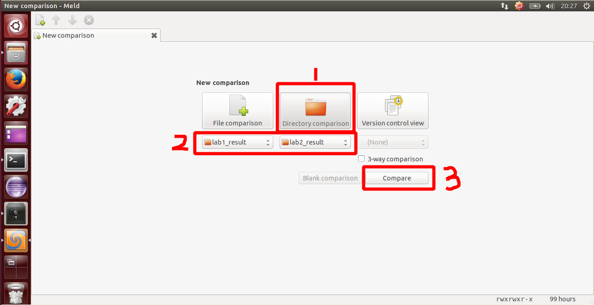
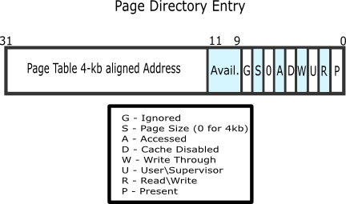
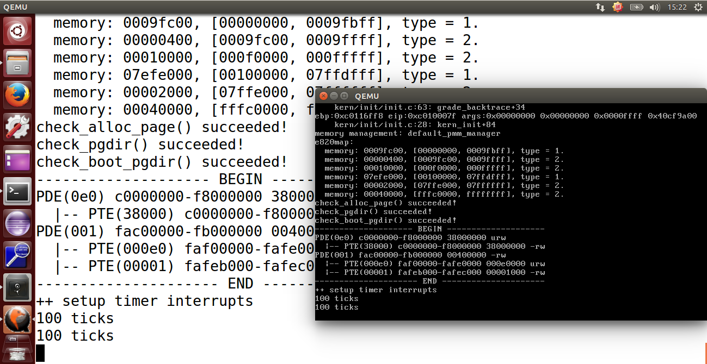

## lab2 实验报告

### 练习0：填写已有实验

`lab2` 会依赖 `lab1` ，我们需要把做的 `lab1` 的代码填到 `lab2` 中缺失的位置上面。练习 0 就是一个工具的利用。这里我使用的是 `Linux` 下的系统已预装好的 `Meld Diff Viewer` 工具。具体操作流程如下图所示：



我们只需要将已经完成的 `lab1` 和待完成的 `lab2` 两个文件夹导入进来，然后点击 `compare` 就行了。


然后软件就会自动分析两份代码的不同，然后就一个个比较比较复制过去就行了，在软件里面是可以支持打开对比复制了，点击 `Copy Right` 即可。当然 `bin` 目录和 `obj` 目录下都是 `make` 生成的，就不用复制了，其他需要修改的地方主要有以下三个文件，通过对比复制完成即可：

```c
kern/debug/kdebug.c
kern/init/init.c
kern/trap/trap.c
```

### 练习1：实现 first-fit 连续物理内存分配算法（需要编程）

在没有其它技术支持的情况下，我们在分配内存空间的时候，分配给一个进程的地址空间必须是连续的。为了提高利用效率，我们希望分配出来的空间有适度的选择。这些动态分配算法实际上就是你在去做选择的做法。而选择完之后呢，每个进程可能用的时间长短不一样，有的进程先结束，有的进程后结束，这个时候，有可能先结束的会留出一些空间，后面一个在分配的时候又会再去找，这个过程的执行就会在这过程中留下一些碎片，这些碎片对于我们后续的内存分配是有一定影响的，那我们就从如何去找你要的空闲分区和如何来处理不能利用的这些小的空闲分区两个角度来看内存分配算法。

- 1、First Fit(最先匹配算法)

该算法从空闲分区链首开始查找，直至找到一个能满足其大小要求的空闲分区为止。然后再按照作业的大小，从该分区中划出一块内存分配给请求者，余下的空闲分区仍留在空闲分区链中。

- - 优点：该算法倾向于使用内存中低地址部分的空闲区，在高地址部分的空闲区很少被利用，从而保留了高地址部分的大空闲区。显然为以后到达的大作业分配大的内存空间创造了条件。
  - 缺点：低地址部分不断被划分，留下许多难以利用、很小的空闲区，而每次查找又都从低地址部分开始，会增加查找的开销。

- 2、Next Fit(循环首次匹配算法)

该算法是由首次适应算法演变而成的。在为进程分配内存空间时，不再每次从链首开始查找，直至找到一个能满足要求的空闲分区，并从中划出一块来分给作业。

- - 优点：使内存中的空闲分区分布的更为均匀，减少了查找时的系统开销。
  - 缺点：缺乏大的空闲分区，从而导致不能装入大型作业。

- 3、Best Fit(最佳匹配算法)

该算法总是把既能满足要求，又是最小的空闲分区分配给作业。为了加速查找，该算法要求将所有的空闲区按其大小排序后，以递增顺序形成一个空白链。这样每次找到的第一个满足要求的空闲区，必然是最优的。孤立地看，该算法似乎是最优的，但事实上并不一定。因为每次分配后剩余的空间一定是最小的，在存储器中将留下许多难以利用的小空闲区。同时每次分配后必须重新排序，这也带来了一定的开销。

- - 优点：每次分配给文件的都是最合适该文件大小的分区。
  - 缺点：内存中留下许多难以利用的小的空闲区。

- 4、Worst Fit(最差匹配算法)

该算法按大小递减的顺序形成空闲区链，分配时直接从空闲区链的第一个空闲区中分配（不能满足需要则不分配）。很显然，如果第一个空闲分区不能满足，那么再没有空闲分区能满足需要。这种分配方法初看起来不太        合理，但它也有很强的直观吸引力：在大空闲区中放入程序后，剩下的空闲区常常也很大，于是还能装下一个较大的新程序。

最坏适应算法与最佳适应算法的排序正好相反，它的队列指针总是指向最大的空闲区，在进行分配时，总是从最大的空闲区开始查寻。

该算法克服了最佳适应算法留下的许多小的碎片的不足，但保留大的空闲区的可能性减小了，而且空闲区回收也和最佳适应算法一样复杂。

- - 优点：给文件分配分区后剩下的空闲区不至于太小，产生碎片的几率最小，对中小型文件分配分区操作有利。
  - 缺点：使存储器中缺乏大的空闲区，对大型文件的分区分配不利。

我们要先熟悉两个数据结构，第一个就是如下所示的每一个物理页的属性结构。

```c
struct Page {
    int ref;                        // 页帧的 引用计数
    uint32_t flags;                 // 页帧的状态 Reserve 表示是否被内核保留 另一个是 表示是否 可分配
    unsigned int property;          // 记录连续空闲页块的数量 只在第一块进行设置
    list_entry_t page_link;         // 用于将所有的页帧串在一个双向链表中 这个地方很有趣 直接将 Page 这个结构体加入链表中会有点浪费空间 因此在 Page 中设置一个链表的结点 将其结点加入到链表中 还原的方法是将 链表中的 page_link 的地址 减去它所在的结构体中的偏移 就得到了 Page 的起始地址
};
```

该结构四个成员变量意义如下:

- 1、`ref` 表示这样页被页表的引用记数，这里应该就是映射此物理页的虚拟页个数。一旦某页表中有一个页表项设置了虚拟页到这个 `Page` 管理的物理页的映射关系，就会把 `Page` 的 `ref` 加一。反之，若是解除，那就减一。
- 2、 `flags` 表示此物理页的状态标记，有两个标志位，第一个表示是否被保留，如果被保留了则设为 `1`（比如内核代码占用的空间）。第二个表示此页是否是 `free` 的。如果设置为 `1` ，表示这页是 `free` 的，可以被分配；如果设置为 `0` ，表示这页已经被分配出去了，不能被再二次分配。
- 3、`property` 用来记录某连续内存空闲块的大小，这里需要注意的是用到此成员变量的这个 `Page` 一定是连续内存块的开始地址（第一页的地址）。
- 4、`page_link` 是便于把多个连续内存空闲块链接在一起的双向链表指针，连续内存空闲块利用这个页的成员变量 `page_link` 来链接比它地址小和大的其他连续内存空闲块。

然后是下面这个结构。一个双向链表，负责管理所有的连续内存空闲块，便于分配和释放。

```c
typedef struct {
    list_entry_t free_list;         // the list header
    unsigned int nr_free;           // # of free pages in this free list
} free_area_t;
```

- free_list 是一个 list_entry 结构的双向链表指针
- nr_free 则记录当前空闲页的个数

首先我们需要完成的是 `/home/moocos/moocos/ucore_lab/labcodes_answer/lab2_result/kern/mm/default_pmm.c` 中的`default_init`，`default_init_memmap`，`default_alloc_pages`，`default_free_pages` 这几个函数的修改。

先来看看 `default_init` 函数，该函数它已经实现好了，不用做修改：

```c
/*
default_init: you can reuse the  demo default_init fun to init the free_list and set nr_free to 0.
free_list is used to record the free mem blocks. nr_free is the total number for free mem blocks.
*/
// 初始化空闲页块链表
static void default_init(void) {
    list_init(&free_list);
    nr_free = 0;// 空闲页块一开始是0个
}
```

然后是 `default_init_memmap`，这个函数是用来初始化空闲页链表的，初始化每一个空闲页，然后计算空闲页的总数。 

初始化每个物理页面记录，然后将全部的可分配物理页视为一大块空闲块加入空闲表。

我们可以有如下实现过程：

```c
/*
default_init_memmap:  CALL GRAPH: kern_init --> pmm_init-->page_init-->init_memmap--> pmm_manager->init_memmap
 *              This fun is used to init a free block (with parameter: addr_base, page_number).
 *              First you should init each page (in memlayout.h) in this free block, include:
 *                  p->flags should be set bit PG_property (means this page is valid. In pmm_init fun (in pmm.c),
 *                  the bit PG_reserved is setted in p->flags)
 *                  if this page  is free and is not the first page of free block, p->property should be set to 0.
 *                  if this page  is free and is the first page of free block, p->property should be set to total num of block.
 *                  p->ref should be 0, because now p is free and no reference.
 *                  We can use p->page_link to link this page to free_list, (such as: list_add_before(&free_list, &(p->page_link)); )
 *              Finally, we should sum the number of free mem block: nr_free+=n
**/
// 初始化n个空闲页块
static void default_init_memmap(struct Page *base, size_t n) {
    assert(n > 0);
    struct Page *p = base;
    for (; p != base + n; p ++) {
        assert(PageReserved(p));//确认本页是否为保留页
        //设置标志位
        p->flags = p->property = 0;
        set_page_ref(p, 0);//清空引用
        
    }
    base->property = n; //连续内存空闲块的大小为n，属于物理页管理链表，头一个空闲页块 要设置数量
    SetPageProperty(base);
    nr_free += n;  //说明连续有n个空闲块，属于空闲链表
    list_add_before(&free_list, &(p->page_link));//插入空闲页的链表里面，初始化完每个空闲页后，将其要插入到链表每次都插入到节点前面，因为是按地址排序
}
```

接着是 `default_alloc_memmap`，主要就是从空闲页块的链表中去遍历，找到第一块大小大于 `n` 的块，然后分配出来，把它从空闲页链表中除去，然后如果有多余的，把分完剩下的部分再次加入会空闲页链表中即可。

首次适配算法要求按照地址从小到大查找空间，所以要求空闲表中的空闲空间按照地址从小到大排序。这样，首次适配算法查询空闲空间的方法就是从链表头部开始找到第一个符合要求的空间，将这个空间从空闲表中删除。空闲空间在分配完要求数量的物理页之后可能会有剩余，那么需要将剩余的部分作为新的空闲空间插入到原空间位置（这样才能保证空闲表中空闲空间地址递增）

实现过程如下：

```c
// 分配n个页块
* 设计思路:
  分配空间的函数中进行了如下修改，因为free_list始终是排序的，分配的page块有剩余空间，那么只需把
	剩余空闲块节点插入到当前节点的前一个节点的后面(或者是当前节点后一个节点的前面)即可
		if (page->property > n) {
	        struct Page *p = page + n;
	        p->property = page->property - n;
	
	        // 将page的property改为n
	        page->property = n;
	
	        // 由于是排好序的链表，只需要在le的前一个节点后面插入即可
	        list_add(list_prev(le), &(p->page_link));
	        // list_add_before(list_next(le), &(p->page_link));
	    }
    
    1.第一种情况(找不到满足需求的可供分配的空闲块(所有的size均 < n))
    2.第二种情况(刚好有满足大小的空闲块)
	    执行分配前
	    --------------          --------------         -------------
	    | size < n   |  <--->   | size = n   |  <--->  | size > n  |
	    --------------          --------------         -------------
	    执行分配后
	    --------------           -------------
	    | size < n   |  <--->    | size > n  |
	    --------------           -------------
    3.第三种情况(不存在刚好满足大小的空闲块，但存在比其大的空闲块)	
    		执行分配前
	    --------------          ------------         --------------
	    | size < n   |  <--->   | size > n |  <--->  | size > n1  |
	    --------------          ------------         --------------
	    执行分配后
	    --------------          ---------------------         --------------
	    | size < n   |  <--->   | size = size - n   |  <--->  | size > n1  |
	    --------------          ---------------------         --------------
--------------------------------------------------------------------------------------------
/*code*/
static struct Page * default_alloc_pages(size_t n) {
    assert(n > 0);
    if (n > nr_free) { //如果所有的空闲页的加起来的大小都不够，那直接返回NULL
        return NULL;
    }
    struct Page *page = NULL;
    list_entry_t *le = &free_list;//从空闲块链表的头指针开始
    // 查找 n 个或以上 空闲页块 若找到 则判断是否大过 n 则将其拆分 并将拆分后的剩下的空闲页块加回到链表中
    while ((le = list_next(le)) != &free_list) {//依次往下寻找直到回到头指针处,即已经遍历一次
        // 此处 le2page 就是将 le 的地址 - page_link 在 Page 的偏移 从而找到 Page 的地址
        struct Page *p = le2page(le, page_link);//将地址转换成页的结构
        if (p->property >= n) {//由于是first-fit，则遇到的第一个大于N的块就选中即可
            page = p;
            break;
        }
    }
    if (page != NULL) {
        if (page->property > n) {
            struct Page *p = page + n;
            p->property = page->property - n;//如果选中的第一个连续的块大于n，只取其中的大小为n的块
            SetPageProperty(p);
            // 将多出来的插入到 被分配掉的页块 后面
            list_add(&(page->page_link), &(p->page_link));
        }
        // 最后在空闲页链表中删除掉原来的空闲页
        list_del(&(page->page_link));
        nr_free -= n;//当前空闲页的数目减n
        ClearPageProperty(page);
    }
    return page;
}
```

最后是 `default_free_pages`，将需要释放的空间标记为空之后，需要找到空闲表中合适的位置。由于空闲表中的记录都是按照物理页地址排序的，所以如果插入位置的前驱或者后继刚好和释放后的空间邻接，那么需要将新的空间与前后邻接的空间合并形成更大的空间。

实现过程如下：

```c
// 释放掉 n 个 页块
* 设计思路:
  1.寻找插入位置(插入到地址 > base的空闲块链表节点前)
    	// 1.寻找插入点
		list_entry_t *le = LIST_HEAD;
		struct Page * node = NULL;
		while ((le = list_next(le)) != LIST_HEAD) {
			node = le2page(le, page_link);
	
			if (node > base) {
				break;
			}
		}
	2.进行地址比对，已确定插入位置及处理方式
	分析: 循环结束情况及处理方式分为如下3种
		(1).空闲链表为空(只有头结点)，直接添加到头结点后面就可以
			if (node == NULL) {
				list_add(&free_list, &(base->page_link));
			}
		(2).查到链表尾均未发现比即将插入到空闲连表地址大的空闲块。
			a.先插入到链表尾部
			b.尝试与前一个节点进行合并
			
			list_entry_t *prev = list_prev(le);
			if (node < base) {
				// 所需插入的节点为末节点
	
				// 先插入到空闲链表中
				list_add(prev, &(base->page_link));
	
				// 进行前向合并
				if (node + node->property == base) {
					node->property += base->property;
					ClearPageProperty(base);
					list_del(&(base->page_link));
				}
			}
		(3).找到比需要插入空闲块地址大的空闲块节点而跳出循环
			a.先插入到找到的节点前面
			b.尝试与后一个节点进行合并
			c.如果前一个节点不为头结点，则尝试与前一个节点进行合并
			
			// 所需插入节点不为末节点

			// 先插入到空闲链表中
			list_add_before(le, &(base->page_link));

			// 进行后向合并
			if (base + base->property == node) {
				base->property += node->property;
				ClearPageProperty(node);

				// 摘除后向节点
				list_del(le);
			}

			// 进行前向合并
			if (prev != LIST_HEAD) {
				// 前拼接
				node = le2page(prev, page_link);
				if (node + node ->property == base) {
					node->property += base->property;
					ClearPageProperty(base);

					// 摘掉当前节点
					list_del(&(base->page_link));
				}
			}
	3.更新空闲链表可用空闲块数量
		nr_free += n;
--------------------------------------------------------------------------------------------
/*code*/
static void default_free_pages(struct Page *base, size_t n) {
    assert(n > 0);
    struct Page *p = base;
    for (; p != base + n; p ++) {
        assert(!PageReserved(p) && !PageProperty(p));
        p->flags = 0;//修改标志位
        set_page_ref(p, 0);
    }
    base->property = n;//设置连续大小为n
    SetPageProperty(base);
    list_entry_t *le = list_next(&free_list);
    // 合并到合适的页块中
    while (le != &free_list) {
        p = le2page(le, page_link);//获取链表对应的Page
        le = list_next(le);
        if (base + base->property == p) {
            base->property += p->property;
            ClearPageProperty(p);
            list_del(&(p->page_link));
        }
        else if (p + p->property == base) {
            p->property += base->property;
            ClearPageProperty(base);
            base = p;
            list_del(&(p->page_link));
        }
    }
    nr_free += n;
    le = list_next(&free_list);
    // 将合并好的合适的页块添加回空闲页块链表
    while (le != &free_list) {
        p = le2page(le, page_link);
        if (base + base->property <= p) {
            break;
        }
        le = list_next(le);
    }
    list_add_before(le, &(base->page_link));//将每一空闲块对应的链表插入空闲链表中
}
```

> 你的First Fit算法是否有进一步的改进空间？

在上面的 `First Fit` 算法中，有两个地方需要 $O(n)$ 时间复杂度：链表查找和有序链表插入。对于其中的有序链表插入，在特殊情况下是可以优化的。当一个刚被释放的内存块来说，如果它的邻接空间都是空闲的，那么就不需要进行线性时间复杂度的链表插入操作，而是直接并入邻接空间，时间复杂度为常数。为了判断邻接空间是否为空闲状态，空闲块的信息除了保存在第一个页面之外，还需要在最后一页保存信息，这样新的空闲块只需要检查邻接的两个页面就能判断邻接空间块的状态。

### 练习2：实现寻找虚拟地址对应的页表项（需要编程）

这里我们需要实现的是 `get_pte` 函数，函数找到一个虚地址对应的二级页表项的内核虚地址，如果此二级页表项不存在，则分配一个包含此项的二级页表。

由于我们已经具有了一个物理内存页管理器 `default_pmm_manager`，我们就可以用它来获得所需的空闲物理页。 
在二级页表结构中，页目录表占 4KB 空间，ucore 就可通过 default_pmm_manager 的 default_alloc_pages 函数获得一个空闲物理页，这个页的起始物理地址就是页目录表的起始地址。同理，ucore 也通过这种方式获得各个页表所需的空间。页表的空间大小取决与页表要管理的物理页数 n，一个页表项(32位，即4字节)可管理一个物理页，页表需要占 n/1024 个物理页空间(向上取整)。这样页目录表和页表所占的总大小约为 4096+4∗n 字节。 

根据LAZY，这里我们并没有一开始就存在所有的二级页表，而是等到需要的时候再添加对应的二级页表。当建立从一级页表到二级页表的映射时，需要注意设置控制位。这里应该设置同时设置上 PTE_U、PTE_W 和 PTE_P（定义可在mm/mmu.h）。如果原来就有二级页表，或者新建立了页表，则只需返回对应项的地址即可。 

如果 create 参数为 0，则 get_pte 返回 NULL；如果 create 参数不为 0，则 get_pte 需要申请一个新的物理页。

> 页目录项内容 = (页表起始物理地址 & ~0x0FFF) | PTE_U | PTE_W | PTE_P
> 或者(分配的地址是4K对齐的，即低12位为0，无需 & ~0x0FFF也行)
> 页目录项内容 = 页表起始物理地址 | PTE_U | PTE_W | PTE_P

整理后的目录项如下：

| 数据类型  |                             说明                             |
| :-------: | :----------------------------------------------------------: |
|   pde_t   | 全称为page directory entry，也就是一级页表的表项（注意：pgdir 实际不是表项，而是一级页表本身，pgdir 给出页表起始地址。）。高22位存储该目录项所对应的页表起始物理地址，其中高10位为在页目录项表中的索引，中10位为在页表中的索引，低12位用于存储标识信息(权限等) |
|   pte_t   | 全称为page table entry，表示二级页表的表项。高22为存储该页表项所对应的页面起始物理地址，低12位存储标识信息(权限等) |
| uintptr_t | 表示为线性地址，由于段式管理只做直接映射，所以它也是逻辑地址。 |
|   PTE_U   |    位3，表示用户态的软件可以读取对应地址的物理内存页内容     |
|   PTE_W   |                 位2，表示物理内存页内容可写                  |
|   PTE_P   |                   位1，表示物理内存页存在                    |

实现过程如下：

```c
* 设计思路：
提供一个虚拟地址，然后根据这个虚拟地址的高 10 位，找到页目录表中的 PDE 项。前20位是页表项 (二级页表) 的线性地址，后 12 位为属性，然后判断一下 PDE 是否存在(就是判断 P 位)。不存在，则获取一个物理页，然后将这个物理页的线性地址写入到 PDE 中，最后返回 PTE 项。简而言之就是根据所给的虚拟地址，构造一个 PTE 项。
// 目录表中目录项的起始地址 pdep
// 目录表中目录项的值 *pdep
// 页表的起始物理地址 (*pdep & ~0xFFF) 即 PDE_ADDR(*pdep)
// 页表的起始内核虚拟地址 KADDR((*pdep & ~0xFFF))
// la在页表项的偏移量为 PTX(la)
// 页表项的起始物理地址为 (pte_t *)KADDR((*pdep & ~0xFFF)) + PTX(la)
--------------------------------------------------------------------------------------------
/*code*/
pte_t *get_pte(pde_t *pgdir, uintptr_t la, bool create) {
    pde_t *pdep = &pgdir[PDX(la)]; // 找到 PDE 这里的 pgdir 可以看做是页目录表的基址
    if (!(*pdep & PTE_P)) {         // 看看 PDE 指向的页表是否存在
        struct Page* page = alloc_page(); // 不存在就申请一页物理页
        /* 这里说多几句 通过 default_alloc_pages() 分配的页 的地址 并不是真正的页分配的地址
            实际上只是 Page 这个结构体所在的地址而已 故而需要 通过使用 page2pa() 将 Page 这个结构体
            的地址 转换成真正的物理页地址的线性地址 然后需要注意的是 无论是 * 或是 memset 都是对虚拟地址进行操作的
            所以需要将 真正的物理页地址再转换成 内核虚拟地址
            */
        if (!create || page == NULL) { //不存在且不需要创建，返回NULL
            return NULL;
        }
        set_page_ref(page, 1); //设置此页被引用一次
        uintptr_t pa = page2pa(page);//得到 page 管理的那一页的物理地址
        memset(KADDR(pa), 0, PGSIZE); // 将这一页清空 此时将线性地址转换为内核虚拟地址
        *pdep = pa | PTE_U | PTE_W | PTE_P; // 设置 PDE 权限
    }
    return &((pte_t *)KADDR(PDE_ADDR(*pdep)))[PTX(la)];
}

```

> 1、请描述页目录项（Page Directory Entry）和页表项（Page Table Entry）中每个组成部分的含义以及对 ucore 而言的潜在用处。



从低到高，分别是：

- *P* (Present) 位：表示该页保存在物理内存中。
- *R* (Read/Write) 位：表示该页可读可写。
- *U* (User) 位：表示该页可以被任何权限用户访问。
- *W* (Write Through) 位：表示 CPU 可以直写回内存。
- *D* (Cache Disable) 位：表示不需要被 CPU 缓存。
- *A* (Access) 位：表示该页被写过。
- *S* (Size) 位：表示一个页 4MB 。
- 9-11 位保留给 OS 使用。
- 12-31 位指明 PTE 基质地址。


从低到高，分别是：

- 0-3 位同 PDE。
- *C* (Cache Disable) 位：同 PDE *D* 位。
- *A* (Access) 位：同 PDE 。
- *D* (Dirty) 位：表示该页被写过。
- *G* (Global) 位：表示在 CR3 寄存器更新时无需刷新 TLB 中关于该页的地址。
- 9-11 位保留给 OS 使用。
- 12-31 位指明物理页基址。

因为页的映射是以物理页面为单位进行，所以页面对应的物理地址总是按照 4096 字节对齐的，物理地址低 0-11 位总是零，所以在页目录项和页表项中，低 0-11 位可以用于作为标志字段使用。

|  位   |              意义               |
| :---: | :-----------------------------: |
|   0   |      表项有效标志（PTE_U）      |
|   1   |        可写标志（PTE_W）        |
|   2   |    用户访问权限标志（PTE_P）    |
|   3   |       写入标志（PTE_PWT）       |
|   4   |     禁用缓存标志（PTE_PCD）     |
|   5   |        访问标志（PTE_A）        |
|   6   |        脏页标志（PTE_D）        |
|   7   |      页大小标志（PTE_PS）       |
|   8   |       零位标志（PTE_MBZ）       |
|  11   |    软件可用标志（PTE_AVAIL）    |
| 12-31 | 页表起始物理地址/页起始物理地址 |

> 2、如果ucore执行过程中访问内存，出现了页访问异常，请问硬件要做哪些事情？

会进行换页操作。首先 CPU 将产生页访问异常的线性地址放到 cr2 寄存器中，然后就是和普通的中断一样，保护现场，将寄存器的值压入栈中，设置错误代码 error_code，触发 Page Fault 异常，然后压入 error_code 中断服务例程，将外存的数据换到内存中来，最后退出中断，回到进入中断前的状态。

### 练习3：释放某虚地址所在的页并取消对应二级页表项的映射（需要编程）

这里主要是 `page_remove_pte` 的补全及完善。 

思路主要就是先判断该页被引用的次数，如果只被引用了一次，那么直接释放掉这页， 否则就删掉二级页表的该表项，即该页的入口。

取消页表映射过程如下：

- 将物理页的引用数目减一，如果变为零，那么释放页面；
- 将页目录项清零；
- 刷新TLB。

实现过程如下：

```c
* 设计思路：
首先判断一下 ptep 是不是合法——检查一下 Present 位就是了。
然后通过注释中所说的，通过 pte2page(*ptep) 获取相应页，减少引用计数并决定是否释放页。
最后把 TLB 中该页的缓存刷掉就可以了。
--------------------------------------------------------------------------------------------
/*code*/
static inline void page_remove_pte(pde_t *pgdir, uintptr_t la, pte_t *ptep) {
    if ((*ptep & PTE_P)) { //判断页表中该表项是否存在
        struct Page *page = pte2page(*ptep);// 将页表项转换为页数据结构
        if (page_ref_dec(page) == 0) { // 判断是否只被引用了一次，若引用计数减一后为0，则释放该物理页
            free_page(page);
        }
        *ptep = 0; // //如果被多次引用，则不能释放此页，只用释放二级页表的表项，清空 PTE
        tlb_invalidate(pgdir, la); // 刷新 tlb
    }
}
```

运行结果如下：



> 1、数据结构Page的全局变量（其实是一个数组）的每一项与页表中的页目录项和页表项有无对应关系？如果有，其对应关系是啥？

```
存在对应关系,从pmm.h中的一系列转换函数及KADDR、PADDR等宏定义中可知(page为pages中的一个项):
	PDX: 页目录表索引
	PTX: 页表索引
	PPN: 线性地址的高20位，即PDX + PTX
	PA: 物理地址 KA - KERNBASE
	KA: 内核虚地址 PA + KERNBASE
	
	page - pages = PPN
	PPN << 12 = PA
	&pages[PPN(pa)] = page
```

其实就是 Page 全局数组中以 Page Directory Index 和 Page Table Index 的组合 PPN (Physical Page Number) 为索引的那一项。

> 2、如果希望虚拟地址与物理地址相等，则需要如何修改lab2，完成此事？ **鼓励通过编程来具体完成这个问题**

```c
* 设计思路：
1.必须先使内核的链接地址等于加载地址(之前尝试过完成分页机制后进行重映射的方法，后查看kernel.asm发现
内核文件的链接地址均为0xc开头的)
2.修改tool/kernel.ld文件, 将. = 0xC0100000修改为. = 0x00100000
3.修改kern/mm/memlayout.h中的KERNBASE宏定义为0x00000000
4.去除pmm_init中的临时映射及取消临时映射机制
5.移除与使用非物理地址相等的虚拟地址的检验函数相关语句，即boodir[0] = 0或某种形式的
assert(boot_pgdir == 0)
```

实现过程如下：

① 修改链接脚本，将内核起始虚拟地址修改为`0x100000`；

```assembly
/* 
tools/kernel.ld
**/
--------------------------------------------------------------------------------------------
/*code*/
SECTIONS {
    /* Load the kernel at this address: "." means the current address */
    . = 0x100000;
...
```

② 修改虚拟内存空间起始地址为0

```c
/*
kern/mm/memlayout.h
**/
--------------------------------------------------------------------------------------------
/*code*/
/* All physical memory mapped at this address */
#define KERNBASE            0x00000000
```

③ 注释掉取消0~4M区域内存页映射的代码

```c
/*
kern/mm/pmm.c
**/
--------------------------------------------------------------------------------------------
/*code*/
//disable the map of virtual_addr 0~4M
// boot_pgdir[0] = 0;

//now the basic virtual memory map(see memalyout.h) is established.
//check the correctness of the basic virtual memory map.
// check_boot_pgdir();
```

### 扩展练习Challenge

#### 1、buddy system（伙伴系统）分配算法（需要编程）

##### 初始化

在 Buddy System 中，空间块之间的关系形成一颗完全二叉树，对于一颗有着 n 叶子的完全二叉树来说，所有节点的总数为 。也就是说，如果 Buddy System 的可分配空间为 n 页的话，那么就需要额外保存 2n-1 个节点信息。

**初始化空闲链表**

Buddy System 并不需要链表，但是为了在调式的时候方便访问所有空闲空间，还是将所有的空闲空间加入链表中。

**确定分配空间大小**

假设我们得到了大小为 n 的空间，我们需要在此基础上建立 Buddy System，经过初始化后，Buddy System 管理的页数为 ，那么大小为 n 的实际空间可能分为两个或者三个部分。

**节点信息区**：节点信息区可以用来保存每个节点对应子树中可用空间的信息，用于在分配内存的时候便于检查子树中是否有足够的空间来满足请求大小。在 32 位操作系统中，最大页数不会超过 4GB/4KB=1M，所有使用一个 32 位整数即可表示每个节点的信息。所以节点信息区的大小为  字节，每页大小为 4KB，内存占用按照页面大小对齐，所以占用  页。

**虚拟分配区**：占用  页。

**实际分配区**：显然实际可以得到的内存大小不大可能刚好等于节点信息区大小+分配空间区大小。如果节点信息区大小+分配空间区大小<=内存大小，那么实际可以分配的区域就等于  页。如果节点信息区大小+分配空间区大小>内存大小，那么实际可以分配的区域就等于 页。

作为操作系统，自然希望实际使用的区域越大越好，不妨分类讨论。

**当内存小于等于512页**：此时无论如何节点信息都会占用一页，所以提高内存利率的方法就是将实际内存大小减一后向上取整（文中整数意为2的幂）。

**当内存大于512页**：不难证明，对于内存大小 $n$ 来说，最佳虚拟分配区大小往往是 n 向下取整或者向上取整的数值，所以候选项也就是只有两个，所以可以先考虑向下取整。对于  中的数  ，向下取整可以得到 :

- 当  时，显然已经是最佳值；
- 当  时，扩大虚拟分配区导致节点信息区增加却没有使得实际分配区增加，所以当期 m 还是最佳值；
- 当  时， 可以扩大实际分配区。

**初始化节点信息**

虚拟分配区可能会大于实际分配区，所以一开始需要将虚拟分配区中没有实际分配区对应的空间标记为已经分配进行屏蔽。另当前区块的虚拟空间大小为 ，实际空间大小为 ，屏蔽的过程如下：

- 如果 ，将空间初始化为一个空闲空间，屏蔽过程结束；
- 如果 ，将空间初始化为一个已分配空间，屏蔽过程结束；
- 如果 ，将右半空间初始化为已分配空间，更新  后继续对左半空间进行操作；
- 如果 ，将左半空间初始化为空闲空间，更新  后继续对左半空间进行操作。

以虚拟分配区 16 页、实际分配区 14 页为例，初始化后如下：

```c
[0,16)

[0,16)

[0,8)

[0,8)

[8,16)

[8,16)

[8,12)

[8,12)

[12,16)

[12,16)

[12,14)

[12,14)

[14,16)

[14,16)

8

8

4

4

2

2

2

[Not supported by viewer]
```

##### 分配过程

Buddy System 要求分配空间为 2 的幂，所以首先将请求的页数向上对齐到 2 的幂。

接下来从二叉树的根节点（1号节点）开始查找满足要求的节点。对于每次检查的节点：

- 如果子树的最大可用空间小于请求空间，那么分配失败；
- 如果子树的最大可用空间大于等于请求空间，并且总空间大小等于请求空间，说明这个节点对应的空间没有被分割和分配，并且满足请求空间大小，那么分配这个空间；
- 如果子树的最大可用空间大于等于请求空间，并且总空间大小大于请求空间，那么在这个节点的子树中查找：
  - 如果这个节点对应的空间没有被分割过（最大可用空间等于总空间大小），那么分割空间，在左子树（左半部分）继续查找；
  - **如果左子树包含大小等于请求空间的可用空间，那么在左子树中继续查找；**
  - **如果右子树包含大小等于请求空间的可用空间，那么在右子树中继续查找；**
- 如果左子树的最大可用空间大于等于请求空间，那么在左子树中继续查找；
  - 如果右子树的最大可用空间大于等于请求空间，那么在右子树中继续查找。

算法中**加粗的部分**主要为了减少碎片而增加的额外优化。

当一个空间被分配之后，这个空间对应节点的所有父节点的可用空间表都会受到影响，需要自地向上重新更新可用空间信息。

##### 释放过程

Buddy System 要求分配空间为 2 的幂，所以同样首先将请求的页数向上对齐到2的幂。

在进行释放之前，需要确定要释放的空间对应的节点，然后将空间标记为可用。接下来进行自底向上的操作：

- 如果某节点的两个子节点对应的空间都未分割和分配，那么合并这两个空间，形成一个更大的空间；
- 否则，根据子节点的可用空间信息更新父节点的可用空间信息。

实现过程如下：

```c
由于不能在堆上分配内存，无法使用二级链表，故 buddy 分配算法使用一级双向链表进行组织，该算法配合
最佳适应算法进行查找获取，可在一定程度上减小内存碎片，为程序腾出大的空闲空间。

设计思路:
	1.新建buddy_pmm.h及buddy_pmm.c文件用于实现pmm_manager规定的接口(函数指针)
	2.将pmm.c的init_pmm_manager的实现改为如下，通过Makefile加入预编译宏_USE_PMM_BUDDY实现
	向Buddy内存管理分配算法的切换,其中_USE_DEBUG宏用于输出调试信息
		static void init_pmm_manager(void) {
		#ifdef _USE_PMM_BUDDY
		    pmm_manager = &buddy_pmm_manager;
		#else
		    pmm_manager = &default_pmm_manager;
		#endif
		    cprintf("memory management: %s\n", pmm_manager->name);
		    pmm_manager->init();
		}
		Makefile:
			# memory management algorithm
			ifdef DEFS
			DEFS			:= 
			endif
			DEFS 		+= -D_USE_PMM_BUDDY
			DEFS			+= -D_USE_DEBUG
	3.添加用于辅助伙伴分配算法的数学函数,主要是指数函数、对数函数及对数取整函数
		// 求以base为底数，n为指数的值
		int32_t pow(int32_t base, int32_t n);
		int32_t pow2(int32_t n);
		
		// 求以base为底数，n为真数的对数函数，其要求n必须为base的正整数次幂
		size_t log(int32_t base, int32_t n);
		size_t log2(int32_t n);
		
		// 对数向上、向下取整函数簇
		size_t log_round_up(int32_t base, int32_t n);
		size_t log_round_down(int32_t base, int32_t n);
		size_t log2_round_up(int32_t n);
		size_t log2_round_down(int32_t n);
	4.依次实现相关函数指针，并初始化buddy_pmm_manager数据结构
	
主要数据结构如下:
typedef struct Buddy {
	// 伙伴大小(2的次幂)，在头结点表示最大的2的次幂空闲块
	size_t power;
	// 伙伴的可用页面大小(for speed up purpose)，头结点为可用页面数量,也方便比较
	size_t property;
	// 用于组织buddy节点, 和page共享
	list_entry_t node;
} buddy_t, *buddy_ptr_t;

// buddy
buddy_t _buddy;

其中初始化函数如下：
static void buddy_init_memmap(struct Page *base, size_t n) {
	// 可用空闲块必须大于0
	assert(n > 0);

#ifdef _USE_DEBUG
	cprintf("avialable pages: %d\n", n);
#endif
	// 设置可用空间大小
	struct Page *p = base;
	_buddy.property += n;

	// 指数计数变量
	register volatile int cnt;

	// 进行切分插入
	size_t size;
	struct Page * bp;
	while (n > 0) {
		// 求剩下部分的最大2次幂
		cnt = log2_round_down(n);
		size = pow2(cnt);
		n -= size;

		// 记录最大的2的次幂(初始化时只需要记录一次,后面再进行修改)
		if (_buddy.power == 0) {
			_buddy.power = cnt;
		}

		// 更新空闲块头指针
		bp = p;
		for (; p != bp + size; p++) {
			assert(PageReserved(p));
			p->flags = p->property = 0;
			set_page_ref(p, 0);
		}
		bp->property = size;
		SetPageProperty(bp);

		// 加入头结点后(按从小到大的顺序组织)
		list_add(get_buddy_head(), &(bp->page_link));

		// 拆分完成，跳出
		if (n == 0) {
			break;
		}
	}

#ifdef _USE_DEBUG
	traverse_free_page_list();
#endif
}
--------------------------------------------------------------------------------------------
/*
buddy.h
**/
--------------------------------------------------------------------------------------------
/*code*/
#ifndef __KERN_MM_BUDDY_H__
#define  __KERN_MM_BUDDY_H__

#include <pmm.h>

extern const struct pmm_manager buddy_pmm_manager;

#endif /* ! __KERN_MM_BUDDY_H__ */
--------------------------------------------------------------------------------------------
/*
buddy.c
**/
--------------------------------------------------------------------------------------------
/*code*/
#include <pmm.h>
#include <list.h>
#include <string.h>
#include <buddy.h>

free_area_t free_area;

#define free_list (free_area.free_list)
#define nr_free (free_area.nr_free)

// Global block
static size_t buddy_physical_size;
static size_t buddy_virtual_size;
static size_t buddy_segment_size;
static size_t buddy_alloc_size;
static size_t *buddy_segment;
static struct Page *buddy_physical;
static struct Page *buddy_alloc;

#define MIN(a,b)                ((a)<(b)?(a):(b))

// Buddy operate
#define BUDDY_ROOT              (1)
#define BUDDY_LEFT(a)           ((a)<<1)
#define BUDDY_RIGHT(a)          (((a)<<1)+1)
#define BUDDY_PARENT(a)         ((a)>>1)
#define BUDDY_LENGTH(a)         (buddy_virtual_size/UINT32_ROUND_DOWN(a))
#define BUDDY_BEGIN(a)          (UINT32_REMAINDER(a)*BUDDY_LENGTH(a))
#define BUDDY_END(a)            ((UINT32_REMAINDER(a)+1)*BUDDY_LENGTH(a))
#define BUDDY_BLOCK(a,b)        (buddy_virtual_size/((b)-(a))+(a)/((b)-(a)))
#define BUDDY_EMPTY(a)          (buddy_segment[(a)] == BUDDY_LENGTH(a))

// Bitwise operate
#define UINT32_SHR_OR(a,n)      ((a)|((a)>>(n)))   
#define UINT32_MASK(a)          (UINT32_SHR_OR(UINT32_SHR_OR(UINT32_SHR_OR(UINT32_SHR_OR(UINT32_SHR_OR(a,1),2),4),8),16))    
#define UINT32_REMAINDER(a)     ((a)&(UINT32_MASK(a)>>1))
#define UINT32_ROUND_UP(a)      (UINT32_REMAINDER(a)?(((a)-UINT32_REMAINDER(a))<<1):(a))
#define UINT32_ROUND_DOWN(a)    (UINT32_REMAINDER(a)?((a)-UINT32_REMAINDER(a)):(a))

static void buddy_init_size(size_t n) {
    assert(n > 1);
    buddy_physical_size = n;
    if (n < 512) {
        buddy_virtual_size = UINT32_ROUND_UP(n-1);
        buddy_segment_size = 1;
    } else {
        buddy_virtual_size = UINT32_ROUND_DOWN(n);
        buddy_segment_size = buddy_virtual_size*sizeof(size_t)*2/PGSIZE;
        if (n > buddy_virtual_size + (buddy_segment_size<<1)) {
            buddy_virtual_size <<= 1;
            buddy_segment_size <<= 1;
        }
    }
    buddy_alloc_size = MIN(buddy_virtual_size, buddy_physical_size-buddy_segment_size);
}

static void buddy_init_segment(struct Page *base) {
    // Init address
    buddy_physical = base;
    buddy_segment = KADDR(page2pa(base));
    buddy_alloc = base + buddy_segment_size;
    memset(buddy_segment, 0, buddy_segment_size*PGSIZE);
    // Init segment
    nr_free += buddy_alloc_size;
    size_t block = BUDDY_ROOT;
    size_t alloc_size = buddy_alloc_size;
    size_t virtual_size = buddy_virtual_size;
    buddy_segment[block] = alloc_size;
    while (alloc_size > 0 && alloc_size < virtual_size) {
        virtual_size >>= 1;
        if (alloc_size > virtual_size) {
            // Add left to free list
            struct Page *page = &buddy_alloc[BUDDY_BEGIN(block)];
            page->property = virtual_size;
            list_add(&(free_list), &(page->page_link));
            buddy_segment[BUDDY_LEFT(block)] = virtual_size;
            // Switch ro right
            alloc_size -= virtual_size;
            buddy_segment[BUDDY_RIGHT(block)] = alloc_size;
            block = BUDDY_RIGHT(block);
        } else {
            // Switch to left
            buddy_segment[BUDDY_LEFT(block)] = alloc_size;
            buddy_segment[BUDDY_RIGHT(block)] = 0;
            block = BUDDY_LEFT(block);
        }
    }
    if (alloc_size > 0) {
        struct Page *page = &buddy_alloc[BUDDY_BEGIN(block)];
        page->property = alloc_size;
        list_add(&(free_list), &(page->page_link));
    }
}

static void buddy_init(void) {
    list_init(&free_list);
    nr_free = 0;
}

static void buddy_init_memmap(struct Page *base, size_t n) {
    assert(n > 0);
    // Init pages
    for (struct Page *p = base; p < base + n; p++) {
        assert(PageReserved(p));
        p->flags = p->property = 0;
    }
    // Init size
    buddy_init_size(n);
    // Init segment
    buddy_init_segment(base);
}

static struct Page * buddy_alloc_pages(size_t n) {
    assert(n > 0);
    struct Page *page;
    size_t block = BUDDY_ROOT;
    size_t length = UINT32_ROUND_UP(n);
    // Find block
    while (length <= buddy_segment[block] && length < BUDDY_LENGTH(block)) {
        size_t left = BUDDY_LEFT(block);
        size_t right = BUDDY_RIGHT(block);
        if (BUDDY_EMPTY(block)) {                   // Split
            size_t begin = BUDDY_BEGIN(block);
            size_t end = BUDDY_END(block);
            size_t mid = (begin+end)>>1;
            list_del(&(buddy_alloc[begin].page_link));
            buddy_alloc[begin].property >>= 1;
            buddy_alloc[mid].property = buddy_alloc[begin].property;
            buddy_segment[left] = buddy_segment[block]>>1;
            buddy_segment[right] = buddy_segment[block]>>1;
            list_add(&free_list, &(buddy_alloc[begin].page_link));
            list_add(&free_list, &(buddy_alloc[mid].page_link));
            block = left;
        } else if (length & buddy_segment[left]) {  // Find in left (optimize)
            block = left;
        } else if (length & buddy_segment[right]) { // Find in right (optimize)
            block = right;
        } else if (length <= buddy_segment[left]) { // Find in left
            block = left;
        } else if (length <= buddy_segment[right]) {// Find in right
            block = right;
        } else {                                    // Shouldn't be here
            assert(0);
        }
    }
    // Allocate
    if (length > buddy_segment[block])
        return NULL;
    page = &(buddy_alloc[BUDDY_BEGIN(block)]);
    list_del(&(page->page_link));
    buddy_segment[block] = 0;
    nr_free -= length;
    // Update buddy segment
    while (block != BUDDY_ROOT) {
        block = BUDDY_PARENT(block);
        buddy_segment[block] = buddy_segment[BUDDY_LEFT(block)] | buddy_segment[BUDDY_RIGHT(block)];
    }
    return page;
}

static void buddy_free_pages(struct Page *base, size_t n) {
    assert(n > 0);
    struct Page *p = base;
    size_t length = UINT32_ROUND_UP(n);
    // Find buddy id 
    size_t begin = (base-buddy_alloc);
    size_t end = begin + length;
    size_t block = BUDDY_BLOCK(begin, end);
    // Release block
    for (; p != base + n; p ++) {
        assert(!PageReserved(p));
        p->flags = 0;
        set_page_ref(p, 0);
    }
    base->property = length;
    list_add(&(free_list), &(base->page_link));
    nr_free += length;
    buddy_segment[block] = length;
    // Upadte & merge
    while (block != BUDDY_ROOT) {
        block = BUDDY_PARENT(block);
        size_t left = BUDDY_LEFT(block);
        size_t right = BUDDY_RIGHT(block);
        if (BUDDY_EMPTY(left) && BUDDY_EMPTY(right)) {  // Merge
            size_t lbegin = BUDDY_BEGIN(left);
            size_t rbegin = BUDDY_BEGIN(right);
            list_del(&(buddy_alloc[lbegin].page_link));
            list_del(&(buddy_alloc[rbegin].page_link));
            buddy_segment[block] = buddy_segment[left]<<1;
            buddy_alloc[lbegin].property = buddy_segment[left]<<1;
            list_add(&(free_list), &(buddy_alloc[lbegin].page_link));
        } else {                                        // Update
            buddy_segment[block] = buddy_segment[BUDDY_LEFT(block)] | buddy_segment[BUDDY_RIGHT(block)];
        }
    }
}

static size_t buddy_nr_free_pages(void) {
    return nr_free;
}

static void macro_check(void) {

    // Block operate check
    assert(BUDDY_ROOT == 1);
    assert(BUDDY_LEFT(3) == 6);
    assert(BUDDY_RIGHT(3) == 7);
    assert(BUDDY_PARENT(6) == 3);
    assert(BUDDY_PARENT(7) == 3);
    size_t buddy_virtual_size_store = buddy_virtual_size;
    size_t buddy_segment_root_store = buddy_segment[BUDDY_ROOT];
    buddy_virtual_size = 16;
    buddy_segment[BUDDY_ROOT] = 16;
    assert(BUDDY_LENGTH(6) == 4);
    assert(BUDDY_BEGIN(6) == 8);
    assert(BUDDY_END(6) == 12);
    assert(BUDDY_BLOCK(8, 12) == 6);
    assert(BUDDY_EMPTY(BUDDY_ROOT));
    buddy_virtual_size = buddy_virtual_size_store;
    buddy_segment[BUDDY_ROOT] = buddy_segment_root_store;

    // Bitwise operate check
    assert(UINT32_SHR_OR(0xCC, 2) == 0xFF);
    assert(UINT32_MASK(0x4000) == 0x7FFF);
    assert(UINT32_REMAINDER(0x4321) == 0x321);
    assert(UINT32_ROUND_UP(0x2321) == 0x4000);
    assert(UINT32_ROUND_UP(0x2000) == 0x2000);
    assert(UINT32_ROUND_DOWN(0x4321) == 0x4000);
    assert(UINT32_ROUND_DOWN(0x4000) == 0x4000);

}

static void size_check(void) {

    size_t buddy_physical_size_store = buddy_physical_size;
    buddy_init_size(200);
    assert(buddy_virtual_size == 256);
    buddy_init_size(1024);
    assert(buddy_virtual_size == 1024);
    buddy_init_size(1026);
    assert(buddy_virtual_size == 1024);
    buddy_init_size(1028);    
    assert(buddy_virtual_size == 1024);
    buddy_init_size(1030);    
    assert(buddy_virtual_size == 2048);
    buddy_init_size(buddy_physical_size_store);   

}

static void segment_check(void) {

    // Check buddy segment
    size_t total = 0, count = 0;
    for (size_t block = BUDDY_ROOT; block < (buddy_virtual_size<<1); block++)
        if (BUDDY_EMPTY(block))
            total += BUDDY_LENGTH(block);
        else if (block < buddy_virtual_size)
            assert(buddy_segment[block] == (buddy_segment[BUDDY_LEFT(block)] | buddy_segment[BUDDY_RIGHT(block)]));
    assert(total == nr_free_pages());

    // Check free list 
    total = 0, count = 0;
    list_entry_t *le = &free_list;
    while ((le = list_next(le)) != &free_list) {
        struct Page *p = le2page(le, page_link);
        count ++, total += p->property;
    }
    assert(total == nr_free_pages());

}

static void alloc_check(void) {

    // Build buddy system for test
    size_t buddy_physical_size_store = buddy_physical_size;
    for (struct Page *p = buddy_physical; p < buddy_physical + 1026; p++)
        SetPageReserved(p);
    buddy_init();
    buddy_init_memmap(buddy_physical, 1026);

    // Check allocation
    struct Page *p0, *p1, *p2, *p3;
    p0 = p1 = p2 = NULL;
    assert((p0 = alloc_page()) != NULL);
    assert((p1 = alloc_page()) != NULL);
    assert((p2 = alloc_page()) != NULL);
    assert((p3 = alloc_page()) != NULL);

    assert(p0 + 1 == p1);
    assert(p1 + 1 == p2);
    assert(p2 + 1 == p3);
    assert(page_ref(p0) == 0 && page_ref(p1) == 0 && page_ref(p2) == 0 && page_ref(p3) == 0);

    assert(page2pa(p0) < npage * PGSIZE);
    assert(page2pa(p1) < npage * PGSIZE);
    assert(page2pa(p2) < npage * PGSIZE);
    assert(page2pa(p3) < npage * PGSIZE);

    list_entry_t *le = &free_list;
    while ((le = list_next(le)) != &free_list) {
        struct Page *p = le2page(le, page_link);
        assert(buddy_alloc_pages(p->property) != NULL);
    }

    assert(alloc_page() == NULL);

    // Check release
    free_page(p0);
    free_page(p1);
    free_page(p2);
    assert(nr_free == 3);

    assert((p1 = alloc_page()) != NULL);
    assert((p0 = alloc_pages(2)) != NULL);
    assert(p0 + 2 == p1);

    assert(alloc_page() == NULL);

    free_pages(p0, 2);
    free_page(p1);
    free_page(p3);

    struct Page *p;
    assert((p = alloc_pages(4)) == p0);
    assert(alloc_page() == NULL);

    assert(nr_free == 0);

    // Restore buddy system
    for (struct Page *p = buddy_physical; p < buddy_physical + buddy_physical_size_store; p++)
        SetPageReserved(p);
    buddy_init();
    buddy_init_memmap(buddy_physical, buddy_physical_size_store);

}

static void default_check(void) {

    // Check buddy system
    macro_check();
    size_check();
    segment_check();
    alloc_check();
    
}

const struct pmm_manager buddy_pmm_manager = {
    .name = "buddy_pmm_manager",
    .init = buddy_init,
    .init_memmap = buddy_init_memmap,
    .alloc_pages = buddy_alloc_pages,
    .free_pages = buddy_free_pages,
    .nr_free_pages = buddy_nr_free_pages,
    .check = default_check,
};
```

#### 2、任意大小的内存单元slub分配算法（需要编程）

实际上 Slub 分配算法是非常复杂的，需要考虑缓存对齐、NUMA 等非常多的问题，作为实验性质的操作系统就不考虑这些复杂因素了。简化的 Slub 算法结合了 Slab 算法和 Slub 算法的部分特征，使用了一些比较右技巧性的实现方法。具体的简化为：

- Slab 大小为一页，不允许创建大对象仓库
- 复用Page数据结构，将 Slab 元数据保存在 Page 结构体中

##### 数据结构

在操作系统中经常会用到大量相同的数据对象，例如互斥锁、条件变量等等，同种数据对象的初始化方法、销毁方法、占用内存大小都是一样的，如果操作系统能够将所有的数据对象进行统一管理，可以提高内存利用率，同时也避免了反复初始化对象的开销。

###### 仓库

每种对象由仓库（感觉cache在这里翻译为仓库更好）进行统一管理：

```c
struct kmem_cache_t {
    list_entry_t slabs_full;	// 全满Slab链表
    list_entry_t slabs_partial;	// 部分空闲Slab链表
    list_entry_t slabs_free;	// 全空闲Slab链表
    uint16_t objsize;		// 对象大小
    uint16_t num;			// 每个Slab保存的对象数目
    void (*ctor)(void*, struct kmem_cache_t *, size_t);	// 构造函数
    void (*dtor)(void*, struct kmem_cache_t *, size_t);	// 析构函数
    char name[CACHE_NAMELEN];	// 仓库名称
    list_entry_t cache_link;	// 仓库链表
};
```

由于限制 Slab 大小为一页，所以数据对象和每页对象数据不会超过  ，所以使用 16 位整数保存足够。然后所有的仓库链接成一个链表，方便进行遍历。

###### Slab

在上面的Buddy System中，一个物理页被分配之后，Page 结构中除了 ref 之外的成员都没有其他用处了，可以把Slab的元数据保存在这些内存中：

```c
struct slab_t {
    int ref;				// 页的引用次数（保留）
    struct kmem_cache_t *cachep;	// 仓库对象指针
    uint16_t inuse;			// 已经分配对象数目
    int16_t free;			// 下一个空闲对象偏移量
    list_entry_t slab_link;		// Slab链表
};
```

为了方便空闲区域的管理，Slab 对应的内存页分为两部分：保存空闲信息的 bufcnt 以及可用内存区域 buf。

```c
bufctl

[Not supported by viewer]

buf

[Not supported by viewer]

1

1

2

2

3

3

-1

-1

object 0

object 0

object 1

[Not supported by viewer]

...

...

object 2

[Not supported by viewer]

object n-1

[Not supported by viewer]

...

...

0

0

1

1

2

2

n-1

n-1
```

对象数据不会超过2048，所以 bufctl 中每个条目为 16 位整数。bufctl 中每个“格子”都对应着一个对象内存区域，不难发现，bufctl 保存的是一个隐式链表，格子中保存的内容就是下一个空闲区域的偏移，-1 表示不存在更多空闲区，slab_t 中的 free 就是链表头部。

###### 内置仓库

除了可以自行管理仓库之外，操作系统往往也提供了一些常见大小的仓库，本文实现中内置了 8 个仓库，仓库对象大小为：8B、16B、32B、64B、128B、256B、512B、1024B。

##### 操作函数

###### 私有函数

- `void *kmem_cache_grow(struct kmem_cache_t *cachep);`

申请一页内存，初始化空闲链表 bufctl，构造 buf 中的对象，更新 Slab 元数据，最后将新的 Slab 加入到仓库的空闲Slab表中。

- `void kmem_slab_destroy(struct kmem_cache_t *cachep, struct slab_t *slab);`

析构 buf 中的对象后将内存页归还。

###### 公共函数

- `void kmem_int();`

**初始化 kmem_cache_t 仓库**：由于 kmem_cache_t 也是由 Slab 算法分配的，所以需要预先手动初始化一个kmem_cache_t 仓库；

**初始化内置仓库**：初始化 8 个固定大小的内置仓库。

- `kmem_cache_create(const char *name, size_t size, void (*ctor)(void*, struct kmem_cache_t *, size_t),void (*dtor)(void*, struct kmem_cache_t *, size_t));`

从 kmem_cache_t 仓库中获得一个对象，初始化成员，最后将对象加入仓库链表。其中需要注意的就是计算 Slab 中对象的数目，由于空闲表每一项占用 2 字节，所以每个 Slab 的对象数目就是：4096 字节/(2字节+对象大小)。

- `void kmem_cache_destroy(struct kmem_cache_t *cachep);`

释放仓库中所有的 Slab，释放 kmem_cache_t。

- `void *kmem_cache_alloc(struct kmem_cache_t *cachep);`

先查找 slabs_partial，如果没找到空闲区域则查找 slabs_free，还是没找到就申请一个新的 slab。从 slab 分配一个对象后，如果 slab 变满，那么将 slab 加入 slabs_full。

- `void *kmem_cache_zalloc(struct kmem_cache_t *cachep);`

使用 kmem_cache_alloc 分配一个对象之后将对象内存区域初始化为零。

- `void kmem_cache_free(struct kmem_cache_t *cachep, void *objp);`

将对象从 Slab 中释放，也就是将对象空间加入空闲链表，更新 Slab 元信息。如果 Slab 变空，那么将 Slab 加入slabs_partial 链表。

- `size_t kmem_cache_size(struct kmem_cache_t *cachep);`

获得仓库中对象的大小。

- `const char *kmem_cache_name(struct kmem_cache_t *cachep);`

获得仓库的名称。

- `int kmem_cache_shrink(struct kmem_cache_t *cachep);`

将仓库中 slabs_free 中所有 Slab 释放。

- `int kmem_cache_reap();`

遍历仓库链表，对每一个仓库进行 kmem_cache_shrink 操作。

- `void *kmalloc(size_t size);`

找到大小最合适的内置仓库，申请一个对象。

- `void kfree(const void *objp);`

释放内置仓库对象。

- `size_t ksize(const void *objp);`

获得仓库对象大小。

实现过程如下：

```c
--------------------------------------------------------------------------------------------
/*
slub.h
**/
--------------------------------------------------------------------------------------------
/*code*/
#ifndef __KERN_MM_SLUB_H__
#define  __KERN_MM_SLUB_H__

#include <pmm.h>
#include <list.h>

#define CACHE_NAMELEN 16

struct kmem_cache_t {
    list_entry_t slabs_full;
    list_entry_t slabs_partial;
    list_entry_t slabs_free;
    uint16_t objsize;
    uint16_t num;
    void (*ctor)(void*, struct kmem_cache_t *, size_t);
    void (*dtor)(void*, struct kmem_cache_t *, size_t);
    char name[CACHE_NAMELEN];
    list_entry_t cache_link;
};

struct kmem_cache_t *
kmem_cache_create(const char *name, size_t size,
                       void (*ctor)(void*, struct kmem_cache_t *, size_t),
                       void (*dtor)(void*, struct kmem_cache_t *, size_t));
void kmem_cache_destroy(struct kmem_cache_t *cachep);
void *kmem_cache_alloc(struct kmem_cache_t *cachep);
void *kmem_cache_zalloc(struct kmem_cache_t *cachep);
void kmem_cache_free(struct kmem_cache_t *cachep, void *objp);
size_t kmem_cache_size(struct kmem_cache_t *cachep);
const char *kmem_cache_name(struct kmem_cache_t *cachep);
int kmem_cache_shrink(struct kmem_cache_t *cachep);
int kmem_cache_reap();
void *kmalloc(size_t size);
void kfree(void *objp);
size_t ksize(void *objp);

void kmem_int();

#endif /* ! __KERN_MM_SLUB_H__ */
--------------------------------------------------------------------------------------------
/*
slub.c
**/
--------------------------------------------------------------------------------------------
/*code*/
#include <slub.h>
#include <list.h>
#include <defs.h>
#include <string.h>
#include <stdio.h>

struct slab_t {
    int ref;                       
    struct kmem_cache_t *cachep;              
    uint16_t inuse;
    uint16_t free;
    list_entry_t slab_link;
};

// The number of sized cache : 16, 32, 64, 128, 256, 512, 1024, 2048
#define SIZED_CACHE_NUM     8
#define SIZED_CACHE_MIN     16
#define SIZED_CACHE_MAX     2048

#define le2slab(le,link)    ((struct slab_t*)le2page((struct Page*)le,link))
#define slab2kva(slab)      (page2kva((struct Page*)slab))

static list_entry_t cache_chain;
static struct kmem_cache_t cache_cache;
static struct kmem_cache_t *sized_caches[SIZED_CACHE_NUM];
static char *cache_cache_name = "cache";
static char *sized_cache_name = "sized";

// kmem_cache_grow - add a free slab
static void * kmem_cache_grow(struct kmem_cache_t *cachep) {
    struct Page *page = alloc_page();
    void *kva = page2kva(page);
    // Init slub meta data
    struct slab_t *slab = (struct slab_t *) page;
    slab->cachep = cachep;
    slab->inuse = slab->free = 0;
    list_add(&(cachep->slabs_free), &(slab->slab_link));
    // Init bufctl
    int16_t *bufctl = kva;
    for (int i = 1; i < cachep->num; i++)
        bufctl[i-1] = i;
    bufctl[cachep->num-1] = -1;
    // Init cache 
    void *buf = bufctl + cachep->num;
    if (cachep->ctor) 
        for (void *p = buf; p < buf + cachep->objsize * cachep->num; p += cachep->objsize)
            cachep->ctor(p, cachep, cachep->objsize);
    return slab;
}

// kmem_slab_destroy - destroy a slab
static void kmem_slab_destroy(struct kmem_cache_t *cachep, struct slab_t *slab) {
    // Destruct cache
    struct Page *page = (struct Page *) slab;
    int16_t *bufctl = page2kva(page);
    void *buf = bufctl + cachep->num;
    if (cachep->dtor)
        for (void *p = buf; p < buf + cachep->objsize * cachep->num; p += cachep->objsize)
            cachep->dtor(p, cachep, cachep->objsize);
    // Return slub page 
    page->property = page->flags = 0;
    list_del(&(page->page_link));
    free_page(page);
}

static int kmem_sized_index(size_t size) {
    // Round up 
    size_t rsize = ROUNDUP(size, 2);
    if (rsize < SIZED_CACHE_MIN)
        rsize = SIZED_CACHE_MIN;
    // Find index
    int index = 0;
    for (int t = rsize / 32; t; t /= 2)
        index ++;
    return index;
}

// ! Test code
#define TEST_OBJECT_LENTH 2046
#define TEST_OBJECT_CTVAL 0x22
#define TEST_OBJECT_DTVAL 0x11

static const char *test_object_name = "test";

struct test_object {
    char test_member[TEST_OBJECT_LENTH];
};

static void test_ctor(void* objp, struct kmem_cache_t * cachep, size_t size) {
    char *p = objp;
    for (int i = 0; i < size; i++)
        p[i] = TEST_OBJECT_CTVAL;
}

static void test_dtor(void* objp, struct kmem_cache_t * cachep, size_t size) {
    char *p = objp;
    for (int i = 0; i < size; i++)
        p[i] = TEST_OBJECT_DTVAL;
}

static size_t list_length(list_entry_t *listelm) {
    size_t len = 0;
    list_entry_t *le = listelm;
    while ((le = list_next(le)) != listelm)
        len ++;
    return len;
}

static void check_kmem() {

    assert(sizeof(struct Page) == sizeof(struct slab_t));

    size_t fp = nr_free_pages();

    // Create a cache 
    struct kmem_cache_t *cp0 = kmem_cache_create(test_object_name, sizeof(struct test_object), test_ctor, test_dtor);
    assert(cp0 != NULL);
    assert(kmem_cache_size(cp0) == sizeof(struct test_object));
    assert(strcmp(kmem_cache_name(cp0), test_object_name) == 0);
    // Allocate six objects
    struct test_object *p0, *p1, *p2, *p3, *p4, *p5;
    char *p;
    assert((p0 = kmem_cache_alloc(cp0)) != NULL);
    assert((p1 = kmem_cache_alloc(cp0)) != NULL);
    assert((p2 = kmem_cache_alloc(cp0)) != NULL);
    assert((p3 = kmem_cache_alloc(cp0)) != NULL);
    assert((p4 = kmem_cache_alloc(cp0)) != NULL);
    p = (char *) p4;
    for (int i = 0; i < sizeof(struct test_object); i++)
        assert(p[i] == TEST_OBJECT_CTVAL);
    assert((p5 = kmem_cache_zalloc(cp0)) != NULL);
    p = (char *) p5;
    for (int i = 0; i < sizeof(struct test_object); i++)
        assert(p[i] == 0);
    assert(nr_free_pages()+3 == fp);
    assert(list_empty(&(cp0->slabs_free)));
    assert(list_empty(&(cp0->slabs_partial)));
    assert(list_length(&(cp0->slabs_full)) == 3);
    // Free three objects 
    kmem_cache_free(cp0, p3);
    kmem_cache_free(cp0, p4);
    kmem_cache_free(cp0, p5);
    assert(list_length(&(cp0->slabs_free)) == 1);
    assert(list_length(&(cp0->slabs_partial)) == 1);
    assert(list_length(&(cp0->slabs_full)) == 1);
    // Shrink cache 
    assert(kmem_cache_shrink(cp0) == 1);
    assert(nr_free_pages()+2 == fp);
    assert(list_empty(&(cp0->slabs_free)));
    p = (char *) p4;
    for (int i = 0; i < sizeof(struct test_object); i++)
        assert(p[i] == TEST_OBJECT_DTVAL);
    // Reap cache 
    kmem_cache_free(cp0, p0);
    kmem_cache_free(cp0, p1);
    kmem_cache_free(cp0, p2);
    assert(kmem_cache_reap() == 2);
    assert(nr_free_pages() == fp);
    // Destory a cache 
    kmem_cache_destroy(cp0);

    // Sized alloc 
    assert((p0 = kmalloc(2048)) != NULL);
    assert(nr_free_pages()+1 == fp);
    kfree(p0);
    assert(kmem_cache_reap() == 1);
    assert(nr_free_pages() == fp);

    cprintf("check_kmem() succeeded!\n");

}
// ! End of test code

// kmem_cache_create - create a kmem_cache
struct kmem_cache_t * kmem_cache_create(const char *name, size_t size,
                       void (*ctor)(void*, struct kmem_cache_t *, size_t),
                       void (*dtor)(void*, struct kmem_cache_t *, size_t)) {
    assert(size <= (PGSIZE - 2));
    struct kmem_cache_t *cachep = kmem_cache_alloc(&(cache_cache));
    if (cachep != NULL) {
        cachep->objsize = size;
        cachep->num = PGSIZE / (sizeof(int16_t) + size);
        cachep->ctor = ctor;
        cachep->dtor = dtor;
        memcpy(cachep->name, name, CACHE_NAMELEN);
        list_init(&(cachep->slabs_full));
        list_init(&(cachep->slabs_partial));
        list_init(&(cachep->slabs_free));
        list_add(&(cache_chain), &(cachep->cache_link));
    }
    return cachep;
}

// kmem_cache_destroy - destroy a kmem_cache
void kmem_cache_destroy(struct kmem_cache_t *cachep) {
    list_entry_t *head, *le;
    // Destory full slabs
    head = &(cachep->slabs_full);
    le = list_next(head);
    while (le != head) {
        list_entry_t *temp = le;
        le = list_next(le);
        kmem_slab_destroy(cachep, le2slab(temp, page_link));
    }
    // Destory partial slabs 
    head = &(cachep->slabs_partial);
    le = list_next(head);
    while (le != head) {
        list_entry_t *temp = le;
        le = list_next(le);
        kmem_slab_destroy(cachep, le2slab(temp, page_link));
    }
    // Destory free slabs 
    head = &(cachep->slabs_free);
    le = list_next(head);
    while (le != head) {
        list_entry_t *temp = le;
        le = list_next(le);
        kmem_slab_destroy(cachep, le2slab(temp, page_link));
    }
    // Free kmem_cache 
    kmem_cache_free(&(cache_cache), cachep);
}   

// kmem_cache_alloc - allocate an object
void * kmem_cache_alloc(struct kmem_cache_t *cachep) {
    list_entry_t *le = NULL;
    // Find in partial list 
    if (!list_empty(&(cachep->slabs_partial)))
        le = list_next(&(cachep->slabs_partial));
    // Find in empty list 
    else {
        if (list_empty(&(cachep->slabs_free)) && kmem_cache_grow(cachep) == NULL)
            return NULL;
        le = list_next(&(cachep->slabs_free));
    }
    // Alloc 
    list_del(le);
    struct slab_t *slab = le2slab(le, page_link);
    void *kva = slab2kva(slab);
    int16_t *bufctl = kva;
    void *buf = bufctl + cachep->num;
    void *objp = buf + slab->free * cachep->objsize;
    // Update slab
    slab->inuse ++;
    slab->free = bufctl[slab->free];
    if (slab->inuse == cachep->num)
        list_add(&(cachep->slabs_full), le);
    else 
        list_add(&(cachep->slabs_partial), le);
    return objp;
}

// kmem_cache_zalloc - allocate an object and fill it with zero
void * kmem_cache_zalloc(struct kmem_cache_t *cachep) {
    void *objp = kmem_cache_alloc(cachep);
    memset(objp, 0, cachep->objsize);
    return objp;
}

// kmem_cache_free - free an object
void kmem_cache_free(struct kmem_cache_t *cachep, void *objp) {
    // Get slab of object 
    void *base = page2kva(pages);
    void *kva = ROUNDDOWN(objp, PGSIZE);
    struct slab_t *slab = (struct slab_t *) &pages[(kva-base)/PGSIZE];
    // Get offset in slab
    int16_t *bufctl = kva;
    void *buf = bufctl + cachep->num;
    int offset = (objp - buf) / cachep->objsize;
    // Update slab 
    list_del(&(slab->slab_link));
    bufctl[offset] = slab->free;
    slab->inuse --;
    slab->free = offset;
    if (slab->inuse == 0)
        list_add(&(cachep->slabs_free), &(slab->slab_link));
    else 
        list_add(&(cachep->slabs_partial), &(slab->slab_link));
}

// kmem_cache_size - get object size
size_t kmem_cache_size(struct kmem_cache_t *cachep) {
    return cachep->objsize;
}

// kmem_cache_name - get cache name
const char * kmem_cache_name(struct kmem_cache_t *cachep) {
    return cachep->name;
}

// kmem_cache_shrink - destroy all slabs in free list 
int kmem_cache_shrink(struct kmem_cache_t *cachep) {
    int count = 0;
    list_entry_t *le = list_next(&(cachep->slabs_free));
    while (le != &(cachep->slabs_free)) {
        list_entry_t *temp = le;
        le = list_next(le);
        kmem_slab_destroy(cachep, le2slab(temp, page_link));
        count ++;
    }
    return count;
}

// kmem_cache_reap - reap all free slabs 
int kmem_cache_reap() {
    int count = 0;
    list_entry_t *le = &(cache_chain);
    while ((le = list_next(le)) != &(cache_chain))
        count += kmem_cache_shrink(to_struct(le, struct kmem_cache_t, cache_link));
    return count;
}

void * kmalloc(size_t size) {
    assert(size <= SIZED_CACHE_MAX);
    return kmem_cache_alloc(sized_caches[kmem_sized_index(size)]);
}

void kfree(void *objp) {
    void *base = slab2kva(pages);
    void *kva = ROUNDDOWN(objp, PGSIZE);
    struct slab_t *slab = (struct slab_t *) &pages[(kva-base)/PGSIZE];
    kmem_cache_free(slab->cachep, objp);
}

void kmem_int() {

    // Init cache for kmem_cache
    cache_cache.objsize = sizeof(struct kmem_cache_t);
    cache_cache.num = PGSIZE / (sizeof(int16_t) + sizeof(struct kmem_cache_t));
    cache_cache.ctor = NULL;
    cache_cache.dtor = NULL;
    memcpy(cache_cache.name, cache_cache_name, CACHE_NAMELEN);
    list_init(&(cache_cache.slabs_full));
    list_init(&(cache_cache.slabs_partial));
    list_init(&(cache_cache.slabs_free));
    list_init(&(cache_chain));
    list_add(&(cache_chain), &(cache_cache.cache_link));

    // Init sized cache 
    for (int i = 0, size = 16; i < SIZED_CACHE_NUM; i++, size *= 2)
        sized_caches[i] = kmem_cache_create(sized_cache_name, size, NULL, NULL); 

    check_kmem();
}
```

### 参考资料

- [伙伴分配器的一个极简实现 | | 酷 壳 - CoolShell](http://coolshell.cn/articles/10427.html)
- [Slab Allocator](https://www.kernel.org/doc/gorman/html/understand/understand011.html)
- [The Slab Allocator: An Object-Caching Kernel Memory Allocator](https://www.usenix.org/legacy/publications/library/proceedings/bos94/full_papers/bonwick.a)

## 