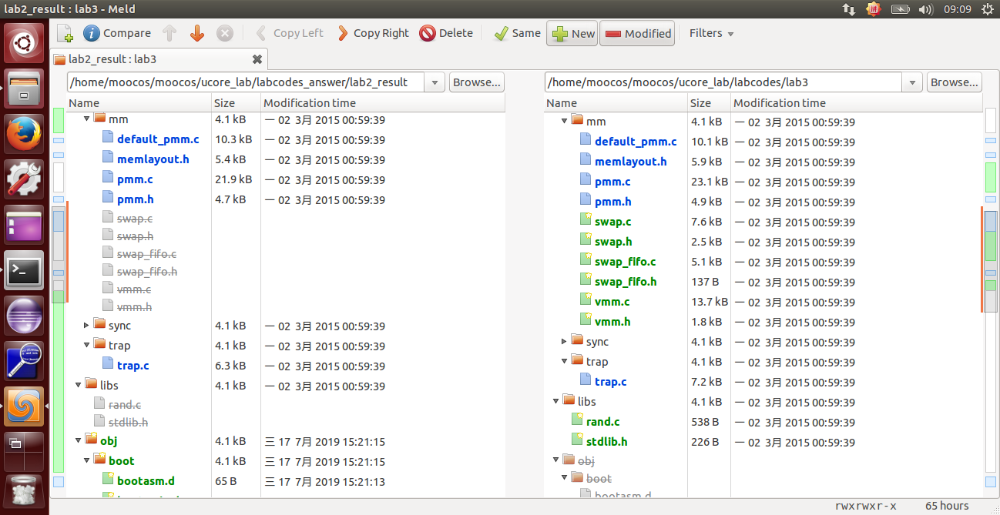
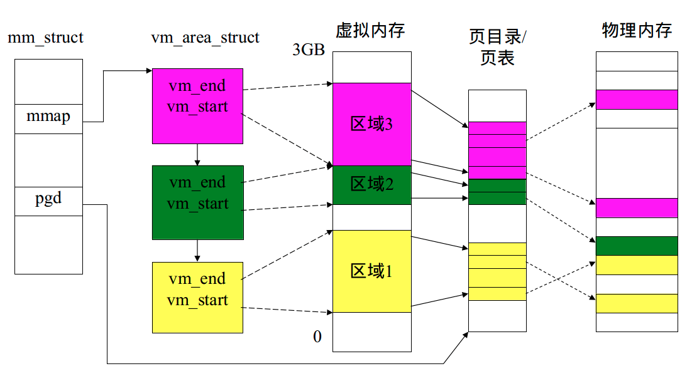
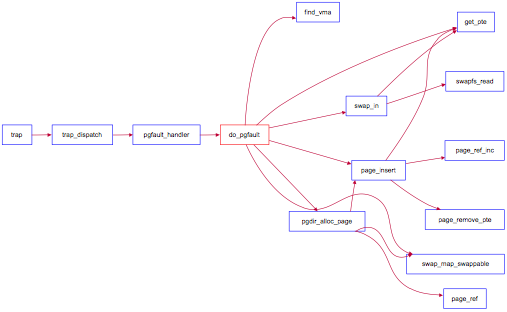
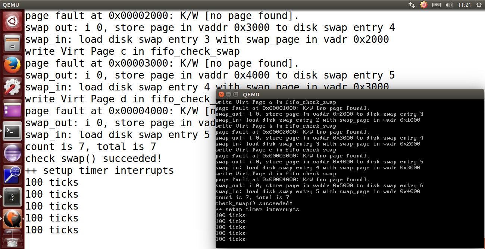

## lab3 实验报告

### 练习0：填写已有实验

`lab3` 会依赖 `lab1` 和 `lab2`，我们需要把做的 `lab1` 和 `lab2` 的代码填到 `lab3` 中缺失的位置上面。练习 0 就是一个工具的利用。这里我使用的是 `Linux` 下的系统已预装好的 `Meld Diff Viewer` 工具。和 `lab2` 操作流程一样，我们只需要将已经完成的 `lab1` 和 `lab2` 与待完成的 `lab3`  (由于 `lab2` 是基于 `lab1` 基础上完成的，所以这里只需要导入 `lab2` )分别导入进来，然后点击 `compare` 就行了。



然后软件就会自动分析两份代码的不同，然后就一个个比较比较复制过去就行了，在软件里面是可以支持打开对比复制了，点击 `Copy Right` 即可。当然 `bin` 目录和 `obj` 目录下都是 `make` 生成的，就不用复制了，其他需要修改的地方主要有以下四个文件，通过对比复制完成即可：

```c
default_pmm.c
pmm.c
trap.c
kdebug.c
```

### 练习1：给未被映射的地址映射上物理页（需要编程）

本实验要求完成 `do_pgfault` 函数，作用给未被映射的地址映射上物理页。 

具体而言，当启动分页机制以后，如果一条指令或数据的虚拟地址所对应的物理页框不在内存中或者访问的类型有错误（比如写一个只读页或用户态程序访问内核态的数据等），就会发生页错误异常。产生页面异常的原因主要有：

- 目标页面不存在（页表项全为 `0`，即该线性地址与物理地址尚未建立映射或者已经撤销）;
- 相应的物理页面不在内存中（页表项非空，但 `Present` 标志位 `=0`，比如在 `swap` 分区或磁盘文件上）
- 访问权限不符合（此时页表项 `P` 标志 `=1`，比如企图写只读页面）.

当出现上面情况之一，那么就会产生页面 `page fault(#PF)` 异常。产生异常的线性地址存储在 `CR2` 中,并且将是 `page fault` 的产生类型保存在 `error code` 中。

因此此函数是完成页错误异常处理的主要函数，它根据 `CPU` 的控制寄存器 `CR2` 中获取的页错误异常的虚拟地址，以及根据 `error code` 的错误类型来查找次虚拟地址是否在某个 `VMA` 的地址范围内，并且是否满足正确的读写权限。如果在此范围内并且权限也正确，就认为这是一次合法访问，但没有建立虚实对应关系，所以需要分配一个空闲的内存页，并修改页表完成虚地址到物理地址的映射，刷新 `TLB`，然后调用 `iret` 中断，返回并重新执行。如果该虚地址不在某 `VMA` 范围内，这认为是一个非法访问。

那么我们的这个 `do_pgfault` 函数的思路就明显了。`do_pgfault()` 函数从 `CR2` 寄存器中获取页错误异常的虚拟地址，根据 `error code` 来查找这个虚拟地址是否在某一个 `VMA` 的地址范围内，那么就给它分配一个物理页。 

page_fault 函数不知道哪些是“合法”的虚拟页，原因是 `ucore` 还缺少一定的数据结构来描述这种不在物理内存中的“合法”虚拟页。为此 `ucore` 通过建立 `mm_struct` 和 `vma_struct` 数据结构，描述了 `ucore` 模拟应用程序运行所需的合法内存空间。当访问内存产生 page fault 异常时，可获得访问的内存的方式（读或写）以及具体的虚拟内存地址，这样 `ucore` 就可以查询此地址，看是否属于 `vma_struct` 数据结构中描述的合法地址范围中，如果在，则可根据具体情况进行请求调页/页换入换出处理；如果不在，则报错。

 虚拟地址空间和物理地址空间的示意图如下图所示：


这里的 VMA 是描述应用程序对虚拟内存“需求”的变量，如下：

```c
struct vma_struct {  
    struct mm_struct *vm_mm;  //指向一个比 vma_struct 更高的抽象层次的数据结构 mm_struct 
    uintptr_t vm_start;      //vma 的开始地址
    uintptr_t vm_end;      // vma 的结束地址
    uint32_t vm_flags;     // 虚拟内存空间的属性
    list_entry_t list_link;  //双向链表，按照从小到大的顺序把虚拟内存空间链接起来
}; 
```

其中，各变量的属性如下：

- `vm_start` 和 `vm_end` 描述的是一个合理的地址空间范围（即严格确保 `vm_start < vm_end` 的关系）

- `list_link` 是一个双向链表，按照从小到大的顺序把一系列用 `vma_struct` 表示的虚拟内存空间链接起来，并且还要求这些链起来的 `vma_struct` 应该是不相交的，即 `vma` 之间的地址空间无交集。

- `vm_flags` 表示了这个虚拟内存空间的属性，目前的属性包括：

  > define VM_READ 0x00000001   //只读
  >
  > define VM_WRITE 0x00000002  //可读写
  >
  > define VM_EXEC 0x00000004   //可执行

`vm_mm` 是一个指针，指向一个比 `vma_struct` 更高的抽象层次的数据结构 `mm_struct`。

```c
struct mm_struct {  
    list_entry_t mmap_list;  //双向链表头，链接了所有属于同一页目录表的虚拟内存空间
    struct vma_struct *mmap_cache;  //指向当前正在使用的虚拟内存空间
    pde_t *pgdir; //指向的就是 mm_struct数据结构所维护的页表
    int map_count; //记录 mmap_list 里面链接的 vma_struct 的个数
    void *sm_priv; //指向用来链接记录页访问情况的链表头
};  
```

其中，各变量的属性如下：

- `mmap_list` 是双向链表头，链接了所有属于同一页目录表的虚拟内存空间。
- `mmap_cache` 是指向当前正在使用的虚拟内存空间，由于操作系统执行的“局部性”原理，当前正在用到的虚拟内存空间在接下来的操作中可能还会用到，这时就不需要查链表，而是直接使用此指针就可找到下一次要用到的虚拟内存空间。
- `pgdir` 所指向的就是 `mm_struct` 数据结构所维护的页表。通过访问 `pgdir` 可以查找某虚拟地址对应的页表项是否存在以及页表项的属性等。
- `map_count` 记录 `mmap_list` 里面链接的 `vma_struct` 的个数。
- `sm_priv` 指向用来链接记录页访问情况的链表头，这建立了 `mm_struct` 和后续要讲到的 `swap_manager` 之间的联系。

其结构关系如图所示：



`do_pgfault` 的调用关系如下图所示：



实现过程如下：(包含了练习 1 以及 练习 2 的部分实现)

```c
int do_pgfault(struct mm_struct *mm, uint32_t error_code, uintptr_t addr) {
    int ret = -E_INVAL;
    //try to find a vma which include addr
    struct vma_struct *vma = find_vma(mm, addr);//查询 vma

    pgfault_num++;
    //If the addr is in the range of a mm's vma?
    if (vma == NULL || vma->vm_start > addr) {
        cprintf("not valid addr %x, and  can not find it in vma\n", addr);
        goto failed;
    }
    //check the error_code
    switch (error_code & 3) {//错误处理
    default:
            /* error code flag : default is 3 ( W/R=1, P=1): write, present */
    case 2: /* error code flag : (W/R=1, P=0): write, not present */
        if (!(vma->vm_flags & VM_WRITE)) {
            cprintf("do_pgfault failed: error code flag = write AND not present, but the addr's vma cannot write\n");
            goto failed;
        }
        break;
    case 1: /* error code flag : (W/R=0, P=1): read, present */
        cprintf("do_pgfault failed: error code flag = read AND present\n");
        goto failed;
    case 0: /* error code flag : (W/R=0, P=0): read, not present */
        if (!(vma->vm_flags & (VM_READ | VM_EXEC))) {
            cprintf("do_pgfault failed: error code flag = read AND not present, but the addr's vma cannot read or exec\n");
            goto failed;
        }
    }
    /* IF (write an existed addr ) OR
     *    (write an non_existed addr && addr is writable) OR
     *    (read  an non_existed addr && addr is readable)
     * THEN
     *    continue process
     */
    uint32_t perm = PTE_U;
    if (vma->vm_flags & VM_WRITE) {
        perm |= PTE_W;
    }
    addr = ROUNDDOWN(addr, PGSIZE);

    ret = -E_NO_MEM;

    pte_t *ptep=NULL;
    /*LAB3 EXERCISE 1: YOUR CODE
    * Maybe you want help comment, BELOW comments can help you finish the code
    *
    * Some Useful MACROs and DEFINEs, you can use them in below implementation.
    * MACROs or Functions:
    *   get_pte : get an pte and return the kernel virtual address of this pte for la
    *             if the PT contians this pte didn't exist, alloc a page for PT (notice the 3th parameter '1')
    *   pgdir_alloc_page : call alloc_page & page_insert functions to allocate a page size memory & setup
    *             an addr map pa<--->la with linear address la and the PDT pgdir
    * DEFINES:
    *   VM_WRITE  : If vma->vm_flags & VM_WRITE == 1/0, then the vma is writable/non writable
    *   PTE_W           0x002                   // page table/directory entry flags bit : Writeable
    *   PTE_U           0x004                   // page table/directory entry flags bit : User can access
    * VARIABLES:
    *   mm->pgdir : the PDT of these vma
    *
    */
--------------------------------------------------------------------------------------------
* 设计思路：
    首先检查页表中是否有相应的表项，如果表项为空，那么说明没有映射过；
    然后使用 pgdir_alloc_page 获取一个物理页，同时进行错误检查即可。
/*LAB3 EXERCISE 1: YOUR CODE*/
    // try to find a pte, if pte's PT(Page Table) isn't existed, then create a PT.
    // (notice the 3th parameter '1')
    if ((ptep = get_pte(mm->pgdir, addr, 1)) == NULL) {
        cprintf("get_pte in do_pgfault failed\n");
        goto failed;
    }
    //如果页表不存在，尝试分配一空闲页，匹配物理地址与逻辑地址，建立对应关系
    if (*ptep == 0) { // if the phy addr isn't exist, then alloc a page & map the phy addr with logical addr
        if (pgdir_alloc_page(mm->pgdir, addr, perm) == NULL) { //失败内存不够退出
            cprintf("pgdir_alloc_page in do_pgfault failed\n");
            goto failed;
        }
    }
--------------------------------------------------------------------------------------------
    /*LAB3 EXERCISE 2: YOUR CODE
    * Now we think this pte is a  swap entry, we should load data from disk to a page with phy addr,
    * and map the phy addr with logical addr, trigger swap manager to record the access situation of this page.
    *
    *  Some Useful MACROs and DEFINEs, you can use them in below implementation.
    *  MACROs or Functions:
    *    swap_in(mm, addr, &page) : alloc a memory page, then according to the swap entry in PTE for addr,
    *                               find the addr of disk page, read the content of disk page into this memroy page
    *    page_insert ： build the map of phy addr of an Page with the linear addr la
    *    swap_map_swappable ： set the page swappable
    */
--------------------------------------------------------------------------------------------
* 设计思路：
    如果 PTE 存在，那么说明这一页已经映射过了但是被保存在磁盘中，需要将这一页内存交换出来：
      1.调用 swap_in 将内存页从磁盘中载入内存；
      2.调用 page_insert 建立物理地址与线性地址之间的映射；
      3.设置页对应的虚拟地址，方便交换出内存时将正确的内存数据保存在正确的磁盘位置；
      4.调用 swap_map_swappable 将物理页框加入 FIFO。
/*LAB3 EXERCISE 2: YOUR CODE*/
    //页表项非空，尝试换入页面
    else { // if this pte is a swap entry, then load data from disk to a page with phy addr
           // and call page_insert to map the phy addr with logical addr
        if(swap_init_ok) {
            struct Page *page=NULL;//根据 mm 结构和 addr 地址，尝试将硬盘中的内容换入至 page 中
            if ((ret = swap_in(mm, addr, &page)) != 0) {
                cprintf("swap_in in do_pgfault failed\n");
                goto failed;
            }    
            page_insert(mm->pgdir, page, addr, perm);//建立虚拟地址和物理地址之间的对应关系
            swap_map_swappable(mm, addr, page, 1);//将此页面设置为可交换的
            page->pra_vaddr = addr;
        }
        else {
            cprintf("no swap_init_ok but ptep is %x, failed\n",*ptep);
            goto failed;
        }
   }
   ret = 0;
failed:
    return ret;
}
```

> 请描述页目录项（Page Directory Entry）和页表项（Page Table Entry）中组成部分对 ucore 实现页替换算法的潜在用处。

表项中 `PTE_A` 表示内存页是否被访问过，`PTE_D` 表示内存页是否被修改过，借助着两位标志位可以实现 Enhanced Clock 算法。

> 如果 ucore 的缺页服务例程在执行过程中访问内存，出现了页访问异常，请问硬件要做哪些事情？

如果出现了页访问异常，那么硬件将引发页访问异常的地址将被保存在 `cr2` 寄存器中，设置错误代码，然后触发 `Page Fault` 异常。

### 练习2：补充完成基于 FIFO 的页面替换算法（需要编程）

本实验要求完成 `do_pgfault` 函数，并且在实现 `FIFO` 算法的 `swap_fifo.c` 中完成 `map_swappable` 和 `swap_out_victim` 函数，通过对 `swap` 的测试。根据练习 1，当页错误异常发生时，有可能是因为页面保存在 `swap` 区或者磁盘文件上造成的，所以我们需要利用页面替换算法解决这个问题。 

页面替换主要分为两个方面，页面换入和页面换出。 

- 页面换入：主要在上述的 `do_pgfault()` 函数实现； 
- 页面换出：主要在 `swap_out_vistim()` 函数实现。

在换入时，需要先检查产生访问异常的地址是否属于某个 `VMA` 表示的合法虚拟地址，并且保存在硬盘的 `swap` 文件中（即对应的 `PTE` 的高 `24` 位不为 `0`，而最低位为 `0`），则是执行页换入的时机，将调用 `swap_in` 函数完成页面换入。

在换出时，采取的是消极的换出策略，是在调用 `alloc_pages` 函数获取空闲页时，此函数如果发现无法从物理内存页分配器（比如 `First Fit` ）获得空闲页，就会进一步调用 `swap_out` 函数 换出某页，实现一种消极的换出策略。

由于页面换入操作已经在练习 1 中实现了，所以这里我们主要谈页面换出。

为了实现各种页替换算法，我们需要设计一个页替换算法的类框架 `swap_manager`：

```c
struct swap_manager
{
     const char *name;
     /* Global initialization for the swap manager */
     int (*init)            (void);
     /* Initialize the priv data inside mm_struct */
     int (*init_mm)         (struct mm_struct *mm);
     /* Called when tick interrupt occured */
     int (*tick_event)      (struct mm_struct *mm);
     /* Called when map a swappable page into the mm_struct */
     int (*map_swappable)   (struct mm_struct *mm, uintptr_t addr, struct Page *page, int swap_in);
     /* When a page is marked as shared, this routine is called to
      * delete the addr entry from the swap manager */
     int (*set_unswappable) (struct mm_struct *mm, uintptr_t addr);
     /* Try to swap out a page, return then victim */
     int (*swap_out_victim) (struct mm_struct *mm, struct Page **ptr_page, int in_tick);
     /* check the page relpacement algorithm */
     int (*check_swap)(void);     
};
```

这里关键的两个函数指针是 `map_swappable` 和 `swap_out_vistim`，`map_swappable` 函数用于记录页访问情况相关属性，`swap_out_vistim` 函数用于挑选需要换出的页。显然 `swap_out_vistim` 函数依赖于 `map_swappable` 函数记录的页访问情况。`tick_event` 函数指针也很重要，结合定时产生的中断，可以实现一种积极的换页策略。

`FIFO` 替换算法会维护一个队列，队列按照页面调用的次序排列，越早被加载到内存的页面会越早被换出。

由于 FIFO 基于双向链表实现，所以只需要将元素插入到头节点之前。

实现过程如下：

```c
/*
 * (3)_fifo_map_swappable: According FIFO PRA, we should link the most recent arrival page at the back of pra_list_head qeueue
 */
// 作用: 将最近被用到的页面添加到算法所维护的次序队列。
static int _fifo_map_swappable(struct mm_struct *mm, uintptr_t addr, struct Page *page, int swap_in)
{
    list_entry_t *head=(list_entry_t*) mm->sm_priv;
    list_entry_t *entry=&(page->pra_page_link);
 
    assert(entry != NULL && head != NULL);
    //record the page access situlation
    /*LAB3 EXERCISE 2: YOUR CODE*/ 
    //(1)link the most recent arrival page at the back of the pra_list_head qeueue.
    list_add(head, entry);//将最近用到的页面添加到次序的队尾
    return 0;
}
```

将双向链表中头部节点后面的第一个节点删除，返回对应的页地址（虚拟地址）。

实现过程如下：

```c
/*
 *  (4)_fifo_swap_out_victim: According FIFO PRA, we should unlink the  earliest arrival page in front of pra_list_head qeueue,
 *                            then assign the value of *ptr_page to the addr of this page.
 */
// 作用: 用来查询哪个页面需要被换出。
static int _fifo_swap_out_victim(struct mm_struct *mm, struct Page ** ptr_page, int in_tick)
{
     list_entry_t *head=(list_entry_t*) mm->sm_priv;
         assert(head != NULL);
     assert(in_tick==0);
     /* Select the victim */
     /*LAB3 EXERCISE 2: YOUR CODE*/ 
     //(1)  unlink the  earliest arrival page in front of pra_list_head qeueue
     //(2)  assign the value of *ptr_page to the addr of this page
     /* Select the tail */
     list_entry_t *le = head->prev;//指出需要被换出的页
     assert(head!=le);
     struct Page *p = le2page(le, pra_page_link);//le2page 宏可以根据链表元素，获得对应 page 的指针p
     list_del(le);//将进来最早的页面从队列中删除
     assert(p !=NULL);
     *ptr_page = p;//将这一页的地址存储在ptr_page中
     return 0;
}
```

最终运行结果如下：



> 如果要在ucore上实现"extended clock 页替换算法"请给你的设计方案，现有的 swap_manager 框架是否足以支持在 ucore 中实现此算法？如果是，请给你的设计方案。如果不是，请给出你的新的扩展和基此扩展的设计方案。并需要回答如下问题
>
> - 需要被换出的页的特征是什么？
> - 在ucore中如何判断具有这样特征的页？
> - 何时进行换入和换出操作？

对于每个页面都有两个标志位，分别为使用位和修改位，记为`<使用,修改>`。换出页的使用位必须为0，并且算法优先考虑换出修改位为零的页面。

当内存页被访问后，MMU 将在对应的页表项的 `PTE_A` 这一位设为1；

当内存页被修改后，MMU 将在对应的页表项的 `PTE_D` 这一位设为1。

当保存在磁盘中的内存需要被访问时，需要进行**换入**操作；

当位于物理页框中的内存被页面替换算法选择时，需要进行**换出**操作。

### 扩展练习

#### Challenge 1：实现识别 dirty bit 的 extended clock 页替换算法（需要编程）

##### 数据结构

Enhanced Clock 算法需要一个环形链表和一个指针，这个可以在原有的双向链表基础上实现。为了方便进行循环访问，将原先的头部哨兵删除，这样所有的页面形成一个环形链表。指向环形链表指针也就是 Enhanced Clock 算法中指向下个页面的指针。

##### 插入

如果环形链表为空，那么这个页面就是整个链表，将指针指向这个页面。否则，只需要将页面插入指针指向的页面之前即可。

##### 换出

Enhanced Clock 算法最多需要遍历环形链表四次（规定标记为`<访问,修改>`）：

- 首先，查找标记为`<0,0>`的页面；
- 如果上一步没有找到，查找标记`<0,1>`，并将访问过的页面的访问位清零；
- 如果上一步没有找到，再次查找标记为`<0,0>`的页面；
- 如果上一步没有找到，再次查找标记为`<0,1>`的页面；

> 将PTE中的PTE_A清除后，需要调用`tlb_invalidate`刷新TLB，否则当页面被再次访问的时候，PTE中的PTE_A不会被设置。

实现如下：

```c
// swap_clock.h
#ifndef __KERN_MM_SWAP_CLOCK_H__
#define __KERN_MM_SWAP_CLOCK_H__

#include <swap.h>
extern struct swap_manager swap_manager_clock;

#endif
--------------------------------------------------------------------------------------------
// swap_clock.c
#include <x86.h>
#include <stdio.h>
#include <string.h>
#include <swap.h>
#include <swap_clock.h>
#include <list.h>

#define GET_LIST_ENTRY_PTE(pgdir, le)  (get_pte((pgdir), le2page((le), pra_page_link)->pra_vaddr, 0))
#define GET_DIRTY_FLAG(pgdir, le)      (*GET_LIST_ENTRY_PTE((pgdir), (le)) & PTE_D)
#define GET_ACCESSED_FLAG(pgdir, le)   (*GET_LIST_ENTRY_PTE((pgdir), (le)) & PTE_A)
#define CLEAR_ACCESSED_FLAG(pgdir, le) do {\
    struct Page *page = le2page((le), pra_page_link);\
    pte_t *ptep = get_pte((pgdir), page->pra_vaddr, 0);\
    *ptep = *ptep & ~PTE_A;\
    tlb_invalidate((pgdir), page->pra_vaddr);\
} while (0)

static int
_clock_init_mm(struct mm_struct *mm)
{     
     mm->sm_priv = NULL;
     return 0;
}

static int
_clock_map_swappable(struct mm_struct *mm, uintptr_t addr, struct Page *page, int swap_in)
{
    list_entry_t *head=(list_entry_t*) mm->sm_priv;
    list_entry_t *entry=&(page->pra_page_link);
    assert(entry != NULL);

    // Insert before pointer
    if (head == NULL) {
        list_init(entry);
        mm->sm_priv = entry;
    } else {
        list_add_before(head, entry);
    }
    return 0;
}

static int
_clock_swap_out_victim(struct mm_struct *mm, struct Page ** ptr_page, int in_tick)
{
     list_entry_t *head=(list_entry_t*) mm->sm_priv;
     assert(head != NULL);
     assert(in_tick==0);

     list_entry_t *selected = NULL, *p = head;
     // Search <0,0>
     do {
        if (GET_ACCESSED_FLAG(mm->pgdir, p) == 0 && GET_DIRTY_FLAG(mm->pgdir, p) == 0) {
            selected = p;
            break;
        }
        p = list_next(p);
     } while (p != head);
     // Search <0,1> and set 'accessed' to 0
     if (selected == NULL)
        do {
            if (GET_ACCESSED_FLAG(mm->pgdir, p) == 0 && GET_DIRTY_FLAG(mm->pgdir, p)) {
                selected = p;
                break;
            }
            CLEAR_ACCESSED_FLAG(mm->pgdir, p);
            p = list_next(p);
        } while (p != head);
     // Search <0,0> again
     if (selected == NULL)
        do {
            if (GET_ACCESSED_FLAG(mm->pgdir, p) == 0 && GET_DIRTY_FLAG(mm->pgdir, p) == 0) {
                selected = p;
                break;
            }
            p = list_next(p);
        } while (p != head);
     // Search <0,1> again
     if (selected == NULL)
        do {
            if (GET_ACCESSED_FLAG(mm->pgdir, p) == 0 && GET_DIRTY_FLAG(mm->pgdir, p)) {
                selected = p;
                break;
            }
            p = list_next(p);
        } while (p != head);
     // Remove pointed element
     head = selected;
     if (list_empty(head)) {
        mm->sm_priv = NULL;
     } else {
         mm->sm_priv = list_next(head);
        list_del(head);
     }
     *ptr_page = le2page(head, pra_page_link);
     return 0;
}

static int
_clock_check_swap(void) {
    cprintf("write Virt Page c in fifo_check_swap\n");
    *(unsigned char *)0x3000 = 0x0c;
    assert(pgfault_num==4);
    cprintf("write Virt Page a in fifo_check_swap\n");
    *(unsigned char *)0x1000 = 0x0a;
    assert(pgfault_num==4);
    cprintf("write Virt Page d in fifo_check_swap\n");
    *(unsigned char *)0x4000 = 0x0d;
    assert(pgfault_num==4);
    cprintf("write Virt Page b in fifo_check_swap\n");
    *(unsigned char *)0x2000 = 0x0b;
    assert(pgfault_num==4);
    cprintf("write Virt Page e in fifo_check_swap\n");
    *(unsigned char *)0x5000 = 0x0e;
    assert(pgfault_num==5);
    cprintf("write Virt Page b in fifo_check_swap\n");
    *(unsigned char *)0x2000 = 0x0b;
    assert(pgfault_num==5);
    cprintf("write Virt Page a in fifo_check_swap\n");
    *(unsigned char *)0x1000 = 0x0a;
    assert(pgfault_num==6);
    cprintf("write Virt Page b in fifo_check_swap\n");
    *(unsigned char *)0x2000 = 0x0b;
    assert(pgfault_num==6);
    cprintf("write Virt Page c in fifo_check_swap\n");
    *(unsigned char *)0x3000 = 0x0c;
    assert(pgfault_num==7);
    cprintf("write Virt Page d in fifo_check_swap\n");
    *(unsigned char *)0x4000 = 0x0d;
    assert(pgfault_num==8);
    cprintf("write Virt Page e in fifo_check_swap\n");
    *(unsigned char *)0x5000 = 0x0e;
    assert(pgfault_num==9);
    cprintf("write Virt Page a in fifo_check_swap\n");
    assert(*(unsigned char *)0x1000 == 0x0a);
    *(unsigned char *)0x1000 = 0x0a;
    assert(pgfault_num==9);
    cprintf("read Virt Page b in fifo_check_swap\n");
    assert(*(unsigned char *)0x2000 == 0x0b);
    assert(pgfault_num==10);
    cprintf("read Virt Page c in fifo_check_swap\n");
    assert(*(unsigned char *)0x3000 == 0x0c);
    assert(pgfault_num==11);
    cprintf("read Virt Page a in fifo_check_swap\n");
    assert(*(unsigned char *)0x1000 == 0x0a);
    assert(pgfault_num==12);
    cprintf("read Virt Page d in fifo_check_swap\n");
    assert(*(unsigned char *)0x4000 == 0x0d);
    assert(pgfault_num==13);
    cprintf("read Virt Page b in fifo_check_swap\n");
    *(unsigned char *)0x1000 = 0x0a;
    assert(*(unsigned char *)0x3000 == 0x0c);
    assert(*(unsigned char *)0x4000 == 0x0d);
    assert(*(unsigned char *)0x5000 == 0x0e);
    assert(*(unsigned char *)0x2000 == 0x0b);
    assert(pgfault_num==14);
    return 0;
}

static int
_clock_init(void)
{
    return 0;
}

static int
_clock_set_unswappable(struct mm_struct *mm, uintptr_t addr)
{
    return 0;
}

_clock_tick_event(struct mm_struct *mm)
{ return 0; }

struct swap_manager swap_manager_clock =
{
     .name            = "clock swap manager",
     .init            = &_clock_init,
     .init_mm         = &_clock_init_mm,
     .tick_event      = &_clock_tick_event,
     .map_swappable   = &_clock_map_swappable,
     .set_unswappable = &_clock_set_unswappable,
     .swap_out_victim = &_clock_swap_out_victim,
     .check_swap      = &_clock_check_swap,
};
```

#### Challenge 2：实现不考虑实现开销和效率的 LRU 页替换算法（需要编程）

> 注：待完成

### 参考资料

- [page-rep3.dvi](http://courses.cs.tamu.edu/bart/cpsc410/Supplements/Slides/page-rep3.pdf)
- [Paging - OSDev Wiki](http://wiki.osdev.org/Paging)

