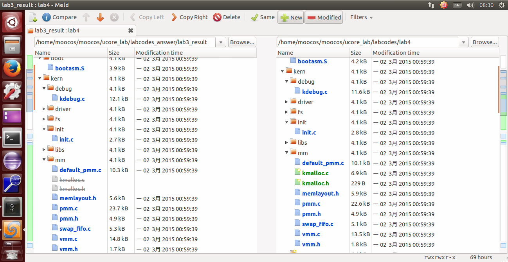
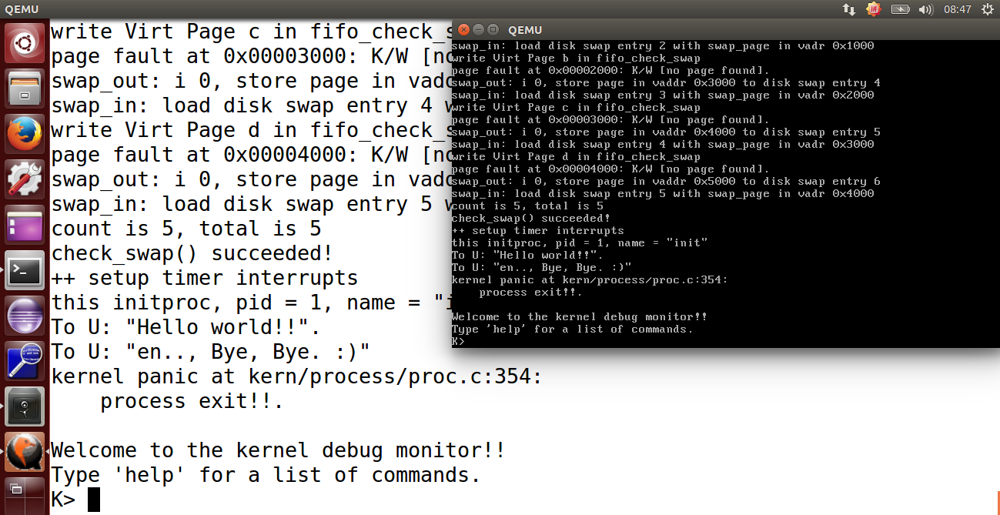

## lab4 实验报告

### 练习0：填写已有实验

`lab4` 会依赖 `lab1、lab2` 和 `lab3`，我们需要把做的 `lab1、lab2` 和 `lab3` 的代码填到 `lab4` 中缺失的位置上面。练习 0 就是一个工具的利用。这里我使用的是 `Linux` 下的系统已预装好的 `Meld Diff Viewer` 工具。和 `lab3` 操作流程一样，我们只需要将已经完成的 `lab1、lab2` 和 `lab3` 与待完成的 `lab4`  (由于 `lab4` 是基于 `lab1、lab2、lab3` 基础上完成的，所以这里只需要导入 `lab3` )分别导入进来，然后点击 `compare` 就行了。



然后软件就会自动分析两份代码的不同，然后就一个个比较比较复制过去就行了，在软件里面是可以支持打开对比复制了，点击 `Copy Right` 即可。当然 `bin` 目录和 `obj` 目录下都是 `make` 生成的，就不用复制了，其他需要修改的地方主要有以下四个文件，通过对比复制完成即可：

```c
default_pmm.c
pmm.c
swap_fifo.c
vmm.c
trap.c
```

### 练习1：分配并初始化一个进程控制块（需要编码）

内核线程是一种特殊的进程，内核线程与用户进程的区别有两个：

- 内核线程只运行在内核态，而用户进程会在在用户态和内核态交替运行；
- 所有内核线程直接使用共同  `ucore` 内核内存空间，不需为每个内核线程维护单独的内存空间，而用户进程需要维护各自的用户内存空间。

这里主要是从 `kern_init` 函数的物理内存管理初始化开始的，按照函数的次序做了一个简单的总结：

- 1、pmm_init() 
  - (1) 初始化物理内存管理器。
  - (2) 初始化空闲页，主要是初始化物理页的 Page 数据结构，以及建立页目录表和页表。
  - (3) 初始化 boot_cr3 使之指向了 ucore 内核虚拟空间的页目录表首地址，即一级页表的起始物理地址。
  - (4) 初始化第一个页表 boot_pgdir。
  - (5) 初始化 GDT，即全局描述符表。

- 2、pic_init() 
  - 初始化 8259A 中断控制器

- 3、idt_init() 
  - 初始化 IDT，即中断描述符表

- 4、vmm_init() 
  - 主要就是实验了一个 do_pgfault() 函数达到页错误异常处理功能，以及虚拟内存相关的 mm,vma 结构数据的创建/销毁/查找/插入等函数

- 5、proc_init() 
  - 这个函数启动了创建内核线程的步骤，完成了 idleproc 内核线程和 initproc 内核线程的创建或复制工作，这是本次实验分析的重点，后面将详细分析。

- 6、ide_init() 
  - 完成对用于页换入换出的硬盘(简称 swap 硬盘)的初始化工作

- 7、swap_init() 
  - swap_init() 函数首先建立完成页面替换过程的主要功能模块，即 swap_manager，其中包含了页面置换算法的实现

操作系统是以进程为中心设计的，所以其首要任务是为进程建立档案，进程档案用于表示、标识或描述进程，即进程控制块。这里需要完成的就是一个进程控制块的初始化。

而这里我们分配的是一个内核线程的 PCB，它通常只是内核中的一小段代码或者函数，没有用户空间。而由于在操作系统启动后，已经对整个核心内存空间进行了管理，通过设置页表建立了核心虚拟空间(即 boot_cr3 指向的二级页表描述的空间)。所以内核中的所有线程都不需要再建立各自的页表，只需共享这个核心虚拟空间就可以访问整个物理内存了。

首先在 `kern/process/proc.h` 中定义了 `PCB`，即进程控制块的结构体 `proc_struct`，如下：

```c 
struct proc_struct {             //进程控制块
    enum proc_state state;       //进程状态
    int pid;                     //进程ID
    int runs;                    //运行时间
    uintptr_t kstack;            //内核栈位置
    volatile bool need_resched;  //是否需要调度
    struct proc_struct *parent;  //父进程
    struct mm_struct *mm;        //进程的虚拟内存
    struct context context;      //进程上下文
    struct trapframe *tf;        //当前中断帧的指针
    uintptr_t cr3;               //当前页表地址
    uint32_t flags;              //进程
    char name[PROC_NAME_LEN + 1];//进程名字
    list_entry_t list_link;      //进程链表       
    list_entry_t hash_link;      //进程哈希表            
};
```

这里简单介绍下各个参数：

- state：进程所处的状态。
  - PROC_UNINIT // 未初始状态 
  - PROC_SLEEPING // 睡眠（阻塞）状态 
  - PROC_RUNNABLE // 运行与就绪态 
  - PROC_ZOMBIE // 僵死状态

- pid：进程 id 号。

- kstack：记录了分配给该进程/线程的内核桟的位置。
- need_resched：是否需要调度
- parent：用户进程的父进程。
- mm：即实验三中的描述进程虚拟内存的结构体
- context：进程的上下文，用于进程切换。
- tf：中断帧的指针，总是指向内核栈的某个位置。中断帧记录了进程在被中断前的状态。
- cr3：记录了当前使用的页表的地址

而这里要求我们完成一个 alloc_proc 函数来负责分配一个新的 struct proc_struct 结构，根据提示我们需要初始化一些变量，具体的代码如下：

```c
* 实现思路：
该函数的具体含义为创建一个新的进程控制块，并且对控制块中的所有成员变量进行初始化，根据实验指导书中的要求，除了指定的若干个成员变量之外，其他成员变量均初始化为0，取特殊值的成员变量如下所示：
proc->state = PROC_UNINIT;
proc->pid = -1;
proc->cr3 = boot_cr3; // 由于是内核线程，共用一个虚拟内存空间
对于其他成员变量中占用内存空间较大的，可以考虑使用 memset 函数进行初始化。
--------------------------------------------------------------------------------------------
/*code*/
static struct proc_struct *alloc_proc(void) {
    struct proc_struct *proc = kmalloc(sizeof(struct proc_struct));
    if (proc != NULL) {
        proc->state = PROC_UNINIT;  //设置进程为未初始化状态
        proc->pid = -1;             //未初始化的的进程id为-1
        proc->runs = 0;             //初始化时间片
        proc->kstack = 0;           //内存栈的地址
        proc->need_resched = 0;     //是否需要调度设为不需要
        proc->parent = NULL;        //父节点设为空
        proc->mm = NULL;            //虚拟内存设为空
        memset(&(proc->context), 0, sizeof(struct context));//上下文的初始化
        proc->tf = NULL;            //中断帧指针置为空
        proc->cr3 = boot_cr3;       //页目录设为内核页目录表的基址
        proc->flags = 0;            //标志位
        memset(proc->name, 0, PROC_NAME_LEN);//进程名
    }
    return proc;
}
```


> 请说明 proc_struct 中 `struct context context` 和 `struct trapframe *tf` 成员变量含义和在本实验中的作用是啥？（提示通过看代码和编程调试可以判断出来）

```c
首先不妨查看 struct context 结构体的定义，可以发现在结构体中存储这除了 eax 之外的所有通用寄存器以及 eip 的数值，这就提示我们这个线程控制块中的 context 很有可能是保存的线程运行的上下文信息；
  
接下来使用 find grep 命令查找在 ucore 中对 context 成员变量进行了设置的代码，总共可以发现两处，分别为 Swtich.S 和 proc.c 中的 copy_thread 函数中，在其他部分均没有发现对 context 的引用和定义（除了初始化）；那么根据 Swtich 中代码的语义，可以确定 context 变量的意义就在于内核线程之间进行切换的时候，将原先的线程运行的上下文保存下来这一作用。

那么为什么没有对 eax 进行保存呢？注意到在进行切换的时候调用了 switch_to 这一个函数，也就是说这个函数的里面才是线程之间切换的切换点，而在这个函数里面，由于 eax 是一个 caller-save 寄存器，并且在函数里 eax 的数值一直都可以在栈上找到对应，因此没有比较对其进行保存。

在 context 中保存着各种寄存器的内容，主要保存了前一个进程的现场（各个寄存器的状态），是进程切换的上下文内容，这是为了保存进程上下文，用于进程切换，为进程调度做准备。

在 ucore 中，所有的进程在内核中也是相对独立的。使用 context 保存寄存器的目的就在于在内核态中能够进行上下文之间的切换。实际利用 context 进行上下文切换的函数是在 kern/process/switch.S 中定义 switch_to 函数。
--------------------------------------------------------------------------------------------
/*code*/
struct context {
    uint32_t eip;
    uint32_t esp;
    uint32_t ebx;
    uint32_t ecx;
    uint32_t edx;
    uint32_t esi;
    uint32_t edi;
    uint32_t ebp;
};
--------------------------------------------------------------------------------------------
接下来同样在代码中寻找对 tf 变量进行了定义的地方，最后可以发现在 copy_thread 函数中对 tf 进行了设置，但是值得注意的是，在这个函数中，同时对 context 变量的 esp 和 eip 进行了设置。前者设置为 tf 变量的地址，后者设置为 forkret 这个函数的指针。接下来观察 forkret 函数，发现这个函数最终调用了 __trapret 进行中断返回，这样的话，tf 变量的作用就变得清晰起来了。

tf 变量的作用在于在构造出了新的线程的时候，如果要将控制权交给这个线程，是使用中断返回的方式进行的（跟lab1中切换特权级类似的技巧），因此需要构造出一个伪造的中断返回现场，也就是 trapframe，使得可以正确地将控制权转交给新的线程；具体切换到新的线程的做法为：
* 调用switch_to函数。
* 然后在该函数中进行函数返回，直接跳转到 forkret 函数。
* 最终进行中断返回函数 __trapret，之后便可以根据 tf 中构造的中断返回地址，切换到新的线程了。

trapframe 保存着用于特权级转换的栈 esp 寄存器，当进程发生特权级转换的时候，中断帧记录了进入中断时任务的上下文。当退出中断时恢复环境。

tf 是一个中断帧的指针，总是指向内核栈的某个位置：
* 当进程从用户空间跳到内核空间时，中断帧记录了进程在被中断前的状态。
* 当内核需要跳回用户空间时，需要调整中断帧以恢复让进程继续执行的各寄存器值。
* 除此之外，ucore 内核允许嵌套中断，因此为了保证嵌套中断发生时 tf 总是能够指向当前的 trapframe，ucore 在内核栈上维护了 tf 的链。
--------------------------------------------------------------------------------------------
/*code*/
struct trapframe {
    struct pushregs {
        uint32_t reg_edi;
        uint32_t reg_esi;
        uint32_t reg_ebp;
        uint32_t reg_oesp;          /* Useless */
        uint32_t reg_ebx;
        uint32_t reg_edx;
        uint32_t reg_ecx;
        uint32_t reg_eax;
    };
    uint16_t tf_gs;
    uint16_t tf_padding0;
    uint16_t tf_fs;
    uint16_t tf_padding1;
    uint16_t tf_es;
    uint16_t tf_padding2;
    uint16_t tf_ds;
    uint16_t tf_padding3;
    uint32_t tf_trapno;
    /* below here defined by x86 hardware */
    uint32_t tf_err;
    uintptr_t tf_eip;
    uint16_t tf_cs;
    uint16_t tf_padding4;
    uint32_t tf_eflags;
    /* below here only when crossing rings, such as from user to kernel */
    uintptr_t tf_esp;
    uint16_t tf_ss;
    uint16_t tf_padding5;
} __attribute__((packed));
```

根据这张图可以看出，内核态和用户态的转换首先是留下 SS 和 ESP 的位置，然后调用中断，改中断栈里面的内容， 然后退出中断的时候跳到内核态中，最后将 ebp 赋给 esp 修复 esp 的位置。


### 练习2：为新创建的内核线程分配资源（需要编码）

alloc_proc 实质只是找到了一小块内存用以记录进程的必要信息，并没有实际分配这些资源，而练习 2 完成的 do_fork 才是真正完成了资源分配的工作，当然，do_fork 也只是创建当前内核线程的一个副本，它们的执行上下文、代码、数据都一样，但是存储位置不同。 

根据提示及阅读源码可知，它完成的工作主要如下：

- 1、分配并初始化进程控制块（ alloc_proc 函数）;
- 2、分配并初始化内核栈，为内核进程（线程）建立栈空间（ setup_stack 函数）;
- 3、根据 clone_flag 标志复制或共享进程内存管理结构（ copy_mm 函数）;
- 4、设置进程在内核（将来也包括用户态）正常运行和调度所需的中断帧和执行上下文 
  （ copy_thread 函数）;
- 5、为进程分配一个 PID（ get_pid() 函数）;
- 6、把设置好的进程控制块放入 hash_list 和 proc_list 两个全局进程链表中;
- 7、自此，进程已经准备好执行了，把进程状态设置为“就绪”态;
- 8、设置返回码为子进程的 PID 号。

实现过程如下：

```c
* 实现思路：
该函数的语义为为内核线程创建新的线程控制块，并且对控制块中的每个成员变量进行正确的设置，使得之后可以正确切换到对应的线程中执行。
proc = alloc_proc(); // 为要创建的新的线程分配线程控制块的空间
if (proc == NULL) goto fork_out; // 判断是否分配到内存空间
assert(setup_kstack(proc) == 0);  // 为新的线程设置栈，在本实验中，每个线程的栈的大小初始均为 2 个 Page，即 8KB
assert(copy_mm(clone_flags, proc) == 0);  // 对虚拟内存空间进行拷贝，由于在本实验中，内核线程之间共享一个虚拟内存空间，因此实际上该函数不需要进行任何操作
copy_thread(proc, stack, tf); // 在新创建的内核线程的栈上面设置伪造好的中端帧，便于后文中利用 iret 命令将控制权转移给新的线程
proc->pid = get_pid(); // 为新的线程创建 pid
hash_proc(proc); // 将线程放入使用 hash 组织的链表中，便于加速以后对某个指定的线程的查找
nr_process ++; // 将全局线程的数目加 1
list_add(&proc_list, &proc->list_link); // 将线程加入到所有线程的链表中，便于进行调度
wakeup_proc(proc); // 唤醒该线程，即将该线程的状态设置为可以运行
ret = proc->pid; // 返回新线程的pid
--------------------------------------------------------------------------------------------
/*code*/
/* do_fork -     parent process for a new child process
 * @clone_flags: used to guide how to clone the child process
 * @stack:       the parent's user stack pointer. if stack==0, It means to fork a kernel thread.
 * @tf:          the trapframe info, which will be copied to child process's proc->tf
 */
int do_fork(uint32_t clone_flags, uintptr_t stack, struct trapframe *tf) {
    int ret = -E_NO_FREE_PROC; //尝试为进程分配内存
    struct proc_struct *proc; //定义新进程
    if (nr_process >= MAX_PROCESS) { //分配进程数大于 4096，返回
        goto fork_out; //返回
    }
    ret = -E_NO_MEM; //因内存不足而分配失败
    //LAB4:EXERCISE2 YOUR CODE
    /*
     * Some Useful MACROs, Functions and DEFINEs, you can use them in below implementation.
     * MACROs or Functions:
     *   alloc_proc:   create a proc struct and init fields (lab4:exercise1)
     *   setup_kstack: alloc pages with size KSTACKPAGE as process kernel stack
     *   copy_mm:      process "proc" duplicate OR share process "current"'s mm according clone_flags
     *                 if clone_flags & CLONE_VM, then "share" ; else "duplicate"
     *   copy_thread:  setup the trapframe on the  process's kernel stack top and
     *                 setup the kernel entry point and stack of process
     *   hash_proc:    add proc into proc hash_list
     *   get_pid:      alloc a unique pid for process
     *   wakeup_proc:  set proc->state = PROC_RUNNABLE
     * VARIABLES:
     *   proc_list:    the process set's list
     *   nr_process:   the number of process set
     */

    //    1. call alloc_proc to allocate a proc_struct
    //    2. call setup_kstack to allocate a kernel stack for child process
    //    3. call copy_mm to dup OR share mm according clone_flag
    //    4. call copy_thread to setup tf & context in proc_struct
    //    5. insert proc_struct into hash_list && proc_list
    //    6. call wakeup_proc to make the new child process RUNNABLE
    //    7. set ret vaule using child proc's pid
    if ((proc = alloc_proc()) == NULL) { //调用 alloc_proc() 函数申请内存块，如果失败，直接返回处理
        goto fork_out;//返回
    }

    proc->parent = current; //将子进程的父节点设置为当前进程

    if (setup_kstack(proc) != 0) { //调用 setup_stack() 函数为进程分配一个内核栈
        goto bad_fork_cleanup_proc; //返回
    }
    if (copy_mm(clone_flags, proc) != 0) { //调用 copy_mm() 函数复制父进程的内存信息到子进程
        goto bad_fork_cleanup_kstack; //返回
    }
    copy_thread(proc, stack, tf); //调用 copy_thread() 函数复制父进程的中断帧和上下文信息
    //将新进程添加到进程的 hash 列表中
    bool intr_flag;
    local_intr_save(intr_flag); //屏蔽中断，intr_flag 置为 1
    {
        proc->pid = get_pid(); //获取当前进程 PID
        hash_proc(proc); //建立 hash 映射
        list_add(&proc_list, &(proc->list_link)); //将进程加入到进程的链表中
        nr_process ++; //进程数加 1
    }
    local_intr_restore(intr_flag); //恢复中断

    wakeup_proc(proc); //一切就绪，唤醒子进程

    ret = proc->pid; //返回子进程的 pid
fork_out: //已分配进程数大于 4096
    return ret;

bad_fork_cleanup_kstack: //分配内核栈失败
    put_kstack(proc);
bad_fork_cleanup_proc:
    kfree(proc);
    goto fork_out;
}
```

> 请说明 ucore 是否做到给每个新 fork 的线程一个唯一的 id？请说明你的分析和理由。

可以。保证每个 fork 的线程给的 ID 唯一，调用的 get_pid() 函数，每次都从进程控制块链表中找到合适的 ID。线程的 PID 由 `get_pid` 函数产生，该函数中包含了两个静态变量 `last_pid` 以及 `next_safe`。`last_pid` 变量保存上一次分配的 PID，而 next_safe 和 last_pid 一起表示一段可以使用的 PID 取值范围 ，同时要求 PID 的取值范围为 ，`last_pid` 和 `next_safe` 被初始化为 `MAX_PID`。每次调用 `get_pid` 时，除了确定一个可以分配的 PID 外，还需要确定 `next_safe` 来实现均摊以此优化时间复杂度，PID 的确定过程中会检查所有进程的 PID，来确保 PID 是唯一的。

```c
接下来不妨分析该函数的内容:

* 在该函数中使用到了两个静态的局部变量 next_safe 和 last_pid，根据命名推测，在每次进入 get_pid 函数的时候，这两个变量的数值之间的取值均是合法的 pid（也就是说没有被使用过），这样的话，如果有严格的 next_safe > last_pid + 1，那么久可以直接取 last_pid + 1 作为新的 pid（需要 last_pid 没有超出 MAX_PID 从而变成 1）；

* 如果在进入函数的时候，这两个变量之后没有合法的取值，也就是说 next_safe > last_pid + 1 不成立，那么进入循环，在循环之中首先通过 if (proc->pid == last_pid) 这一分支确保了不存在任何进程的 pid 与 last_pid 重合，然后再通过 if (proc->pid > last_pid && next_safe > proc->pid) 这一判断语句保证了不存在任何已经存在的 pid 满足：last_pid < pid < next_safe，这样就确保了最后能够找到这么一个满足条件的区间，获得合法的 pid；

* 之所以在该函数中使用了如此曲折的方法，维护一个合法的 pid 的区间，是为了优化时间效率，如果简单的暴力的话，每次需要枚举所有的 pid，并且遍历所有的线程，这就使得时间代价过大，并且不同的调用 get_pid 函数的时候不能利用到先前调用这个函数的中间结果；
--------------------------------------------------------------------------------------------
/*code*/
// get_pid - alloc a unique pid for process
static int get_pid(void) {
    static_assert(MAX_PID > MAX_PROCESS);
    struct proc_struct *proc;
    list_entry_t *list = &proc_list, *le;
    static int next_safe = MAX_PID, last_pid = MAX_PID;
    if (++ last_pid >= MAX_PID) {
        last_pid = 1;
        goto inside;
    }
    if (last_pid >= next_safe) {
    inside:
        next_safe = MAX_PID;
    repeat:
        le = list;
        while ((le = list_next(le)) != list) {
            proc = le2proc(le, list_link);
            if (proc->pid == last_pid) {
                if (++ last_pid >= next_safe) {
                    if (last_pid >= MAX_PID) {
                        last_pid = 1;
                    }
                    next_safe = MAX_PID;
                    goto repeat;
                }
            }
            else if (proc->pid > last_pid && next_safe > proc->pid) {
                next_safe = proc->pid;
            }
        }
    }
    return last_pid;
}
```

### 练习3：阅读代码，理解 proc_run 函数和它调用的函数如何完成进程切换的。（无编码工作）

这里我从 proc_init() 函数开始说起的。由于之前的 proc_init() 函数已经完成了 idleproc 内核线程和 initproc 内核线程的初始化。所以在 kern_init() 最后，它通过 cpu_idle() 唤醒了 0 号 idle 进程，在分析 proc_run 函数之前，我们先分析调度函数 schedule() 。 

schedule() 代码如下：

```c
/* 
宏定义:
   #define le2proc(le, member)         \
    to_struct((le), struct proc_struct, member)
*/
void schedule(void) {
    bool intr_flag; //定义中断变量
    list_entry_t *le, *last; //当前list，下一list
    struct proc_struct *next = NULL; //下一进程
    local_intr_save(intr_flag); //中断禁止函数
    {
        current->need_resched = 0; //设置当前进程不需要调度
      //last是否是idle进程(第一个创建的进程),如果是，则从表头开始搜索
      //否则获取下一链表
        last = (current == idleproc) ? &proc_list : &(current->list_link);
        le = last; 
        do { //一直循环，直到找到可以调度的进程
            if ((le = list_next(le)) != &proc_list) {
                next = le2proc(le, list_link);//获取下一进程
                if (next->state == PROC_RUNNABLE) {
                    break; //找到一个可以调度的进程，break
                }
            }
        } while (le != last); //循环查找整个链表
        if (next == NULL || next->state != PROC_RUNNABLE) {
            next = idleproc; //未找到可以调度的进程
        }
        next->runs ++; //运行次数加一
        if (next != current) {
            proc_run(next); //运行新进程,调用proc_run函数
        }
    }
    local_intr_restore(intr_flag); //允许中断
}
```

可以看到 ucore 实现的是 FIFO 调度算法：

- 1、调度开始时，先屏蔽中断，设置当前内核线程 current->need_resched 为 0。
- 2、在进程链表中，查找第一个可以被调度的程序，即在 proc_list 队列中查找下一个处于就绪态的线程或进程 next。
- 3、找到这样的进程后，就调用 proc_run 函数，保存当前进程 current 的执行现场(进程上下文)，恢复新进程的执行现场，运行新进程，允许中断，完成进程切换。

即 `schedule`  函数通过查找 proc_list 进程队列，在这里只能找到一个处于就绪态的 initproc 内核线程。于是通过  `proc_run` 和进一步的 switch_to 函数完成两个执行现场的切换。

再分析 switch_to 函数

```assembly
* 实现思路：
switch_to 函数主要完成的是进程的上下文切换，先保存当前寄存器的值，然后再将下一进程的上下文信息保存到对于寄存器中。
  1. 首先，保存前一个进程的执行现场，即 movl 4(%esp), %eax 和 popl 0(%eax) 两行代码。
  2. 然后接下来的七条指令如下：
     movl %esp, 4(%eax)
     movl %ebx, 8(%eax)
     movl %ecx, 12(%eax)
     movl %edx, 16(%eax)
     movl %esi, 20(%eax)
     movl %edi, 24(%eax)
     movl %ebp, 28(%eax)
  这些指令完成了保存前一个进程的其他 7 个寄存器到 context 中的相应域中。至此前一个进程的执行现场保存完毕。
  3. 再往后是恢复向一个进程的执行现场，这其实就是上述保存过程的逆执行过程，即从 context 的高地址的域 ebp 开始，逐一把相关域的值赋值给对应的寄存器。
  4. 最后的 pushl 0(%eax) 其实是把 context 中保存的下一个进程要执行的指令地址 context.eip 放到了堆栈顶，这样接下来执行最后一条指令 “ret” 时,会把栈顶的内容赋值给 EIP 寄存器，这样就切换到下一个进程执行了，即当前进程已经是下一个进程了，从而完成了进程的切换。
--------------------------------------------------------------------------------------------
/*code*/
switch_to:                      # switch_to(from, to)
    # save from's registers
    movl 4(%esp), %eax          #保存from的首地址
    popl 0(%eax)                #将返回值保存到context的eip
    movl %esp, 4(%eax)          #保存esp的值到context的esp
    movl %ebx, 8(%eax)          #保存ebx的值到context的ebx
    movl %ecx, 12(%eax)         #保存ecx的值到context的ecx
    movl %edx, 16(%eax)         #保存edx的值到context的edx
    movl %esi, 20(%eax)         #保存esi的值到context的esi
    movl %edi, 24(%eax)         #保存edi的值到context的edi
    movl %ebp, 28(%eax)         #保存ebp的值到context的ebp

    # restore to's registers
    movl 4(%esp), %eax          #保存to的首地址到eax
    movl 28(%eax), %ebp         #保存context的ebp到ebp寄存器
    movl 24(%eax), %edi         #保存context的ebp到ebp寄存器
    movl 20(%eax), %esi         #保存context的esi到esi寄存器
    movl 16(%eax), %edx         #保存context的edx到edx寄存器
    movl 12(%eax), %ecx         #保存context的ecx到ecx寄存器
    movl 8(%eax), %ebx          #保存context的ebx到ebx寄存器
    movl 4(%eax), %esp          #保存context的esp到esp寄存器
    pushl 0(%eax)               #将context的eip压入栈中
    ret
```


最后分析一下 proc_run 函数

4、由 switch_to函数完成具体的两个线程的执行现场切换，即切换各个寄存器，当 switch_to 函数执行完“ret”指令后，就切换到 initproc 执行了。

`proc_run` 的执行过程为：

- 保存 IF 位并且禁止中断；
- 将 current 指针指向将要执行的进程；
- 更新 TSS 中的栈顶指针；
- 加载新的页表；
- 调用 switch_to 进行上下文切换；
- 当执行 proc_run 的进程恢复执行之后，需要恢复 IF 位。

以下是对 proc_run 函数的具体分析过程：

```c
* 实现思路：
	1. 让 current 指向 next 内核线程 initproc；
	2. 设置任务状态段 ts 中特权态 0 下的栈顶指针 esp0 为 next 内核线程 initproc 的内核栈的栈顶，即 next->kstack + KSTACKSIZE ；
	3. 设置 CR3 寄存器的值为 next 内核线程 initproc 的页目录表起始地址 next->cr3，这实际上是完成进程间的页表切换；
	4. 由 switch_to 函数完成具体的两个线程的执行现场切换，即切换各个寄存器，当 switch_to 函数执行完 “ret” 指令后，就切换到 initproc 执行了。

* 当前进程/线程 切换到 proc 这个进程/线程
* 注意到在本实验框架中，唯一调用到这个函数是在线程调度器的 schedule 函数中，也就是可以推测 proc_run 的语义就是将当前的 CPU 的控制权交给指定的线程；
* 可以看到 proc_run 中首先进行了 TSS 以及 cr3 寄存器的设置，然后调用到了 swtich_to 函数来切换线程，根据上文中对 switch_to 函数的分析可以知道，在调用该函数之后，首先会恢复要运行的线程的上下文，然后由于恢复的上下文中已经将返回地址（ copy_thread 函数中完成）修改成了 forkret 函数的地址(如果这个线程是第一运行的话，否则就是切换到这个线程被切换出来的地址)，也就是会跳转到这个函数，最后进一步跳转到了 __trapsret 函数，调用 iret ，最终将控制权切换到新的线程；
--------------------------------------------------------------------------------------------
/*code*/
void proc_run(struct proc_struct *proc) {
    if (proc != current) { // 判断需要运行的线程是否已经运行着了
        bool intr_flag;
        struct proc_struct *prev = current, *next = proc;
        local_intr_save(intr_flag); // 关闭中断
        {
            current = proc; // 将当前进程换为 要切换到的进程
            // 设置任务状态段 tss 中的特权级 0 下的 esp0 指针为 next 内核线程 的内核栈的栈顶
            load_esp0(next->kstack + KSTACKSIZE); // 设置 TSS
            lcr3(next->cr3); // 重新加载 cr3 寄存器(页目录表基址) 进行进程间的页表切换，修改当前的 cr3 寄存器成需要运行线程（进程）的页目录表
            switch_to(&(prev->context), &(next->context)); // 调用 switch_to 进行上下文的保存与切换，切换到新的线程
        }
        local_intr_restore(intr_flag);
    }
}
```

> 在本实验的执行过程中，创建且运行了几个内核线程？

总共创建了两个内核线程，分别为：

- idle_proc，为第 0 个内核线程，在完成新的内核线程的创建以及各种初始化工作之后，进入死循环，用于调度其他进程或线程；
- init_proc，被创建用于打印 "Hello World" 的线程。本次实验的内核线程，只用来打印字符串。

> 语句 `local_intr_save(intr_flag);....local_intr_restore(intr_flag);` 在这里有何作用？请说明理由。

在进行进程切换的时候，需要避免出现中断干扰这个过程，所以需要在上下文切换期间清除 IF 位屏蔽中断，并且在进程恢复执行后恢复 IF 位。

- 该语句的左右是关闭中断，使得在这个语句块内的内容不会被中断打断，是一个原子操作；

- 这就使得某些关键的代码不会被打断，从而不会一起不必要的错误；

- 比如说在 proc_run 函数中，将 current 指向了要切换到的线程，但是此时还没有真正将控制权转移过去，如果在这个时候出现中断打断这些操作，就会出现 current 中保存的并不是正在运行的线程的中断控制块，从而出现错误；

运行结果如下：



### 扩展练习Challenge：实现支持任意大小的内存分配算法

通过少量的修改，即可使用实验2扩展练习实现的 Slub 算法。

- 初始化 Slub 算法：在初始化物理内存最后初始化 Slub ；

```c
void pmm_init(void) {
	...
    kmem_int();
}
```

- 在 vmm.c 中使用 Slub 算法：

为了使用Slub算法，需要声明仓库的指针。

```c
struct kmem_cache_t *vma_cache = NULL;
struct kmem_cache_t *mm_cache = NULL;
```

在虚拟内存初始化时创建仓库。

```c
void vmm_init(void) {
    mm_cache = kmem_cache_create("mm", sizeof(struct mm_struct), NULL, NULL);
    vma_cache = kmem_cache_create("vma", sizeof(struct vma_struct), NULL, NULL);
	...
}
```

在 mm_create 和 vma_create 中使用 Slub 算法。

```c
struct mm_struct *mm_create(void) {
    struct mm_struct *mm = kmem_cache_alloc(mm_cache);
	...
}

struct vma_struct *vma_create(uintptr_t vm_start, uintptr_t vm_end, uint32_t vm_flags) {
    struct vma_struct *vma = kmem_cache_alloc(vma_cache);
	...
}
```

在 mm_destroy 中释放内存。

```c
void
mm_destroy(struct mm_struct *mm) {
	...
    while ((le = list_next(list)) != list) {
		...
        kmem_cache_free(mm_cache, le2vma(le, list_link));  //kfree vma        
    }
    kmem_cache_free(mm_cache, mm); //kfree mm
	...
}
```

- 在 proc.c 中使用 Slub 算法：

声明仓库指针。

```c
struct kmem_cache_t *proc_cache = NULL;
```

在初始化函数中创建仓库。

```c
void proc_init(void) {
 	...
    proc_cache = kmem_cache_create("proc", sizeof(struct proc_struct), NULL, NULL);
  	...
}
```

在 alloc_proc 中使用 Slub 算法。

```c
static struct proc_struct *alloc_proc(void) {
    struct proc_struct *proc = kmem_cache_alloc(proc_cache);
  	...
}
```

本实验没有涉及进程结束后 PCB 回收，不需要回收内存。

### 参考文献

- https://en.wikipedia.org/wiki/SLOB
- https://lwn.net/Articles/157944/
- https://www.ibm.com/developerworks/cn/linux/l-linux-slab-allocator/