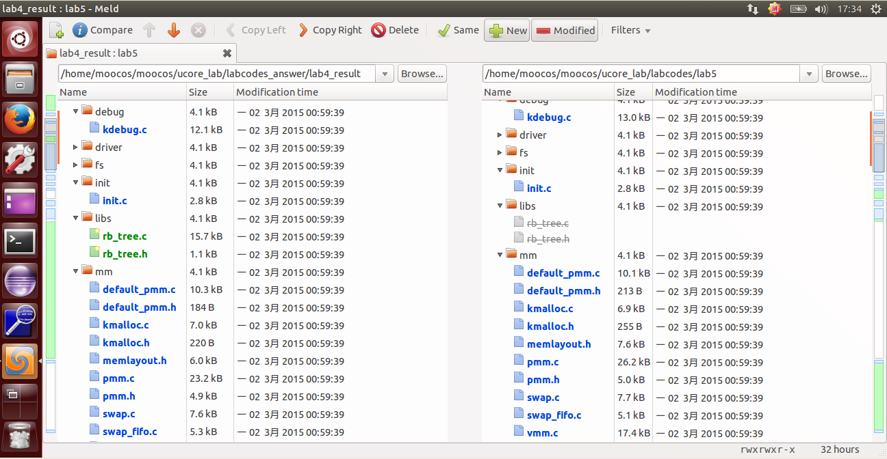
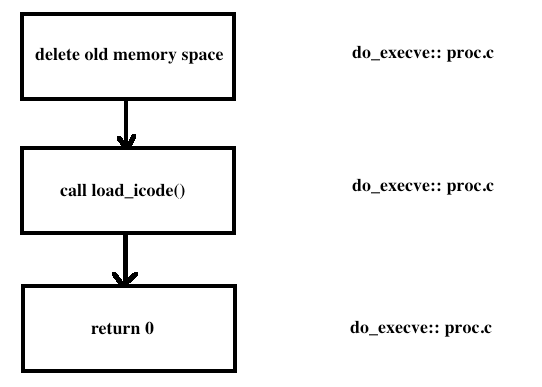
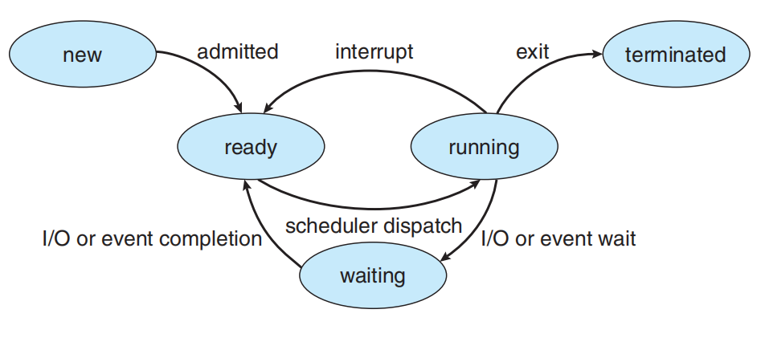
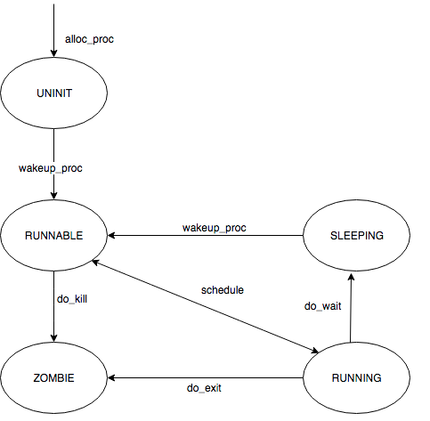
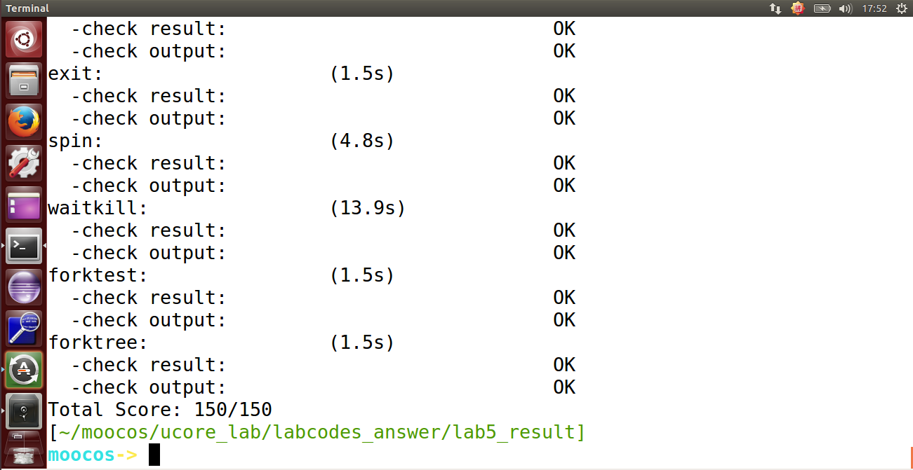

## lab5 实验报告

### 练习0：填写已有实验

`lab5` 会依赖 `lab1~lab4` ，我们需要把做的 `lab1~lab4` 的代码填到 `lab5` 中缺失的位置上面。练习 0 就是一个工具的利用。这里我使用的是 `Linux` 下的系统已预装好的 `Meld Diff Viewer` 工具。和 `lab3` 操作流程一样，我们只需要将已经完成的 `lab1~lab4` 与待完成的 `lab5`  (由于 `lab5` 是基于 `lab1~lab4` 基础上完成的，所以这里只需要导入 `lab4` )分别导入进来，然后点击 `compare` 就行了。



然后软件就会自动分析两份代码的不同，然后就一个个比较比较复制过去就行了，在软件里面是可以支持打开对比复制了，点击 `Copy Right` 即可。当然 `bin` 目录和 `obj` 目录下都是 `make` 生成的，就不用复制了，其他需要修改的地方主要有以下七个文件，通过对比复制完成即可：

```c
kdebug.c
trap.c
default_pmm.c
pmm.c
swap_fifo.c
vmm.c
proc.c
```

根据试验要求，我们需要对部分代码进行改进，这里讲需要改进的地方的代码和说明罗列如下：

- 在初始化 IDT 的时候，设置系统调用对应的中断描述符，使其能够在用户态下被调用，并且设置为 trap 类型。（事实上这个部分已经在LAB1的实验中顺手被完成了）

- 在时钟中断的处理部分，每过 TICK_NUM 个中断，就将当前的进程设置为可以被重新调度的，这样使得当前的线程可以被换出，从而实现多个线程的并发执行；

- 在 `alloc_proc` 函数中，额外对进程控制块中新增加的 `wait_state, cptr, yptr, optr` 成员变量进行初始化；

- 在 do_fork 函数中，使用 set_links 函数来完成将 fork 的线程添加到线程链表中的过程，值得注意的是，该函数中就包括了对进程总数加 1 这一操作，因此需要将原先的这个操作给删除掉；

#### alloc_proc() 函数

我们在原来的实验基础上，新增了 2 行代码：

```c
proc->wait_state = 0;//PCB 进程控制块中新增的条目，初始化进程等待状态  
proc->cptr = proc->optr = proc->yptr = NULL;//进程相关指针初始化
```

这两行代码主要是初始化进程等待状态、和进程的相关指针，例如父进程、子进程、同胞等等。新增的几个 proc 指针给出相关的解释如下：

```c
parent:           proc->parent  (proc is children)
children:         proc->cptr    (proc is parent)
older sibling:    proc->optr    (proc is younger sibling)
younger sibling:  proc->yptr    (proc is older sibling)
```

因为这里涉及到了用户进程，自然需要涉及到调度的问题，所以进程等待状态和各种指针需要被初始化。

所以改进后的 `alloc_proc` 函数如下：

```c
static struct proc_struct *alloc_proc(void) {
    struct proc_struct *proc = kmalloc(sizeof(struct proc_struct));
    if (proc != NULL) {
        proc->state = PROC_UNINIT;  //设置进程为未初始化状态
        proc->pid = -1;             //未初始化的的进程id为-1
        proc->runs = 0;             //初始化时间片
        proc->kstack = 0;           //内存栈的地址
        proc->need_resched = 0;     //是否需要调度设为不需要
        proc->parent = NULL;        //父节点设为空
        proc->mm = NULL;            //虚拟内存设为空
        memset(&(proc->context), 0, sizeof(struct context));//上下文的初始化
        proc->tf = NULL;            //中断帧指针置为空
        proc->cr3 = boot_cr3;       //页目录设为内核页目录表的基址
        proc->flags = 0;            //标志位
        memset(proc->name, 0, PROC_NAME_LEN);//进程名
        proc->wait_state = 0;//PCB 进程控制块中新增的条目，初始化进程等待状态  
        proc->cptr = proc->optr = proc->yptr = NULL;//进程相关指针初始化
    }
    return proc;
}
```

#### do_fork() 函数

我们在原来的实验基础上，新增了 2 行代码：

```c
assert(current->wait_state == 0); //确保当前进程正在等待
set_links(proc); //将原来简单的计数改成来执行 set_links 函数，从而实现设置进程的相关链接 
```

第一行是为了确定当前的进程正在等待，我们在 alloc_proc 中初始化 wait_state 为0。第二行是将原来的计数换成了执行一个 `set_links` 函数，因为要涉及到进程的调度，所以简单的计数肯定是不行的。

我们可以看看 set_links 函数：

```c
static void set_links(struct proc_struct *proc) {
    list_add(&proc_list,&(proc->list_link));//进程加入进程链表
    proc->yptr = NULL; //当前进程的 younger sibling 为空
    if ((proc->optr = proc->parent->cptr) != NULL) {
        proc->optr->yptr = proc; //当前进程的 older sibling 为当前进程
    }
    proc->parent->cptr = proc; //父进程的子进程为当前进程
    nr_process ++; //进程数加一
}
```

可以看出，set_links 函数的作用是设置当前进程的 process relations。

所以改进后的 `do_fork` 函数如下：

```c
int do_fork(uint32_t clone_flags, uintptr_t stack, struct trapframe *tf) {
    int ret = -E_NO_FREE_PROC; //尝试为进程分配内存
    struct proc_struct *proc; //定义新进程
    if (nr_process >= MAX_PROCESS) { //分配进程数大于 4096，返回
        goto fork_out; //返回
    }
    ret = -E_NO_MEM; //因内存不足而分配失败
    if ((proc = alloc_proc()) == NULL) { //调用 alloc_proc() 函数申请内存块，如果失败，直接返回处理
        goto fork_out;//返回
    }

    proc->parent = current; //将子进程的父节点设置为当前进程
    assert(current->wait_state == 0); //确保当前进程正在等待
  
    if (setup_kstack(proc) != 0) { //调用 setup_stack() 函数为进程分配一个内核栈
        goto bad_fork_cleanup_proc; //返回
    }
    if (copy_mm(clone_flags, proc) != 0) { //调用 copy_mm() 函数复制父进程的内存信息到子进程
        goto bad_fork_cleanup_kstack; //返回
    }
    copy_thread(proc, stack, tf); //调用 copy_thread() 函数复制父进程的中断帧和上下文信息
    //将新进程添加到进程的 hash 列表中
    bool intr_flag;
    local_intr_save(intr_flag); //屏蔽中断，intr_flag 置为 1
    {
        proc->pid = get_pid(); //获取当前进程 PID
        hash_proc(proc); //建立 hash 映射
        set_links(proc);//将原来简单的计数改成来执行set_links函数，从而实现设置进程的相关链接
    }
    local_intr_restore(intr_flag); //恢复中断

    wakeup_proc(proc); //一切就绪，唤醒子进程

    ret = proc->pid; //返回子进程的 pid
fork_out: //已分配进程数大于 4096
    return ret;

bad_fork_cleanup_kstack: //分配内核栈失败
    put_kstack(proc);
bad_fork_cleanup_proc:
    kfree(proc);
    goto fork_out;
}
```

#### idt_init() 函数

我们在原来的实验基础上，新增了 1 行代码：

```c
SETGATE(idt[T_SYSCALL], 1, GD_KTEXT, __vectors[T_SYSCALL], DPL_USER);//这里主要是设置相应的中断门
```

所以改进后的 `idt_init` 函数如下：

```c
void idt_init(void) {
    extern uintptr_t __vectors[];
    int i;
    for (i = 0; i < sizeof(idt) / sizeof(struct gatedesc); i ++) {
        SETGATE(idt[i], 0, GD_KTEXT, __vectors[i], DPL_KERNEL);
    }
    SETGATE(idt[T_SYSCALL], 1, GD_KTEXT, __vectors[T_SYSCALL], DPL_USER); //设置相应的中断门
    lidt(&idt_pd);
}
```

设置一个特定中断号的中断门，专门用于用户进程访问系统调用。在上述代码中，可以看到在执行加载中断描述符表 lidt 指令前，专门设置了一个特殊的中断描述符 idt[T_SYSCALL]，它的特权级设置为 DPL_USER，中断向量处理地址在 `__vectors[T_SYSCALL]` 处。这样建立好这个中断描述符后，一旦用户进程执行 INT T_SYSCALL 后，由于此中断允许用户态进程产生（它的特权级设置为 DPL_USER），所以 CPU 就会从用户态切换到内核态，保存相关寄存器，并跳转到 `__vectors[T_SYSCALL]` 处开始执行，形成如下执行路径：

```c
vector128(vectors.S)--\>
\_\_alltraps(trapentry.S)--\>trap(trap.c)--\>trap\_dispatch(trap.c)----\>syscall(syscall.c)-
```

在 **syscall** 中，根据系统调用号来完成不同的系统调用服务。

#### trap_dispatch() 函数

我们在原来的实验基础上，新增了 1 行代码：

```c
current->need_resched = 1;//时间片用完设置为需要调度
```

这里主要是将时间片设置为需要调度，说明当前进程的时间片已经用完了。

所以改进后的 `trap_dispatch` 函数如下：

```c
ticks ++;
        if (ticks % TICK_NUM == 0) {
            assert(current != NULL);
            current->need_resched = 1;//时间片用完设置为需要调度
        }
```

### 练习1: 加载应用程序并执行（需要编码）

根据实验说明书，我们需要完善的函数是 load_icode 函数。

这里介绍下这个函数的功能：load_icode 函数主要用来被 do_execve 调用，将执行程序加载到进程空间（执行程序本身已从磁盘读取到内存中），给用户进程建立一个能够让用户进程正常运行的用户环境。这涉及到修改页表、分配用户栈等工作。 

该函数主要完成的工作如下：

- 1、调用 mm_create 函数来申请进程的内存管理数据结构 mm 所需内存空间,并对 mm 进行初始化;

- 2、调用 setup_pgdir 来申请一个页目录表所需的一个页大小的内存空间，并把描述 ucore 内核虚空间映射的内核页表( boot_pgdir 所指)的内容拷贝到此新目录表中，最后让 mm->pgdir 指向此页目录表，这就是进程新的页目录表了，且能够正确映射内核虚空间;

- 3、根据可执行程序的起始位置来解析此 ELF 格式的执行程序，并调用 mm_map 函数根据 ELF 格式执行程序的各个段(代码段、数据段、BSS 段等)的起始位置和大小建立对应的 vma 结构，并把 vma 插入到 mm 结构中，表明这些是用户进程的合法用户态虚拟地址空间;

- 4、根据可执行程序各个段的大小分配物理内存空间，并根据执行程序各个段的起始位置确定虚拟地址，并在页表中建立好物理地址和虚拟地址的映射关系，然后把执行程序各个段的内容拷贝到相应的内核虚拟地址中，至此应用程序执行码和数据已经根据编译时设定地址放置到虚拟内存中了;

- 5、需要给用户进程设置用户栈，为此调用 mm_mmap 函数建立用户栈的 vma 结构,明确用户栈的位置在用户虚空间的顶端，大小为 256 个页，即 1MB，并分配一定数量的物理内存且建立好栈的虚地址<-->物理地址映射关系;

- 6、至此，进程内的内存管理 vma 和 mm 数据结构已经建立完成，于是把 mm->pgdir 赋值到 cr3 寄存器中，即更新了用户进程的虚拟内存空间，此时的 init 已经被 exit 的代码和数据覆盖，成为了第一个用户进程，但此时这个用户进程的执行现场还没建立好;

- 7、先清空进程的中断帧,再重新设置进程的中断帧，使得在执行中断返回指令 iret 后，能够让 CPU 转到用户态特权级，并回到用户态内存空间，使用用户态的代码段、数据段和堆栈，且能够跳转到用户进程的第一条指令执行，并确保在用户态能够响应中断;

简单的说，该 load_icode 函数的主要工作就是给用户进程建立一个能够让用户进程正常运行的用户环境。

我们可以看看 do_execve 函数：

```c
// do_execve - call exit_mmap(mm)&put_pgdir(mm) to reclaim memory space of current process
//           - call load_icode to setup new memory space accroding binary prog.
int
do_execve(const char *name, size_t len, unsigned char *binary, size_t size) {
    struct mm_struct *mm = current->mm; //获取当前进程的内存地址
    if (!user_mem_check(mm, (uintptr_t)name, len, 0)) {
        return -E_INVAL;
    }
    if (len > PROC_NAME_LEN) {
        len = PROC_NAME_LEN;
    }

    char local_name[PROC_NAME_LEN + 1];
    memset(local_name, 0, sizeof(local_name));
    memcpy(local_name, name, len);
    //为加载新的执行码做好用户态内存空间清空准备 
    if (mm != NULL) {
        lcr3(boot_cr3); //设置页表为内核空间页表
        if (mm_count_dec(mm) == 0) { //如果没有进程再需要此进程所占用的内存空间
            exit_mmap(mm); //释放进程所占用户空间内存和进程页表本身所占空间
            put_pgdir(mm);
            mm_destroy(mm);
        }
        current->mm = NULL; //把当前进程的 mm 内存管理指针为空
    }
    int ret;
    // 加载应用程序执行码到当前进程的新创建的用户态虚拟空间中。这里涉及到读 ELF 格式的文件，申请内存空间，建立用户态虚存空间，加载应用程序执行码等。load_icode 函数完成了整个复杂的工作。  
    if ((ret = load_icode(binary, size)) != 0) {
        goto execve_exit;
    }
    set_proc_name(current, local_name);
    return 0;

execve_exit:
    do_exit(ret);
    panic("already exit: %e.\n", ret);
}
```

而这里这个 do_execve 函数主要做的工作就是先回收自身所占用户空间，然后调用 load_icode，用新的程序覆盖内存空间，形成一个执行新程序的新进程。


至此，用户进程的用户环境已经搭建完毕。此时 **initproc** 将按产生系统调用的函数调用路径原路返回，执行中断返回指令 **iret** 后，将切换到用户进程程序的第一条语句位置 `_start` 处开始执行。

实现过程如下：

```c
load_icode 函数分析:
该函数的功能主要分为 6 个部分，而我们需要填写的是第 6 个部分，就是伪造中断返回现场，使得系统调用返回之后可以正确跳转到需要运行的程序入口，并正常运行；而 1-5 部分则是一系列对用户内存空间的初始化，这部分将在 LAB8 的编码实现中具体体现，因此在本 LAB 中暂时不加具体说明；与 LAB1 的 challenge 类似的，第 6 个部分是在进行中断处理的栈（此时应当是内核栈）上伪造一个中断返回现场，使得中断返回的时候可以正确地切换到需要的执行程序入口处；在这个部分中需要对 tf 进行设置，不妨通过代码分析来确定这个 tf 变量究竟指到什么位置，该 tf 变量与 current->tf 的数值一致，而 current->tf 是在进行中断服务里程的 trap 函数中被设置为当前中断的中断帧，也就是说这个 tf 最终指向了当前系统调用 exec 产生的中断帧处；
/* load_icode - load the content of binary program(ELF format) as the new content of current process
 * @binary:  the memory addr of the content of binary program
 * @size:  the size of the content of binary program
 */
static int load_icode(unsigned char *binary, size_t size) {
    if (current->mm != NULL) { //当前进程的内存为空
        panic("load_icode: current->mm must be empty.\n");
    }

    int ret = -E_NO_MEM; //记录错误信息：未分配内存
    struct mm_struct *mm;
    //(1) create a new mm for current process
    if ((mm = mm_create()) == NULL) { //分配内存
        goto bad_mm; //分配失败，返回
    }
    //(2) create a new PDT, and mm->pgdir= kernel virtual addr of PDT
    if (setup_pgdir(mm) != 0) { //申请一个页目录表所需的空间
        goto bad_pgdir_cleanup_mm; //申请失败
    }
    //(3) copy TEXT/DATA section, build BSS parts in binary to memory space of process
    struct Page *page;
    //(3.1) get the file header of the bianry program (ELF format)
    struct elfhdr *elf = (struct elfhdr *)binary;
    //(3.2) get the entry of the program section headers of the bianry program (ELF format)
    struct proghdr *ph = (struct proghdr *)(binary + elf->e_phoff); //获取段头部表的地址
    //(3.3) This program is valid?
    if (elf->e_magic != ELF_MAGIC) { //读取的 ELF 文件不合法
        ret = -E_INVAL_ELF; //ELF 文件不合法错误
        goto bad_elf_cleanup_pgdir; //返回
    }

    uint32_t vm_flags, perm;
    struct proghdr *ph_end = ph + elf->e_phnum; //段入口数目
    for (; ph < ph_end; ph ++) { //遍历每一个程序段
    //(3.4) find every program section headers
        if (ph->p_type != ELF_PT_LOAD) { //当前段不能被加载
            continue ;
        }
        if (ph->p_filesz > ph->p_memsz) { //虚拟地址空间大小大于分配的物理地址空间
            ret = -E_INVAL_ELF;
            goto bad_cleanup_mmap;
        }
        if (ph->p_filesz == 0) { //当前段大小为 0
            continue ;
        }
    //(3.5) call mm_map fun to setup the new vma ( ph->p_va, ph->p_memsz)
        vm_flags = 0, perm = PTE_U;
        if (ph->p_flags & ELF_PF_X) vm_flags |= VM_EXEC;
        if (ph->p_flags & ELF_PF_W) vm_flags |= VM_WRITE;
        if (ph->p_flags & ELF_PF_R) vm_flags |= VM_READ;
        if (vm_flags & VM_WRITE) perm |= PTE_W;
        if ((ret = mm_map(mm, ph->p_va, ph->p_memsz, vm_flags, NULL)) != 0) {
            goto bad_cleanup_mmap;
        }
        unsigned char *from = binary + ph->p_offset;
        size_t off, size;
        uintptr_t start = ph->p_va, end, la = ROUNDDOWN(start, PGSIZE);

        ret = -E_NO_MEM;

     //(3.6) alloc memory, and  copy the contents of every program section (from, from+end) to process's memory (la, la+end)
        end = ph->p_va + ph->p_filesz;
     //(3.6.1) copy TEXT/DATA section of bianry program
        while (start < end) {
            if ((page = pgdir_alloc_page(mm->pgdir, la, perm)) == NULL) {
                goto bad_cleanup_mmap;
            }
            off = start - la, size = PGSIZE - off, la += PGSIZE;
            if (end < la) {
                size -= la - end;
            }
            memcpy(page2kva(page) + off, from, size);
            start += size, from += size;
        }

      //(3.6.2) build BSS section of binary program
        end = ph->p_va + ph->p_memsz;
        if (start < la) {
            /* ph->p_memsz == ph->p_filesz */
            if (start == end) {
                continue ;
            }
            off = start + PGSIZE - la, size = PGSIZE - off;
            if (end < la) {
                size -= la - end;
            }
            memset(page2kva(page) + off, 0, size);
            start += size;
            assert((end < la && start == end) || (end >= la && start == la));
        }
        while (start < end) {
            if ((page = pgdir_alloc_page(mm->pgdir, la, perm)) == NULL) {
                goto bad_cleanup_mmap;
            }
            off = start - la, size = PGSIZE - off, la += PGSIZE;
            if (end < la) {
                size -= la - end;
            }
            memset(page2kva(page) + off, 0, size);
            start += size;
        }
    }
    //(4) build user stack memory
    vm_flags = VM_READ | VM_WRITE | VM_STACK;
    if ((ret = mm_map(mm, USTACKTOP - USTACKSIZE, USTACKSIZE, vm_flags, NULL)) != 0) {
        goto bad_cleanup_mmap;
    }
    assert(pgdir_alloc_page(mm->pgdir, USTACKTOP-PGSIZE , PTE_USER) != NULL);
    assert(pgdir_alloc_page(mm->pgdir, USTACKTOP-2*PGSIZE , PTE_USER) != NULL);
    assert(pgdir_alloc_page(mm->pgdir, USTACKTOP-3*PGSIZE , PTE_USER) != NULL);
    assert(pgdir_alloc_page(mm->pgdir, USTACKTOP-4*PGSIZE , PTE_USER) != NULL);
    
    //(5) set current process's mm, sr3, and set CR3 reg = physical addr of Page Directory
    mm_count_inc(mm);
    current->mm = mm;
    current->cr3 = PADDR(mm->pgdir);
    lcr3(PADDR(mm->pgdir));

    //(6) setup trapframe for user environment
    struct trapframe *tf = current->tf;
    memset(tf, 0, sizeof(struct trapframe));
    /* LAB5:EXERCISE1 YOUR CODE
     * should set tf_cs,tf_ds,tf_es,tf_ss,tf_esp,tf_eip,tf_eflags
     * NOTICE: If we set trapframe correctly, then the user level process can return to USER MODE from kernel. So
     *          tf_cs should be USER_CS segment (see memlayout.h)
     *          tf_ds=tf_es=tf_ss should be USER_DS segment
     *          tf_esp should be the top addr of user stack (USTACKTOP)
     *          tf_eip should be the entry point of this binary program (elf->e_entry)
     *          tf_eflags should be set to enable computer to produce Interrupt
     */
--------------------------------------------------------------------------------------------
进程切换总是在内核态中发生，当内核选择一个进程执行的时候，首先切换内核态的上下文（EBX、ECX、EDX、ESI、EDI、ESP、EBP、EIP 八个寄存器）以及内核栈。完成内核态切换之后，内核需要使用 IRET 指令将 trapframe 中的用户态上下文恢复出来，返回到进程态，在用户态中执行进程。
* 实现思路：
  1. 由于最终是在用户态下运行的，所以需要将段寄存器初始化为用户态的代码段、数据段、堆栈段；
  2. esp 应当指向先前的步骤中创建的用户栈的栈顶；
  3. eip 应当指向 ELF 可执行文件加载到内存之后的入口处；
  4. eflags 中应当初始化为中断使能，注意 eflags 的第 1 位是恒为 1 的；
  5. 设置 ret 为 0，表示正常返回；

load_icode 函数需要填写的部分为：
  * 将 trapframe 的代码段设为 USER_CS；
  * 将 trapframe 的数据段、附加段、堆栈段设为 USER_DS；
  * 将 trapframe 的栈顶指针设为 USTACKTOP；
  * 将 trapframe 的代码段指针设为 ELF 的入口地址 elf->e_entry；
  * 将 trapframe 中 EFLAGS 的 IF 置为 1。
--------------------------------------------------------------------------------------------
/*code*/
    tf->tf_cs = USER_CS;
    tf->tf_ds = tf->tf_es = tf->tf_ss = USER_DS;
    tf->tf_esp = USTACKTOP; //0xB0000000
    tf->tf_eip = elf->e_entry;
    tf->tf_eflags = FL_IF; //FL_IF为中断打开状态
    ret = 0;
--------------------------------------------------------------------------------------------
out:
    return ret;
bad_cleanup_mmap:
    exit_mmap(mm);
bad_elf_cleanup_pgdir:
    put_pgdir(mm);
bad_pgdir_cleanup_mm:
    mm_destroy(mm);
bad_mm:
    goto out;
}
```

调用流程如下图所示：



关于 `tf_esp` 和 `tf_eip` 的设置，我们可以通过阅读下图可以得知。这是一个完整的虚拟内存空间的分布图：

```c
/*
   file_path:kern/mm/memlayout.h
*/
/* *
 * Virtual memory map:                                          Permissions
 *                                                              kernel/user
 *
 *     4G ------------------> +---------------------------------+
 *                            |                                 |
 *                            |         Empty Memory (*)        |
 *                            |                                 |
 *                            +---------------------------------+ 0xFB000000
 *                            |   Cur. Page Table (Kern, RW)    | RW/-- PTSIZE
 *     VPT -----------------> +---------------------------------+ 0xFAC00000
 *                            |        Invalid Memory (*)       | --/--
 *     KERNTOP -------------> +---------------------------------+ 0xF8000000
 *                            |                                 |
 *                            |    Remapped Physical Memory     | RW/-- KMEMSIZE
 *                            |                                 |
 *     KERNBASE ------------> +---------------------------------+ 0xC0000000
 *                            |        Invalid Memory (*)       | --/--
 *     USERTOP -------------> +---------------------------------+ 0xB0000000
 *                            |           User stack            |
 *                            +---------------------------------+
 *                            |                                 |
 *                            :                                 :
 *                            |         ~~~~~~~~~~~~~~~~        |
 *                            :                                 :
 *                            |                                 |
 *                            ~~~~~~~~~~~~~~~~~~~~~~~~~~~~~~~~~~~
 *                            |       User Program & Heap       |
 *     UTEXT ---------------> +---------------------------------+ 0x00800000
 *                            |        Invalid Memory (*)       | --/--
 *                            |  - - - - - - - - - - - - - - -  |
 *                            |    User STAB Data (optional)    |
 *     USERBASE, USTAB------> +---------------------------------+ 0x00200000
 *                            |        Invalid Memory (*)       | --/--
 *     0 -------------------> +---------------------------------+ 0x00000000
 * (*) Note: The kernel ensures that "Invalid Memory" is *never* mapped.
 *     "Empty Memory" is normally unmapped, but user programs may map pages
 *     there if desired.
 *
 * */
```

> 请在实验报告中描述当创建一个用户态进程并加载了应用程序后，CPU 是如何让这个应用程序最终在用户态执行起来的。即这个用户态进程被 ucore 选择占用 CPU 执行（RUNNING 态）到具体执行应用程序第一条指令的整个经过。

分析在创建了用户态进程并且加载了应用程序之后，其占用 CPU 执行到具体执行应用程序的整个经过：

  1. 在经过调度器占用了 CPU 的资源之后，用户态进程调用了 exec 系统调用，从而转入到了系统调用的处理例程；
  
  2. 在经过了正常的中断处理例程之后，最终控制权转移到了 syscall.c 中的 syscall 函数，然后根据系统调用号转移给了 sys_exec 函数，在该函数中调用了上文中提及的 do_execve 函数来完成指定应用程序的加载；
  
  3. 在do_execve中进行了若干设置，包括推出当前进程的页表，换用 kernel 的 PDT 之后，使用 load_icode 函数，完成了对整个用户线程内存空间的初始化，包括堆栈的设置以及将 ELF 可执行文件的加载，之后通过 current->tf 指针修改了当前系统调用的 trapframe，使得最终中断返回的时候能够切换到用户态，并且同时可以正确地将控制权转移到应用程序的入口处；

  4. 在完成了 do_exec 函数之后，进行正常的中断返回的流程，由于中断处理例程的栈上面的 eip 已经被修改成了应用程序的入口处，而 CS 上的 CPL 是用户态，因此 iret 进行中断返回的时候会将堆栈切换到用户的栈，并且完成特权级的切换，并且跳转到要求的应用程序的入口处；

  5. 接下来开始具体执行应用程序的第一条指令；

### 练习2: 父进程复制自己的内存空间给子进程（需要编码）

这个工作的执行是由 do_fork 函数完成，具体是调用 copy_range 函数，而这里我们的任务就是补全这个函数。 

这个具体的调用过程是由 do_fork 函数调用 copy_mm 函数，然后 copy_mm 函数调用 dup_mmap 函数，最后由这个 dup_mmap 函数调用 copy_range 函数。即 `do_fork()---->copy_mm()---->dup_mmap()---->copy_range()`。

我们回顾一下 do_fork 的执行过程，它完成的工作主要如下：

- 1、分配并初始化进程控制块（ alloc_proc 函数）;
- 2、分配并初始化内核栈，为内核进程（线程）建立栈空间（ setup_stack 函数）;
- 3、根据 clone_flag 标志复制或共享进程内存管理结构（ copy_mm 函数）;
- 4、设置进程在内核（将来也包括用户态）正常运行和调度所需的中断帧和执行上下文 （ copy_thread 函数）;
- 5、为进程分配一个 PID（ get_pid() 函数）;
- 6、把设置好的进程控制块放入 hash_list 和 proc_list 两个全局进程链表中;
- 7、自此，进程已经准备好执行了，把进程状态设置为“就绪”态;
- 8、设置返回码为子进程的 PID 号。

```c
/*
   file_path:kern/process/proc.c
*/
/* do_fork -     parent process for a new child process
 * @clone_flags: used to guide how to clone the child process
 * @stack:       the parent's user stack pointer. if stack==0, It means to fork a kernel thread.
 * @tf:          the trapframe info, which will be copied to child process's proc->tf
 */
int do_fork(uint32_t clone_flags, uintptr_t stack, struct trapframe *tf) {
    int ret = -E_NO_FREE_PROC; //尝试为进程分配内存
    struct proc_struct *proc; //定义新进程
    if (nr_process >= MAX_PROCESS) { //分配进程数大于 4096，返回
        goto fork_out;  //返回
    }
    ret = -E_NO_MEM;  //因内存不足而分配失败
if ((proc = alloc_proc()) == NULL) { //分配内存失败
        goto fork_out; //返回
    }
    proc->parent = current; //设置父进程名字
    if (setup_kstack(proc) != 0) {//为进程分配一个内核栈
        goto bad_fork_cleanup_proc; //返回
    }
    if (copy_mm(clone_flags, proc) != 0) { //复制父进程内存信息
        goto bad_fork_cleanup_kstack; //返回
    }
    copy_thread(proc, stack, tf); //复制中断帧和上下文信息
    bool intr_flag; 
    //将新进程添加到进程的 hash 列表中
    local_intr_save(intr_flag);  //屏蔽中断，intr_flag 置为 1
    {
        proc->pid = get_pid(); //获取当前进程 PID
        hash_proc(proc);  //建立 hash 映射
        list_add(&proc_list,&(proc->list_link));//将进程加入到进程链表中
        nr_process ++;  //进程数加一
    }
    local_intr_restore(intr_flag); //恢复中断
    wakeup_proc(proc); //一切就绪，唤醒新进程
    ret = proc->pid; //返回当前进程的 PID
fork_out:  //已分配进程数大于4096
    return ret;
bad_fork_cleanup_kstack: //分配内核栈失败
    put_kstack(proc);
bad_fork_cleanup_proc: 
    kfree(proc);
    goto fork_out;
}
```

由于 do_fork 函数中调用了 copy_mm 函数，这部分是我们在 lab4 中未实现的部分，我们可以看看这部分函数是如何实现的：

```c
/*
   file_path:kern/process/proc.c
*/
// copy_mm - process "proc" duplicate OR share process "current"'s mm according clone_flags
//         - if clone_flags & CLONE_VM, then "share" ; else "duplicate"
static int copy_mm(uint32_t clone_flags, struct proc_struct *proc) {
    struct mm_struct *mm, *oldmm = current->mm;
    /* current is a kernel thread */
    if (oldmm == NULL) { //当前进程地址空间为 NULL
        return 0;
    }
    if (clone_flags & CLONE_VM) { //可以共享地址空间
        mm = oldmm;  //共享地址空间
        goto good_mm;
    }
    int ret = -E_NO_MEM; 
    if ((mm = mm_create()) == NULL) { //创建地址空间未成功
        goto bad_mm;
    }
    if (setup_pgdir(mm) != 0) { 
        goto bad_pgdir_cleanup_mm;
    }
    lock_mm(oldmm); //打开互斥锁,避免多个进程同时访问内存
    {
        ret = dup_mmap(mm, oldmm); //调用 dup_mmap 函数
    }
    unlock_mm(oldmm); //释放互斥锁
    if (ret != 0) {
        goto bad_dup_cleanup_mmap;
    }
good_mm:
    mm_count_inc(mm);  //共享地址空间的进程数加一
    proc->mm = mm;     //复制空间地址
    proc->cr3 = PADDR(mm->pgdir); //复制页表地址
    return 0;
bad_dup_cleanup_mmap:
    exit_mmap(mm);
    put_pgdir(mm);
bad_pgdir_cleanup_mm:
    mm_destroy(mm);
bad_mm:
    return ret; 
}
```

由于 copy_mm 函数调用 dup_mmap 函数，我们可以看看这部分函数是如何实现的：

```c
/*
   file_path:kern/mm/vmm.c
*/
int dup_mmap(struct mm_struct *to, struct mm_struct *from) {
    assert(to != NULL && from != NULL); //必须非空
    // mmap_list 为虚拟地址空间的首地址
    list_entry_t *list = &(from->mmap_list), *le = list;
    while ((le = list_prev(le)) != list) { //遍历所有段
        struct vma_struct *vma, *nvma; 
        vma = le2vma(le, list_link); //获取某一段
        nvma = vma_create(vma->vm_start, vma->vm_end, vma->vm_flags);
        if (nvma == NULL) {
            return -E_NO_MEM;
        }
        insert_vma_struct(to, nvma); //向新进程插入新创建的段
        bool share = 0; 
        //调用 copy_range 函数
        if (copy_range(to->pgdir, from->pgdir, vma->vm_start, vma->vm_end, share) != 0) {
            return -E_NO_MEM;
        }
    }
    return 0;
}
```

由于 dup_mmap 函数调用 copy_range 函数，这部分函数实现如下：

```c
/*
   file_path:kern/mm/pmm.c
*/
/* copy_range - copy content of memory (start, end) of one process A to another process B
 * @to:    the addr of process B's Page Directory
 * @from:  the addr of process A's Page Directory
 * @share: flags to indicate to dup OR share. We just use dup method, so it didn't be used.
 *
 * CALL GRAPH: copy_mm-->dup_mmap-->copy_range
 */
int copy_range(pde_t *to, pde_t *from, uintptr_t start, uintptr_t end, bool share) {
    assert(start % PGSIZE == 0 && end % PGSIZE == 0);
    assert(USER_ACCESS(start, end));
    // copy content by page unit.
    do {
        //call get_pte to find process A's pte according to the addr start
        pte_t *ptep = get_pte(from, start, 0), *nptep;
        if (ptep == NULL) {
            start = ROUNDDOWN(start + PTSIZE, PTSIZE);
            continue ;
        }
        //call get_pte to find process B's pte according to the addr start. If pte is NULL, just alloc a PT
        if (*ptep & PTE_P) {
            if ((nptep = get_pte(to, start, 1)) == NULL) {
                return -E_NO_MEM;
            }
        uint32_t perm = (*ptep & PTE_USER);
        //get page from ptep
        struct Page *page = pte2page(*ptep);
        // alloc a page for process B
        struct Page *npage=alloc_page();
        assert(page!=NULL);
        assert(npage!=NULL);
        int ret=0;
        /* LAB5:EXERCISE2 YOUR CODE
         * replicate content of page to npage, build the map of phy addr of nage with the linear addr start
         *
         * Some Useful MACROs and DEFINEs, you can use them in below implementation.
         * MACROs or Functions:
         *    page2kva(struct Page *page): return the kernel vritual addr of memory which page managed (SEE pmm.h)
         *    page_insert: build the map of phy addr of an Page with the linear addr la
         *    memcpy: typical memory copy function
         *
         * (1) find src_kvaddr: the kernel virtual address of page
         * (2) find dst_kvaddr: the kernel virtual address of npage
         * (3) memory copy from src_kvaddr to dst_kvaddr, size is PGSIZE
         * (4) build the map of phy addr of  nage with the linear addr start
         */
--------------------------------------------------------------------------------------------
* 实现思路：
copy_range 函数的具体执行流程是遍历父进程指定的某一段内存空间中的每一个虚拟页，如果这个虚拟页是存在的话，为子进程对应的同一个地址（但是页目录表是不一样的，因此不是一个内存空间）也申请分配一个物理页，然后将前者中的所有内容复制到后者中去，然后为子进程的这个物理页和对应的虚拟地址（事实上是线性地址）建立映射关系；而在本练习中需要完成的内容就是内存的复制和映射的建立，具体流程如下：
  1. 找到父进程指定的某一物理页对应的内核虚拟地址；
  2. 找到需要拷贝过去的子进程的对应物理页对应的内核虚拟地址；
  3. 将前者的内容拷贝到后者中去；
  4. 为子进程当前分配这一物理页映射上对应的在子进程虚拟地址空间里的一个虚拟页；
--------------------------------------------------------------------------------------------
/*code*/
        void * kva_src = page2kva(page); // 找到父进程需要复制的物理页在内核地址空间中的虚拟地址，这是由于这个函数执行的时候使用的时内核的地址空间
        void * kva_dst = page2kva(npage); // 找到子进程需要被填充的物理页的内核虚拟地址
    
        memcpy(kva_dst, kva_src, PGSIZE); // 将父进程的物理页的内容复制到子进程中去

        ret = page_insert(to, npage, start, perm); // 建立子进程的物理页与虚拟页的映射关系
        assert(ret == 0);
        }
        start += PGSIZE;
    } while (start != 0 && start < end);
    return 0;
}
```

> 请在实验报告中简要说明如何设计实现 ”Copy on Write 机制“，给出概要设计，鼓励给出详细设计。

接下来将说明如何实现 “Copy on Write” 机制，该机制的主要思想为使得进程执行 fork 系统调用进行复制的时候，父进程不会简单地将整个内存中的内容复制给子进程，而是暂时共享相同的物理内存页；而当其中一个进程需要对内存进行修改的时候，再额外创建一个自己私有的物理内存页，将共享的内容复制过去，然后在自己的内存页中进行修改；根据上述分析，主要对实验框架的修改应当主要有两个部分，一个部分在于进行 fork 操作的时候不直接复制内存，另外一个处理在于出现了内存页访问异常的时候，会将共享的内存页复制一份，然后在新的内存页进行修改，具体的修改部分如下：

- do fork 部分：在进行内存复制的部分，比如 copy_range 函数内部，不实际进行内存的复制，而是将子进程和父进程的虚拟页映射上同一个物理页面，然后在分别在这两个进程的虚拟页对应的 PTE 部分将这个页置成是不可写的，同时利用 PTE 中的保留位将这个页设置成共享的页面，这样的话如果应用程序试图写某一个共享页就会产生页访问异常，从而可以将控制权交给操作系统进行处理；

- page fault 部分：在 page fault 的 ISR 部分，新增加对当前的异常是否由于尝试写了某一个共享页面引起的，如果是的话，额外申请分配一个物理页面，然后将当前的共享页的内容复制过去，建立出错的线性地址与新创建的物理页面的映射关系，将 PTE 设置设置成非共享的；然后查询原先共享的物理页面是否还是由多个其它进程共享使用的，如果不是的话，就将对应的虚地址的 PTE 进行修改，删掉共享标记，恢复写标记；这样的话 page fault 返回之后就可以正常完成对虚拟内存（原想的共享内存）的写操作了；

上述实现有一个较小的缺陷，在于在 do fork 的时候需要修改所有的 PTE，会有一定的时间效率上的损失；可以考虑将共享的标记加在 PDE 上，然后一旦访问了这个 PDE 之后再将标记下传给对应的 PTE，这样的话就起到了标记延迟和潜在的标记合并的左右，有利于提升时间效率；

### 练习3: 阅读分析源代码，理解进程执行 fork/exec/wait/exit 的实现，以及系统调用的实现（不需要编码）

首先我们可以罗列下目前 ucore 所有的系统调用，如下表所示：

```c
SYS_exit        : process exit,                           -->do_exit
SYS_fork        : create child process, dup mm            -->do_fork-->wakeup_proc
SYS_wait        : wait process                            -->do_wait
SYS_exec        : after fork, process execute a program   -->load a program and refresh the mm
SYS_clone       : create child thread                     -->do_fork-->wakeup_proc
SYS_yield       : process flag itself need resecheduling, -->proc->need_sched=1, then scheduler will rescheule this process
SYS_sleep       : process sleep                           -->do_sleep 
SYS_kill        : kill process                            -->do_kill-->proc->flags |= PF_EXITING
                                                                 -->wakeup_proc-->do_wait-->do_exit   
SYS_getpid      : get the process's pid
```

一般来说，用户进程只能执行一般的指令,无法执行特权指令。采用系统调用机制为用户进程提供一个获得操作系统服务的统一接口层，简化用户进程的实现。 

根据之前的分析，应用程序调用的 exit/fork/wait/getpid 等库函数最终都会调用 syscall 函数，只是调用的参数不同而已（分别是 SYS_exit / SYS_fork / SYS_wait / SYS_getid ）

当应用程序调用系统函数时，一般执行 INT T_SYSCALL 指令后，CPU 根据操作系统建立的系统调用中断描述符，转入内核态，然后开始了操作系统系统调用的执行过程，在内核函数执行之前，会保留软件执行系统调用前的执行现场，然后保存当前进程的 tf 结构体中，之后操作系统就可以开始完成具体的系统调用服务，完成服务后，调用 IRET 返回用户态，并恢复现场。这样整个系统调用就执行完毕了。

接下来对 fork/exec/wait/exit 四个系统调用进行分析：

#### fork

调用过程为：`fork->SYS_fork->do_fork+wakeup_proc`

首先当程序执行 fork 时，fork 使用了系统调用 SYS_fork，而系统调用 SYS_fork 则主要是由 do_fork 和 wakeup_proc 来完成的。do_fork() 完成的工作在练习 2 及 lab4 中已经做过详细介绍，这里再简单说一下，主要是完成了以下工作：

- 1、分配并初始化进程控制块（ alloc_proc 函数）;
- 2、分配并初始化内核栈，为内核进程（线程）建立栈空间（ setup_stack 函数）;
- 3、根据 clone_flag 标志复制或共享进程内存管理结构（ copy_mm 函数）;
- 4、设置进程在内核（将来也包括用户态）正常运行和调度所需的中断帧和执行上下文 （ copy_thread 函数）;
- 5、为进程分配一个 PID（ get_pid() 函数）;
- 6、把设置好的进程控制块放入 hash_list 和 proc_list 两个全局进程链表中;
- 7、自此，进程已经准备好执行了，把进程状态设置为“就绪”态;
- 8、设置返回码为子进程的 PID 号。

而 wakeup_proc 函数主要是将进程的状态设置为等待，即 proc->wait_state = 0。

#### exec

调用过程为：`SYS_exec->do_execve`

当应用程序执行的时候，会调用 SYS_exec 系统调用，而当 ucore 收到此系统调用的时候，则会使用 do_execve() 函数来实现，因此这里我们主要介绍 do_execve() 函数的功能，函数主要时完成用户进程的创建工作，同时使用户进程进入执行。 

主要工作如下：

- 1、首先为加载新的执行码做好用户态内存空间清空准备。如果 mm 不为 NULL，则设置页表为内核空间页表，且进一步判断 mm 的引用计数减 1 后是否为 0，如果为 0，则表明没有进程再需要此进程所占用的内存空间，为此将根据 mm 中的记录，释放进程所占用户空间内存和进程页表本身所占空间。最后把当前进程的 mm 内存管理指针为空。

- 2、接下来是加载应用程序执行码到当前进程的新创建的用户态虚拟空间中。之后就是调用 load_icode 从而使之准备好执行。（具体 load_icode 的功能在练习 1 已经介绍的很详细了，这里不赘述了）

#### wait

调用过程为：`SYS_wait->do_wait`

我们可以看看 do_wait 函数的实现过程：

```c
/*
   file_path:kern/process/proc.c
*/
// do_wait - wait one OR any children with PROC_ZOMBIE state, and free memory space of kernel stack
//         - proc struct of this child.
// NOTE: only after do_wait function, all resources of the child proces are free.
int do_wait(int pid, int *code_store) {
    struct mm_struct *mm = current->mm;
    if (code_store != NULL) {
        if (!user_mem_check(mm, (uintptr_t)code_store, sizeof(int), 1)) {
            return -E_INVAL;
        }
    }
    struct proc_struct *proc;
    bool intr_flag, haskid;
repeat:
    haskid = 0;
    //如果pid！=0，则找到进程id为pid的处于退出状态的子进程 
    if (pid != 0) {
        proc = find_proc(pid);
        if (proc != NULL && proc->parent == current) {
            haskid = 1;
            if (proc->state == PROC_ZOMBIE) {
                goto found; //找到进程
            }
        }
    }
    else {
      //如果pid==0，则随意找一个处于退出状态的子进程
        proc = current->cptr;
        for (; proc != NULL; proc = proc->optr) {
            haskid = 1;
            if (proc->state == PROC_ZOMBIE) {
                goto found;
            }
        }
    }
    if (haskid) {//如果没找到，则父进程重新进入睡眠，并重复寻找的过程
        current->state = PROC_SLEEPING;
        current->wait_state = WT_CHILD;
        schedule();
        if (current->flags & PF_EXITING) {
            do_exit(-E_KILLED);
        }
        goto repeat;
    }
    return -E_BAD_PROC;
   //释放子进程的所有资源 
found:
    if (proc == idleproc || proc == initproc) {
        panic("wait idleproc or initproc.\n");
    }
    if (code_store != NULL) {
        *code_store = proc->exit_code;
    }
    local_intr_save(intr_flag);
    {
        unhash_proc(proc);//将子进程从hash_list中删除
        remove_links(proc);//将子进程从proc_list中删除 
    }
    local_intr_restore(intr_flag);
    put_kstack(proc); //释放子进程的内核堆栈
    kfree(proc);  //释放子进程的进程控制块
    return 0;
}
```

当执行 wait 功能的时候，会调用系统调用 SYS_wait，而该系统调用的功能则主要由 do_wait 函数实现，主要工作就是父进程如何完成对子进程的最后回收工作，具体的功能实现如下：

- 1、 如果 pid!=0，表示只找一个进程 id 号为 pid 的退出状态的子进程，否则找任意一个处于退出状态的子进程;

- 2、 如果此子进程的执行状态不为 PROC_ZOMBIE，表明此子进程还没有退出，则当前进程设置执行状态为 PROC_SLEEPING（睡眠），睡眠原因为 WT_CHILD (即等待子进程退出)，调用 schedule() 函数选择新的进程执行，自己睡眠等待，如果被唤醒，则重复跳回步骤 1 处执行;

- 3、 如果此子进程的执行状态为 PROC_ZOMBIE，表明此子进程处于退出状态，需要当前进程(即子进程的父进程)完成对子进程的最终回收工作，即首先把子进程控制块从两个进程队列 proc_list 和 hash_list 中删除，并释放子进程的内核堆栈和进程控制块。自此，子进程才彻底地结束了它的执行过程，它所占用的所有资源均已释放。

#### exit

调用过程为：`SYS_exit->exit`

我们可以看看 do_exit 函数的实现过程：

```c
/*
   file_path:kern/process/proc.c
*/
// do_exit - called by sys_exit
//   1. call exit_mmap & put_pgdir & mm_destroy to free the almost all memory space of process
//   2. set process' state as PROC_ZOMBIE, then call wakeup_proc(parent) to ask parent reclaim itself.
//   3. call scheduler to switch to other process
int do_exit(int error_code) {
    if (current == idleproc) {
        panic("idleproc exit.\n");
    }
    if (current == initproc) {
        panic("initproc exit.\n");
    }
    struct mm_struct *mm = current->mm;
    if (mm != NULL) { //如果该进程是用户进程
        lcr3(boot_cr3); //切换到内核态的页表
        if (mm_count_dec(mm) == 0){
            exit_mmap(mm); 
/*如果没有其他进程共享这个内存释放current->mm->vma链表中每个vma描述的进程合法空间中实际分配的内存，然后把对应的页表项内容清空，最后还把页表所占用的空间释放并把对应的页目录表项清空*/
            put_pgdir(mm); //释放页目录占用的内存 
            mm_destroy(mm); //释放mm占用的内存
        }
        current->mm = NULL; //虚拟内存空间回收完毕
    }
    current->state = PROC_ZOMBIE; //僵死状态
    current->exit_code = error_code;//等待父进程做最后的回收
    bool intr_flag;
    struct proc_struct *proc;
    local_intr_save(intr_flag);
    {
        proc = current->parent;
        if (proc->wait_state == WT_CHILD) {
            wakeup_proc(proc); //如果父进程在等待子进程，则唤醒
        }
        while (current->cptr != NULL) {
 /*如果当前进程还有子进程，则需要把这些子进程的父进程指针设置为内核线程initproc，且各个子进程指针需要插入到initproc的子进程链表中。如果某个子进程的执行状态是PROC_ZOMBIE，则需要唤醒initproc来完成对此子进程的最后回收工作。*/
            proc = current->cptr;
            current->cptr = proc->optr;

            proc->yptr = NULL;
            if ((proc->optr = initproc->cptr) != NULL) {
                initproc->cptr->yptr = proc;
            }
            proc->parent = initproc;
            initproc->cptr = proc;
            if (proc->state == PROC_ZOMBIE) {
                if (initproc->wait_state == WT_CHILD) {
                    wakeup_proc(initproc);
                }
            }
        }
    }
    local_intr_restore(intr_flag);
    schedule(); //选择新的进程执行
    panic("do_exit will not return!! %d.\n", current->pid);
}
```

当执行 exit 功能的时候，会调用系统调用 SYS_exit，而该系统调用的功能主要是由 do_exit 函数实现。具体过程如下：

- 1、先判断是否是用户进程，如果是，则开始回收此用户进程所占用的用户态虚拟内存空间;（具体的回收过程不作详细说明）

- 2、设置当前进程的中hi性状态为 PROC_ZOMBIE，然后设置当前进程的退出码为 error_code。表明此时这个进程已经无法再被调度了，只能等待父进程来完成最后的回收工作（主要是回收该子进程的内核栈、进程控制块）

- 3、如果当前父进程已经处于等待子进程的状态，即父进程的 wait_state 被置为 WT_CHILD，则此时就可以唤醒父进程，让父进程来帮子进程完成最后的资源回收工作。

- 4、如果当前进程还有子进程,则需要把这些子进程的父进程指针设置为内核线程 init，且各个子进程指针需要插入到 init 的子进程链表中。如果某个子进程的执行状态是 PROC_ZOMBIE，则需要唤醒 init 来完成对此子进程的最后回收工作。

- 5、执行 schedule() 调度函数，选择新的进程执行。

所以说该函数的功能简单的说就是，回收当前进程所占的大部分内存资源,并通知父进程完成最后的回收工作。

> 请分析 fork/exec/wait/exit 在实现中是如何影响进程的执行状态的？

- fork 执行完毕后，如果创建新进程成功，则出现两个进程，一个是子进程，一个是父进程。在子进程中，fork 函数返回 0，在父进程中，fork 返回新创建子进程的进程 ID。我们可以通过 fork 返回的值来判断当前进程是子进程还是父进程。fork 不会影响当前进程的执行状态，但是会将子进程的状态标记为 RUNNALB，使得可以在后续的调度中运行起来；

- exec 完成用户进程的创建工作。首先为加载新的执行码做好用户态内存空间清空准备。接下来的一步是加载应用程序执行码到当前进程的新创建的用户态虚拟空间中。exec 不会影响当前进程的执行状态，但是会修改当前进程中执行的程序；

- wait 是等待任意子进程的结束通知。wait_pid 函数等待进程 id 号为 pid 的子进程结束通知。这两个函数最终访问 sys_wait 系统调用接口让 ucore 来完成对子进程的最后回收工作。wait 系统调用取决于是否存在可以释放资源（ZOMBIE）的子进程，如果有的话不会发生状态的改变，如果没有的话会将当前进程置为 SLEEPING 态，等待执行了 exit 的子进程将其唤醒；

- exit 会把一个退出码 error_code 传递给 ucore，ucore 通过执行内核函数 do_exit 来完成对当前进程的退出处理，主要工作简单地说就是回收当前进程所占的大部分内存资源，并通知父进程完成最后的回收工作。exit 会将当前进程的状态修改为 ZOMBIE 态，并且会将父进程唤醒（修改为RUNNABLE），然后主动让出 CPU 使用权；

> 请给出 ucore 中一个用户态进程的执行状态生命周期图（包执行状态，执行状态之间的变换关系，以及产生变换的事件或函数调用）。（字符方式画即可）

首先，我们梳理一下流程：



最终，我们可以画出执行状态图如下所示：



最终的实验结果如下图所示：



如果 make grade 无法满分，尝试注释掉 tools/grade.sh 的 221 行到 233 行（在前面加上“#”）。

这里我们选用古老的编辑器 Vim，具体操作过程如下：

- 1、首先按 esc 进入命令行模式下，按下 `:221` 跳转至 221 行;
- 2、按下 Ctrl + v，进入列（也叫区块）模式;

- 3、在行首使用上下键选择需要注释的多行（221~233 行）;

- 4、按下键盘（大写）“I”键，进入插入模式；

- 5、然后输入注释符（“//”、“#”等）;

- 6、最后按下“Esc”键。

### 扩展练习 Challenge ：实现 Copy on Write （COW）机制

#### 设置共享标志

在 vmm.c 中将 dup_mmap 中的 share 变量的值改为 1，启用共享：

```c
int dup_mmap(struct mm_struct *to, struct mm_struct *from) {
		...
        bool share = 1;
		...
}
```

#### 映射共享页面

在 pmm.c 中为 copy_range 添加对共享的处理，如果 share 为 1，那么将子进程的页面映射到父进程的页面。由于两个进程共享一个页面之后，无论任何一个进程修改页面，都会影响另外一个页面，所以需要子进程和父进程对于这个共享页面都保持只读。

```c
int copy_range(pde_t *to, pde_t *from, uintptr_t start, uintptr_t end, bool share) {
	...
        if (*ptep & PTE_P) {
            if ((nptep = get_pte(to, start, 1)) == NULL) {
                return -E_NO_MEM;
            }
            uint32_t perm = (*ptep & PTE_USER);
            //get page from ptep
            struct Page *page = pte2page(*ptep);
            assert(page!=NULL);
            int ret=0;
            if (share) {	
              	// share page
                page_insert(from, page, start, perm & (~PTE_W));
                ret = page_insert(to, page, start, perm & (~PTE_W));
            } else {
                // alloc a page for process B
                struct Page *npage=alloc_page();
                assert(npage!=NULL);
                uintptr_t src_kvaddr = page2kva(page);
                uintptr_t dst_kvaddr = page2kva(npage);
                memcpy(dst_kvaddr, src_kvaddr, PGSIZE);
                ret = page_insert(to, npage, start, perm);
            }
            assert(ret == 0);
        }
		...
    return 0;
}
```

#### 修改时拷贝

当程序尝试修改只读的内存页面的时候，将触发Page Fault中断，在错误代码中 P=1，W/R=1[[OSDev](http://wiki.osdev.org/Page_Fault)]。因此，当错误代码最低两位都为 1 的时候，说明进程访问了共享的页面，内核需要重新分配页面、拷贝页面内容、建立映射关系：

```c
int do_pgfault(struct mm_struct *mm, uint32_t error_code, uintptr_t addr) {
	...
    if (*ptep == 0) {
        ...
    } else if (error_code & 3 == 3) {	// copy on write
        struct Page *page = pte2page(*ptep);
        struct Page *npage = pgdir_alloc_page(mm->pgdir, addr, perm);
        uintptr_t src_kvaddr = page2kva(page);
        uintptr_t dst_kvaddr = page2kva(npage);
        memcpy(dst_kvaddr, src_kvaddr, PGSIZE);
    } else {
		...
   	}
	...
}
```

### 参考资料

- [Page Fault - OSDev Wiki](http://wiki.osdev.org/Page_Fault)