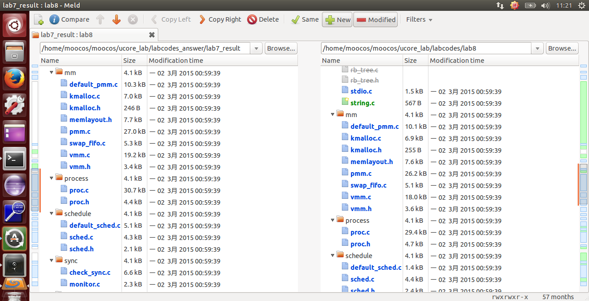
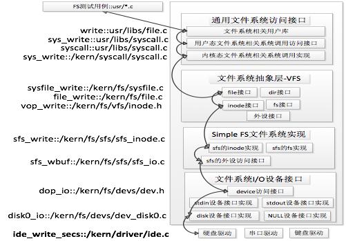
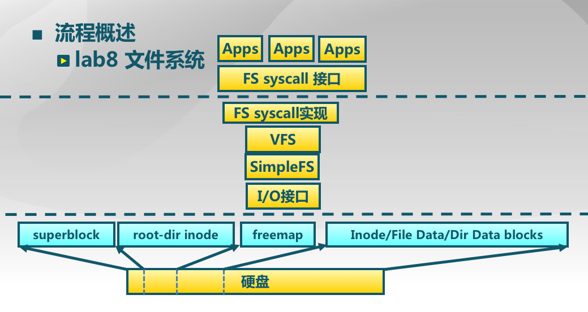
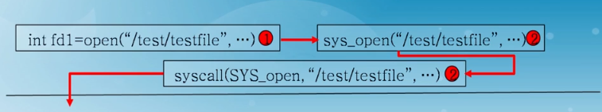
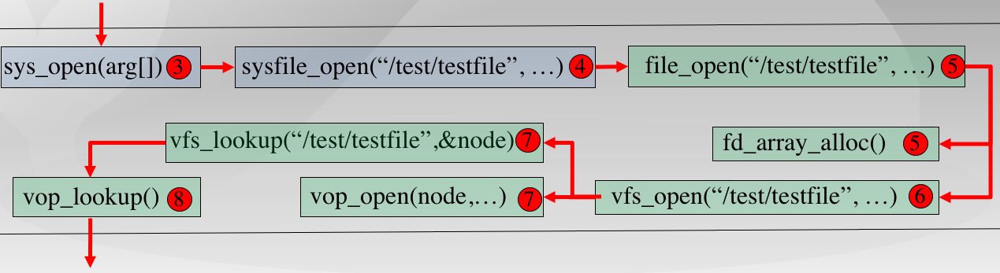
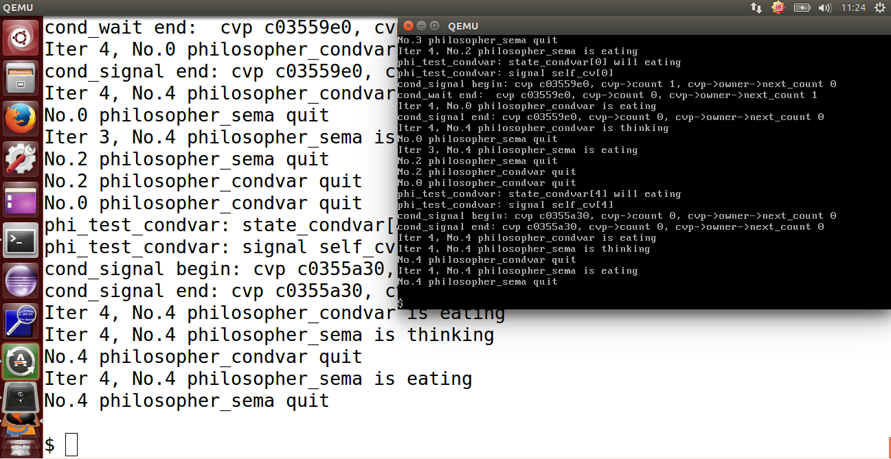
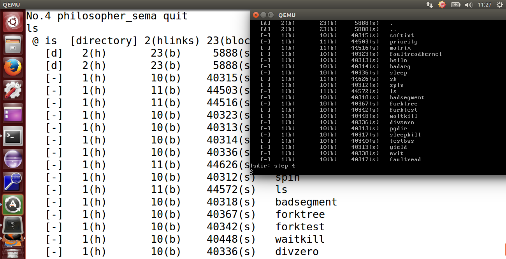

## lab8 实验报告

### 练习0：填写已有实验

`lab8` 会依赖 `lab1~lab7` ，我们需要把做的 `lab1~lab7` 的代码填到 `lab8` 中缺失的位置上面。练习 0 就是一个工具的利用。这里我使用的是 `Linux` 下的系统已预装好的 `Meld Diff Viewer` 工具。和 `lab6` 操作流程一样，我们只需要将已经完成的 `lab1~lab7` 与待完成的 `lab7`  (由于 `lab8` 是基于 `lab1~lab7` 基础上完成的，所以这里只需要导入 `lab7` )分别导入进来，然后点击 `compare` 就行了。



然后软件就会自动分析两份代码的不同，然后就一个个比较比较复制过去就行了，在软件里面是可以支持打开对比复制了，点击 `Copy Right` 即可。当然 `bin` 目录和 `obj` 目录下都是 `make` 生成的，就不用复制了，其他需要修改的地方主要有以下七个文件，通过对比复制完成即可：

```c
proc.c
default_pmm.c
pmm.c
swap_fifo.c
vmm.c
trap.c
sche.c
```

根据试验要求，我们需要对部分代码进行改进，进一步比对发现，无需改进代码实现，直接使用即可。

### 练习1: 完成读文件操作的实现（需要编码）

要求是首先了解打开文件的处理流程，然后参考本实验后续的文件读写操作的过程分析，编写在 sfs_inode.c 中 sfs_io_nolock 读文件中数据的实现代码。 

ucore 的文件系统模型源于 Havard 的 OS161 的文件系统和 Linux 文件系统。但其实这二者都是源于传统的 UNIX 文件系统设计。UNIX 提出了四个文件系统抽象概念：文件(file)、目录项(dentry)、索引节点(inode)和安装点(mount point)。

- 文件：UNIX 文件中的内容可理解为是一有序字节 buffer，文件都有一个方便应用程序识别的文件名称（也称文件路径名）。典型的文件操作有读、写、创建和删除等。

- 目录项：目录项不是目录，而是目录的组成部分。在 UNIX 中目录被看作一种特定的文件，而目录项是文件路径中的一部分。如一个文件路径名是 “/test/testfile”，则包含的目录项为：根目录 “/”，目录 “test” 和文件 “testfile”，这三个都是目录项。一般而言，目录项包含目录项的名字（文件名或目录名）和目录项的索引节点（见下面的描述）位置。

- 索引节点：UNIX 将文件的相关元数据信息（如访问控制权限、大小、拥有者、创建时间、数据内容等等信息）存储在一个单独的数据结构中，该结构被称为索引节点。 

- 安装点：在 UNIX 中，文件系统被安装在一个特定的文件路径位置，这个位置就是安装点。所有的已安装文件系统都作为根文件系统树中的叶子出现在系统中。安装点是一个起点，从安装点开始可以访问文件系统中的所有文件。

其中，文件和目录是给应用程序看到的一个抽象。

从 ucore 操作系统不同的角度来看，ucore 中的文件系统架构包含四类主要的数据结构, 它们分别是：

- 1、超级块（SuperBlock），它主要从文件系统的全局角度描述特定文件系统的全局信息。它的作用范围是整个OS空间。 

- 2、索引节点（inode）：它主要从文件系统的单个文件的角度它描述了文件的各种属性和数据所在位置。它的作用范围是整个OS空间。 

- 3、目录项（dentry）：它主要从文件系统的文件路径的角度描述了文件路径中的特定目录。它的作用范围是整个 OS 空间。 

- 4、文件（file），它主要从进程的角度描述了一个进程在访问文件时需要了解的文件标识，文件读写的位置，文件引用情况等信息。它的作用范围是某一具体进程。

文件系统，会将磁盘上的文件（程序）读取到内存里面来，在用户空间里面变成进程去进一步执行或其他操作。通过一系列系统调用完成这个过程。

根据实验指导书，我们可以了解到，ucore 的文件系统架构主要由四部分组成：

- 通用文件系统访问接口层：该层提供了一个从用户空间到文件系统的标准访问接口。这一层访问接口让应用程序能够通过一个简单的接口获得 ucore 内核的文件系统服务。

- 文件系统抽象层：向上提供一个一致的接口给内核其他部分（文件系统相关的系统调用实现模块和其他内核功能模块）访问。向下提供一个抽象函数指针列表和数据结构来屏蔽不同文件系统的实现细节。

- Simple FS 文件系统层：一个基于索引方式的简单文件系统实例。向上通过各种具体函数实现以对应文件系统抽象层提出的抽象函数。向下访问外设接口

- 外设接口层：向上提供 device 访问接口屏蔽不同硬件细节。向下实现访问各种具体设备驱动的接口,比如 disk 设备接口/串口设备接口/键盘设备接口等。

这里我们可以通过下图可以比较好的理解这四个部分的关系：



接下来分析下打开一个文件的详细处理的流程。 

例如某一个应用程序需要操作文件（增删读写等），首先需要通过文件系统的通用文件系统访问接口层给用户空间提供的访问接口进入文件系统内部，接着由文件系统抽象层把访问请求转发给某一具体文件系统(比如 Simple FS 文件系统)，然后再由具体文件系统把应用程序的访问请求转化为对磁盘上的 block 的处理请求，并通过外设接口层交给磁盘驱动例程来完成具体的磁盘操作。

对应到我们的ucore上，具体的过程如下：

- 1、 以打开文件为例，首先用户会在进程中调用 safe_open() 函数，然后依次调用如下函数 open->sys_open->syscall，从而引发系统调用然后进入内核态，然后会由 sys_open 内核函数处理系统调用，进一步调用到内核函数 sysfile_open，然后将字符串 "/test/testfile" 拷贝到内核空间中的字符串 path 中，并进入到文件系统抽象层的处理流程完成进一步的打开文件操作中。
- 2、 在文件系统抽象层，系统会分配一个 file 数据结构的变量，这个变量其实是 current->fs_struct->filemap[] 中的一个空元素，即还没有被用来打开过文件，但是分配完了之后还不能找到对应对应的文件结点。所以系统在该层调用了 vfs_open 函数通过调用 vfs_lookup 找到 path 对应文件的 inode，然后调用vop_open函数打开文件。然后层层返回，通过执行语句 file->node=node;，就把当前进程的 current->fs_struct->filemap[fd]（即 file 所指变量）的成员变量 node 指针指向了代表文件的索引节点 node。这时返回 fd。最后完成打开文件的操作。

- 3、 在第2步中，调用了 SFS 文件系统层的 vfs_lookup 函数去寻找 node，这里在 sfs_inode.c 中我们能够知道 .vop_lookup = sfs_lookup。

- 4、看到 sfs_lookup 函数传入的三个参数，其中 node 是根目录“/”所对应的 inode 节点；path 是文件的绝对路径（例如“/test/file”)，而 node_store 是经过查找获得的 file 所对应的 inode 节点。 函数以“/”为分割符，从左至右逐一分解path获得各个子目录和最终文件对应的 inode 节点。在本例中是分解出 “test” 子目录，并调用 sfs_lookup_once 函数获得 “test” 子目录对应的 inode 节点 subnode，然后循环进一步调用  sfs_lookup_once 查找以 “test” 子目录下的文件 “testfile1” 所对应的 inode 节点。当无法分解 path 后，就意味着找到了testfile1对应的 inode 节点，就可顺利返回了。

- 5、而我们再进一步观察 sfs_lookup_once 函数，它调用 sfs_dirent_search_nolock 函数来查找与路径名匹配的目录项，如果找到目录项，则根据目录项中记录的 inode 所处的数据块索引值找到路径名对应的 SFS 磁盘 inode，并读入 SFS 磁盘 inode 对的内容，创建 SFS 内存 inode。 

如下图所示，ucore 文件系统中，是这样处理读写硬盘操作的：



- （1）首先是应用程序发出请求，请求硬盘中写数据或读数据，应用程序通过 FS syscall 接口执行系统调用，获得 ucore 操作系统关于文件的一些服务；

- （2）之后，一旦操作系统内系统调用得到了请求，就会到达 VFS 层面（虚拟文件系统），包含很多部分比如文件接口、目录接口等，是一个抽象层面，它屏蔽底层具体的文件系统；

- （3）VFS 如果得到了处理，那么 VFS 会将这个 iNode 传递给 SimpleFS，注意，此时，VFS 中的 iNode 还是一个抽象的结构，在 SimpleFS 中会转化为一个具体的 iNode；

- （4）通过该 iNode 经过 IO 接口对于磁盘进行读写。

那么，硬盘中的文件布局又是怎样的呢？硬盘中的布局信息存在SFS中，如下图所示：


上图所示的是一个 SFS 的文件系统，其定义在（kern/fs/sfs/sfs.h，83——94行）：

```c
struct sfs_fs {
    struct sfs_super super;              /* on-disk superblock */
    struct device *dev;                  /* device mounted on */
    struct bitmap *freemap;              /* blocks in use are mared 0 */
    bool super_dirty;                    /* true if super/freemap modified */
    void *sfs_buffer;                    /* buffer for non-block aligned io */
    semaphore_t fs_sem;                  /* semaphore for fs */
    semaphore_t io_sem;                  /* semaphore for io */
    semaphore_t mutex_sem;               /* semaphore for link/unlink and rename */
    list_entry_t inode_list;             /* inode linked-list */
    list_entry_t *hash_list;             /* inode hash linked-list */
};
```

其中，SFS 的前 3 项对应的就是硬盘文件布局的全局信息。

那么，接下来分析这些文件布局的数据结构：

（1）超级块 super_block（kern/fs/sfs/sfs.h，40——45行）

```c
struct sfs_super {
    uint32_t magic;                     /* magic number, should be SFS_MAGIC */
    uint32_t blocks;                    /* # of blocks in fs */
    uint32_t unused_blocks;             /* # of unused blocks in fs */
    char info[SFS_MAX_INFO_LEN + 1];    /* infomation for sfs  */
};
```

超级块，刚刚说过是一个文件系统的全局角度描述特定文件系统的全局信息。这里面定义了标识符 magic、总块数 blocks、空闲块数 unused_blocks 和一些关于 SFS 的信息，通常是字符串。

（2）根目录结构 root_dir（kern/fs/sfs/sfs.h，48——57行）

```c
struct sfs_disk_inode {
    uint32_t size;                       	/* size of the file (in bytes) */
    uint16_t type;                       	/* one of SYS_TYPE_* above */
    uint16_t nlinks;                     	/* # of hard links to this file */
    uint32_t blocks;                    	/* # of blocks */
    uint32_t direct[SFS_NDIRECT];        	/* direct blocks */
    uint32_t indirect;                    	/* indirect blocks */
};
```

我们刚刚讲过，iNode 是从文件系统的单个文件的角度它描述了文件的各种属性和数据所在位置，相当于一个索引，而 root_dir 是一个根目录索引，根目录表示，我们一开始访问这个文件系统可以看到的目录信息。主要关注 direct 和 indirect，代表根目录下的直接索引和间接索引。

（3）目录项 entry（kern/fs/sfs/sfs.h，60——63行）

```c
struct sfs_disk_entry {
    uint32_t ino;                              	/* inode number */
    char name[SFS_MAX_FNAME_LEN + 1];       	/* file name */
};
```

数组中存放的是文件的名字，ino 是该文件的 iNode 值。

仅有硬盘文件布局还不够，SFS 毕竟是一个在硬盘之上的抽象，它还需要传递上一层过来的索引值 INODE。这个 INODE 是 SFS 层面的，我们刚刚讨论的 iNode 是硬盘上实际的索引。

sfs_inode（kern/fs/sfs/sfs.h，69——77行）

```c
struct sfs_inode {
    struct sfs_disk_inode *din;             /* on-disk inode */
    uint32_t ino;                           /* inode number */
    bool dirty;                             /* true if inode modified */
    int reclaim_count;                      /* kill inode if it hits zero */
    semaphore_t sem;                        /* semaphore for din */
    list_entry_t inode_link;                /* entry for linked-list in sfs_fs */
    list_entry_t hash_link;                 /* entry for hash linked-list in sfs_fs */
};
```

我们看到，sfs_disk_inode 是 SFS 层面上的 iNode 的一个成员，代表了这两个结构之间的上下级关系。

接下来，我们来分析更高层的数据结构 VFS（虚拟文件系统）。


在 VFS 层中，我们需要对于虚拟的 iNode，和下一层的 SFS 的 iNode 进行对接。

文件系统抽象层是把不同文件系统的对外共性接口提取出来，形成一个函数指针数组，这样，通用文件系统访问接口层只需访问文件系统抽象层，而不需关心具体文件系统的实现细节和接口。

（1）VFS的抽象定义（kern/fs/vfs/vfs.h，35——46行）

```c
struct fs {
    union {
        struct sfs_fs __sfs_info;                   
    } fs_info;                              	    // filesystem-specific data 
    enum {
        fs_type_sfs_info,
    } fs_type;                               	    // filesystem type 
    int (*fs_sync)(struct fs *fs);                 	// Flush all dirty buffers to disk 
    struct inode *(*fs_get_root)(struct fs *fs);   	// Return root inode of filesystem.
    int (*fs_unmount)(struct fs *fs);             	// Attempt unmount of filesystem.
    void (*fs_cleanup)(struct fs *fs);            	// Cleanup of filesystem.??? 
};
```

主要是一些函数指针用于处理 VFS 的操作。

（2）文件结构（kern/fs/file.c，14——24行）

```c
struct file {
    enum {
        FD_NONE, FD_INIT, FD_OPENED, FD_CLOSED,
    } status;                    //访问文件的执行状态
    bool readable;               //文件是否可读
    bool writable;               //文件是否可写
    int fd;                      //文件在 filemap 中的索引值
    off_t pos;                   //访问文件的当前位置
    struct inode *node;          //该文件对应的内存 inode 指针
    atomic_t open_count;         //打开此文件的次数
};
```

在 file 基础之上还有一个管理所有 file 的数据结构 file_struct（kern/fs/fs.h，25——30行）

```c
struct files_struct {
    struct inode *pwd;      	//当前工作目录
    struct file *fd_array;      //已经打开的文件对应的数组
    int files_count;        	//打开的文件个数
};
```

（3）VFS 的索引 iNode（kern/fs/vfs/inode.h，29——42行）

```c
/*
inode 数据结构是位于内存的索引节点，把不同文件系统的特定索引节点信息(甚至不能算是一个索引节点)统一封装起来，避免了进程直接访问具体文件系统
*/
struct inode {
    union {                                  //包含不同文件系统特定 inode 信息的 union 域
        struct device __device_info;         //设备文件系统内存 inode 信息
        struct sfs_inode __sfs_inode_info;   //SFS 文件系统内存 inode 信息
    } in_info;
    enum {
        inode_type_device_info = 0x1234,
        inode_type_sfs_inode_info,
    } in_type;                               //此 inode 所属文件系统类型
    atomic_t ref_count;                      //此 inode 的引用计数
    atomic_t open_count;                     //打开此 inode 对应文件的个数
    struct fs *in_fs;                        //抽象的文件系统,包含访问文件系统的函数指针
    const struct inode_ops *in_ops;          //抽象的 inode 操作,包含访问 inode 的函数指针
};
```

我们看到在 VFS 层面的 iNode 值，包含了 SFS 和硬件设备 device 的情况。

（4）inode 的操作函数指针列表（kern/fs/vfs/inode.h，169——186行）

```c
struct inode_ops {
    unsigned long vop_magic;
    int (*vop_open)(struct inode *node, uint32_t open_flags);
    int (*vop_close)(struct inode *node);
    int (*vop_read)(struct inode *node, struct iobuf *iob);
    int (*vop_write)(struct inode *node, struct iobuf *iob);
    int (*vop_fstat)(struct inode *node, struct stat *stat);
    int (*vop_fsync)(struct inode *node);
    int (*vop_namefile)(struct inode *node, struct iobuf *iob);
    int (*vop_getdirentry)(struct inode *node, struct iobuf *iob);
    int (*vop_reclaim)(struct inode *node);
    int (*vop_gettype)(struct inode *node, uint32_t *type_store);
    int (*vop_tryseek)(struct inode *node, off_t pos);
    int (*vop_truncate)(struct inode *node, off_t len);
    int (*vop_create)(struct inode *node, const char *name, bool excl, struct inode **node_store);
    int (*vop_lookup)(struct inode *node, char *path, struct inode **node_store);
    int (*vop_ioctl)(struct inode *node, int op, void *data);
};
```

inode_ops 是对常规文件、目录、设备文件所有操作的一个抽象函数表示。对于某一具体的文件系统中的文件或目录，只需实现相关的函数，就可以被用户进程访问具体的文件了，且用户进程无需了解具体文件系统的实现细节。

有了上述分析后，我们可以看看如果一个用户进程打开文件会做哪些事情？

首先假定用户进程需要打开的文件已经存在在硬盘上。以 user/sfs_filetest1.c 为例，首先用户进程会调用在 main 函数中的如下语句：

```c
int fd1 = safe_open("/test/testfile", O_RDWR | O_TRUNC);
```

如果 ucore 能够正常查找到这个文件，就会返回一个代表文件的文件描述符 fd1，这样在接下来的读写文件过程中，就直接用这样 fd1 来代表就可以了。

接下来实现需要编码的函数：

通用文件访问接口层的处理流程：

首先进入通用文件访问接口层的处理流程，即进一步调用如下用户态函数：open->sys_open->syscall，从而引起系统调用进入到内核态。到了内核态后，通过中断处理例程，会调用到 sys_open 内核函数，并进一步调用 sysfile_open 内核函数。到了这里，需要把位于用户空间的字符串 ”/test/testfile” 拷贝到内核空间中的字符串  path 中，并进入到文件系统抽象层的处理流程完成进一步的打开文件操作中。



文件系统抽象层（VFS）的处理流程：

1、分配一个空闲的 file 数据结构变量 file 在文件系统抽象层的处理中，首先调用的是 file_open 函数，它要给这个即将打开的文件分配一个 file 数据结构的变量，这个变量其实是当前进程的打开文件数组 current->fs_struct->filemap[] 中的一个空闲元素（即还没用于一个打开的文件），而这个元素的索引值就是最终要返回到用户进程并赋值给变量 fd1。到了这一步还仅仅是给当前用户进程分配了一个 file 数据结构的变量，还没有找到对应的文件索引节点。

为此需要进一步调用 vfs_open 函数来找到 path 指出的文件所对应的基于 inode 数据结构的 VFS 索引节点 node。 vfs_open 函数需要完成两件事情：通过 vfs_lookup 找到 path 对应文件的 inode；调用 vop_open 函数打开文件。



2、找到文件设备的根目录/的索引节点需要注意，这里的 vfs_lookup 函数是一个针对目录的操作函数，它会调用 vop_lookup 函数来找到 SFS 文件系统中的 /test 目录下的 testfile 文件。为此，vfs_lookup 函数首先调用 get_device 函数，并进一步调用 vfs_get_bootfs 函数（其实调用了）来找到根目录/对应的 inode。这个 inode 就是位于 vfs.c 中的 inode 变量 bootfs_node。这个变量在 init_main 函数（位于kern/process/proc.c）执行时获得了赋值。

找到根目录/下的test子目录对应的索引节点，在找到根目录对应的inode后，通过调用vop_lookup函数来查找/和test这两层目录下的文件testfile所对应的索引节点，如果找到就返回此索引节点。

3、把 file 和 node 建立联系。完成第3步后，将返回到 file_open 函数中，通过执行语句 file->node=node，就把当前进程的current->fs_struct->filemap[fd]（即file所指变量）的成员变量 node 指针指向了代表 /test/testfile 文件的索引节点 node。这时返回 fd。经过重重回退，通过系统调用返回，用户态的 syscall->sys_open->open->safe_open 等用户函数的层层函数返回，最终把把fd赋值给fd1。自此完成了打开文件操作。但这里我们还没有分析第2和第3步是如何进一步调用 SFS 文件系统提供的函数找位于 SFS 文件系统上的 /test/testfile 所对应的 sfs 磁盘 inode 的过程。下面需要进一步对此进行分析。

sfs_lookup（kern/fs/sfs/sfs_inode.c，975——993行）

```c
static int sfs_lookup(struct inode *node, char *path, struct inode **node_store) {
struct sfs_fs *sfs = fsop_info(vop_fs(node), sfs);
assert(*path != '\0' && *path != '/');    
//以“/”为分割符，从左至右分解path获得各子目录和最终文件对应的inode节点。
vop_ref_inc(node);
struct sfs_inode *sin = vop_info(node, sfs_inode);
if (sin->din->type != SFS_TYPE_DIR) {
    	vop_ref_dec(node);
    	return -E_NOTDIR;
}
struct inode *subnode;
int ret = sfs_lookup_once(sfs, sin, path, &subnode, NULL);  //循环进一步调用	sfs_lookup_once查找以“test”子目录下的文件“testfile1”所对应的inode节点。
 
vop_ref_dec(node);
if (ret != 0) {  
    	return ret;
}
*node_store = subnode;  
//当无法分解path后，就意味着找到了需要对应的inode节点，就可顺利返回了。
return 0;
}
```

看到函数传入的三个参数，其中 node 是根目录 “/” 所对应的 inode 节点；path 是文件的绝对路径（例如 “/test/file”)，而 node_store 是经过查找获得的file所对应的inode节点。

函数以 “/” 为分割符，从左至右逐一分解path获得各个子目录和最终文件对应的 inode 节点。在本例中是分解出 “test” 子目录，并调用sfs_lookup_once函数获得“test”子目录对应的 inode 节点 subnode，然后循环进一步调用 sfs_lookup_once 查找以 “test” 子目录下的文件 “testfile1” 所对应的 inode 节点。当无法分解 path 后，就意味着找到了 testfile1 对应的 inode 节点，就可顺利返回了。

而我们再进一步观察 sfs_lookup_once 函数，它调用 sfs_dirent_search_nolock 函数来查找与路径名匹配的目录项，如果找到目录项，则根据目录项中记录的 inode 所处的数据块索引值找到路径名对应的 SFS 磁盘 inode，并读入 SFS 磁盘 inode 对的内容，创建 SFS 内存 inode。

sfs_lookup_once（kern/fs/sfs/sfs_inode.c，498——512行）

```c
static int sfs_lookup_once(struct sfs_fs *sfs, struct sfs_inode *sin, const char *name, struct inode **node_store, int *slot) {
    int ret;
    uint32_t ino;
    lock_sin(sin);
    {   // find the NO. of disk block and logical index of file entry
        ret = sfs_dirent_search_nolock(sfs, sin, name, &ino, slot, NULL);
    }
    unlock_sin(sin);
    if (ret == 0) {
		// load the content of inode with the the NO. of disk block
        ret = sfs_load_inode(sfs, node_store, ino);
    }
    return ret;
}
```

最后是需要实现的函数，这里只注释了读文件的部分：

```c
static int sfs_io_nolock(struct sfs_fs *sfs, struct sfs_inode *sin, void *buf, off_t offset, size_t *alenp, bool write) {
......
......  
 
if ((blkoff = offset % SFS_BLKSIZE) != 0) {                   	//读取第一部分的数据
    size = (nblks != 0) ? (SFS_BLKSIZE - blkoff) : (endpos - offset);//计算第一个数据块的大小
if ((ret = sfs_bmap_load_nolock(sfs, sin, blkno, &ino)) != 0) {  
//找到内存文件索引对应的 block 的编号 ino
        goto out;
    }
 
    if ((ret = sfs_buf_op(sfs, buf, size, ino, blkoff)) != 0) {   
        goto out;
    }
    //完成实际的读写操作
    alen += size;
    if (nblks == 0) {
        goto out;
    }
    buf += size, blkno ++, nblks --;
}
 
//读取中间部分的数据，将其分为 size 大小的块，然后一次读一块直至读完
size = SFS_BLKSIZE;
while (nblks != 0) {
    if ((ret = sfs_bmap_load_nolock(sfs, sin, blkno, &ino)) != 0) {
        goto out;
    }
    if ((ret = sfs_block_op(sfs, buf, ino, 1)) != 0) {
        goto out;
    }
    alen += size, buf += size, blkno ++, nblks --;
}
//读取第三部分的数据
if ((size = endpos % SFS_BLKSIZE) != 0) {
    if ((ret = sfs_bmap_load_nolock(sfs, sin, blkno, &ino)) != 0) {
        goto out;
    }
    if ((ret = sfs_buf_op(sfs, buf, size, ino, 0)) != 0) {
        goto out;
    }
    alen += size;
}
......
```

每次通过 sfs_bmap_load_nolock 函数获取文件索引编号，然后调用 sfs_buf_op 完成实际的文件读写操作。

```c
uint32_t blkno = offset / SFS_BLKSIZE;          // The NO. of Rd/Wr begin block
uint32_t nblks = endpos / SFS_BLKSIZE - blkno;  // The size of Rd/Wr blocks
```

blkno 就是文件开始块的位置，nblks 是文件的大小。

> 请在实验报告中给出设计实现”UNIX的PIPE机制“的概要设方案，鼓励给出详细设计方案。

为了实现 UNIX 的 PIPE 机制，可以考虑在磁盘上保留一部分空间或者是一个特定的文件来作为 pipe 机制的缓冲区，接下来将说明如何完成对 pipe 机制的支持：

- 当某两个进程之间要求建立管道，假定将进程 A 的标准输出作为进程B的标准输入，那么可以在这两个进程的进程控制块上新增变量来记录进程的这种属性；并且同时生成一个临时的文件，并将其在进程A, B中打开;
- 当进程 A 使用标准输出进行 write 系统调用的时候，通过PCB中的变量可以知道，需要将这些标准输出的数据输出到先前提高的临时文件中去；
- 当进程 B 使用标准输入的时候进行 read 系统调用的时候，根据其PCB中的信息可以知道，需要从上述的临时文件中读取数据；
- 至此完成了对 pipe 机制的设计；

事实上，由于在真实的文件系统和用户之间还由一层虚拟文件系统，因此我们也可以不把数据缓冲在磁盘上，而是直接保存在内存中，然后完成一个根据虚拟文件系统的规范完成一个虚拟的 pipe 文件，然后进行输入输出的时候只要对这个文件进行操作即可；

### 练习2: 完成基于文件系统的执行程序机制的实现（需要编码）

改写proc.c中的load_icode函数和其他相关函数，实现基于文件系统的执行程序机制。执行：make qemu。如果能看看到sh用户程序的执行界面，则基本成功了。如果在sh用户界面上可以执行”ls”,”hello”等其他放置在sfs文件系统中的其他执行程序，则可以认为本实验基本成功。

可以在 Lab 7 的基础上进行修改，读 elf 文件变成从磁盘上读，而不是直接在内存中读。

在 proc.c 中，根据注释我们需要先初始化 fs 中的进程控制结构，即在 alloc_proc 函数中我们需要做一下修改，加上一句 proc->filesp = NULL; 从而完成初始化。

为什么要这样做的呢，因为我们之前讲过，一个文件需要在 VFS 中变为一个进程才能被执行。

修改之后 alloc_proc 函数如下：（增加一行，kern/process/proc.c，136行）

```c
proc->filesp = NULL;     //初始化fs中的进程控制结构
```

所以完整的 alloc_proc 函数的实现如下：

```c
//LAB8:EXERCISE2 YOUR CODE HINT:need add some code to init fs in proc_struct, ...
static struct proc_struct *alloc_proc(void) {
    struct proc_struct *proc = kmalloc(sizeof(struct proc_struct));
    if (proc != NULL) {
        proc->state = PROC_UNINIT; //进程状态为为初始化
        proc->pid = -1;            //进程ID为-1
        proc->runs = 0;            //进程运行时间为0
        proc->kstack = 0;          //内核栈为0
        proc->need_resched = 0;    //进程不需要调度
        proc->parent = NULL; //父进程为空
        proc->mm = NULL; //内存管理为空
        memset(&(proc->context), 0, sizeof(struct context)); 
        proc->tf = NULL; //中断帧为空
        proc->cr3 = boot_cr3; //cr3寄存器
        proc->flags = 0; //标记
        memset(proc->name, 0, PROC_NAME_LEN);
        proc->wait_state = 0; //等待状态
        proc->cptr = proc->optr = proc->yptr = NULL; //相关指针初始化
        proc->rq = NULL; //运行队列 
        list_init(&(proc->run_link)); //运行队列链表
        proc->time_slice = 0; //进程运行的时间片
        proc->lab6_run_pool.left = proc->lab6_run_pool.right = proc->lab6_run_pool.parent = NULL; //进程池
        proc->lab6_stride = 0; 
        proc->lab6_priority = 0; //优先级
        proc->filesp = NULL;  //初始化fs中的进程控制结构
    }
    return proc;
}

```

此外 参数在栈中的布局如下所示：

```markdown
| High Address |
----------------
|   Argument   |
|      n       |
----------------
|     ...      |
----------------
|   Argument   |
|      1       |
----------------
|    padding   |
----------------
|   null ptr   |
----------------
|  Ptr Arg n   |
----------------
|     ...      |
----------------
|  Ptr  Arg 1  |
----------------
|  Arg  Count  | <-- user esp
----------------
| Low  Address |
```

然后就是要实现 `load_icode` 函数，具体的实现及注释如下所示：

```c
static int load_icode(int fd, int argc, char **kargv) {

    /* (1) create a new mm for current process
     * (2) create a new PDT, and mm->pgdir= kernel virtual addr of PDT
     * (3) copy TEXT/DATA/BSS parts in binary to memory space of process
     *    (3.1) read raw data content in file and resolve elfhdr
     *    (3.2) read raw data content in file and resolve proghdr based on info in elfhdr
     *    (3.3) call mm_map to build vma related to TEXT/DATA
     *    (3.4) callpgdir_alloc_page to allocate page for TEXT/DATA, read contents in file
     *          and copy them into the new allocated pages
     *    (3.5) callpgdir_alloc_page to allocate pages for BSS, memset zero in these pages
     * (4) call mm_map to setup user stack, and put parameters into user stack
     * (5) setup current process's mm, cr3, reset pgidr (using lcr3 MARCO)
     * (6) setup uargc and uargv in user stacks
     * (7) setup trapframe for user environment
     * (8) if up steps failed, you should cleanup the env.
     */
    assert(argc >= 0 && argc <= EXEC_MAX_ARG_NUM);
    //(1)建立内存管理器
    // 判断当前进程的 mm 是否已经被释放掉了
    if (current->mm != NULL) {    //要求当前内存管理器为空
        panic("load_icode: current->mm must be empty.\n");
    }

    int ret = -E_NO_MEM;    // E_NO_MEM 代表因为存储设备产生的请求错误
    struct mm_struct *mm;  //建立内存管理器
    if ((mm = mm_create()) == NULL) {// 为进程创建一个新的 mm
        goto bad_mm;
    }

    //(2)建立页目录
    if (setup_pgdir(mm) != 0) {// 进行页表项的设置
        goto bad_pgdir_cleanup_mm;
    }
    struct Page *page;//建立页表

    //(3)从文件加载程序到内存
    struct elfhdr __elf, *elf = &__elf;
    // 从磁盘上读取出 ELF 可执行文件的 elf-header
    if ((ret = load_icode_read(fd, elf, sizeof(struct elfhdr), 0)) != 0) {//读取 elf 文件头
        goto bad_elf_cleanup_pgdir;           
    }

    if (elf->e_magic != ELF_MAGIC) {// 判断该 ELF 文件是否合法
        ret = -E_INVAL_ELF;
        goto bad_elf_cleanup_pgdir;
    }

    struct proghdr __ph, *ph = &__ph;
    uint32_t vm_flags, perm, phnum;
    // 根据 elf-header 中的信息，找到每一个 program header
    for (phnum = 0; phnum < elf->e_phnum; phnum ++) {  //e_phnum 代表程序段入口地址数目，即多少各段
        off_t phoff = elf->e_phoff + sizeof(struct proghdr) * phnum;  //循环读取程序的每个段的头部   
        if ((ret = load_icode_read(fd, ph, sizeof(struct proghdr), phoff)) != 0) {// 读取program header
            goto bad_cleanup_mmap;
        }
        if (ph->p_type != ELF_PT_LOAD) {
            continue ;
        }
        if (ph->p_filesz > ph->p_memsz) {
            ret = -E_INVAL_ELF;
            goto bad_cleanup_mmap;
        }
        if (ph->p_filesz == 0) {
            continue ;
        }
        vm_flags = 0, perm = PTE_U;//建立虚拟地址与物理地址之间的映射
        if (ph->p_flags & ELF_PF_X) vm_flags |= VM_EXEC;// 根据 ELF 文件中的信息，对各个段的权限进行设置
        if (ph->p_flags & ELF_PF_W) vm_flags |= VM_WRITE;
        if (ph->p_flags & ELF_PF_R) vm_flags |= VM_READ;
        if (vm_flags & VM_WRITE) perm |= PTE_W;
        if ((ret = mm_map(mm, ph->p_va, ph->p_memsz, vm_flags, NULL)) != 0) {// 将这些段的虚拟内存地址设置为合法的
            goto bad_cleanup_mmap;
        }
        off_t offset = ph->p_offset;
        size_t off, size;
        uintptr_t start = ph->p_va, end, la = ROUNDDOWN(start, PGSIZE);


        ret = -E_NO_MEM;

        //复制数据段和代码段
        end = ph->p_va + ph->p_filesz;      //计算数据段和代码段终止地址
        while (start < end) {               
            if ((page = pgdir_alloc_page(mm->pgdir, la, perm)) == NULL) {// 为 TEXT/DATA 段逐页分配物理内存空间
                ret = -E_NO_MEM;
                goto bad_cleanup_mmap;
            }
            off = start - la, size = PGSIZE - off, la += PGSIZE;
            if (end < la) {
                size -= la - end;
            }
            //每次读取size大小的块，直至全部读完
            if ((ret = load_icode_read(fd, page2kva(page) + off, size, offset)) != 0) {       //load_icode_read 通过 sysfile_read 函数实现文件读取，将磁盘上的 TEXT/DATA 段读入到分配好的内存空间中去
                goto bad_cleanup_mmap;
            }
            start += size, offset += size;
        }
        //建立BSS段
        end = ph->p_va + ph->p_memsz;   //同样计算终止地址

        if (start < la) {// 如果存在 BSS 段，并且先前的 TEXT/DATA 段分配的最后一页没有被完全占用，则剩余的部分被BSS段占用，因此进行清零初始化     
            if (start == end) {   
                continue ;
            }
            off = start + PGSIZE - la, size = PGSIZE - off;
            if (end < la) {
                size -= la - end;
            }
            memset(page2kva(page) + off, 0, size);
            start += size;
            assert((end < la && start == end) || (end >= la && start == la));
        }

        while (start < end) {// 如果 BSS 段还需要更多的内存空间的话，进一步进行分配
            if ((page = pgdir_alloc_page(mm->pgdir, la, perm)) == NULL) {// 为 BSS 段分配新的物理内存页
                ret = -E_NO_MEM;
                goto bad_cleanup_mmap;
            }
            off = start - la, size = PGSIZE - off, la += PGSIZE;
            if (end < la) {
                size -= la - end;
            }
            //每次操作 size 大小的块
            memset(page2kva(page) + off, 0, size);// 将分配到的空间清零初始化
            start += size;
        }
    }
    // 关闭传入的文件，因为在之后的操作中已经不需要读文件了
    sysfile_close(fd);//关闭文件，加载程序结束

    //(4)建立相应的虚拟内存映射表
    vm_flags = VM_READ | VM_WRITE | VM_STACK;// 设置用户栈的权限
    if ((ret = mm_map(mm, USTACKTOP - USTACKSIZE, USTACKSIZE, vm_flags, NULL)) != 0) {// 将用户栈所在的虚拟内存区域设置为合法的
        goto bad_cleanup_mmap;
    }
    assert(pgdir_alloc_page(mm->pgdir, USTACKTOP-PGSIZE , PTE_USER) != NULL);
    assert(pgdir_alloc_page(mm->pgdir, USTACKTOP-2*PGSIZE , PTE_USER) != NULL);
    assert(pgdir_alloc_page(mm->pgdir, USTACKTOP-3*PGSIZE , PTE_USER) != NULL);
    assert(pgdir_alloc_page(mm->pgdir, USTACKTOP-4*PGSIZE , PTE_USER) != NULL);
    //(5)设置用户栈
    mm_count_inc(mm);// 切换到用户的内存空间，这样的话后文中在栈上设置参数部分的操作将大大简化，因为具体因为空间不足而导致的分配物理页的操作已经交由page fault处理了，是完全透明的
    current->mm = mm;
    current->cr3 = PADDR(mm->pgdir);
    lcr3(PADDR(mm->pgdir));

    //(6)处理用户栈中传入的参数，其中 argc 对应参数个数，uargv[] 对应参数的具体内容的地址
    uint32_t argv_size=0, i;
    for (i = 0; i < argc; i ++) {// 先算出所有参数加起来的长度
        argv_size += strnlen(kargv[i],EXEC_MAX_ARG_LEN + 1)+1;
    }

    uintptr_t stacktop = USTACKTOP - (argv_size/sizeof(long)+1)*sizeof(long);
    char** uargv=(char **)(stacktop  - argc * sizeof(char *));

    argv_size = 0;
    for (i = 0; i < argc; i ++) {         //将所有参数取出来放置 uargv
        uargv[i] = strcpy((char *)(stacktop + argv_size ), kargv[i]);
        argv_size +=  strnlen(kargv[i],EXEC_MAX_ARG_LEN + 1)+1;
    }

    stacktop = (uintptr_t)uargv - sizeof(int);   //计算当前用户栈顶
    *(int *)stacktop = argc;              
    //(7)设置进程的中断帧   
    struct trapframe *tf = current->tf;// 设置中断帧    
    memset(tf, 0, sizeof(struct trapframe));//初始化 tf，设置中断帧
    tf->tf_cs = USER_CS;// 需要返回到用户态，因此使用用户态的数据段和代码段的选择子      
    tf->tf_ds = tf->tf_es = tf->tf_ss = USER_DS;
    tf->tf_esp = stacktop;// 栈顶位置为先前计算过的栈顶位置，注意在C语言的函数调用规范中，栈顶指针指向的位置应该是返回地址而不是第一个参数，这里让栈顶指针指向了第一个参数的原因在于，在中断返回之后，会跳转到ELF可执行程序的入口处，在该入口处会进一步使用call命令调用主函数，这时候也就完成了将 Return address 入栈的功能，因此这里无需画蛇添足压入返回地址
    tf->tf_eip = elf->e_entry;// 将返回地址设置为用户程序的入口
    tf->tf_eflags = FL_IF;// 允许中断，根据 IA32 的规范，eflags 的第 1 位需要恒为 1
    ret = 0;
    //(8)错误处理部分
out:
    return ret;           //返回
bad_cleanup_mmap:
    exit_mmap(mm);
bad_elf_cleanup_pgdir:
    put_pgdir(mm);
bad_pgdir_cleanup_mm:
    mm_destroy(mm);
bad_mm:
    goto out;
}
```

load_icode 主要是将文件加载到内存中执行，从上面的注释可知分为了一共七个步骤：

- 1、建立内存管理器

- 2、建立页目录

- 3、将文件逐个段加载到内存中，这里要注意设置虚拟地址与物理地址之间的映射

- 4、建立相应的虚拟内存映射表

- 5、建立并初始化用户堆栈

- 6、处理用户栈中传入的参数

- 7、最后很关键的一步是设置用户进程的中断帧

- 8、发生错误还需要进行错误处理。

当然一旦发生错误还需要进行错误处理。

>请在实验报告中给出设计实现基于”UNIX的硬链接和软链接机制“的概要设方案，鼓励给出详细设计方案;

观察到保存在磁盘上的 inode 信息均存在一个 nlinks 变量用于表示当前文件的被链接的计数，因而支持实现硬链接和软链接机制；

- 如果在磁盘上创建一个文件 A 的软链接 B，那么将 B 当成正常的文件创建 inode，然后将 TYPE 域设置为链接，然后使用剩余的域中的一个，指向 A 的 inode 位置，然后再额外使用一个位来标记当前的链接是软链接还是硬链接；

- 当访问到文件 B（read，write 等系统调用），判断如果 B 是一个链接，则实际是将对B指向的文件A（已经知道了 A 的 inode 位置）进行操作；

- 当删除一个软链接 B 的时候，直接将其在磁盘上的 inode 删掉即可；

- 如果在磁盘上的文件 A 创建一个硬链接 B，那么在按照软链接的方法创建完 B 之后，还需要将 A 中的被链接的计数加 1；

- 访问硬链接的方式与访问软链接是一致的；

- 当删除一个硬链接B的时候，除了需要删除掉 B 的 inode 之外，还需要将 B 指向的文件 A 的被链接计数减 1，如果减到了 0，则需要将 A 删除掉；

最终的实验结果如下图所示：



直接运行答案文件夹可能会出错，需要在 Makefile 最后加上：

```makefile
tags:
@echo TAGS ALL
$(V)rm -f cscope.files cscope.in.out cscope.out cscope.po.out tags
$(V)find . -type f -name "*.[chS]" >cscope.files
$(V)cscope -bq
$(V)ctags -L cscope.files
```

或者将 lab8 中的 Makefile，复制到 lab8_result 中（本项目已做过更正），覆盖掉原有的 Makefile，待 make qemu 信息输出完毕后，点进 qemu 界面，输入 ls，回车，可以看到文件信息：

