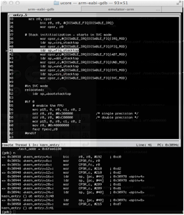

##### 2.4.4.4 使用gdb配置文件

在上面可以看到，为了进行源码级调试，需要输入较多的东西，很麻烦。为了方便，可以将这些命令存在脚本中，并让gdb在启动的时候自动载入。

以lab1为例，在lab1/tools目录下，执行完`make`后，我们可以创建文件`gdbinit`，并输入下面的内容：
```
	target remote 127.0.0.1:1234
	file bin/kernel
```
为了让gdb在启动时执行这些命令，使用下面的命令启动gdb：
```
	$ gdb -x tools/gdbinit
```
如果觉得这个命令太长，可以将这个命令存入一个文件中，当作脚本来执行。

另外，如果直接使用上面的命令，那么得到的界面是一个纯命令行的界面，不够直观，就像下图这样：



如果想获得上面右图那样的效果，只需要再加上参数-tui就行了，比如：
```
	gdb -tui -x tools/gdbinit
```
