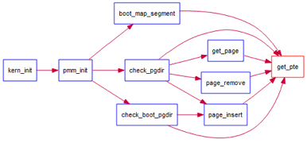
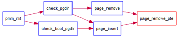

### 练习

为了实现lab2的目标，lab2提供了3个基本练习和2个扩展练习，要求完成实验报告。

对实验报告的要求：
 - 基于markdown格式来完成，以文本方式为主
 - 填写各个基本练习中要求完成的报告内容
 - 完成实验后，请分析ucore_lab中提供的参考答案，并请在实验报告中说明你的实现与参考答案的区别
 - 列出你认为本实验中重要的知识点，以及与对应的OS原理中的知识点，并简要说明你对二者的含义，关系，差异等方面的理解（也可能出现实验中的知识点没有对应的原理知识点）
 - 列出你认为OS原理中很重要，但在实验中没有对应上的知识点

**练习0：填写已有实验**

本实验依赖实验1。请把你做的实验1的代码填入本实验中代码中有“LAB1”的注释相应部分。提示：可采用diff和patch工具进行半自动的合并（merge），也可用一些图形化的比较/merge工具来手动合并，比如meld，eclipse中的diff/merge工具，understand中的diff/merge工具等。

**练习1：实现 first-fit 连续物理内存分配算法（需要编程）**

在实现first fit
内存分配算法的回收函数时，要考虑地址连续的空闲块之间的合并操作。提示:在建立空闲页块链表时，需要按照空闲页块起始地址来排序，形成一个有序的链表。可能会修改default\_pmm.c中的default\_init，default\_init\_memmap，default\_alloc\_pages，
default\_free\_pages等相关函数。请仔细查看和理解default\_pmm.c中的注释。

请在实验报告中简要说明你的设计实现过程。请回答如下问题：
 - 你的first fit算法是否有进一步的改进空间

**练习2：实现寻找虚拟地址对应的页表项（需要编程）**

通过设置页表和对应的页表项，可建立虚拟内存地址和物理内存地址的对应关系。其中的get\_pte函数是设置页表项环节中的一个重要步骤。此函数找到一个虚地址对应的二级页表项的内核虚地址，如果此二级页表项不存在，则分配一个包含此项的二级页表。本练习需要补全get\_pte函数
in
kern/mm/pmm.c，实现其功能。请仔细查看和理解get\_pte函数中的注释。get\_pte函数的调用关系图如下所示：

图1 get\_pte函数的调用关系图

请在实验报告中简要说明你的设计实现过程。请回答如下问题：
 - 请描述页目录项（Pag Director Entry）和页表（Page Table Entry）中每个组成部分的含义和以及对ucore而言的潜在用处。
 - 如果ucore执行过程中访问内存，出现了页访问异常，请问硬件要做哪些事情？

**练习3：释放某虚地址所在的页并取消对应二级页表项的映射（需要编程）**

当释放一个包含某虚地址的物理内存页时，需要让对应此物理内存页的管理数据结构Page做相关的清除处理，使得此物理内存页成为空闲；另外还需把表示虚地址与物理地址对应关系的二级页表项清除。请仔细查看和理解page\_remove\_pte函数中的注释。为此，需要补全在
kern/mm/pmm.c中的page\_remove\_pte函数。page\_remove\_pte函数的调用关系图如下所示：

图2 page\_remove\_pte函数的调用关系图

请在实验报告中简要说明你的设计实现过程。请回答如下问题：
 - 数据结构Page的全局变量（其实是一个数组）的每一项与页表中的页目录项和页表项有无对应关系？如果有，其对应关系是啥？
 - 如果希望虚拟地址与物理地址相等，则需要如何修改lab2，完成此事？ **鼓励通过编程来具体完成这个问题** 

**扩展练习Challenge：buddy system（伙伴系统）分配算法（需要编程）**

Buddy System算法把系统中的可用存储空间划分为存储块(Block)来进行管理, 每个存储块的大小必须是2的n次幂(Pow(2, n)), 即1, 2, 4, 8, 16, 32, 64, 128...

 -  参考[伙伴分配器的一个极简实现](http://coolshell.cn/articles/10427.html)， 在ucore中实现buddy system分配算法，要求有比较充分的测试用例说明实现的正确性，需要有设计文档。
 
**扩展练习Challenge：任意大小的内存单元slub分配算法（需要编程）**

slub算法，实现两层架构的高效内存单元分配，第一层是基于页大小的内存分配，第二层是在第一层基础上实现基于任意大小的内存分配。可简化实现，能够体现其主体思想即可。

 - 参考[linux的slub分配算法/](http://www.ibm.com/developerworks/cn/linux/l-cn-slub/)，在ucore中实现slub分配算法。要求有比较充分的测试用例说明实现的正确性，需要有设计文档。

> Challenges是选做，做一个就很好了。完成Challenge的同学可单独提交Challenge。完成得好的同学可获得最终考试成绩的加分。
