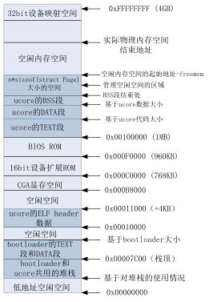

###以页为单位管理物理内存

在获得可用物理内存范围后，系统需要建立相应的数据结构来管理以物理页（按4KB对齐，且大小为4KB的物理内存单元）为最小单位的整个物理内存，以配合后续涉及的分页管理机制。每个物理页可以用一个
Page数据结构来表示。由于一个物理页需要占用一个Page结构的空间，Page结构在设计时须尽可能小，以减少对内存的占用。Page的定义在kern/mm/memlayout.h中。以页为单位的物理内存分配管理的实现在kern/default\_pmm.[ch]。

为了与以后的分页机制配合，我们首先需要建立对整个计算机的每一个物理页的属性用结构Page来表示，它包含了映射此物理页的虚拟页个数，描述物理页属性的flags和双向链接各个Page结构的page\_link双向链表。
```
struct Page {
    int ref;        // page frame's reference counter
    uint32_t flags; // array of flags that describe the status of the page frame
    unsigned int property;// the num of free block, used in first fit pm manager
    list_entry_t page_link;// free list link
};
```
这里看看Page数据结构的各个成员变量有何具体含义。ref表示这样页被页表的引用记数（在“实现分页机制”一节会讲到）。如果这个页被页表引用了，即在某页表中有一个页表项设置了一个虚拟页到这个Page管理的物理页的映射关系，就会把Page的ref加一；反之，若页表项取消，即映射关系解除，就会把Page的ref减一。flags表示此物理页的状态标记，进一步查看kern/mm/memlayout.h中的定义，可以看到：
```
/* Flags describing the status of a page frame */
#define PG_reserved                 0       // the page descriptor is reserved for kernel or unusable
#define PG_property                 1       // the member 'property' is valid
```
这表示flags目前用到了两个bit表示页目前具有的两种属性，bit
0表示此页是否被保留（reserved），如果是被保留的页，则bit
0会设置为1，且不能放到空闲页链表中，即这样的页不是空闲页，不能动态分配与释放。比如目前内核代码占用的空间就属于这样“被保留”的页。在本实验中，bit
1表示此页是否是free的，如果设置为1，表示这页是free的，可以被分配；如果设置为0，表示这页已经被分配出去了，不能被再二次分配。另外，本实验这里取的名字PG\_property比较不直观
，主要是我们可以设计不同的页分配算法（best fit, buddy
system等），那么这个PG\_property就有不同的含义了。

在本实验中，Page数据结构的成员变量property用来记录某连续内存空闲块的大小（即地址连续的空闲页的个数）。这里需要注意的是用到此成员变量的这个Page比较特殊，是这个连续内存空闲块地址最小的一页（即头一页，
Head
Page）。连续内存空闲块利用这个页的成员变量property来记录在此块内的空闲页的个数。这里去的名字property也不是很直观，原因与上面类似，在不同的页分配算法中，property有不同的含义。

Page数据结构的成员变量page\_link是便于把多个连续内存空闲块链接在一起的双向链表指针（可回顾在lab0实验指导书中有关双向链表数据结构的介绍）。这里需要注意的是用到此成员变量的这个Page比较特殊，是这个连续内存空闲块地址最小的一页（即头一页，
Head
Page）。连续内存空闲块利用这个页的成员变量page\_link来链接比它地址小和大的其他连续内存空闲块。

在初始情况下，也许这个物理内存的空闲物理页都是连续的，这样就形成了一个大的连续内存空闲块。但随着物理页的分配与释放，这个大的连续内存空闲块会分裂为一系列地址不连续的多个小连续内存空闲块，且每个连续内存空闲块内部的物理页是连续的。那么为了有效地管理这些小连续内存空闲块。所有的连续内存空闲块可用一个双向链表管理起来，便于分配和释放，为此定义了一个free\_area\_t数据结构，包含了一个list\_entry结构的双向链表指针和记录当前空闲页的个数的无符号整型变量nr\_free。其中的链表指针指向了空闲的物理页。
```
/* free_area_t - maintains a doubly linked list to record free (unused) pages */
typedef struct {
            list_entry_t free_list;                                // the list header
            unsigned int nr_free;                                 // # of free pages in this free list
} free_area_t;
```
有了这两个数据结构，ucore就可以管理起来整个以页为单位的物理内存空间。接下来需要解决两个问题：

• 管理页级物理内存空间所需的Page结构的内存空间从哪里开始，占多大空间？
• 空闲内存空间的起始地址在哪里？

对于这两个问题，我们首先根据bootloader给出的内存布局信息找出最大的物理内存地址maxpa（定义在page\_init函数中的局部变量），由于x86的起始物理内存地址为0，所以可以得知需要管理的物理页个数为
```
npage = maxpa / PGSIZE
```
这样，我们就可以预估出管理页级物理内存空间所需的Page结构的内存空间所需的内存大小为：
```
sizeof(struct Page) * npage)
```
由于bootloader加载ucore的结束地址（用全局指针变量end记录）以上的空间没有被使用，所以我们可以把end按页大小为边界去整后，作为管理页级物理内存空间所需的Page结构的内存空间，记为：
```
pages = (struct Page *)ROUNDUP((void *)end, PGSIZE);
```
为了简化起见，从地址0到地址pages+ sizeof(struct Page) \*
npage)结束的物理内存空间设定为已占用物理内存空间（起始0\~640KB的空间是空闲的），地址pages+
sizeof(struct Page) \*
npage)以上的空间为空闲物理内存空间，这时的空闲空间起始地址为
```
uintptr_t freemem = PADDR((uintptr_t)pages + sizeof(struct Page) * npage);
```
为此我们需要把这两部分空间给标识出来。首先，对于所有物理空间，通过如下语句即可实现占用标记：
```
for (i = 0; i < npage; i ++) {
SetPageReserved(pages + i);
}
````
然后，根据探测到的空闲物理空间，通过如下语句即可实现空闲标记：
```
//获得空闲空间的起始地址begin和结束地址end
……
init_memmap(pa2page(begin), (end - begin) / PGSIZE);
```
其实SetPageReserved只需把物理地址对应的Page结构中的flags标志设置为PG\_reserved
，表示这些页已经被使用了，将来不能被用于分配。而init\_memmap函数则是把空闲物理页对应的Page结构中的flags和引用计数ref清零，并加到free\_area.free\_list指向的双向列表中，为将来的空闲页管理做好初始化准备工作。

关于内存分配的操作系统原理方面的知识有很多，但在本实验中只实现了最简单的内存页分配算法。相应的实现在default\_pmm.c中的default\_alloc\_pages函数和default\_free\_pages函数，相关实现很简单，这里就不具体分析了，直接看源码，应该很好理解。

其实实验二在内存分配和释放方面最主要的作用是建立了一个物理内存页管理器框架，这实际上是一个函数指针列表，定义如下：
```
struct pmm_manager {
            const char *name; //物理内存页管理器的名字
            void (*init)(void); //初始化内存管理器
            void (*init_memmap)(struct Page *base, size_t n); //初始化管理空闲内存页的数据结构
            struct Page *(*alloc_pages)(size_t n); //分配n个物理内存页
            void (*free_pages)(struct Page *base, size_t n); //释放n个物理内存页
            size_t (*nr_free_pages)(void); //返回当前剩余的空闲页数
            void (*check)(void); //用于检测分配/释放实现是否正确的辅助函数
};
```
重点是实现init\_memmap/ alloc\_pages/
free\_pages这三个函数。当完成物理内存页管理初始化工作后，计算机系统的内存布局如下图所示：


图3 计算机系统的内存布局

