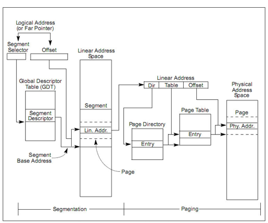
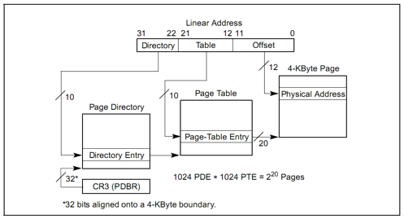

### 段页式管理基本概念

如图4在保护模式中，x86
体系结构将内存地址分成三种：逻辑地址（也称虚地址）、线性地址和物理地址。逻辑地址即是程序指令中使用的地址，物理地址是实际访问内存的地址。逻
辑地址通过段式管理的地址映射可以得到线性地址，线性地址通过页式管理的地址映射得到物理地址。

 

 图 4 段页式管理总体框架图

段式管理前一个实验已经讨论过。在 ucore
中段式管理只起到了一个过渡作用，它将逻辑地址不加转换直接映射成线性地址，所以我们在下面的讨论中可以对这两个地址不加区分（目前的
OS 实现也是不加区分的）。对段式管理有兴趣的同学可以参照《Intel® 64 and
IA-32Architectures Software Developer ’s Manual – Volume 3A》3.2 节。

如图5所示，页式管理将线性地址分成三部分（图中的
Linear Address 的 Directory 部分、 Table 部分和 Offset 部分）。ucore
的页式管理通过一个二级的页表实现。一级页表的起始物理地址存放在 cr3
寄存器中，这个地址必须是一个页对齐的地址，也就是低 12 位必须为
0。目前，ucore 用boot\_cr3（mm/pmm.c）记录这个值。

图 5 分页机制管理
