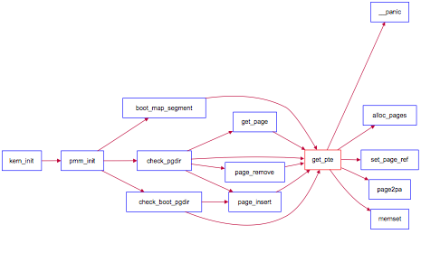

###建立虚拟页和物理页帧的地址映射关系

**建立二级页表**

80368的采用了二级页表来建立线性地址与物理地址之间的映射关系。由于我们已经具有了一个物理内存页管理器default\_pmm\_manager，支持动态分配和释放内存页的功能，我们就可以用它来获得所需的空闲物理页。在二级页表结构中，页目录表占4KB空间，可通过alloc\_page函数获得一个空闲物理页作为页目录表（Page Directory Table，PDT）。同理，ucore也通过这种类似方式获得一个页表(Page Table,PT)所需的4KB空间。

整个页目录表和页表所占空间大小取决与二级页表要管理和映射的物理页数。假定当前物理内存0~16MB，每物理页（也称Page Frame）大小为4KB，则有4096个物理页，也就意味这有4个页目录项和4096个页表项需要设置。一个页目录项(Page Directory Entry，PDE)和一个页表项(Page Table Entry，PTE)占4B。即使是4个页目录项也需要一个完整的页目录表（占4KB）。而4096个页表项需要16KB（即4096*4B）的空间，也就是4个物理页，16KB的空间。所以对16MB物理页建立一一映射的16MB虚拟页，需要5个物理页，即20KB的空间来形成二级页表。

为把0\~KERNSIZE（明确ucore设定实际物理内存不能超过KERNSIZE值，即0x38000000字节，896MB，3670016个物理页）的物理地址一一映射到页目录项和页表项的内容，其大致流程如下：

1. 先通过alloc\_page获得一个空闲物理页，用于页目录表；
2. 调用boot\_map\_segment函数建立一一映射关系，具体处理过程以页为单位进行设置，即
```
virt addr = phy addr + 0xC0000000
```
设一个32bit线性地址la有一个对应的32bit物理地址pa，如果在以la的高10位为索引值的页目录项中的存在位（PTE\_P）为0，表示缺少对应的页表空间，则可通过alloc\_page获得一个空闲物理页给页表，页表起始物理地址是按4096字节对齐的，这样填写页目录项的内容为
```
  页目录项内容 = 页表起始物理地址 | PTE_U | PTE_W | PTE_P
```
进一步对于页表中以线性地址la的中10位为索引值对应页表项的内容为
```
  页表项内容 = (pa & 0x0FFF) | PTE_P | PTE_W
```
其中：

* PTE\_U：位3，表示用户态的软件可以读取对应地址的物理内存页内容
* PTE\_W：位2，表示物理内存页内容可写
* PTE\_P：位1，表示物理内存页存在

ucore
的内存管理经常需要查找页表：给定一个虚拟地址，找出这个虚拟地址在二级页表中对应的项。通过更改此项的值可以方便地将虚拟地址映射到另外的页上。可完成此功能的这个函数是get\_pte函数。它的原型为
```
pte_t  *get_pte (pde_t *pgdir,  uintptr_t la, bool  create)
```
下面的调用关系图可以比较好地看出get\_pte在实现上诉流程中的位置：



图6 get\_pte调用关系图

这里涉及到三个类型pte t、pde t和uintptr
t。通过参见mm/mmlayout.h和libs/types.h，可知它们其实都是unsigned
int类型。在此做区分，是为了分清概念。

pde\_t全称为 page directory
entry，也就是一级页表的表项（注意：pgdir实际不是表
项，而是一级页表本身。实际上应该新定义一个类型pgd\_t来表示一级页表本身）。pte
t全 称为 page table entry，表示二级页表的表项。uintptr
t表示为线性地址，由于段式管理只做直接映射，所以它也是逻辑地址。

pgdir给出页表起始地址。通过查找这个页表，我们需要给出二级页表中对应项的地址。
虽然目前我们只有boot\_pgdir一个页表，但是引入进程的概念之后每个进程都会有自己的页
表。

有可能根本就没有对应的二级页表的情况，所以二级页表不必要一开始就分配，而是等到需要的时候再添加对应的二级页表。如果在查找二级页表项时，发现对应的二级页表不存在，则需要根据create参数的值来处理是否创建新的二级页表。如果create参数为0，则get\_pte返回NULL；如果create参数不为0，则get\_pte需要申请一个新的物理页（通过alloc\_page来实现，可在mm/pmm.h中找到它的定义），再在一级页表中添加页目录项指向表示二级页表的新物理页。注意，新申请的页必须全部设定为零，因为这个页所代表的虚拟地址都没有被映射。

当建立从一级页表到二级页表的映射时，需要注意设置控制位。这里应该设置同时设置
上PTE\_U、PTE\_W和PTE\_P（定义可在mm/mmu.h）。如果原来就有二级页表，或者新建立了页表，则只需返回对应项的地址即可。

虚拟地址只有映射上了物理页才可以正常的读写。在完成映射物理页的过程中，除了要象上面那样在页表的对应表项上填上相应的物理地址外，还要设置正确的控制位。有关
x86 中页表控制位的详细信息，请参照《Intel® 64 and IA-32 Architectures
Software Developer ’s Manual – Volume 3A》4.11 节。

只有当一级二级页表的项都设置了用户写权限后，用户才能对对应的物理地址进行读写。
所以我们可以在一级页表先给用户写权限，再在二级页表上面根据需要限制用户的权限，对物理页进行保护。由于一个物理页可能被映射到不同的虚拟地址上去（譬如一块内存在不同进程
间共享），当这个页需要在一个地址上解除映射时，操作系统不能直接把这个页回收，而是要先看看它还有没有映射到别的虚拟地址上。这是通过查找管理该物理页的Page数据结构的成员变量ref（用来表示虚拟页到物理页的映射关系的个数）来实现的，如果ref为0了，表示没有虚拟页到物理页的映射关系了，就可以把这个物理页给回收了，从而这个物理页是free的了，可以再被分配。page\_insert函数将物理页映射在了页表上。可参看page\_insert函数的实现来了解ucore内核是如何维护这个变量的。当不需要再访问这块虚拟地址时，可以把这块物理页回收并在将来用在其他地方。取消映射由page\_remove来做，这其实是page
insert的逆操作。

建立好一一映射的二级页表结构后，接下来就要使能分页机制了，这主要是通过enable\_paging函数实现的，这个函数主要做了两件事：

1. 通过lcr3指令把页目录表的起始地址存入CR3寄存器中；

2. 通过lcr0指令把cr0中的CR0\_PG标志位设置上。

执行完enable\_paging函数后，计算机系统进入了分页模式！但到这一步还没建立好完整的段页式映射。还记得ucore在最开始通过kern\_entry函数设置了临时的新段映射机制吗？这个临时的新段映射不是最简单的对等映射，导致虚拟地址和线性地址不相等。这里需要注意：刚进入分页模式的时刻是一个过渡过程。在这个过渡过程中，虚拟地址，线性地址以及物理地址之间的映射关系为：
```
virt addr = linear addr + 0xC0000000 = phy addr + 2 * 0xC0000000
```
而我们希望的段页式映射的最终映射关系为：
```
 virt addr = linear addr = phy addr + 0xC0000000
```
这里最终的段映射是简单的段对等映射（virt addr = linear addr）。所以我们需要进一步调整段映射关系，即重新设置新的GDT，建立对等段映射。在这个特殊的阶段，如果不把段映射关系改为virt addr = linear addr，则通过段页式两次地址转换后，无法得到正确的物理地址。为此我们需要进一步调用gdt\_init函数，根据新的gdt全局段描述符表内容（gdt定义位于pmm.c中），恢复简单的段对等映射关系，即使得virt addr = linear addr。这样在执行完gdt\_init后，通过的段机制和页机制实现的地址映射关系为：
```
virt addr=linear addr = phy addr +0xC0000000
```
这里存在的一个问题是，在调用enable\_page函数到执行gdt\_init函数之前，内核使用的还是旧的段表映射，即：
```
virt addr = linear addr + 0xC0000000 = phy addr + 2 * 0xC0000000
```
如何保证此时内核依然能够正常工作呢？其实只需让index为0的页目录项的内容等于以索引值为(KERNBASE>>22)的目录表项的内容即可。目前内核大小不超过
4M （实际上是3M，因为内核从 0x100000开始编址），这样就只需要让页表在0\~4MB的线性地址与KERNBASE \~ KERNBASE+4MB的线性地址获得相同的映射即可，都映射到 0\~4MB的物理地址空间，具体实现在pmm.c中pmm\_init函数的语句：
```
boot_pgdir[0] = boot_pgdir[PDX(KERNBASE)];
```
实际上这种映射也限制了内核的大小。当内核大小超过预期的3MB
就可能导致打开分页之后内核crash，在后面的试验中，也的确出现了这种情况。解决方法同样简单，就是拷贝更多的高地址对应的页目录项内容到低地址对应的页目录项中即可。

当执行完毕gdt\_init函数后，新的段页式映射已经建立好了，上面的0\~4MB的线性地址与0\~4MB的物理地址一一映射关系已经没有用了。
所以可以通过如下语句解除这个老的映射关系。
```
boot_pgdir[0] = 0;
```
在page\_init函数建立完实现物理内存一一映射和页目录表自映射的页目录表和页表后，一旦使能分页机制，则ucore看到的内核虚拟地址空间如下图所示：


图7 使能分页机制后的虚拟地址空间图
