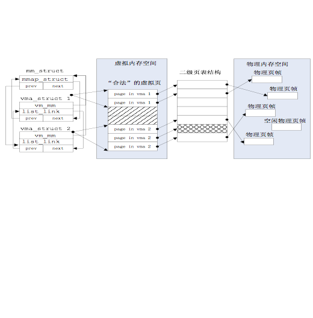

### 3.3 关键数据结构和相关函数分析

对于第一个问题的出现，在于实验二中有关内存的数据结构和相关操作都是直接针对实际存在的资源--物理内存空间的管理，没有从一般应用程序对内存的“需求”考虑，即需要有相关的数据结构和操作来体现一般应用程序对虚拟内存的“需求”。一般应用程序的对虚拟内存的“需求”与物理内存空间的“供给”没有直接的对应关系，ucore是通过page
fault异常处理来间接完成这二者之间的衔接。

page\_fault函数不知道哪些是“合法”的虚拟页，原因是ucore还缺少一定的数据结构来描述这种不在物理内存中的“合法”虚拟页。为此ucore通过建立mm\_struct和vma\_struct数据结构，描述了ucore模拟应用程序运行所需的合法内存空间。当访问内存产生page
fault异常时，可获得访问的内存的方式（读或写）以及具体的虚拟内存地址，这样ucore就可以查询此地址，看是否属于vma\_struct数据结构中描述的合法地址范围中，如果在，则可根据具体情况进行请求调页/页换入换出处理（这就是练习2涉及的部分）；如果不在，则报错。mm\_struct和vma\_struct数据结构结合页表表示虚拟地址空间和物理地址空间的示意图如下所示：

图 虚拟地址空间和物理地址空间的示意图

   

在ucore中描述应用程序对虚拟内存“需求”的数据结构是vma\_struct（定义在vmm.h中），以及针对vma\_struct的函数操作。这里把一个vma\_struct结构的变量简称为vma变量。vma\_struct的定义如下：

```
struct vma_struct {
    // the set of vma using the same PDT
    struct mm_struct *vm_mm;
    uintptr_t vm_start; // start addr of vma
    uintptr_t vm_end; // end addr of vma
    uint32_t vm_flags; // flags of vma
    //linear list link which sorted by start addr of vma
    list_entry_t list_link;
};
```

vm\_start和vm\_end描述了一个连续地址的虚拟内存空间的起始位置和结束位置，这两个值都应该是PGSIZE 对齐的，而且描述的是一个合理的地址空间范围（即严格确保 vm\_start < vm\_end的关系）；list\_link是一个双向链表，按照从小到大的顺序把一系列用vma\_struct表示的虚拟内存空间链接起来，并且还要求这些链起来的vma\_struct应该是不相交的，即vma之间的地址空间无交集；vm\_flags表示了这个虚拟内存空间的属性，目前的属性包括：

```
#define VM_READ 0x00000001 //只读
#define VM_WRITE 0x00000002 //可读写
#define VM_EXEC 0x00000004 //可执行
```   

vm\_mm是一个指针，指向一个比vma\_struct更高的抽象层次的数据结构mm\_struct，这里把一个mm\_struct结构的变量简称为mm变量。这个数据结构表示了包含所有虚拟内存空间的共同属性，具体定义如下  

```  
struct mm_struct {
    // linear list link which sorted by start addr of vma
    list_entry_t mmap_list;
    // current accessed vma, used for speed purpose
    struct vma_struct *mmap_cache;
    pde_t *pgdir; // the PDT of these vma
    int map_count; // the count of these vma
    void *sm_priv; // the private data for swap manager
};
``` 

mmap\_list是双向链表头，链接了所有属于同一页目录表的虚拟内存空间，mmap\_cache是指向当前正在使用的虚拟内存空间，由于操作系统执行的“局部性”原理，当前正在用到的虚拟内存空间在接下来的操作中可能还会用到，这时就不需要查链表，而是直接使用此指针就可找到下一次要用到的虚拟内存空间。由于mmap_cache 的引入，可使得 mm\_struct 数据结构的查询加速 30% 以上。pgdir
所指向的就是 mm\_struct数据结构所维护的页表。通过访问pgdir可以查找某虚拟地址对应的页表项是否存在以及页表项的属性等。map\_count记录mmap\_list 里面链接的 vma\_struct的个数。sm_priv指向用来链接记录页访问情况的链表头，这建立了mm\_struct和后续要讲到的swap\_manager之间的联系。

涉及vma_struct的操作函数也比较简单，主要包括三个：

* vma_create--创建vma
* insert_vma_struct--插入一个vma
* find_vma--查询vma。

vma\_create函数根据输入参数vm\_start、vm\_end、vm\_flags来创建并初始化描述一个虚拟内存空间的vma\_struct结构变量。insert\_vma\_struct函数完成把一个vma变量按照其空间位置[vma-\>vm\_start,vma-\>vm\_end]从小到大的顺序插入到所属的mm变量中的mmap\_list双向链表中。find\_vma根据输入参数addr和mm变量，查找在mm变量中的mmap\_list双向链表中某个vma包含此addr，即vma-\>vm\_start<=addr <vma-\>end。这三个函数与后续讲到的page fault异常处理有紧密联系。

涉及mm\_struct的操作函数比较简单，只有mm\_create和mm\_destroy两个函数，从字面意思就可以看出是是完成mm\_struct结构的变量创建和删除。在mm\_create中用kmalloc分配了一块空间，所以在mm\_destroy中也要对应进行释放。在ucore运行过程中，会产生描述虚拟内存空间的vma\_struct结构，所以在mm\_destroy中也要进对这些mmap\_list中的vma进行释放。
