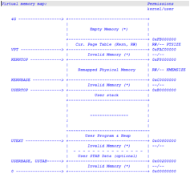

### 3.2 创建用户进程 

在实验四中，我们已经完成了对内核线程的创建，但与用户进程的创建过程相比，创建内核线程的过程还远远不够。而这两个创建过程的差异本质上就是用户进程和内核线程的差异决定的。

#### 1. 应用程序的组成和编译 

我们首先来看一个应用程序，这里我们假定是hello应用程序，在user/hello.c中实现，代码如下：

```
#include <stdio.h>
#include <ulib.h>

int main(void) {
    cprintf("Hello world!!.\n");
    cprintf("I am process %d.\n", getpid());
    cprintf("hello pass.\n");
    return 0;
}
```

hello应用程序只是输出一些字符串，并通过系统调用sys\_getpid（在getpid函数中调用）输出代表hello应用程序执行的用户进程的进程标识--pid。

首先，我们需要了解ucore操作系统如何能够找到hello应用程序。这需要分析ucore和hello是如何编译的。修改Makefile，把第六行注释掉。然后在本实验源码目录下执行make，可得到如下输出：

```
……
+ cc user/hello.c

gcc -Iuser/ -fno-builtin -Wall -ggdb -m32 -gstabs -nostdinc  -fno-stack-protector -Ilibs/ -Iuser/include/ -Iuser/libs/ -c user/hello.c -o obj/user/hello.o

ld -m    elf_i386 -nostdlib -T tools/user.ld -o obj/__user_hello.out  obj/user/libs/initcode.o obj/user/libs/panic.o obj/user/libs/stdio.o obj/user/libs/syscall.o obj/user/libs/ulib.o obj/user/libs/umain.o  obj/libs/hash.o obj/libs/printfmt.o obj/libs/rand.o obj/libs/string.o obj/user/hello.o
……
ld -m    elf_i386 -nostdlib -T tools/kernel.ld -o bin/kernel  obj/kern/init/entry.o obj/kern/init/init.o …… -b binary …… obj/__user_hello.out
……
```

从中可以看出，hello应用程序不仅仅是hello.c，还包含了支持hello应用程序的用户态库：

* user/libs/initcode.S：所有应用程序的起始用户态执行地址“\_start”，调整了EBP和ESP后，调用umain函数。
* user/libs/umain.c：实现了umain函数，这是所有应用程序执行的第一个C函数，它将调用应用程序的main函数，并在main函数结束后调用exit函数，而exit函数最终将调用sys\_exit系统调用，让操作系统回收进程资源。
* user/libs/ulib.[ch]：实现了最小的C函数库，除了一些与系统调用无关的函数，其他函数是对访问系统调用的包装。
* user/libs/syscall.[ch]：用户层发出系统调用的具体实现。
* user/libs/stdio.c：实现cprintf函数，通过系统调用sys\_putc来完成字符输出。
* user/libs/panic.c：实现\_\_panic/\_\_warn函数，通过系统调用sys\_exit完成用户进程退出。

除了这些用户态库函数实现外，还有一些libs/\*.[ch]是操作系统内核和应用程序共用的函数实现。这些用户库函数其实在本质上与UNIX系统中的标准libc没有区别，只是实现得很简单，但hello应用程序的正确执行离不开这些库函数。

【注意】libs/\*.[ch]、user/libs/\*.[ch]、user/\*.[ch]的源码中没有任何特权指令。

在make的最后一步执行了一个ld命令，把hello应用程序的执行码obj/\_\_user\_hello.out连接在了ucore kernel的末尾。且ld命令会在kernel中会把\_\_user\_hello.out的位置和大小记录在全局变量\_binary\_obj\_\_\_user\_hello\_out\_start和\_binary\_obj\_\_\_user\_hello\_out\_size中，这样这个hello用户程序就能够和ucore内核一起被 bootloader 加载到内存里中，并且通过这两个全局变量定位hello用户程序执行码的起始位置和大小。而到了与文件系统相关的实验后，ucore会提供一个简单的文件系统，那时所有的用户程序就都不再用这种方法进行加载了，而可以用大家熟悉的文件方式进行加载了。

#### 2. 用户进程的虚拟地址空间 

在tools/user.ld描述了用户程序的用户虚拟空间的执行入口虚拟地址：

```
SECTIONS {
    /* Load programs at this address: "." means the current address */
    . = 0x800020;
```

在tools/kernel.ld描述了操作系统的内核虚拟空间的起始入口虚拟地址：

```
SECTIONS {
    /* Load the kernel at this address: "." means the current address */
    . = 0xC0100000;
```

这样ucore把用户进程的虚拟地址空间分了两块，一块与内核线程一样，是所有用户进程都共享的内核虚拟地址空间，映射到同样的物理内存空间中，这样在物理内存中只需放置一份内核代码，使得用户进程从用户态进入核心态时，内核代码可以统一应对不同的内核程序；另外一块是用户虚拟地址空间，虽然虚拟地址范围一样，但映射到不同且没有交集的物理内存空间中。这样当ucore把用户进程的执行代码（即应用程序的执行代码）和数据（即应用程序的全局变量等）放到用户虚拟地址空间中时，确保了各个进程不会“非法”访问到其他进程的物理内存空间。

这样ucore给一个用户进程具体设定的虚拟内存空间（kern/mm/memlayout.h）如下所示：



#### 3. 创建并执行用户进程 

在确定了用户进程的执行代码和数据，以及用户进程的虚拟空间布局后，我们可以来创建用户进程了。在本实验中第一个用户进程是由第二个内核线程initproc通过把hello应用程序执行码覆盖到initproc的用户虚拟内存空间来创建的，相关代码如下所示：

```
    // kernel_execve - do SYS_exec syscall to exec a user program called by user_main kernel_thread
    static int
    kernel_execve(const char *name, unsigned char *binary, size_t size) {
    int ret, len = strlen(name);
    asm volatile (
        "int %1;"
        : "=a" (ret)
        : "i" (T_SYSCALL), "0" (SYS_exec), "d" (name), "c" (len), "b" (binary), "D" (size)
        : "memory");
    return ret;
   }

    #define __KERNEL_EXECVE(name, binary, size) ({                          \
            cprintf("kernel_execve: pid = %d, name = \"%s\".\n",        \
                    current->pid, name);                                \
            kernel_execve(name, binary, (size_t)(size));                \
        })

    #define KERNEL_EXECVE(x) ({                                             \
            extern unsigned char _binary_obj___user_##x##_out_start[],  \
                _binary_obj___user_##x##_out_size[];                    \
            __KERNEL_EXECVE(#x, _binary_obj___user_##x##_out_start,     \
                            _binary_obj___user_##x##_out_size);         \
        })
……
// init_main - the second kernel thread used to create kswapd_main & user_main kernel threads
static int
init_main(void *arg) {
    #ifdef TEST
    KERNEL_EXECVE2(TEST, TESTSTART, TESTSIZE);
    #else
    KERNEL_EXECVE(hello);
    #endif
    panic("kernel_execve failed.\n");
    return 0;
}
```

对于上述代码，我们需要从后向前按照函数/宏的实现一个一个来分析。Initproc的执行主体是init\_main函数，这个函数在缺省情况下是执行宏KERNEL\_EXECVE(hello)，而这个宏最终是调用kernel\_execve函数来调用SYS\_exec系统调用，由于ld在链接hello应用程序执行码时定义了两全局变量：

* \_binary\_obj\_\_\_user\_hello\_out\_start：hello执行码的起始位置
* \_binary\_obj\_\_\_user\_hello\_out\_size中：hello执行码的大小

kernel\_execve把这两个变量作为SYS\_exec系统调用的参数，让ucore来创建此用户进程。当ucore收到此系统调用后，将依次调用如下函数

```
vector128(vectors.S)--\>
\_\_alltraps(trapentry.S)--\>trap(trap.c)--\>trap\_dispatch(trap.c)--
--\>syscall(syscall.c)--\>sys\_exec（syscall.c）--\>do\_execve(proc.c)
```

最终通过do\_execve函数来完成用户进程的创建工作。此函数的主要工作流程如下：

* 首先为加载新的执行码做好用户态内存空间清空准备。如果mm不为NULL，则设置页表为内核空间页表，且进一步判断mm的引用计数减1后是否为0，如果为0，则表明没有进程再需要此进程所占用的内存空间，为此将根据mm中的记录，释放进程所占用户空间内存和进程页表本身所占空间。最后把当前进程的mm内存管理指针为空。由于此处的initproc是内核线程，所以mm为NULL，整个处理都不会做。

* 接下来的一步是加载应用程序执行码到当前进程的新创建的用户态虚拟空间中。这里涉及到读ELF格式的文件，申请内存空间，建立用户态虚存空间，加载应用程序执行码等。load\_icode函数完成了整个复杂的工作。

load\_icode函数的主要工作就是给用户进程建立一个能够让用户进程正常运行的用户环境。此函数有一百多行，完成了如下重要工作：

1. 调用mm\_create函数来申请进程的内存管理数据结构mm所需内存空间，并对mm进行初始化；

2. 调用setup\_pgdir来申请一个页目录表所需的一个页大小的内存空间，并把描述ucore内核虚空间映射的内核页表（boot\_pgdir所指）的内容拷贝到此新目录表中，最后让mm-\>pgdir指向此页目录表，这就是进程新的页目录表了，且能够正确映射内核虚空间；

3. 根据应用程序执行码的起始位置来解析此ELF格式的执行程序，并调用mm\_map函数根据ELF格式的执行程序说明的各个段（代码段、数据段、BSS段等）的起始位置和大小建立对应的vma结构，并把vma插入到mm结构中，从而表明了用户进程的合法用户态虚拟地址空间；

4. 调用根据执行程序各个段的大小分配物理内存空间，并根据执行程序各个段的起始位置确定虚拟地址，并在页表中建立好物理地址和虚拟地址的映射关系，然后把执行程序各个段的内容拷贝到相应的内核虚拟地址中，至此应用程序执行码和数据已经根据编译时设定地址放置到虚拟内存中了；

5. 需要给用户进程设置用户栈，为此调用mm\_mmap函数建立用户栈的vma结构，明确用户栈的位置在用户虚空间的顶端，大小为256个页，即1MB，并分配一定数量的物理内存且建立好栈的虚地址<--\>物理地址映射关系；

6. 至此,进程内的内存管理vma和mm数据结构已经建立完成，于是把mm-\>pgdir赋值到cr3寄存器中，即更新了用户进程的虚拟内存空间，此时的initproc已经被hello的代码和数据覆盖，成为了第一个用户进程，但此时这个用户进程的执行现场还没建立好；

7. 先清空进程的中断帧，再重新设置进程的中断帧，使得在执行中断返回指令“iret”后，能够让CPU转到用户态特权级，并回到用户态内存空间，使用用户态的代码段、数据段和堆栈，且能够跳转到用户进程的第一条指令执行，并确保在用户态能够响应中断；

至此，用户进程的用户环境已经搭建完毕。此时initproc将按产生系统调用的函数调用路径原路返回，执行中断返回指令“iret”（位于trapentry.S的最后一句）后，将切换到用户进程hello的第一条语句位置\_start处（位于user/libs/initcode.S的第三句）开始执行。
