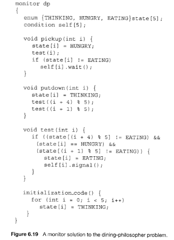

### 3.4 管程和条件变量 

引入了管程是为了将对共享资源的所有访问及其所需要的同步操作集中并封装起来。Hansan为管程所下的定义：“一个管程定义了一个数据结构和能为并发进程所执行（在该数据结构上）的一组操作，这组操作能同步进程和改变管程中的数据”。有上述定义可知，管程由四部分组成：

* 管程内部的共享变量；
* 管程内部的条件变量；
* 管程内部并发执行的进程；
* 对局部于管程内部的共享数据设置初始值的语句。

局限在管程中的数据结构，只能被局限在管程的操作过程所访问，任何管程之外的操作过程都不能访问它；另一方面，局限在管程中的操作过程也主要访问管程内的数据结构。由此可见，管程相当于一个隔离区，它把共享变量和对它进行操作的若干个过程围了起来，所有进程要访问临界资源时，都必须经过管程才能进入，而管程每次只允许一个进程进入管程，从而需要确保进程之间互斥。

但在管程中仅仅有互斥操作是不够用的。进程可能需要等待某个条件C为真才能继续执行。如果采用[忙等](http://zh.wikipedia.org/w/index.php?title=%E5%BF%99%E7%AD%89%E5%BE%85&action=edit&redlink=1 "忙等待（页面不存在）")(busy
waiting)方式：

```
while not( C ) do {}
```

在单处理器情况下，将会导致所有其它进程都无法进入[临界区](http://zh.wikipedia.org/wiki/%E4%B8%B4%E7%95%8C%E5%8C%BA "临界区")使得该条件C为真，该管程的执行将会发生[死锁](http://zh.wikipedia.org/wiki/%E6%AD%BB%E9%94%81 "死锁")。为此，可引入条件变量（Condition
Variables，简称CV）。一个条件变量CV可理解为一个进程的等待队列，队列中的进程正等待某个条件C变为真。每个条件变量关联着一个[断言](http://zh.wikipedia.org/wiki/%E6%96%B7%E8%A8%80_(%E7%A8%8B%E5%BC%8F) "断言 (程序)")Pc。当一个进程等待一个条件变量，该进程不算作占用了该管程，因而其它进程可以进入该管程执行，改变管程的状态，通知条件变量CV其关联的断言Pc在当前状态下为真。因此对条件变量CV有两种主要操作：

* wait\_cv： 被一个进程调用，以等待断言Pc被满足后该进程可恢复执行.
进程挂在该条件变量上等待时，不被认为是占用了管程。
* signal\_cv：被一个进程调用，以指出断言Pc现在为真，从而可以唤醒等待断言Pc被满足的进程继续执行。

有了互斥和信号量支持的管程就可用用了解决各种同步互斥问题。比如参考《OS
Concept》一书中的6.7.2小节“用管程解决哲学家就餐问题”就给出了这样的事例：

 

虽然大部分教科书上说明管程适合在语言级实现比如java等高级语言，没有提及在采用C语言的OS中如何实现。下面我们将要尝试在ucore中用C语言实现采用基于互斥和条件变量机制的管程基本原理。

ucore中的管程机制是基于信号量和条件变量来实现的。ucore中的管程的数据结构monitor\_t定义如下：

```
typedef struct monitor{
    semaphore_t mutex;      // the mutex lock for going into the routines in monitor, should be initialized to 1
    semaphore_t next;       // the next semaphore is used to down the signaling proc itself, and the other OR wakeuped
    //waiting proc should wake up the sleeped signaling proc.
    int next_count;         // the number of of sleeped signaling proc
    condvar_t *cv;          // the condvars in monitor
} monitor_t;
```

管程中的成员变量mutex是一个二值信号量，是实现每次只允许一个进程进入管程的关键元素，确保了[互斥](http://zh.wikipedia.org/wiki/%E4%BA%92%E6%96%A5 "互斥")访问性质。管程中的条件变量cv通过执行wait\_cv，会使得等待某个条件C为真的进程能够离开管程并睡眠，且让其他进程进入管程继续执行；而进入管程的某进程设置条件C为真并执行signal\_cv时，能够让等待某个条件C为真的睡眠进程被唤醒，从而继续进入管程中执行。管程中的成员变量信号量next和整形变量next\_count是配合进程对条件变量cv的操作而设置的，这是由于发出signal\_cv的进程A会唤醒睡眠进程B，进程B执行会导致进程A睡眠，直到进程B离开管程，进程A才能继续执行，这个同步过程是通过信号量next完成的；而next\_count表示了由于发出singal\_cv而睡眠的进程个数。

管程中的条件变量的数据结构condvar\_t定义如下：

```
typedef struct condvar{
    semaphore_t sem; // the sem semaphore is used to down the waiting proc, and the signaling proc should up the waiting proc
    int count;       // the number of waiters on condvar
    monitor_t * owner; // the owner(monitor) of this condvar
} condvar_t;
```

条件变量的定义中也包含了一系列的成员变量，信号量sem用于让发出wait\_cv操作的等待某个条件C为真的进程睡眠，而让发出signal\_cv操作的进程通过这个sem来唤醒睡眠的进程。count表示等在这个条件变量上的睡眠进程的个数。owner表示此条件变量的宿主是哪个管程。

理解了数据结构的含义后，我们就可以开始管程的实现了。ucore设计实现了条件变量wait\_cv操作和signal\_cv操作对应的具体函数，即cond\_wait函数和cond\_signal函数，此外还有cond\_init初始化函数（可直接看源码）。函数cond\_wait(condvar\_t
\*cvp, semaphore\_t \*mp)和cond\_signal (condvar\_t
\*cvp)的实现原理可参考《OS
Concept》一书中的6.7.3小节“用信号量实现管程”的内容：

** cond_wait的原理描述 **

```
cv.count++;
if(monitor.next_count > 0)
   sem_signal(monitor.next);
else
   sem_signal(monitor.mutex);
sem_wait(cv.sem);
cv.count -- ;
```


** cond_signal的原理描述 **

```
if( cv.count > 0) {
   monitor.next_count ++;
   sem_signal(cv.sem);
   sem_wait(monitor.next);
   monitor.next_count -- ;
}
```

简单分析一下cond\_wait函数的实现。可以看出如果进程A执行了cond\_wait函数，表示此进程等待某个条件C不为真，需要睡眠。因此表示等待此条件的睡眠进程个数cv.count要加一。接下来会出现两种情况。

情况一：如果monitor.next\_count如果大于0，表示有大于等于1个进程执行cond\_signal函数且睡着了，就睡在了monitor.next信号量上。假定这些进程形成S进程链表。因此需要唤醒S进程链表中的一个进程B。然后进程A睡在cv.sem上，如果睡醒了，则让cv.count减一，表示等待此条件的睡眠进程个数少了一个，可继续执行了！这里隐含这一个现象，即某进程A在时间顺序上先执行了signal\_cv，而另一个进程B后执行了wait\_cv，这会导致进程A没有起到唤醒进程B的作用。这里还隐藏这一个问题，在cond\_wait有sem\_signal(mutex)，但没有看到哪里有sem\_wait(mutex)，这好像没有成对出现，是否是错误的？其实在管程中的每一个函数的入口处会有wait(mutex)，这样二者就配好对了。

情况二：如果monitor.next\_count如果小于等于0，表示目前没有进程执行cond\_signal函数且睡着了，那需要唤醒的是由于互斥条件限制而无法进入管程的进程，所以要唤醒睡在monitor.mutex上的进程。然后进程A睡在cv.sem上，如果睡醒了，则让cv.count减一，表示等待此条件的睡眠进程个数少了一个，可继续执行了！

对照着再来看cond\_signal的实现。首先进程B判断cv.count，如果不大于0，则表示当前没有执行cond\_wait而睡眠的进程，因此就没有被唤醒的对象了，直接函数返回即可；如果大于0，这表示当前有执行cond\_wait而睡眠的进程A，因此需要唤醒等待在cv.sem上睡眠的进程A。由于只允许一个进程在管程中执行，所以一旦进程B唤醒了别人（进程A），那么自己就需要睡眠。故让monitor.next\_count加一，且让自己（进程B）睡在信号量monitor.next上。如果睡醒了，这让monitor.next\_count减一。

为了让整个管程正常运行，还需在管程中的每个函数的入口和出口增加相关操作，即：

```
function （…）
{
sem.wait(monitor.mutex);
  the real body of function;
  if(monitor.next_count > 0)
     sem_signal(monitor.next);
  else
     sem_signal(monitor.mutex);
} 
```

这样带来的作用有两个，（1）只有一个进程在执行管程中的函数。（2）避免由于执行了cond\_signal函数而睡眠的进程无法被唤醒。对于第二点，如果进程A由于执行了cond\_signal函数而睡眠（这会让monitor.next\_count大于0，且执行sem\_wait(monitor.next)），则其他进程在执行管程中的函数的出口，会判断monitor.next\_count是否大于0，如果大于0，则执行sem\_signal(monitor.next)，从而执行了cond\_signal函数而睡眠的进程被唤醒。上诉措施将使得管程正常执行。

需要注意的是，上述只是原理描述，与具体描述相比，还有一定的差距。需要大家在完成练习时仔细设计和实现。
