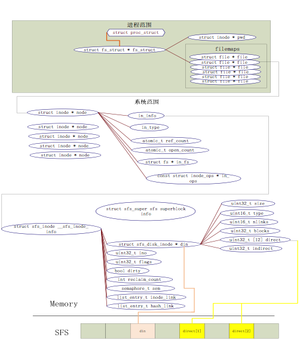

### 3.1 ucore 文件系统总体介绍 

操作系统中负责管理和存储可长期保存数据的软件功能模块称为文件系统。在本次试验中，主要侧重文件系统的设计实现和对文件系统执行流程的分析与理解。

ucore的文件系统模型源于Havard的OS161的文件系统和Linux文件系统。但其实这二者都是源于传统的UNIX文件系统设计。UNIX提出了四个文件系统抽象概念：文件(file)、目录项(dentry)、索引节点(inode)和安装点(mount point)。

* 文件：UNIX文件中的内容可理解为是一有序字节buffer，文件都有一个方便应用程序识别的文件名称（也称文件路径名）。典型的文件操作有读、写、创建和删除等。
* 目录项：目录项不是目录，而是目录的组成部分。在UNIX中目录被看作一种特定的文件，而目录项是文件路径中的一部分。如一个文件路径名是“/test/testfile”，则包含的目录项为：根目录“/”，目录“test”和文件“testfile”，这三个都是目录项。一般而言，目录项包含目录项的名字（文件名或目录名）和目录项的索引节点（见下面的描述）位置。
* 索引节点：UNIX将文件的相关元数据信息（如访问控制权限、大小、拥有者、创建时间、数据内容等等信息）存储在一个单独的数据结构中，该结构被称为索引节点。
* 安装点：在UNIX中，文件系统被安装在一个特定的文件路径位置，这个位置就是安装点。所有的已安装文件系统都作为根文件系统树中的叶子出现在系统中。

上述抽象概念形成了UNIX文件系统的逻辑数据结构，并需要通过一个具体文件系统的架构设计与实现把上述信息映射并储存到磁盘介质上。一个具体的文件系统需要在磁盘布局也实现上述抽象概念。比如文件元数据信息存储在磁盘块中的索引节点上。当文件被载如内存时，内核需要使用磁盘块中的索引点来构造内存中的索引节点。

ucore模仿了UNIX的文件系统设计，ucore的文件系统架构主要由四部分组成：

* 通用文件系统访问接口层：该层提供了一个从用户空间到文件系统的标准访问接口。这一层访问接口让应用程序能够通过一个简单的接口获得ucore内核的文件系统服务。

* 文件系统抽象层：向上提供一个一致的接口给内核其他部分（文件系统相关的系统调用实现模块和其他内核功能模块）访问。向下提供一个同样的抽象函数指针列表和数据结构屏蔽不同文件系统的实现细节。

* Simple FS文件系统层：一个基于索引方式的简单文件系统实例。向上通过各种具体函数实现以对应文件系统抽象层提出的抽象函数。向下访问外设接口

* 外设接口层：向上提供device访问接口屏蔽不同硬件细节。向下实现访问各种具体设备驱动的接口，比如disk设备接口/串口设备接口/键盘设备接口等。

对照上面的层次我们再大致介绍一下文件系统的访问处理过程，加深对文件系统的总体理解。假如应用程序操作文件（打开/创建/删除/读写），首先需要通过文件系统的通用文件系统访问接口层给用户空间提供的访问接口进入文件系统内部，接着由文件系统抽象层把访问请求转发给某一具体文件系统（比如SFS文件系统），具体文件系统（Simple FS文件系统层）把应用程序的访问请求转化为对磁盘上的block的处理请求，并通过外设接口层交给磁盘驱动例程来完成具体的磁盘操作。结合用户态写文件函数write的整个执行过程，我们可以比较清楚地看出ucore文件系统架构的层次和依赖关系。

    

**ucore文件系统总体结构**

从ucore操作系统不同的角度来看，ucore中的文件系统架构包含四类主要的数据结构,
它们分别是：

* 超级块（SuperBlock），它主要从文件系统的全局角度描述特定文件系统的全局信息。它的作用范围是整个OS空间。
* 索引节点（inode）：它主要从文件系统的单个文件的角度它描述了文件的各种属性和数据所在位置。它的作用范围是整个OS空间。
* 目录项（dentry）：它主要从文件系统的文件路径的角度描述了文件路径中的特定目录。它的作用范围是整个OS空间。
* 文件（file），它主要从进程的角度描述了一个进程在访问文件时需要了解的文件标识，文件读写的位置，文件引用情况等信息。它的作用范围是某一具体进程。

如果一个用户进程打开了一个文件，那么在ucore中涉及的相关数据结构（其中相关数据结构将在下面各个小节中展开叙述）和关系如下图所示：

    

**ucore中文件相关关键数据结构及其关系**
