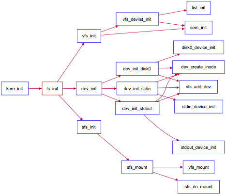

### 3.6 实验执行流程概述 

与实验七相比，实验八增加了文件系统，并因此实现了通过文件系统来加载可执行文件到内存中运行的功能，导致对进程管理相关的实现比较大的调整。我们来简单看看文件系统是如何初始化并能在ucore的管理下正常工作的。

首先看看kern\_init函数，可以发现与lab7相比增加了对fs\_init函数的调用。fs\_init函数就是文件系统初始化的总控函数，它进一步调用了虚拟文件系统初始化函数vfs\_init，与文件相关的设备初始化函数dev\_init和Simple FS文件系统的初始化函数sfs\_init。这三个初始化函数联合在一起，协同完成了整个虚拟文件系统、SFS文件系统和文件系统对应的设备（键盘、串口、磁盘）的初始化工作。其函数调用关系图如下所示：

文件系统初始化调用关系图

参考上图，并结合源码分析，可大致了解到文件系统的整个初始化流程。vfs\_init主要建立了一个device
list双向链表vdev\_list，为后续具体设备（键盘、串口、磁盘）以文件的形式呈现建立查找访问通道。dev\_init函数通过进一步调用disk0/stdin/stdout\_device\_init完成对具体设备的初始化，把它们抽象成一个设备文件，并建立对应的inode数据结构，最后把它们链入到vdev\_list中。这样通过虚拟文件系统就可以方便地以文件的形式访问这些设备了。sfs\_init是完成对Simple FS的初始化工作，并把此实例文件系统挂在虚拟文件系统中，从而让ucore的其他部分能够通过访问虚拟文件系统的接口来进一步访问到SFS实例文件系统。
