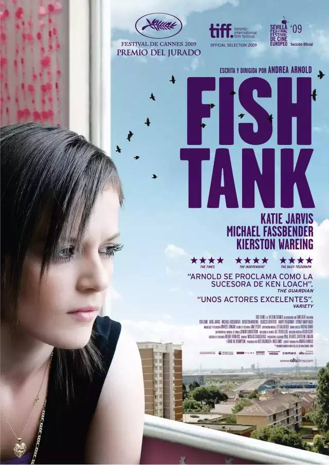

## 我特别推荐的电影

#### 1、未来机器城

资源链接：https://pan.baidu.com/s/1kyEr_Z8kZH81UhP-F3MoTA

这部动漫是暴走漫画出品的第一部电影，我不算是暴漫的老粉，但也算是忠实粉丝吧，每一期的暴走大事件都有可能是最后一期，所以且看且珍惜。我不说以前怎么样，至少近一年以来，每一期的大事件我都看了，暴走团队是真正代表人民站出来说话的一方，用诙谐幽默的语言诉说了很多人想说而不敢说的一些事情，包括社会上的一些不公等等。

再稍微介绍一下这部电影，这是我比较推荐的一部，这是一部充满未来科技的动画片，除了新奇的机器人之外，还有王尼玛访谈出现在电影中，仿佛打破了二次元与三次元的壁垒。我觉得这部充满科技感的动漫真正想表达的还是对未来人工智能时代的设想和忧虑吧。

电影的主人公是一名叛逆女孩小麦，虽然生活在机器人辅助的科技时代，却因为父亲的离开对机器人充满厌恶，留着和性格相匹配的短发热爱足球。

在阴差阳错下，激活了博士的新型机器人7723，一个讨厌机器人的小女孩却不得不和7723一起相处，在相处中原本孤独的小麦重新获得了快乐，也收获了友谊和家人的关心，同时和7723并肩作战，实现了拯救世界的任务。

机器人7723更像是钢铁侠和大白的结合体，一方面对激活的小麦关心照顾，另一方面在面对困难敌人时，又能化身战斗机器大败四方。

可是机器人的设定有些奇怪，博士制造了他的功能及结构，可是7723为何就认准了小麦是他的朋友，在帮小麦搞破坏时没有什么反应，可是最后居然自己删除了武器核心功能，难道机器人对世界的认知已经超过了人类？

反观小麦似乎比机器人还不懂事，因为父亲的离开不喜欢机器人还能理解，可是公然破坏社会秩序和他人机器人的逻辑就无法理解了。就如同我不喜欢养花，我可以把自己家的花都扔出去，可是我如果把邻居家的花也砸了就不符合常规了。

还有一点，有7723之前小麦被同学的机器人欺负，她应该更能体会到被欺负的痛苦，可是当拥有了强大的7723后，小麦居然开始报复曾经的同学，让7723都看不下去停手了，小麦反倒怪罪7723不是真正的朋友。

这种价值观好可怕，好朋友不应该是互帮互助，而不是依靠强大去欺负他人。这种思想如果真的被小朋友学去，后果真的不堪设想。

如果你有了一个强大的机器人，你会让它干什么呢？ 

#### 2、Fish Tank

资源链接：https://pan.baidu.com/s/1KVS1PVujrZCUhakEZEOvnA 提取码: f48d 

电影名字叫做 Fish Tank ，大家查一下字典就能知道中文意思是鱼缸，鱼缸是什么？鱼缸就是养鱼用的嘛～这里比喻的是被养在玻璃缸的那些不自由之身，它们本属于大海，但为了满足人类的观赏需求，被囚禁在那小小的一方池水中。

电影开始就是一段喘息，女主人公米娅刚刚练完舞。破旧的房间，老旧的录音机，还有那身不怎么合身的衣服，这是米娅留给观众最初的印象。可下一秒，她就和几个女生当街撕逼了。米娅一个人对一群人，还打坏了一个女孩的鼻子，气哄哄地走了。米娅暴躁的脾气离不开她的家庭背景。她没有父亲，只有一个整天鬼混的亲妈，和一个出口成脏的妹妹。米娅每次回到家里，都会重重关上房门，那一声摔门的声响是个信号，代表着“我回来了”和“请勿打扰”。只有在那个挂满了稀奇古怪玩意儿的小小空间里，她才会有丝丝的归属感。然而，不是所有人都理解她这样的怪脾气，亲妈不待见她，妹妹不喜欢她，就连街上的小混混都时不时找她的麻烦。她被排挤，被欺负，但她依然会找个没人的地方，随着音乐扭动起身体。她喜欢跳舞，或者说是因为没有其他爱好可以供她选择。

在一个不完整的家庭里长大，米娅早早习惯了大人不负责任的生活，她的母亲抽烟、酗酒、吸毒、乱性。而她耳濡目染，每天化着浓厚的妆，学大人穿着不合时宜的衣服。唯一不同的是，她的孤僻，并没有让她有可以“乱来”的机会。直到，这个家里出现了一个大叔（法鲨）。他是母亲的新男友，第一次看到他，是女主早起之后在厨房里找吃的。大叔半裸出现，开着玩笑，从米娅身边侧身擦过。在这个混乱的小屋里，大叔是一点都不见外，不仅和米娅母亲难舍难分，对米娅的妹妹也很大方，尽管米娅对他充满了戒备，他依然是微笑着示好。米娅喜欢跳舞，她的母亲却总是打击她跳的是垃圾，只有大叔在当面夸她跳的好。那是米娅第一次得到鼓励，在她的成长经历里，这个第一次对她来说意义深重。大叔的到来让这个房子不再是剑拔弩张，他会教育米娅不能说粗口，也会教育她要学会包容。母亲沉溺在恋情中，不再针对她们姐妹。米娅虽然表面上还是刺头一个，但内心早已起了变化。大叔对米娅十分关心，米娅的脚踝在钓鱼时不小心被割伤，妹妹喊着艾滋，大叔先是阻止妹妹乱喊，然后把绷带缠在米娅的脚踝上，默默背起了她。休息时，大叔趁着女友离开，悄悄打开了音乐，在他的引导下，米娅第一次在公众场合下跳起了她秘密练习了很久的舞。虽然母亲还是一如既往的打击，但大叔却连连称赞，而且还建议米娅应该把自己的舞姿寄出去，让更多的人看到。从米娅记事以来，她没有感受到温暖，她跟妹妹说的最多的话就是，如果你有一天在这个房子里待不下去了，找儿童保护协会。但现在，一个浑身上下都散发着荷尔蒙的大叔，让她有了早点回家的理由。大叔给了米娅一个DV，还推荐了他最喜欢的歌曲《California dreaming》，他们之间暧昧，让米娅有点心乱。米娅15岁，没有谈过恋爱，没有享受过父爱，突然一个这样“优秀”的大叔出现在她身边，她有点意乱情迷。她说服自己这只是胡思乱想，但背地里，她却为了那句口头上的承诺，拼了命地练习舞蹈。然而，这场暗恋的故事还没有开头，就被灌上了一个恶俗但现实的结尾。米娅在大叔的挑逗下，两个人趁着母亲醉酒熟睡时，做出了越轨的行为。第二天，意识到自己犯了大错的大叔马上和米娅妈妈分了手。

谁能想到，这位不断给米娅鼓励和安慰的大叔，是个有妇之夫。米娅跟踪过去才发现，原来他一边扮演着好丈夫好爸爸，一边和自己母亲以情侣关系自称，同时还口口声声说真正喜欢的是自己。所有梦幻的希望全部破灭了，她冲上去想要一个说法，但看到他们一家三口其乐融融的画面时，她又忍住了。那一刻，她是那么的多余，少女情怀里的那些美好被人撕得粉碎，她的心也碎了。冲动之下，她诱拐了大叔的女儿，虽然最后还是将女儿送了回去，但换来的是大叔愤怒的一巴掌。是那一巴掌，也结束了她仅存的希望。梦醒了，她还是那个不受人待见的奇怪女孩，青春里充满很多美好，但也隐藏了很多残酷。米娅没有选择家庭的权力，她一出生就要面对一个不负责任的妈，要面对一个没有爸爸的家，还要面对周围人对自己的排挤和打压。她变成了一个问题少女，可是所有人都觉得是她自己的问题，所有的后果是她咎由自取。突然，一个温柔如水的男人出现了，他给了米娅关怀，这段时间，米娅感受到了这15年来不曾有过的美好。只是稍纵即逝，她的生活又一次回到了原点。

女主人公米娅就像那条鱼，她用尽全力也游不到大海。而生活就是透明水缸，你以为可以很轻松逃离，却怎么都冲不破那道看不见的屏障。

#### 3、An Education

资源链接：https://pan.baidu.com/s/19SFc4noOh70rOzIO30r1XQ 提取码: 75r7 

片子讲一个有潜力上牛津的伦敦底层少女放弃学习决定嫁给一个狂追她的有钱中年大叔但发现大叔已婚而重获新生考入牛津的故事。故事的核心大概本来是想说：教育的意义在于明确自己的发展目标并为之奋斗，但是最后却给了我们一个爱情观的探讨：生活没有捷径，女孩只能靠自己奋斗。其实跟上一部影片形成了鲜明的对比，一个结局是悲惨的，一个结局是美好的。

教育的意义是什么？这是生而为人必须要明确的问题。或者其实，从受众的角度来说，应该是“学习的意义到底是什么”。如果让我来回答，我觉得学习的意义是找到真正的自己，找到自己生活的意义，找到最适合自己的生存方式。学习可以开阔眼界，学习可以带给你新的人生观，学习可以给你人生新的起点，学习可以给你成就感，学习当然也可以给你一份不错的收入的工作，可是学习的意义远远不只是“带给你什么”这么而简单，而是在学习的过程中，“发觉了什么”。