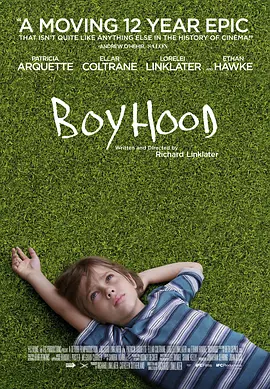

## Angel_Kitty的 plog 第七周

今天是2019年4月14日，距离考研初试时间还剩251天，这是我考研正式开始复习的第七周，复习已经到了中期了，难度也开始变大了，目前陷入了一个非常尴尬的局面，感觉现在做什么事情都觉得很困难，算是一个很困难的瓶颈期了。刚开始肝专业课，很多东西都遗忘的差不多了，因为清华的数据结构对我已经两年年没碰过算法的人来讲有很大的困难和障碍，所以现在正在重新修一下清华的 C++ 程序设计的课程，在这过程中我会将复习的一些课件和做过的实验会上传到 Github 上，部分课程的视频(我自己复习时候觉得比较好的)我也会在后期的整理中上传到相关目录的 README 中，以百度网盘链接的形式分享。

项目地址：https://github.com/AngelKitty/review_the_national_post-graduate_entrance_examination

其他课程也开始进入了一个白热化的阶段，政治目前上过了一遍徐涛基础班(马原和毛中特)，然后英语大概是已经巩固了一遍语法基础，翻译也学完了一些基础性的翻译技巧，但是感觉自己做两个往年的真题翻译会碰到很大的困难，翻译出来的句子真的是只能用 **惨不忍睹** 来形如，感觉单词可能要重新过一遍了，感觉好像没怎么记住，翻译里面的一些简单的单词都翻译不出来，一个大写的 **惨** 字。这一两周的时间准备试试用词根词缀来背一下单词，感觉单词背的不是很牢固啊。数学的话这周基本上都是在整理上周的笔记去了，笔记欠下的债太多啦，可能也是因为上周去开 ACM-ICPC 程序设计总决赛去了，落下的罪过要自己来偿还，不过今年 T 大今年竟然连牌都没摸到，中国队全体阵亡，这个成绩实属很差了，不过据说是把苗子都藏起来了，毛子依然是稳稳地夺冠，太强了。

昨天稍微去操场跑了六七圈，感觉最近又有点不在状态了，结果跑完以后整个人都是飘的，然后头痛欲裂，似乎是有点缺氧了。还是需要加强锻炼了。

本周内容概要：

- 本周的学习情况
- 跑步的碎碎念
- 本周推荐的电影

### 本周的学习情况

这周有很多想做的没有完成，当然上周想做的完成了三项，也算是有所为之。

Completed some tasks：

- 英语语法部分的长难句分析已经过完了一遍基础
- 学完了基础的翻译技巧
- 政治已经过完了马原和毛中特基础
- 学完了 gdb 调试的一些基本的技巧，已经能够较为熟练的使用 gcc ，g++ 去编译和处理程序的运行过程

No Completed Tasks：

- 开始数学的 Round2 的强化阶段的复习，完成数学上的所有题库基础部分有关的习题。
- 辅修完清华大学郑莉的 C++ 程序设计课程，并完成相应的作业和实验。
- 完成基础的阅读技巧的学习
- 每天做一篇翻译
- 开坑计算机网络，尽量看完数据链路层的部分内容

### 跑步的碎碎念

最近感觉学习效率提不上去了，就想想是不是需要换个方式去提高一下效率，想想看就和实验室的大佬晚上去夜跑去了。 2019 年的第一次夜跑，可能是因为大半年都没有如此高强度的体育锻炼，跑了大概六七圈的样子，感觉自己就有点犯头晕了，耳朵嗡鸣作响，整个人就有点飘忽不定的状态，感觉整个人都要凉了的那种状态，这可能是严重缺乏锻炼的表现吧，觉得实在不能继续了，想想还是休息一下走几圈吧。

不过在边跑步的时候也多少去想了些问题。其实考研就像是数百万人在马拉松赛跑一样，很多人会因为各种各样的原因未能参加这次比赛，也会有很大一部分人会在赛跑途中逐渐偏离了跑道，或者是坚持不下去了中途放弃了，只有那么 1/4 左右的人能够最终到达终点，这个过程是漫长又曲折的，你也许在这个奔跑的过程中遇到了很多困难，毕竟会有想法来考研的，谁都不是天才，那种大佬都基本上保研去了，所以和你比赛的这些人水平其实都差不多，千万别有放弃的想法。如果有那种喜欢水群的人，都或多或少容易受到某部分人的干扰，说谁谁谁凭关系，家里有人，或者说和导师打好关系啥的，其实吧，我觉得那些问题都不是很大，因为社会就是这样啊，无论是考公还是考研，还是你未来从事工作，这种黑幕都是避免不了的吧，但是你要知道，社会的发展如果都是这样一批人，那么社会必将无法向前推进。即便这个社会再怎么黑暗，还是需要一批能干会做事的人，那些仅凭关系上然后达到目的的人仅仅是少数，你不要有任何抱怨之心，怨天尤人，你说这些又有什么用呢，有本事你就去搞个运动把它们从现在的位置上拉下来啊，如果你做不到，你就不要去天天抱怨这些没用的东西，好好学技能，做好自己的本分工作，在这个社会上永远饿不死有能力的人。

我很讨厌现在的媒体啊，娱乐圈啊，很多媒体除了会炒作一些子无虚有的东西，总是给大众一个错误的社会舆论引导，没事就喜欢煽风点火，搞得全民上下都是人心惶惶，这有意思嘛。包括现在的中国目前的科研状况，令人堪忧。在全国政协十三届会议上，施一公老先生在短短的五分钟的发言中，说了三次 **很担心** ，让他感到担心的是目前科研的现状，中国表面上科研繁荣昌盛，实际上不管是在基础领域的理论研究，还是在重大技术的突破上，鲜有中国人的身影，论文造假泛滥成灾，这种现象不仅是在各大高校，在各个单位，不论是晋升评职称还是考量绩效，都是把专利、发表文章数量，文章的引用数以及文章所发表杂志的影响因子作为衡量标准，而且这一风气愈演愈烈，如果再这么下去，中国真正想要干实事的人将会荡然无存，中国的科研必将会走向穷头陌路。

其次想谈的一个问题就是最近炒的热火朝天的 996 ，中国在早期革命的过程中，想让中国向苏联学习，成为一个共产主义大国，事实上，在消灭剥削阶级的过程中，消灭了帝国主义和封建主义，唯独没能消灭资产阶级，因为中国的革命任务至始至终都是反帝反封建，而在此过程中，苏联势力土崩瓦解，当年最大的共产主义大国就这么土崩瓦解了，中国在苏联瓦解的过程中吸取教训，要走一条中国特色社会主义道路，要实施中国共产党领导的多党合作与协商制度，以公有制为主体，多种所有制经济共同发展的道路，说白了，多种所有制经济就是私有制没消灭呗，所以这才是 **中国特色社会主义** 嘛，现在全民抗议的 996 ，说白了就是当年没有完全消灭私有制带来的后果，看过资本论的同学都应该知道，资本论讲述的就是资本家是如何一步一步剥削劳动力的。我用最通俗易懂的方式描述一下资本主义剥削的本质：

假如老板花 100 块钱 雇佣了员工 A ，员工 A 作为劳动力要为老板工作，也就是劳动的过程，员工 A 一天创造出的新价值大概是 200 块钱，老板付了员工 A 100 块钱作为工资，第二天又是如此，循环往复，而这个时候剥削已经产生了。

即便是全民抗议 996 ，但如果没有这些资本家去先富带动后富，没有他们去创造就业的岗位，照抄照搬苏联那一套模式，中国也可能会像苏联那样土崩瓦解，现在你们还能过上如此和谐安逸的生活嘛？这个恐怕都很难说。所以我觉得搞 996 那些东西的人可能也是吃饱了撑着，明知道没有用还要去搞，去抗议，中国现在是处在什么时期，要做什么事情，这得要有相当的大局观，要知道，我也在前面多次强调过这个问题，你会愿意去加班，会天天想着去抗议一些没有意义的事情，也是意味着你个人能力的不足，你不懂理财，不懂让钱为你服务，不懂得如何成为一个老板，学校也并没有教会你这些东西，当然学校也不可能教你这些东西。不要轻易的下定断，认为老板就一定比员工清闲，我觉得这也是一种错误的观点，能力远大，职位越高，压力也是越大，老板的生活也绝非像员工所想的那样悠哉，可以坐享其成的那种，如果会这么想的人，我觉得你的格局实在是太小了，你永远做不成大事。在一些财商的书中有提过，一些富商其实已经有了足够多的资产够他一辈子用了，他们还是在不断地努力奋斗着，而并非游手好闲之人。

说到这，我相信很多朋友可能都想怼我了，我愿意接受你们任何理由的反驳。说实话，搞 996 的那批人是嫌加班时间长呢还是嫌工资少呢？我觉得就是吃饱了撑的，你觉得不行你完全就可以不去做啊，你为啥偏要赖着那个位置不放呢？360 行，行行出状元，你不舍得换行，一边拿着老板给你的工资，一边说老板不好，给人一种觉得你就是白眼狼的感觉。有意思嘛？每个公司都有他们辉煌的一面，当然也有他们艰辛的一面，既然你在那个岗位了，你就不要总是去抱怨什么，埋怨什么。习大大都说了，做一行就要爱一行，忠于一行，钻一行，三十年如一日。每个岗位都有他们所应该具有的社会价值，我们不应该去歧视任何一个人。

社会要发展，公司要争上游，加班是避免不了的， 而我希望读者朋友不要把这些当做你逃避的理由，人既然来到这个世上，就是要经历各种各样的磨难和挫折的，世界上哪里有那么多舒服的日子让你过的。你如果总是想着舒舒服服过完这一辈子，我觉得你最好尽早放弃这个想法，人生来就没有这种待遇的，人人生而平等，如果世界上的好事都被你一个人独享了，必将会掀起社会的动荡。人呐，现实一点比较好的吧。

### 本周推荐的电影

本周还是准备推荐一部美剧，名叫 **Boyhood**

虽说题目的标题翻译为少年时光，我却更想把它翻译为成长的烦恼，整部剧情概括来讲，讲述的是一个普通德州男孩6到18岁的人生。本部电影饱含诚意与朴实，不狗血，不戏剧，但也不是流水账，不是客观的纪录片，就是很纯真的那种。

这是一个关于成长的故事，在时间的范畴下，所有人都在成长，只不过有的人的成长被关注看得见，有的人的成长更隐秘。主演小 Mason 的成长显然被放在放大镜下审视，一步一步，遇见自己遇见爱。姐姐 Sam 的成长也着墨颇多，从全 A 女孩到羞涩的听到 condom 会脸红到大方的说被一群小鲜肉围绕很幸福。妈妈的成长则更隐蔽，两次离婚，面对伤害越来越强大，爱孩子但也给孩子空间，经历与孩子的离别，形象丰满而又真实。 Ethan 的爸爸的成长就如他自己所说，变成了 20 岁的时候最鄙视的样子，从乡村歌手过渡到了安稳度日的精算师。甚至还有个打酱油的管道工小哥，也成长的很明显，去上了学，成了餐厅的管理员。而在时间的范畴下，我们又看到所有人都没有改变。小 Mason 从小就有的敏感和忧郁一直没变， Sam 的骄傲一直没变，妈妈的敢爱敢恨一直没变，而爸爸的自由放荡也一直没变。我们在成长，但依旧走不出那个自己，虽然这道理很直白，但这么集中在2小时40分钟里还是很震撼。我曾经期待十年之后的自己会是怎样的不同，会经历怎样的人生，好像电影之后明白了，我会成长，但不变的依旧是不会改变。

这个故事很平凡，爸妈没有复合，各自过着自己安稳的生活，没有谁有一个 happy ever after ，因为这个故事仍在继续。它是每一个美国人的故事，有着每一个美国人历经的岁月，无论是 911 ，奥巴马，还是哈利波特。这样的时代感与怀旧感却又因为导演的诚恳不突兀不装逼。长大，搬家，上学，有喜欢的女孩，分手，找到自己的爱好，就是这样一路长大，不是什么疼痛青春天天沉迷在性与爱之中，不是什么浮夸青春没有 chanel ，只有自己打工挣学费（据说美国人很多都是这样的），不是什么说走就走的旅行，没有死亡，离别也只是与好朋友 say goodbye 。这个故事没什么特别，在大一去同学家过圣诞，她爸妈就送了儿子一把猎枪，去的 party 上也玩着把球投进杯子的游戏，撞到室友和男友的尴尬一幕也存在，不矫情的讲着每个人长大的故事。没有一个瞬间让人惊叫也没有一个瞬间让人感动的痛哭流涕，但就是让人在看完之后只想称赞一番。影片结尾段父子在演出前，儿子问人生的意义在何，爸爸爽朗大笑， who fucking cares ，重要的是在当下我们能感受到我们活着。某种程度上讲， boyhood 剧透了你我的人生，最后不过了了，没什么惊天动地也没什么功成名就，但依旧是走过每一个平凡的一天，这才是人生。