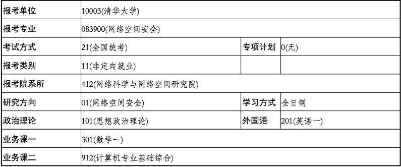

## Angel_Kitty的 plog 第三十三周

今天是2019年10月13日，距离考研初试时间还剩 66 天，这是我考研正式开始复习的第三十三周。偶尔诈个尸来给大家更点东西。这周发生了一些非预期的情况。就比如说研招网10.10开通了正式报名的渠道，而预报名选定的学校竟然无法更改，我也是头大了，原定网安招生一个人，今年却招生了10个，算是近三年招生人数最多的一次了，我怀疑是学校扩招了一倍的人，我又去核对了一下深圳院统招人数，果然是扩招了一倍，大概率是响应国家号召吧，所以突然感觉有点亏了，心情糟了好几天，然后一些朋友也给我支了招，似乎可以多注册几个账号啥的，重新报名，我和爸妈也稍微沟通了以下，就在刚才，我毅然的改了学校，下图为证。

既然扩招了，咱也得去拼一把不是，虽然我大概率没把握，但是万一呢？谁知道呢，瞎猫碰到死耗子，刚好就撞上了。公众号很多朋友留言说劝我不要报北大软微，事实上我自己心里也是这么想的，我读研不是为了混毕业证去的，是为了以后有机会去国外读博深造去的，不然我就完全没有读研的必要了。咱也不是说北大软微不好，只不过地处大兴，这地方离北京市区太过遥远，可能去那里我会大概率很不甘心吧，即便是要凉，也得凉个彻底不是？正好帮学弟学妹们试个水，看看这水深不深。

其实我是很怕失败的那种，所以上周的话联系了某学校的导师，也在前两天和那个导师单独面试了一下，那个导师有意向要我，说我只要能通过学校的考试就会要我，并且如果能在他实验室做得好的话，以后可以推荐我去KAIST等常青藤名校读博。我这一方面可能给自己留了一个保底学校，我爸妈也不太希望我这么早就工作，希望我能多读点书，以后发展会更好些，另一方面我也确实不希望再来一年，我很能理解再来一年的痛苦。就说我现在复习的状态，学新东西相对要容易很多，捡旧知识是很痛苦的，有很多旧知识并不是你希望回忆起来的，也许它曾经给你造成了心理上的阴影，你可能曾经发誓说一辈子再也不想学这个玩意，结果到头来考研的时候还是得温故这些玩意，“真香定理” 又再一次的成立。

申请学校要准备一些材料嘛，所以在这过程中也去找了一些教授签字，当时也找到我们教练写推荐信，第二天她发朋友圈的时候我才仔细揣测当时她说过的话。她说我以后去工作读书时，要注意职业道德，职业素养以及诚信。我当时好像是停顿了一下(主要是我反射弧一直都很慢。。。。。。)，可能她当时挺怀疑我的态度和想法，也问了我以后是不是打算读博深造。"大一时是个孩子模样，四年了，现在胖的有点轻微的浮肿。"我挺不赞同我胖了(不易胖体质)，倒是觉得教练话中有话。要说我大学四年发生了什么变化，我觉得应该是被压抑的那一面人格充分的展现出来了一段时间，又重新的收敛了起来吧。

**仗义每多屠狗辈，负心多是读书人**。尤其是在现在的商业社会，少了这个外在束缚，是否还能坚守原则，更多的还是取决于对自我的理解程度以及内心有多少原则是无法用外在价值去衡量的，也许教练不希望我成为那个负心汉吧。

再聊聊一些我和那个导师单独面试时谈到的一些问题。我当时联系那个导师的时候，看到他简介上说他是做移动安全相关研究的，移动安全我了解的不是很多，感觉应该是二进制分析相关的吧，正好我也有想法从Web转向二进制方向，所以当时我想都没想就给那个导师发了邮件，那个导师晚上就回了我，说找个时间可以单独面试一下。后来我就逃了一节课和他单独面谈了一下，才知道他课题组的研究方向其实是和深度学习，TensorFlow相关的东西，当然也是现在比较前沿的一些技术，例如基于深度学习的入侵检测，基于深度学习的漏洞利用啥的，并非是传统意义下的二进制漏洞利用罢了，可能更多的是偏向于运用深度神经网络相关的知识，当然我并不是排斥做人工智能领域相关的东西，只不过和我当时的心里期望值稍微有那么一丢丢的差距(还不是因为买不起高贵的GTX)。我当时也问了一下中科院的学姐，她们做的似乎也是和AI结合的一些课题，这个领域我还是挺赞同的，3月份到贵T听讲座的时候。ASU的教授有提到关于 Fuzzing 漏洞挖掘相关的东西，通过深度神经网络实现自动化挖掘一直是目前科研界待突破的一个重要课题，前景是肯定的，所以想以后读研深造的小伙伴想走安全这一领域，90%的可能性都得和深度学习挂钩了，国内几乎没有用传统方法做安全的导师 (其实就我目前了解有一个，中科院有一个导师，人特别好，不强迫学生做没有意义的学术论文，以后想走安全方向并且有推免资格的，非常建议投他，其它室的导师基本上是和AI挂钩的，甚至还有特别坑人的，这里我就不方便透露)。

所以在这里，我还是给学弟学妹们一些建议吧，家里有条件的，能留学出国的就尽量不要考研，因为捡旧知识确实很痛苦，也没必要，能用到以后搞科研的知识其实也就那么一点，现学现补完全来得及。能有推免资格的也可以选择出国，因为国内的坑导师相对还是更多一点，当然家庭经济不是很好的，推免一个中上游的985，我觉得也是可以的，当然能推免去清北的也不会看我一个人在这瞎叨叨吧。前面两者都达不到的同学，再考虑考研这条不归路(考研这条路相对会越来越难，但是也不一定，国家一直都在想办法解决人口就业问题，所以研究生会不断地扩招，当然带来的问题就是研究生的泛滥会导致毕业后研究生文凭会越来越不值钱)，考研我建议首选一线城市(例如北上广深杭)，其他地方的研究生(除了985)，说实话就算是考上了，毕业工资可能还不如你直接出去找工作。

说了这么多，我也该好好复习了，下一次什么时候会更新，就得看我的状态了，佛系更新。

