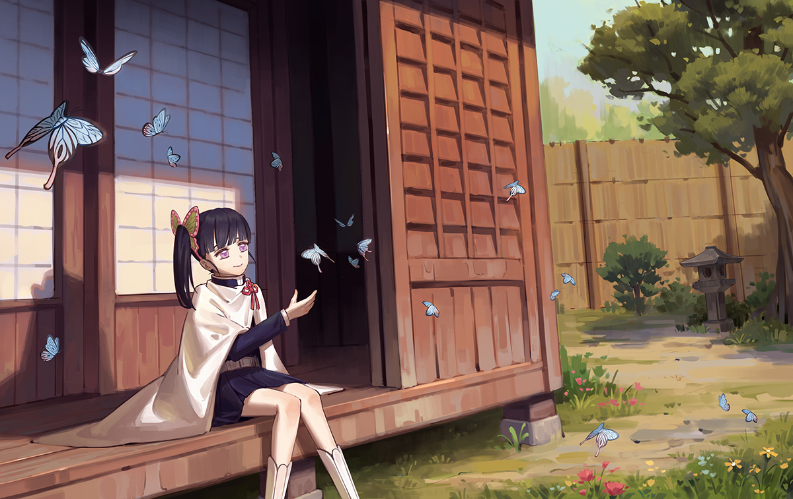

## Angel_Kitty的 plog 第三十二周

今天是2019年10月6日，距离考研初试时间还剩 73 天，这是我考研正式开始复习的第三十二周。国庆本来说好的只是回家拿两本书，即可就回学校，爸妈硬要我在家多留几天，然后结果真的就在家多睡了几天，一天睡十几个小时还觉得很困的那种，我是不是没救了ww，呆在家里的这些天，我一度以为自己已经能和上帝对话了，做梦都遇见一堆不好的事情，也不知道咱啥时候就练就出这样的能力了。这一周在家也没怎么学习，书也看不下去，即便是课外书，也没有看的兴趣。我爸妈也发现了我最近状态不太对，之前有人也问我说考研怎么有那么多时间读课外书，读课外书对我来讲有两种情况，一是我确实想陶冶性情，多读点书增加自己的知识面，如果在你某个阶段书已经读的足够多的时候，你再不断地看书，那只有是情绪化了。经过这么多年在大学的沉淀，我差不多已经学会了通过书本去调整自己的心态。

**过去的时代只需拿来缅怀就好，就像我们过去的回忆一般，沉浸其中似乎什么都改变不了，只徒悲伤。**

**无论曾经多么的荒唐，也无论取得了多少的成就，或许下一个转身就再也见不到了。**

**时代在变化，而人们的认知与格局也在变化。**

**时间长河不会因为某个人的优秀与否停下步子，相反会如浪潮一般会推着时代继续向前。**

**生活非黑即白，有人光芒万丈，有人如坠深渊。在这个尔虞我诈的世界里，谁又能真正独善其身呢？**

**人生天地之间，若白驹过隙，忽然而已。**

**也许我们一出生就背负着家族的希望，承受着我们这个年纪不该承受的压力；也许我们一出生就独立于舞台之上，聚光灯之下，很多人看着我们长大；也许我们早已受够了这个浮躁的社会，在我们最该奋斗的年纪选择了安逸。我们都是大千世界的平凡人，很多事情不是轻而易举的就可以变得风轻云淡。**

**有些人还在，有些人已经老去。当大哥大变成智能手机，笨重的电脑薄若蝉翼，而改变这一切的都是一直在奔流不息的时间，还有在时间中努力改变世界的人。**

**每个圣人都有过去，每个罪人都有未来。我们这一生，都会遭遇许多困难。如果可以选择，或许70%以上的人会选择不降生到这个世上，既然一切都别无选择，何不在看清了生活的本质之后，再度热爱它呢？我想这才是人活在世上真正的意义吧。**

本周内容概要：

- 本周的学习情况
- 后续

### 本周的学习情况

No Completed Tasks：

- 1991～1997年数学一真题
- 2000年～2001年英语一真题
- 英语归纳作文模版&&复习单词
- 政治每天刷20～40道选择题
- 专业课待定，先学再说

从三月份更新一直到现在，连更了七个月，虽然只是一周一更，但是每一篇文章都是经过深思熟虑才下笔的。毕竟是一个人运营的公众号，想要坚持每周连更也是一件很不容易的事情。很多人说我很能写，其实有时候我也会因为被催更而抓耳挠腮，有些时候会因为没有灵感而产生拖更的念头，有些时候可能因为心情烦躁而异常暴躁，有些时候可能是因为学业繁重而心烦意乱，不过我觉得我更多时候是因为有想法而不知道该怎么去表达而苦恼不堪。

有读者曾经提出了我公众号的定位，我也曾认真想过这个问题，原本计划是做一个更新前沿技术的公众号，结果被我活活做成了一个只讲真话的公众号。这是我想做的嘛？在这个言论管制的社会里，讲真话的人往往是不受社会喜欢和接受的，但我还是冒着被查水表的风险，每周都顶风作案。其实我也知道我说的很多话题，其实大家可能比我更清楚这一问题，只不过我替你们做了那些想做而不敢做的事情。要是有一天这个社会缺少了讲真话的一群人，也许那时候中国已经足够强大了吧，其实我倒挺希望是那样子。

国庆已经结束了，我也不太确定我是否能保证国庆后能持续更新下去，每一次的文案如果不是灵感来潮，可能好几个小时也憋不出一句话出来，每个行业都挺辛苦的，赚几个钱真的很不容易，做了一年的小编，多少次想找一个合作伙伴帮我运营公众号，却被各位 dalao 们一一拒绝了，也许她们是嫌我太菜了吧QwQ。我是个才疏学浅的泛泛之辈，默默地耕耘着这个不起眼的公众号，在自媒体这个大潮中连泛起一片浪花的能力也没有。尽管如此，我始终恪守真实的底线，不敢造次。

离考试只剩短短七十来天了，我也意识到了事情的严重性，我也知道紧张焦虑并没有什么用，静下心来抓紧时间复习才是我目前要干的事情。国庆这些天我确实没怎么把心思放在学习上，可能是还没拐过弯来，考研和高考不同，高考失败了可以重来，考研失败了，即将面临的也许是工作和生活的双重压力，尤其是有专心二战想法的考生，一旦二战还未上岸，面临的是往届生就业的困难，毕竟父母没有这个义务一直供你考研。我是不太想二战的那种，可能是最近读了太多劝退文了吧，所以国庆期间一直有在贴吧上找一些比较容易申请到的一些学校，一个好的跳板还是挺重要的，以后如果想去国外读博确实是必不可少的。

也有很多人跟我说过，说我报北大软微肯定是会后悔的。这一点我确实承认，我爸妈也看出了我的心思，我心理压力确实挺大，心态最近也是日常崩溃，我觉得我可能把责任看的太重了，我爸妈也说了不需要有这种压力，家里就你一个，没啥，不管做什么选择都支持我，好好复习好好看书，每天都有收获就行，也不用太在意最后的结果啥的了。

未来两个月估计是要拖更了，看情况吧，状态好就更，状态不好就咕，计划啥的都是用来咕的，想到啥写啥才是正道.jpg。