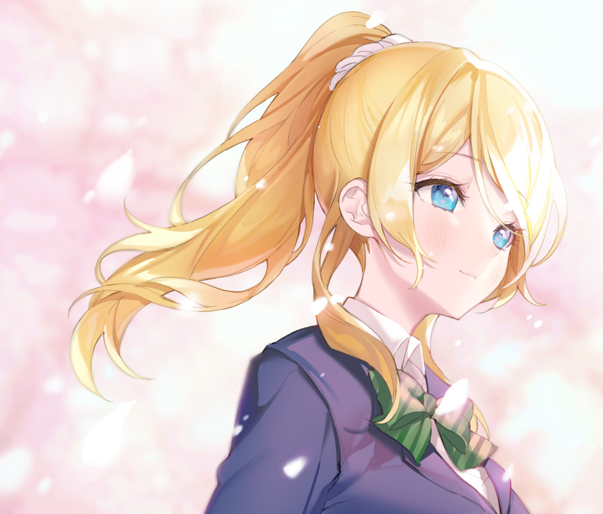
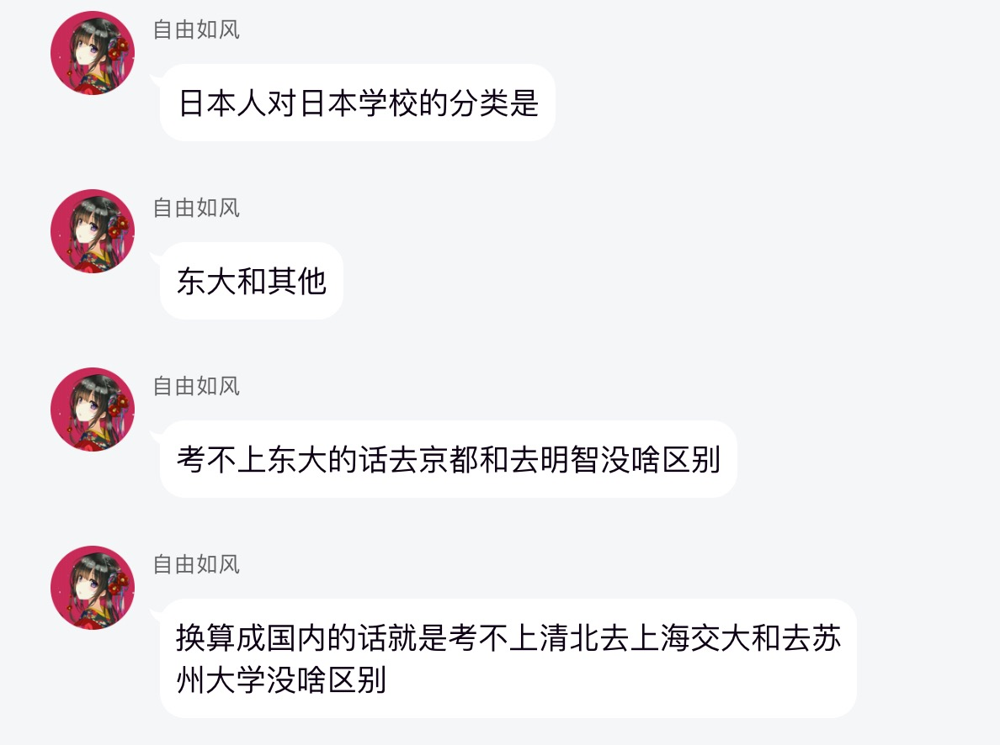

## Angel_Kitty的 plog 第三十五周

今天是2019年10月27日，距离考研初试时间还剩 52 天，这是我考研正式开始复习的第三十五周。没错，感觉我终于要开始断更了，因为我也开始缺素材了，每到周末这一会儿，我总说要当一只鸽子断更，但是总归有一些朋友习惯性的等待着周日 23:58 那一刻的更新，感觉又不能这样草草的过了这一周，所以每当这个时候，我只能尽量想一想可以分享一些什么有意义的东西。

当然本周确实也发生了一些不大不小的事情，有个学弟说他想早点解脱，觉得猝死对他来讲是最好的选择。

其实和我当年遇到的情况是一样的，付出与回报不成正比，这是很多人心心念念叨在嘴上的口头禅。回想高三那年每天一两点还躲在被子里刷题，一周也没得一次休息的机会，正因如此，高考前夕因为过度的神经衰弱住进了医院，虽然我百般劝阻，似乎对他来讲都无济于事，主要还是年纪太小了吧，看不开事情（怎么感觉我更像是那个要先入土为安的人啊，明明才十几岁，好心累的感觉，承受着我这个年纪不该承受的压力，其实学弟年纪比我大好几岁QwQ）。

本质上我是没资格去教育他的，因为我自己就是一个典型的高考失败者，我知道高考失败的阴影带来的惨痛教训，而作为一个失败者去拿它的失败经验教育一个失败者去鼓起勇气面对生活，这本身就不是个真命题，显然是没有任何可信度和说服力的，因为在你没成功之前，这一切都是虚无飘渺的，可这又能代表什么，人呐，一辈子就这么短暂，潦潦草草的结束这一生并非是你的初心，毕竟曾经为之努力过，我知道他有很多的不甘心，我也知道他永远不满意当前的现状，这是人天然的本性，大学四年一直活在欺骗与自我欺骗的阴影中，可这又能怎么样呢？

引用某群巨佬的话：

当然我对这个观点是持肯定的态度，我一直都是跟别人聊天（吹皮）的时候都是这么说的，中国只有两所大学，一所清北大学，另外一所是其它大学。说白了这都是教育资源分配不均匀的问题。清北是多少莘莘学子一生的梦想。

回想起十多年的学习心路，你掌握到的真理又有多少呢，当你读中学的时候，你在不断地否定小学老师教授你的一些理论，当你上了大学的时候，你又在不断地否认中学时期你所学习到的一些理论，而现在的你马上就要步入研究生阶段，本科所学到的那些东西又有多少会是正确的呢？

周末的时候花了一点时间听了关于利用汇编挖掘编程语言本质的公开课，深入剖析了我们在学习C/C++ 学习过程中遇到的一些误区，程序员口中所谓的口口相传的东西大多都是存在问题的，而只不过我们自以为自己学的很好，忽略了程序背后实现的逻辑原理，听完课以后我大彻大悟了许多，学了四年，错了四年，而这些背后的原理是大学四年并没有教会我的，包括各大高校的一些老师，也许他们都不一定知道这背后实现的逻辑，又有什么资格去教会你呢？高校的一些老师最多最多只会教你如何通过 debug 去测试代码的正确性，无一人教你如何通过反汇编去深入了解每一步代码的执行流程，甚至乎可能连debug都不愿意教授，因为这样太浪费时间，也太没有必要了，而且考试也不考，也没有多少学生对考试内容之外的东西感兴趣。绝大多数学生读大学只是为了混毕业证去的，毕业后能有一份薪水不错且稳定的工作就很OK了。

很多已经成功的人都说学习最重要的不是结果如何，而是这一持之以恒的学习过程。我知道很多人很不甘心，觉得这句话只有在一个人成功的时候才会说这句话。要我说，人生不就是在欺骗与自我欺骗中一步步的试错而成长起来的嘛？

其实我以前也谈过这个问题，不过也是两年前了，这两年我又对此有了新的感悟，我觉得可以拿出来给大家分享一下，毕竟人是在不断地自我批评中长大的，所以这周咱们就聊一聊这个问题。

> **从小到大你是否会有这样一个疑问，我们到底该怎么做才能成为一个受人欢迎的人。**

自卑的人往往都有这样的特点：懦弱，胆小，畏惧强权，做事情瞻前顾后优柔寡断，会因为敌人的强大而胆怯，会因为自己的错误而退缩，会因为恐惧而害怕，从来都觉得自己是芸芸众生中最普通的一员，不善言谈，内向羞涩，从不与人坦露心声。

而就是这样一个卑微的人，一个真实的人，他却可能也有着人类品质中所有属于善的部分。他做事情的时候会下意识的小声不去妨碍他人，他温柔善良，从不记仇，总是将过错归于自身，哪怕是对方先犯了错，却还是要自责自己。

而谁又能想到，就是这样一个人，他也会去想要改变自己，想要做一些不符合自己的事情。

人类自身本就是如此矛盾，渴望一方，却又畏惧。

这位懦弱的少年在现实的不可抗力中，渐渐学会了接受，而不是逃避。

朋友的背叛让这位天真的少年知道了人性的黑暗，朋友的无情背弃让这位天真的少年彻底迷茫，不知道该相信谁，该选择谁。他本就不是坚强执着的人，因此出现动摇也无可厚非。此时的他特别渴望有一个能让他感受温暖，一个让他在迷茫中，至少还有一个能够依赖前行的目标的人。

他选择在自责中坚强的接受了现实，不再逃避。

我们在成长中，会做出伤害他人的事情，会做出欺骗他人的事情。或许是无意，或许是故意，但总有人，会义无反顾的信任我们，譬如家人，譬如爱人。不要逃避自己的错误，而是勇敢承担。

而也许就是这样一位少年，在经历了鲜血和眼泪后，一点点的成长，一点点的改变。从懦弱逃避，到坚强面对，直至最后，背负着所有人的罪恶，牺牲自我，只为向神忏悔赎罪，这样的人或许才是这个世界真正的救世主吧。

**重拾了朋友，学会了爱，拥有了想要保护的东西。对于一个人来说，一生中，能得到这些，已经足以。**

**坚强的面对自己的罪恶，去克服去面对，还是任由自己逃避一切，都是我们自己的选择。**

我希望所有读过我文章的人都能坚强微笑的活下去，一切都还没成定局，一切都还没有结束。

**世界交织着悲伤与美好，无尽的过去与未来里，感谢有你相伴。**

**在最后，我终被你所救赎。**

在最后，我终被你所救赎。