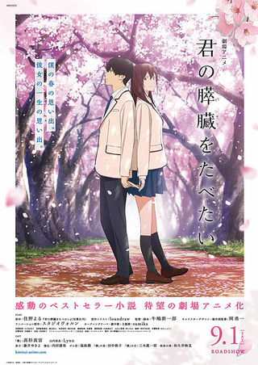
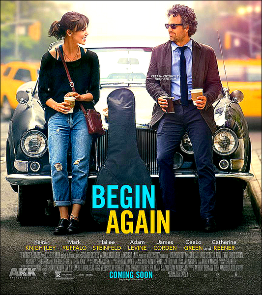
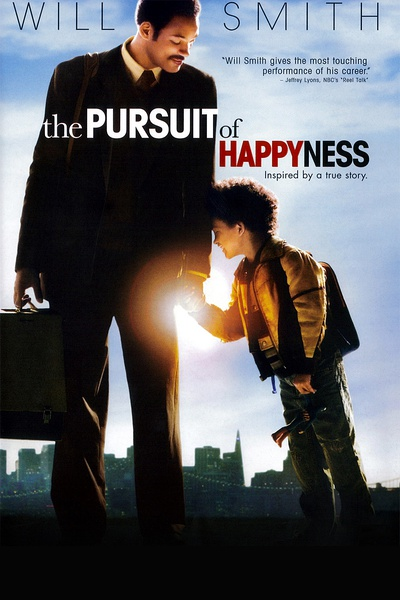

## Angel_Kitty的 plog 第九周

今天是2019年4月28日，距离考研初试时间还剩 237 天，这是我考研正式开始复习的第九周，还有明天一天的课程就开始五一长达五天的假期了，意味着第十周的复习都是在五一中度过的诶，这也是我这个学期可能最后一周复习了，后面几周恐怕要花近一个月的时间和期末考试周旋。这篇文章也是临时晚上才开始写的，上了一天的课程，补了一天的作业，总算搞完了，所以可能会稍微有点赶工的痕迹，所以这周就简单谈一点东西。

本周内容概要：

- 本周的学习情况
- 碎碎念
  - 再谈永恒不变的教育问题
- 本周推荐的电影
  - 《君の膵臓をたべたい》
  - 《Begin Again》
  - 《The Pursuit of Happyness》

### 本周的学习情况

本周完成的进度稍微还算可以，比上周要多了那么一点点。

Completed some tasks：

- 清华大学郑莉的 C++ 程序设计课程完成第四章的作业以及试验
- 串了一遍词根词缀，学完了前七个单元

No Completed Tasks：(五一任务)

- 串完考研大纲的词汇
- 清华大学郑莉的 C++ 程序设计课程向前推进两个章节的学习
- C++ primer Plus 也紧跟 C++ 课程复习的进度，学到哪个章节看到哪个章节
- 计算机网络向前推进两个章节
- 数学完成1000题的高等数学上册部分

### 碎碎念

####再谈永恒不变的教育问题

> 其实很多东西的话我是不想写的，又容易被敏感词屏蔽了，有时候又被一些事情气的啊，唉，所以有些东西简而言之，一笔带过，毕竟我觉得说了太多东西也是没有意义的，有朝一日我与君相会，吾定可与君畅谈三天三夜。

这周发生了一件很不愉快的事情，可能不是这周发生的，只是恰好我这周才发现了而已，我上次买的 harry potter 周边的纪念币被人偷走了一个，关键我还是放在实验室里面的。本来我打算考研复试结束以后，如果预录取的话，回头搞个抽奖活动，作为礼物馈赠给一些读者朋友的，结果现在少了一个，就不太好当礼物送人了。

我也没去过问是谁拿走的，我也不会去追究其我觉得吧，都是大学生了，都是成年人了，其实有些东西并不需要别人指指点点，每个人都是一个独立的个体，每个人都有其独立思考的能力，我为人处事的原则，看过我博客的人都知道，做人无疑是一个人最重要的品质。我其实说实话都不想再讨论这些东西了，可是现在的教育体制都把学生教成什么样子了，死读书，连做人该有的一些基本原则都抛掉了，国家培养你这样的人到底有什么用，你这样的人又真正能够给国家带来些什么？不过就是给社会制造一些无用的垃圾而已，酒囊饭袋之徒罢了。

从小家长老师教育我们上课要认真听讲，课后要认真完成功课，可就是这样的制度，毒害了多少的学生，致使现在的学生完全缺乏独立思考的能力。试问一下，老师讲的东西都是对的嘛？老师的知识面，知识水平一定比我们学生要高嘛？有多少人敢去质疑权威，又有多少人坦然接受了这些错误的知识，错误的思想灌输？这恐怕就是国内现在的研究生，博士生水平还不如一个本科生的根本原因吧。再者，很多所谓的教授，副教授，不过是徒有虚名罢了，水平不过如此。试想一下，一个老师的水平能被学生一眼望到底，可见这样的老师能教出怎样的学生出来？撇开这一点不说，某些老师甚至还显得自己很高傲自大的样子，总想压学生一头，话说这样有意思嘛？很多隐藏的大佬只是默不作声，做自己的事情而已，让他一个人在台上尴尬的说，而某些老师却不知廉耻，在台上乱讲一通。我只想安安稳稳的毕业，任凭他怎么说我，我只会点头答应，必然不会去指出老师的不足，明者自知。

### 本周推荐的电影

本周推荐三部电影(因为我每到晚上，学习状态特别糟糕，想想就还是看电影缓解一下)，这周我推荐一部动漫电影和两部经典的美剧吧。

1、《君の膵臓をたべたい》

这是我目前为止看过最好看的动漫电影了，我必然是极力推荐的。

这部动漫可以类比与之前看过的一部番剧《四月是你的谎言》，表现的手法有惊人的相似之处，但也有出人意料的手法表达。我看完以后，个人觉得比看四谎还要难过，主要的原因可能还是因为主人公的身份背景更加的平凡与真实吧。

男主是陪伴女主走过所剩不久的人生，而女主是改变了男主为人处世的态度，帮助男主成长。这部电影阐述的一些东西更像是我们未来可能将要或者想要去经历的，那是我们希望中的、我们心底的自己。

我们存活于世，有时，不得不把那个真实的自我，小心翼翼地伪装起来，避免受到伤害。但是一旦接受了自己不久于世的事实，就会发觉，这些是多么可笑，多么无用，就会时刻想要去展现真实的自我，反正都要死了，不如活得洒脱一点？

面对世界的恶意，大多数人都选择了逃避。但是，在你的内心深处某个角落，真的没有，哪怕一点点的，义愤填膺的正义感吗？

2、《Begin Again》

链接:https://pan.baidu.com/s/1A8B0yoWdJY9rTKkoEDpJEA  密码:rynw

这部电影最吸引我的地方就是全片以音乐为主线了，在我所看过的以音乐为主旋律的美剧中，第一非它莫属。

我喜欢影片传达出来的精神，好的音乐在街角巷尾，人人都可以享受。就像歌里唱的：我们是银河里的灰尘，我们是迷失的星星，只是想要点亮黑暗。故事的结尾，女主骑着自行车，没有成名，没有和哪个男人在一起，她用一块钱卖掉了这张专辑，上传成功的那一瞬间，她的生命，那些歌曲的生命，又迎来一个崭新开始，也印证了电影的标题，非常值得一看。

3、《The Pursuit of Happyness》

链接:https://pan.baidu.com/s/1XUy4CQ0v19exKyr4sqUpNg  密码:ogpr

>
> You got a dream, you gonna protect it. People can’t do something themselves, they wanna tell you you can’t do it. If you want something, go get it. Period.

本片是部励志的电影，影片震撼人心之处不仅仅在于最后成功所带来的煊赫辉煌，更多的是人物在里面所展现的一种坚持，他受尽生活的打磨而不自弃，也许你在他的眼里已经看不到光芒，但不妨碍他身上那种锐意的执着。

没有人天生会是成功的，在梦想和现实之间，在梦想变成现实的过程里，总要加上点什么。除了天赋和努力，最重要的是对自己的认知和定位。悲哀的不是物质的艰辛，悲哀的是心如止水，已经向这个世界投降，有些东西很珍贵，妥协一次便是一生难求。

笑也好，哭也罢，太阳不会因为你不升不落，时间也不会因为任何人而静止，与其抱怨，不如省下力气来看看自己能做些什么。我们被太多的东西苛刻着，久而久之连试一试挣脱束缚的枷锁都不敢了。我们不相信，自己是那个独一无二的奇迹，不相信，自己能颠覆命运的齿轮。但我们也忘了，片子中的主人公的成功哪怕不是必然，也断然不是奇迹。

如果你没有得到什么，那么一定是你做的还不够好。在梦想与现实的博弈里，如果你想赢得坦坦荡荡，纵是要承受常人所不能承受的，也该是甘之如饴的。很多事情，虽是你选择开始，却由不得自己来结束。

> There is an I in happiness. There is no Y in happiness. 

影片的最后，他诠释的幸福不在于别人如何拥有，却在于自己如何选择与创造。而这，也是本部影片最成功的地方。