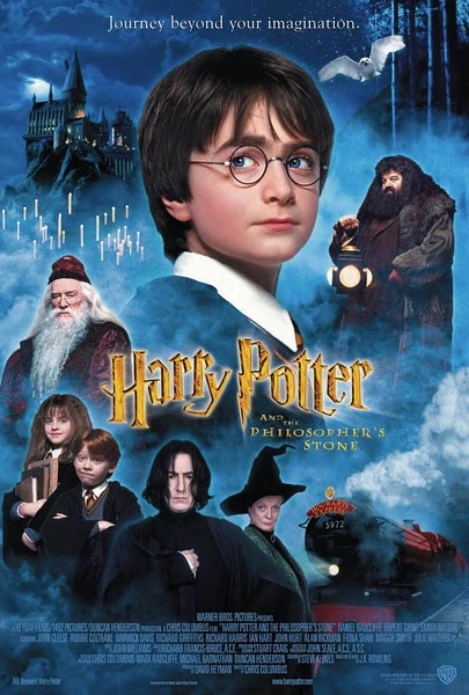

## Angel_Kitty的 plog 第八周

今天是2019年4月21日，距离考研初试时间还剩244天，这是我考研正式开始复习的第八周，一晃眼一周又过去了，想做的事情还是很大部分没有完成，有点懊恼，渐渐地开始进入了期末周了，这周刚结了一门课，其他课程也会在陆续地几周接连结课，通宵复习的日子就要到了。

现在的状态也是一天不如一天，不知为何，也许是繁重的学业压力，也许是自己的一些心理负担，一切都是那么不尽人意，不过这也算是正常的，如果事事顺心，那我每天只需高枕无忧就好了，可悲啊，可叹啊。

最近自己也是遇到了一些麻烦问题， C++ 在学习到函数这一章节的时候就接连受挫，感觉自己似乎从来没有学过这门课一样的，有一半以上的内容，自己是闻所未闻。有时候真想抽自己一巴掌，我怎么这么没用，我怎么这些东西都不会，这个社会会需要我这样的菜鸟嘛？

我感觉我现在是处于一种比较低迷的状态，我深知这种状态会给我造成多大的影响，那段曾经让我痛不欲生的阴影。其实我和你们大多数人一样，甚至在各方面能力上远不及你们在场的所有人，我害怕失败，我更害怕我永远在失败中迷茫。但即便如此，我更愿意相信我能够从这段阴影中走出来。

人本来就是地球上最聪明的物种，它们拥有情感，它们懂得从失败中吸取经验和教训，它们知道从哪里跌倒就该从哪里爬起，它们敢于承担风险，敢于去尝试探索未知，这是其它物种所不能匹及的。

毛主席说，有条件要上，没有条件创造条件也要上。要说我们现在的命苦，多去想想毛爷爷当年越雪山，过草地吧，那么艰苦的条件，他们都没有放弃，我们岂能轻易说放弃呢？

昨晚心血来潮，写下了几个大字：

> **只有革命才能救中国，只有奋斗才能创辉煌**

本周内容概要：

- 本周的学习情况
- 生活的碎碎念
  - 大学教育的碎碎念
  - 琐事的碎碎念
- 本周推荐的电影

### 本周的学习情况

这周个人感觉收获微乎其微，可悲可叹啊。

Completed some tasks：

- 清华大学郑莉的 C++ 程序设计课程复习到第三章，实验部分还落下了一章没完成
- 计算机网络刚过完网络层，一些笔记还未能及时的整理
- 手动实现了 cmath 库中关于三角函数这块的函数的具体计算流程(如 arctan 等)

No Completed Tasks：

- 数据结构停滞了很长一段时间没有进展，在慢慢地提升码力，希望有望能向前推进一个章节就好了
- 清华大学郑莉的 C++ 程序设计课程向前推进两个章节的学习
- C++ primer Plus 也紧跟 C++ 课程复习的进度，学到哪个章节看到哪个章节
- 计算机网络向前推进两个章节
- 数学有所停滞了，主要原因是因为复习专业课的过程中遇到了许多障碍，导致计划没有按照预定的轨道进行，时间上被耽误了很多，有点乱了手脚，其实也很正常，现在被耽误了总比到了考前一两个月临时抱佛脚要好很多吧，所以这周需要加大复习强度，尽可能地做完高等数学上册的习题

### 生活的碎碎念

#### 大学教育的碎碎念

如果当有人问起如何评价中国大学的教育，我会用八个字来形容大学的教育体制：

**先易后难，先紧后松**

我觉得我这个概括应该是一语道破大学教育制度的本质，我个人是无法再找到比这更好的说辞来概括了。

我为什么这么说呢？我相信在大学读过书的朋友们都知道，大一大二的时候什么高数啊，大物啊，线代啊等等，老师都会说这门课历年挂科率都有 50%~60%，叫同学们要重视这些科目的学习，但是当你到了大三大四的时候，却很少有老师这么说，为什么？有没有人想过这样一个问题？真的是因为到了大三大四以后，课程难度变简单了？那学校为什么不把简单的课程放在大一大二去学，而把简单的课程放在大三大四呢？我觉得只不过是很多人并不清楚一个事实，不是课程变简单了，恰恰相反，课程难度只会一直在递增，之所以你觉得没那么难了，是你在大一大二的时候基础课学的比较扎实了，再学后面的专业课就会顺风顺水了，当然还有一种可能就是老师放水了，考试难度刻意而为的降低了，为了保证学校的毕业率和就业率，老师们自然而然就会这么干，这绝非是老师有意而为之，实则名利之纠纷。

大一大二的时候大部分人之所以考的挺好的，都是因为被老师父母步步紧逼着，被吓怕了都，活的跟高三一样，等到大三大四的时候再来去追求自己想要的东西，回首发现自己的大学在刷题和复习中度过，当然我只是把我认知范围内的东西做出最客观的评价，绝非有针对过任何人，在这里我必须要在此声明这一点。但试问，这样的大学生活真的是你想要的嘛？而且似乎现在的高校对大学教育这块抓的更紧了，这种应试教育的毒害看来持续的时间会更长。

我觉得这样的大学生活是没有灵魂的，在大学里面不追求点自己想要的一些东西，这样的大学生活和咸鱼有什么区别呢？

学习的自觉性、主动性是自己的事情，老师去压着管着，无疑是抹杀了学生的自主性与创造力，这样培养出的学生从某个层面来讲确实是很有用的，但在我上周的 plog 原稿中提到了，一辈子只能卑躬屈膝去接受老板和国家的施舍，剥削只会愈演愈烈。

其实很多时候我担心是多余的，我感觉自己总是为天下先，总是为人民群众着想，我却从来没有做过一件惊天地泣鬼神的事情，空有一腔热血，满怀壮志，却又害怕遭人陷害，待静观其变，日后尔等定会有用武之地。

#### 琐事的碎碎念

我相信很多朋友也看到了，我最近频繁地更新公众号，大概两天一更的频率，而且很多朋友也看到了，多数均为一些朋友的投稿，当然从文章阅读量的反馈以及点赞数来看，文章质量确实不尽人意，其实这些我比各位读者都要清楚。我也尽可能的反思过我自己，但是只要有粉丝读者投稿，我都会尽可能地帮她们推，因为毕竟这是出自她们之笔，因为对她们来讲，她们至少愿意动笔去写了，至少愿意去分享自己的得与失了，至少敢于面对自己的不足了。也许现在的我对她们的这一份鼓励与支持帮助微乎其微，但也许她们会因为这份信仰成就一番伟大的事业，对我而言，这一切或许是值得的。多给这些年轻人一点机会，她们就会多一些对未来的憧憬，多一些赞同感，也许会成就这些年轻人一生的事业，至少对她们未来而言，这也许是人生中一段很宝贵的经历。毕竟社会都是需要认同感的呀，如果没有这份信仰，也就没有现在的新中国了。每个人都是从不会到会这个阶段过来的，而我最希望的一点是常怀感恩之心，在你未来功成名就之时，不忘在你成功道路上曾经帮助过你的人。

### 本周推荐的电影

现在开始看 Harry Potter 系列了，接下来的很多周可能都是这个系列的影评了，今天给大家安利的当然是 J.K. Rowling 的第一部杰作《Harry Potter and the Sorcerer's Stone》

资源链接：https://pan.baidu.com/s/1NlH7_mg_2Z5w1GtJEBjabg  密码:om6w

Harry Potter 从小学的时候就有所耳闻，只不过我一直都没有去有时间看过该系列的小说或者电影，然后在一个关系很要好的小姐姐的安利下，开始了漫长的补剧之旅，算是弥补我童年记忆的缺失吧。为此我大费周章，从 Amazon 上捎了一套英国的原版著作，还买了些周边，算是我对这个系列的赞助和支持吧(一套下来好烧钱啊QAQ)。

如果要我概括《哈利·波特与魔法石》这部电影的剧情，我会用九个字来概括：

**正义总是能战胜邪恶**

我们的生活需要点正能量的传递，这个社会需要更多的有志之士去改变，去创造。

这部电影让我感触最深的就是它给我们创造了一个全新的魔法世界，让我们打开了新视野的大门，这部电影其实在情节上，除了题材新颖，想象力丰富外，还有一个优点，就是从头到尾，都弥漫着爱。不管是小哈利重入魔法世界受到的欢迎也好，罗恩的家庭也好，海格，邓布利多和麦格教授的慈爱，格林芬顿学院的同学们之间的友爱也好，都是让人觉得温暖的，就算是哈利死去的父母的形象得偶尔闪动，也是如此具有感人的力量。这些东西虽然是很普通，也算不上什么桥段，但是却是人世间最为美好的东西。我想，其实真正好的电影其实就是这么简单，不需要像李安那样出其不意的桥段，也能博取大家的青睐。我们是否太沉浸在承认世界里面的忧愁和烦恼当中，忘记了最初的美好的东西呢？罗琳的哈利波特系列，固然是越发展越可以让人嗅出很强的商业气息，但是她的开端确实非常美好的。

> It promises many things to go, and that means hope, which is fabulous.