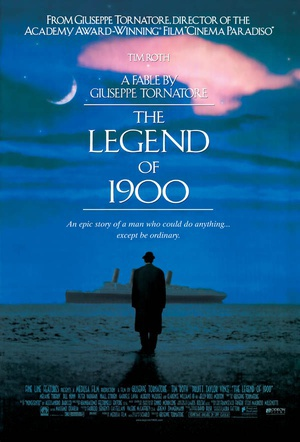

## Angel_Kitty的 plog 第十一周

今天是2019年5月12日，距离考研初试时间还剩223天，这是我考研正式开始复习的第十一周，今天也是一个特殊的日子，母亲节啦，在这里，我祝愿全天下的母亲，节日快乐。晚上和团队的大佬们聊天聊了两个多小时，聊到食堂都要关门了都，阿姨都要关门了，我们才勉强离开。大佬们也说，网上聊天挺浪费时间的，不以目的的聊天都是耍流氓，我其实挺不赞同的，然后想想自己好像确实也是在网上聊天浪费了不少时间，虽然已经基本上戒掉了QQ，微信也就只有几个会偶尔搭话的朋友，但是感觉确实一定程度上也耽误了一些时间，我也在考虑是不是在考研期间不与任何人联系。但是有时候又会在想，考个研吧，确实忙，但是不能读书把人都读傻了，很多时候整个人的精神气会被这该死的应试考试一点点的消磨殆尽，人啊，联系少了，关系就淡了，很多人都会渐渐地遗忘了，这也不是我所希望看到的，不过大家其实都能理解这些的，所以其实也不能算是打扰吧，一定程度上还能捡起一些即将遗忘的知识点。

下周开始将是为期两个月的期末考试，是不是有点有点可怕？一周考1~2门，我也是醉了，不过这样也好，某些课程我有充足的时间复习，至少可以保证本学期的期末考试能平安度过，唯一气的一点就是考研集中复习时间折损了两个月，对我来讲也是硬伤，只能忙中偷闲，稍微看看电影，看看动漫，写写数学这样子维持生活。

本周内容概要：

- 本周的学习情况
- 浅析商品的价值
- 本周推荐的电影

### 本周的学习情况

这周其实没做很多东西，唯一有点小成就的就是自己写了个自动化搭建 SSR 客户端的 shell 脚本，代码量也就100来行，没什么很高的技术含量，只能说玩玩还行。项目链接在这里：https://github.com/AngelKitty/ssr

Completed some tasks：

- 背了十三页的单词(感觉应该背了500个单词左右吧)
- 数学做定积分那节的时候卡住了，暂时停滞了
- 背了一篇作文，不是很熟
- 看了两部经典的美剧
- 看了一点资本论
- 看了三部电影，本周就推荐其中两部很经典很励志的，另外一个是Harry Potter第三部，这个暂时不做太多评论，以后做个整体的总结吧
- 手动写了个 ssr 客户端自动化安装的脚本，写了一下午+一晚上，感觉挺好的，毕竟是我用 shell 写的第一个自动化工具
- 下周考 Linux ，虽然感觉没啥复习的必要，但是还是稍微把书过了一遍，对shell编程这块用的不多，不过手动写了上面那个小工具后感觉大体都熟悉了一遍，makefile 也不是很懂，以及制作函数库(静态库与动态库的生成)需要稍微花点时间学学

No Completed Tasks：

- 下周把高数上册部分1000题做完
- 看完两本书(本周看的一本书还差一小半以及下周再看一本)
- 看完题源外刊课程1-6

### 浅析商品的价值

大家可能看到这个标题会很奇怪，商品的价值有什么好谈的。如果你会产生这样的想法的话，说明你没学过考研政治。这是马克思的毕生著作《资本论》在第一章就谈论的话题。我记得我在第七周的plog谈到这个话题，不过当时因为政治敏感，没有办法发出来，所以在公众号发布的时候删减了那部分的内容，不过你可以通过查看阅读原文来获取完整的内容。我相信在座的很多人如果没有看过资本论的话，应该都不会理解何谓商品的价值。我就上次的话题更深一步的讨论这个问题。

商品的价值分为质和量。何谓质呢，质指的是使用价值，量指的是劳动时间。而决定这个商品的真正的价值恰恰是后者。这个时候可能很多人就不理解了，一个商品的价值为什么不是前者呢？举个例子，我们中国人吃饭用的是筷子，所以筷子对我们有使用价值，所以我们就简单的认为筷子是有价值的，但是西方人吃饭用的是刀叉，而筷子对于西方人而言就没有使用价值，这能说明筷子这个时候就没有价值了嘛？我相信，通过我上面这个例子的讲解，大家可以确信的一点是，使用价值不能用来衡量商品的真正的价值，而决定商品真正价值的是劳动时间。

劳动时间，这里的劳动时间我们需要重新定义一下，一个商品的价值取决于社会生产的**平均劳动时间**，这里要注意的是**平均**二字。我举个例子大家就会明白了。比如工业革命之前，我们想做一件衣服，我们需要花5天的时间，每天工作8小时才能做好，而如果给裁缝做同样一件衣服，他们只需要花3天时间就能做好，在那个时期的时候，这件衣服的价值是多少呢？是我们工作五天的劳动时间的总和嘛？还是裁缝工作3天的劳动时间的总和？都不是，也许这个裁缝可能做事比较利索，这件衣服的市场价值取决于在那个时期社会生产这件衣服花费的平均劳动时间。工业革命之后，有了裁缝机，生产同样一件衣服只需要花1天的时间就能做完，这件衣服的市场价值就为一天8小时的劳动时间的总和，这就意味着同样一件产品在不同的时期，所具有的商品价值发生了变化，市场价值降低了。以前可以卖30元的衣服，现在就只能卖10元了，其实就是这个道理。生产一种劳动产品所需的劳动时间越少，该劳动产品所具有的劳动时间的总和也就越小，相应的，该劳动产品的价值就会越小，而能够将劳动产品变成商品的前提是首先这个劳动产品能够用来交换，也就是这个劳动产品是有用的，没有用就不能拿来交换，连商品都谈不上的劳动产品，也就不具有价值可言。

### 本周推荐的电影

虽然我上周好像说不会再看电影了，但是有经典励志的，台词非常值得学习的电影，我还是会竭力去欣赏，去观看，然后找到了高清的双语字幕的资源，这样也方便大家再去寻找，高清双语字幕的电影真的很难找的说。

#### 1、Homeless to Harvard

链接: https://pan.baidu.com/s/1a625WMdIwr-oPufFZ3Wtag 提取码: ipik

这是一部非常励志的电影，影片名为《风雨哈佛路》，讲述的是女主人公利兹，她的父母都是瘾君子，母亲患了精神分裂症，双眼失明、后来死于AIDS。利兹的生活颠沛流离：住过收容所，睡过地铁站，捡拾垃圾......从来没有一个像样的家的她，青少年的岁月多半是在慌乱的流浪中度过的。偶尔，她还要扮演大人的角色，回去照顾她的爸妈和姊姊，多少次，她流泪坐在妈妈的病床前面。她身便的人，多半是遭遇不幸的人。同儕暴力、性虐待和精神疾病。一日复一日，她活在一个沒有希望和梦想的世界裡。母亲去世时，她跑到大厦的楼顶，在天空飘下的雨中无助地抽泣。母亲下葬，没有牧师没有仪式，待寥寥数人散去，她静静地躺在母亲的棺木上，低声诉说过往的点点滴滴……

利兹真的凭借着这份自己的毅力和坚持考上了哈佛大学。为了支付哈佛昂贵的学费，她找遍了所有的奖学金资讯。面試的那天，她连一件像样的衣服都沒有，穿着一件破烂衣服，罩上一件向姊姊借來的大衣勉強充场面。果然，她得到了那笔奖学金，进了哈佛。

领奖致辞的那天，她说，她的生命就在那一刻，永远的改变。Liz Murray，一个最贫穷，也最勇敢的哈佛女孩。在哈佛金色的秋天里，女孩仰起脸，眼睛里是坚毅的光。

本部影片很多台词都非常的棒，一些经典的台词可以作为很好的素材使用。

> Keep their eyes shut to the wholeness of the situation. All those tinny things that have come together to make it, what it is. 
>
> 生活的残酷会让人不知所措，于是有人终日沉浸在彷徨迷茫之中，不愿睁大双眼去看清形势， 
> 不愿去想是哪些细小的因素累积在一起造成了这种局面。

> The world is changing while you're just a stardust. The earth turns arround with or without you. Reality doesn't change according to your will. 
>
> 世界在转动，你只是一粒尘埃，没有你地球照样在转。现实是不会按照你的意志去改变的，因为别人的意志会比你的更强。

#### 2、The Legend of 1900

链接: https://pan.baidu.com/s/1VA_AwWdJgpfi6eFGoncmdQ 提取码: u2tt

有些电影是你看过之后，心中涌动万千却无从下笔，是你满脑子的思绪却不知从何整理，影片名《海上钢琴师》(这个翻译应该是根据电影内容直译)就是这样一部让我欲罢不能欲言又止的电影。

主人公名叫1900，1900代表着一种理想，代表着这个尘世中的多数人，注定不会付诸行动，却会始终心怀向往的理想。矗立在那里，自由，决绝，而悲伤。 

1900是一个没有出生证明的孩子，他不属于哪个国家也没有我们传统意义上的名字，如果他死了，你在任何资料中找不到他存在的痕迹，可能也没有多少人记得他的存在，他也没有一座存放他遗体的墓穴，但是他却实实在在地存在过，真真实实地活过，他用什么证明了自己的存在呢？

1900的一生是存在主义思想的体现，他藐视规则，藐视这个社会认可的规则，他害怕上岸其实是拒绝上岸，藐视上岸。他重自身的存在大于外界对自身的认可，他可以轻易打败爵士乐的开山祖师并对他表示鄙夷，他可以靠他的才华赚取无数的名利但是他拒绝音乐与自身的分离，他可以用音乐去探究所有人的心灵，可以在音乐里去旅行，可以寻觅到自己的爱情，但是他没有常人那样去要去追，他轻轻地将这些丢进了大海，他将迈向陆地的脚收回。

为什么不想离开大海呢。因为外面的世界是上帝的键盘，millions and billions of keys that never end，太巨大了。他说，钢琴只有88个键，但是外面的世界，却是有着无数黑白键的巨大钢琴。他无法驾驭。 

我们是生活在“外面的世界”里的人。这个世界的意义在于“传承”。就像一个游戏，每个人都是其中的玩家，然而获得的任务，却是如何使这个游戏永远存在。赡养父母，繁衍后代，诸多必须背负的责任令前行显得缓慢而艰难。然而我们的人生对于整个游戏而言，存在的时间或许只有一秒，或者更短。也唯有越短暂，这个游戏的运行时间才会越长，才有可能，“永不结束”。 这样一想会不会又心有不甘呢？辛苦奋斗的一生，其实不过一粒微尘，轻得仿佛随时都会消失。

我们或许从来都不是天才，但是我们至少能做到勤恳、踏实。我们从坚硬和纯白开始，学会圆滑，学会世故，但内心深处，终究会一直记得，这一生所做的种种妥协，不过是为了在这个微尘世界，在这架上帝给予的钢琴上，创作出独属于自己的旋律与琴音。 