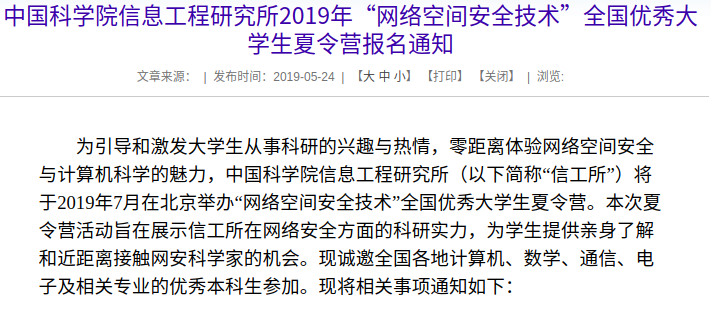
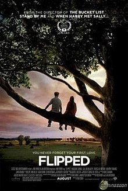
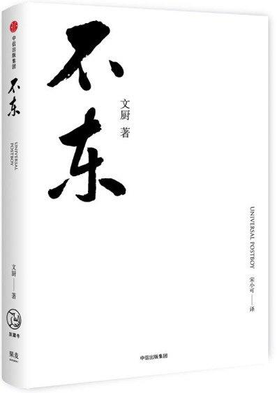

## Angel_Kitty的 plog 第十三周

今天是2019年5月26日，距离考研初试时间还剩209天，这是我考研正式开始复习的第十三周，本周除了复习期末考试，几乎是没有干其他和考研相关的事情，但是这也没办法，学校一步步在摧残我的学习热情，既不让你保研，又不让你考研，就总是逼着你赶着你去面试就业，有些骗局也应该早点结束吧，总是喜欢把学生当成傻子，等我毕业了，我会如实的把一些事情的真相公之于众的。

这周发生了不少的事情，偶然一次机会看到了中科院信工所NeSE战队招有ctf经验的研究生，正好朋友圈有个认识的学姐，就了解了一下信工所的情况，据说那个实验室安全那块好像确实挺强的，我就想着要不试试看，那个学姐也非常的支持我，叫我不要放过任何一个机会，然后其实对我来讲，我可能就随缘投吧，毕竟我很佛系，我也没指望那个研导会回复我，然后花了一天的时间，很用心很用心的写了那封邮件，结果，结果，结果那个研导竟然第二天就发邮件回复我，说有意向要我，叫我先投夏令营试试看，如果没录取的话及时发邮件给他，他给我单独安排保研面试！！！

我当时心里也是咯噔了一下，咦，那老师竟然有意向要我，简直了，我也不相信自己有何德何能能被研导看上。然后上信工所官网找夏令营通知，好像还没发，往年三月份就发了通知，今年怎么到这个时候还没发啊，其实当时心里也是有一丢丢焦急的，没想到，第二天中午去官网看的时候，诶，一切竟然进展的如此顺利，前一天收到邮件，第二天就赶上了夏令营发通知了？？？

于是我又想要不既然那老师都那么说了，就投一下吧，反正也没损失什么，于是又花了一下午写了申请材料，后面的就是等通知了，当时其实我稍微看了下去年这个实验室考研招生，好像就招了一个，所以其实我大概对自己很清楚了，我极有可能不会去报考中科院的，即便是那边的老师会要我，我也几乎不可能可以从自己的母校拿到一分好处，我太清楚这些了，因为母校从来没有值得令我报答与感激的地方，只是我交了学费，它给了我几张试卷，打了几个无用的分数，最后发了一个毕业证和学位证给我，仅此而已。只是单纯的交易关系。其实我无所谓的，不知为何，似乎已经看破了人生，学院的情况我很清楚，没有一个明确的保研的标准，对外说只能保研本院，事实上呢，我问了其他学院的师兄师姐，甚至其他学校的师兄师姐，他们都说有哪个学校都有保研外校的名额的，但是我们导员跟我们说只能保研本院，这不是一直把我们蒙在鼓里嘛？不让保研也就算了，还不让你安心考研，课又特别多，一些形式主义的杂事又麻烦，我似乎已经有点厌倦了本科大学的生活，我脑子里就想着早早地毕业吧，毕业了一切都会好起来的，只要通过了这学期的考试就好了。在我的母校，没有值得我留念的人，一个都没有；也没有值得我留恋的事，甚至我毕业以后都不愿提起我曾读过我的母校。

本周内容概要：

- 本周的学习情况
- 回顾三国的所思所想
- 每周书评

### 本周的学习情况

这周除了发了两封邮件之外，还看了两本书，不过考试的专业课一门都没有复习完，我也很无奈，考试要背电路图，以我的智商根本背不下来，我真的要哭了！！！

首先很高兴的一件事就是我花了两周的时间，我扛下了巨大的压力，完整的读完了一本英文原著，这本原著几乎是上课在看，下课也在看，晚上熬夜还在看，一天大概可能看了七八个小时这个样子，才勉强读完，而且把一些词汇，句子还做了不同程度的批注，看完的那天，我被自己的坚持感动的哭了，事实上我并不认为自己是个有很强执行力的那种人，而且我对英文其实还挺感冒的，并不是因为我不喜欢英语，而是我觉得英文好难啊，我很难做得到和老外那种正常交流的那种程度，我每天为自己的无能烦恼不堪，听力又差，写作又差，口语又差，阅读好像也好不到哪里去，这样看来，我似乎就是个废物吧。但是又是个不甘心永远当废物的废物，所以总是会想尽一切办法，去改善现有的这种状况，让自己稍微变得比以前好那么一点点。

**感叹世人都看错了我，昨日看错了我，今日又看错了我，可能明日还会看错我，可是我还是那个我。**这个世界上也很难有能和我坦诚交心的人，整个朋友圈+空间3000多个好友，能聊得来的却不到十人，能交心的屈指可数，其实现在想想看，这还挺正常的嘛，要那么多聊得来的干嘛，太累了都，还不如静下心来读两本书，清静，我愿终老于南山脚下，躬耕于此，终老山林。

Completed some tasks：

- Harry Potter电影看完第五部和第六部
- 看完两本书，其中一本英文原著

No Completed Tasks：

- 把三门考试课复习完，期末了！！！(十五周有一门考试，十七周有两门考试+一门大作业，十八周有一门大作业，十九周有两门考试)

### 回顾三国的所思所想

都说少不看水浒，老不看三国，我是未老先衰，人未老心已经枯了。这周看完三国以后，内心隐隐作痛。我很羡慕孔明与司马懿这对知音啊，这个世上有一个懂自己的人是件多么令人振奋的一件事情。我想，孔明这一生最敬佩的是司马懿，最惧怕的也是司马懿。司马懿的坚忍，众观历史的长河，除了越王勾践，几乎无人可与之相比。忍常人所不能忍，但愿我能学到其中的一点哲理。

### 每周书评

1、《Flipped》

这是我强烈**推荐**的一本英文原著，词汇量大概在3000~4000左右，很适合四六级、考研的学生阅读。当然我的建议是先去看看这部电影，看完电影以后再去看原著会好很多。这是我完整的读完的第一本英文原著，我可以分享一下我看完这本英文原著的一些心得。

其实读下一本英语原著并不容易，虽说词汇在3000~4000左右，但是有些原著中有些词，有些句子的用法很灵活。英语是一门很随意灵活的语言，可以不受到词原本意思的束缚，是一种融于情感的语言，所以我们不能逐字逐句对一些词，一些句子进行生硬的翻译与解读，那样你就会丧失了读一本英文原著的信心与勇气。你要多去身临其境，把自己想象成主人公，这样我觉得一定程度上，你能更好的理解作者所要传递的内涵，你也就能对这本书的脉络逻辑把握的比较准确了，不会偏离的太多。

其次我觉得你要有比较强的意念(意志力)去做一件事情，不然你是没有办法读下去的。毕竟汉语是我们的母语，事实上，汉语的书你都不愿去读，你更不可能会去花上好几倍甚至几十倍的时间去读一本英文原著的。我现在回想起我读这本书的经历，画面情节历历在目，我当时就是在想，我如果看不完这本书，我就放弃考研究生，我考不上的，然后就通宵达旦地在肝，在疯狂的阅读，后来其实我已经爱上了阅读，我已经沉迷其中了。其实读一本英文原著也就那么回事，也没多难嘛，我还是能做好一件事的嘛，我其实并不是很菜嘛。我也和两个小姐姐谈过心，她们都挺信赖我的，一个人的精神力不倒，这个人就没有她跨不过去的坎，一切都会美好如初的。我就是靠着强大的精神力和源源不断地的勇气与毅力一路走到了现在，生命不息，梦想不灭，我永远还是那个我。

最后一点也是最重要的一点，兴趣是最好的老师，我的建议是刚开始选择书籍的时候，尽量选择那种改编过电影的，有故事情节的话，你要理解起来会变得容易了许多，然后选择词汇量相对要求不那么高的，选择国外小学生甚至幼儿园水平的刊物就好，其实那种刊物比较适合我们初次阅读英语原著的人阅读，虽然小王子我到现在都没读下去2333333。

2、《不东》

这本书的话，我仅仅花了一个小时的时间就读完了整本书，说实话，我不太推荐大家去阅读，怎么说呢？如果你不太想了解长城会的话，你可能会觉得这本书特别无聊，这本书有点像流水账日记，有点像中小学生写的几百字，一千字左右的小论文，然后大概十几篇装订成一本书，这本书最让我惊讶的一点就是中英文双语，这让我其实挺无法理解的，其实没有必要中英文双语，我觉得愿意读这本书的大概都是冲着名人效应读的吧，或者说你很想了解长城会这个组织，不过说真的，作者文厨传递的思想还是很值得大家去学习，去推敲的，他是个很有想法的年轻人，我读完以后感想颇多，我以后是不是会为了人类的进步，互联网的发展去做出我力所能及的事情，我能不能带动整个世界，做互联网的先锋军，掀起一波互联网的浪潮，带动互联网朝着更高更快更远的方向前进呢？当然你们没有闲钱的话，其实我可以把我手头这本书送给你们，或者如果你们真的很想要或者很感兴趣的话，下次找出版商拿几本来抽奖吧，你们只要出个邮费就行了，当然如果你们积极来投稿的话，文章质量还可以的话，我会免费寄一本给你的，其实这也算是我对社会的一点贡献吧。(毕竟我也没啥收入，从来没接过任何的外快)