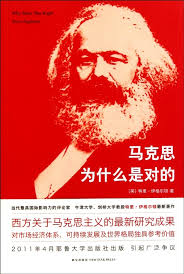

## Angel_Kitty的 plog 第十二周

今天是2019年5月19日，距离考研初试时间还剩216天，这是我考研正式开始复习的第十二周，寻思着明天似乎又是一个特殊的节日，可这又和我这个单身狗有啥关系呢( ⊙ o ⊙ )，当然还是祝愿有情人终成眷属啦。

这周也是刚考完Linux，唯一感慨的一点是 **卷子太简单** ，20分钟不到写完2个小时的卷子，学这门课简直是浪费我时间，好好的青春时间活活的被学校，被老师耽误了，这才是大事。虽然后面要考试的科目都挺麻烦的，说实话，对这些科目一点好感都没有，要不就是老师太水，要不就是画工图，想吐，这年头，都有 CAD 了，而且都大三了，还手工画图，这老师也太恶心了。

然后我 flag 还是立在这里，尽可能的每周看一本(闲)书，每周写个书评，书中自有黄金屋，不读书是不行滴，虽然这个 flag 从大一就立下过，坚持了一个月，然后就放弃了，大三现在又重新把它立起来，算起来，从现在算起到考研结束这段时间应该还可以读个十几本书的样子，这种感觉应该还是挺不错的，至少现在感觉还是挺好的，虽然看到认识的某些大佬已经到了开始做专业课真题的进度了，还是有点小慌的，其实我也挺心烦的，毕竟有考试压身，不可能说放开手来去做一些事情，所以得过且过就好，做自己想做的事情就行了。

本周内容概要：

- 本周的学习情况
- 师能不能成师
- 每周书评

### 本周的学习情况

说实话，最近学习状态、学习效果都不是很给力，周六团队聚餐，喝了点小酒差点不省人事，头痛欲裂，然后周末基本上都睡到了八点才起，简直罪恶无比，浪费了大好的早上，明明内心慌得一批，却又表面故作淡定，然后事实上又不愿复习，唉，难受(╯﹏╰)。

Completed some tasks：

- 好像就正儿八经的背了两页单词(因为花时间去看精读原著小说去了)
- 1000题完整的弄完了极限与连续
- 试着练了两天听写句子，惨不忍睹，应该多花点功夫在上面
- 看了两部经典的美剧
- 看了两部电影吧，Harry Potter 第四部和之前最想看的奇异博士，本周就不给你们推荐了，值得学习的地方不多
- 考完 Linux ，课程考试任务还剩5门 + 2门大作业，十五周周一考现代控制理论，离复(预)习时间仅剩两周

No Completed Tasks：

- 下周把1000题一元函数微分学弄完
- 下周也准备了一本书，关于互联网十年历程的，书还在路上，看完以后再做评判
- 下周把第一本原著给看完(尽力！！！)

### 师能不能成师

鲁迅先生曾经说过，真正的勇士敢于直面惨淡的人生，敢于正视淋漓的鲜血。虽然在这个没有流血的社会里，无形的刀刃往往有形之刃刺的更深更痛。

我曾评价过医生这个职业的病态，将这个社会带入到了一个病态的发展轨迹，但真正对社会造成最大威胁的职业是什么？是人民教师，这是一个比医生还要艰险，还要恶毒的一个职业。经过多年的思考，我总结如下：

> 医生是在物质层面上对你威胁最大的人，他能威胁的只是你一个个体，而老师则是在精神层面上对你威胁最大的人，他能威胁的是一整个群体。

在这个物质文明已经高度发达的社会里，精神层面的需求早已占据了极其重要的地位，孰轻孰重，一想便知。

我最瞧不起的是医生，因为很多医生没有医德，没有了救死扶伤的品质，利高于一切，这我早年曾经就说过，**没有永远的朋友，只有永远的利益。**你只不过是在物质层面上折磨一个人罢了，可我最深恶痛绝的还是人民教师，作为教师，你的一言一行，所作所为是影响着一代人的教育，影响着一代人的前途命运，而某些人民教师，我们就免为其然把他称之为所谓的"师"吧，`师 -> 施` ，因材施教，这个道理你们难道都不明白嘛，还要我这个乳臭未干的娃娃来教你们嘛？不要总是用你那明知是错误的教育思想，教学理念还不知悔改、轻狂自大的态度去训斥我们，别把学生当傻子，点破不说破，狂妄自大只会自取其辱，你们被评的那些职称，自己摸着良心说话，你们的资质够格嘛。我永远无法理解学生把 `Github` 读成`Gi thub([gɪθʌb])`，而老师还拍手叫好是一种什么样的心态，这是你在培养学生的创新能力嘛，在鼓励学生从错误的道路上越走越远？这种人又有何德何能能做我老师呢？

看看现在的00后都被教成什么样子了，一点礼貌都没有还不算，满口脏话，胡话连篇，又狂妄自大，在外沉默寡言，在内疯如野狗。娇生惯养，不学无术，成何体统。我担心00后的这批人将来执政，必将会是国家最危难的十年啊。

师者，所以传道授业解惑也。作为老师，要言传身教。技亦不如生，德亦不如生，还轻狂自大，无理取闹，要这种老师何用。

说句再比较极端的话，要知道，学生上的每一门课都是教了学费的，作为老师，没有理由说去强行要求学生要做什么事情的，我不交学费你也不会说善良到让我免费读书吧，不照样会把我赶回家嘛？虽说这笔钱最后都去教育厅了，国家也投入了不少，但中规中矩，从资本论阐述的角度来看，学生交的那笔学费其实足够全年的教育开支了，甚至乎学生一定程度上并没有享受到高昂的学费所带来的高品质的教育，某些老师不要把自己想象的很高尚，你有什么资格去谈高尚，高尚这一词配你简直是侮辱了伟人。生活中无时无刻没有在做交易，学生与老师不过就是在做商品的教育罢了，有时候我并非选你做我老师，只不过是学校强制要求的，仅此而已，我完全可以不做这笔交易，是不是这笔交易的钱可以退还给我呢？不能，老师照样要收你每节课的学费，并且还要自以为是的按照他所认为最公平的方式去做出评判，这原本是个极不公平的买卖交易，又何谈公平这一概念呢？听说某校某院有个女生因为搞毕设被导师逼到失踪，据说还上了热搜，但愿那女生平安无事才好。

### 每周书评

本周推荐的书籍是《马克思为什么是对的》

这本书是一本反驳之作。作者将十个最为常见的对于马克思观点的批评进行了一番反驳，试图来揭开人们对于马克思的误解。作者看待这些问题的角度更多的是哲学的或者是价值的，点明了一些马克思以及马克思主义的实践中为人误解的价值观，让人们深深体会到马克思对于人性的价值关怀以及对于民主与自治的认同，这些正是后来在苏联的实践中被严重扭曲的。

作者予以反驳的十个观点分别是：

- 资本主义自身的演化带来了阶级分化的淡化、社会流动性的增强，早已不是马克思批判的那个残酷的资本主义世界，马克思主义过时了。
- 马克思主义的实践必伴随着独裁暴政；自由市场的消失必然意味着人的自由的丧失以及物资短缺。
- 马克思的历史哲学中存在着一种历史铁律，一种宿命论，是对人自由意志的一种忽视。
- 马克思的共产主义社会是一种乌托邦，无视人性险恶，将人人设想为美好的个体。
- 马克思主义之中的经济决定论过于片面。
- 马克思的物质决定论表现出了对人的精神层面的无视。
- 马克思空想社会主义。
- 马克思宣扬暴力革命。
- 马克思主张建立全面强大的国家。
- 马克思的理论并没有适应新社会运动的浪潮，强调劳工运动的马克思主义已经不再是当今社会运动的主流。

事实上，每个观点都有其值得我们去客观的评价和反思的意义，大家可以先去思考一下以上这十个给予反驳的观点，每周如果有空的话就一条一条的，结合我自己个人的一些理解进行解读吧。其实我很推荐大家去读一下的，日后有时间慢慢道来吧，篇幅有限，来日方长。