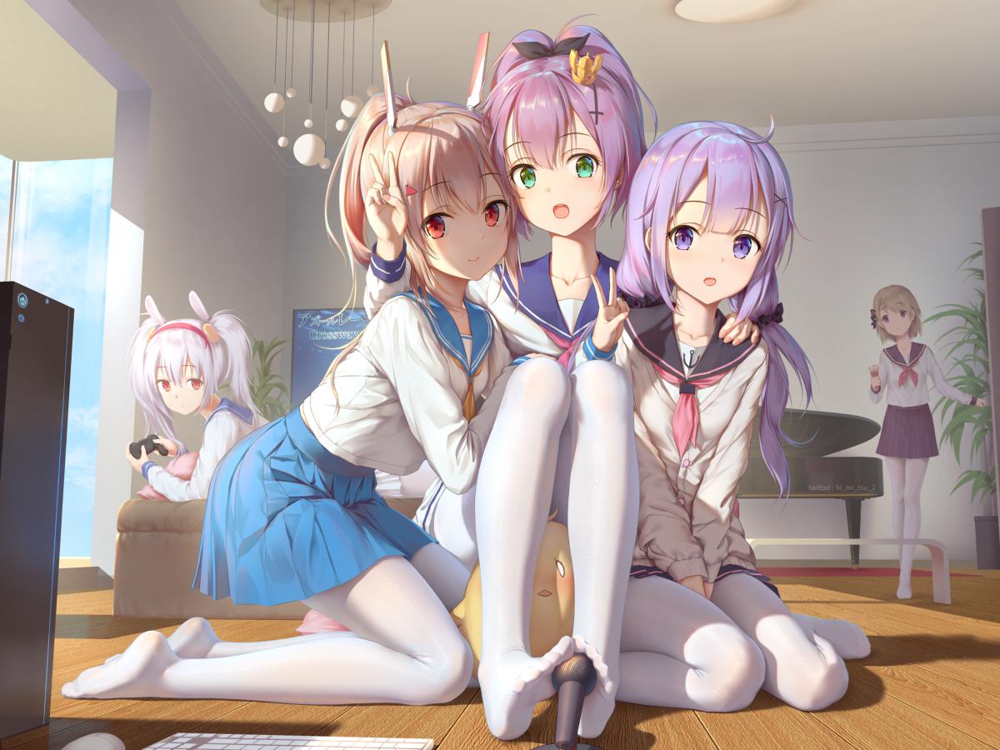

## Angel_Kitty的 plog 第十五周

今天是2019年6月9日，距离考研初试时间还剩 195 天，这是我考研正式开始复习的第十五周，首先祝大家端午安康，虽然在学校买个粽子还有点难？(主要是食堂的粽子不太好次，跑到外面找店又比较困难，找了好几里地才找到)不过还是家里的粽子好次。下周就开始下一门期末了，没怎么复习那门课(主要还是那门课是开卷，想想就懒得花那么多时间复习了)，期末主要是复习复习就很头痛，一点意思都没有，都是要背的东西，有时候我又一个人在想，干脆就不复习得了，可是考试过不了毕业证就拿不到啊，没毕业证我怎么考研啊，这些老师为难学生背这种对我以后没有任何意义的电路图，况且。。。电路图为什么要背？能看懂不就行了嘛？又不是设计电路图，不知道这些老师脑子是不是被驴踢了，这些还是得怪袁老先生，都喂的太饱了没事干，就只能折磨折磨学生。眼看距离考研准备的时间越来越少，不管最后说你在这过程中有多么多么努力，只要最后结果是没考上，我就是个彻彻底底的 loser，这些老师能为我前途负责嘛，能为我逝去的青春负责嘛，一样都不行！！！既然这样，都大三了，都要从这个学校离开了，你还想怎么样？况且我们的专业本身课程量就是别的专业的2倍有余，学分也比其他专业毕业要求要高不少，但实质上学的东西却非常的浅，雨露均沾的那种感觉。

有人说我天天就知道抱怨天地不公，事实上我只是觉得憋在心里难受，有些东西看不惯，总不能一直憋着吧，当然不理会是最好的，时间长了还是容易生病，到时候得了抑郁症就不好了。

好像到今天为止高考就结束了，回想一下三年前那个场景，至今我后悔不已，后悔自己没有再努力一点，再认真一点，咬咬牙，狠狠心，没有那种不上清北绝不认输的勇气，我是个废物，我如果早一点对自己的人生有个比较好的规划，也不至于沦落到如此的惨状。但是这一切只是如果。不过我估计我应该也许没有刚高考完的读者朋友吧，如果有，那就希望你能好好利用这三个月的假期，做一些自己想干却没能干的事情吧，结果在你交卷的那一刻已成定局了，不用去想太多，你该做的已经做完了，剩下的就是看天了。千万别像我一样，三个月沉浸在高考失败的阴影当中。

我心里很难受，难受的时候就喜欢上b站找找乐子，刷视频的时候无意间得到一位up主推荐的一本书，叫《丑陋的中国人》，我一不做二不休，立马就跑到书店淘到了这本书，后来和朋友聊天的时候就谈到了这本书的作者，好像挺有名气的，那个朋友家里是做生意的，他说他家里半个书柜都是他的著作，这一点让我惊叹不已。

这本书的作者叫柏杨，可能沿海地区中产阶级及以上的家庭可能对他了解的会比较多些。他是一个台湾作家，在他出版这本《丑陋的中国人》之前，他"享受”了十年的牢狱生活。他和鲁迅先生有着潜移默化的联系。

柏杨先生批评中国传统文化为"酱缸文化”，而鲁迅先生在100年前提出了一个染缸文化的概念。鲁迅说日本人在砍中国人的人头的时候，周围的中国看客却在笑着看热闹。八十年代人“在思考“染缸文化”的时候，他们在笑，因为他们不觉得这个染缸和自己有什么关系，那是别人的事。不知不觉间，他们成了那些看客。但是，“酱缸文化”却让他们笑不出来了，柏杨先生一针见血地指出了他们身上的国民劣根性。比如，错误与指责都是送给别人的，自己永远是对的，很干脆地告诉他们，中国人的丑陋，就存在于他们身上。这一次，他们笑不出来了。柏杨先生给了年轻一代新的思考角度，他们开始比较彻底地思考着中国人和中国人的文化。

鲁迅对国人“哀其不幸，怒其不争”，柏杨的观点更直截了当：丑陋的中国人！很值得我们90后这一代人去思考。

本周内容概要：

- 本周的学习情况
- 本周书评

### 本周的学习情况

我是最讨厌期末的，每到期末我就会迷失了自我，每天都不知道自己在干什么，明明事情多到做不完，那么多科目都没有复习，我却丝毫没有一点复习的欲望，时间就这么偷偷地溜走了，我每天生活在充满愧疚的世界里面，刷番睡觉，偶尔烦了又拿起和考试无关的书看了起来，颓了几天觉得该看书了，又拿起了我最不想复习的专业课的书看了起来，基本上是没看几个小时就睡着了，有时候觉得这样不行，就疯狂的寻找研友带我学习一波，而她们总是说，你是大佬，你不需要我带你学习的。。。有时候我的处境就很尴尬，赤裸裸的嘲笑。不过当然我后来也看开了，这一切的一切都是阶级矛盾产生的。马克思主义哲学告诉我们，消除矛盾的唯一办法就是更努力一点，变得再优秀一点，这样阶级矛盾就能彻底消除了。当你们都已经不在同一个阶级(层次)了，又何谈矛盾呢？比如说马爸爸昨天又赚了几个亿，你会去羡慕嘛，你显然不会，因为他赚几个亿跟你有什么关系，你们已经不是在同一个阶级下了，你们之间有相当大的差距，所以你不会因为他赚了几个亿而产生矛盾，而如果是你室友今天在地上捡到一百块钱，或者买彩票中了一百万，你们之间就会产生矛盾，为什么这种好事是发生在它身上而不是你，你就会心生羡慕甚至嫉妒恨。

不过还好这两天又好好反思了一下，又重新拿起了考研数学开始补上个月欠下的功课，一个月都没有碰过和考研相关的东西(除了英语)，说不慌那是假的，只能等这两周结束了才能稍微看点东西了。

## 本周书评

本周本来打算看几本的，有一本看了三天，实在没能看下去，还是我悟性太低了吧，所以本周我只看了一本，不过这本书我当然是力推，希望大家都能去看看，我也公开征求一些意见，也是关于我个人的一些评价，我不太确定我自己是个什么样的人，有人说好，也有人说不好，我其实更愿意多听取一些你们批评我的一些声音，我想知道我哪方面性格上或者行为上有问题，我很愿意接受指着我的言论。当年的腾讯，愿意去接纳一些忠言逆耳，而成为全国第一大互联网公司，而我虽不及当年的腾讯，但是我也愿意去接受一些忠言去做出改变，让自己变得足够的强大，如果你有问题，欢迎你在公众号后台留言，我会尽量在48h内处理这些留言的，欢迎批评。

《丑陋的中国人》

我觉得，这辈子能有机会读到如此"真实"的书，也是前世修来的福分吧，我相信这本书如果晚个五到十年，极有可能不会上市吧。

前几天有个朋友把我批斗了一番，说我总是喜欢把自己的想法压在别人身上，说我们是同龄人，别老把对于她来讲一些不值一提的事情挂在嘴边，觉得我这样只是在干预她的正常生活，给她带来了太多的负面情绪。当时被她说了一顿，我懵了好一阵子，于是乎我就没在去说些啥了。我也很仔细，很认真地去思考着这个问题，后来读到儒家思想中提到的《春秋》责备贤者这一现象，我才恍然大悟。孔丘先生也并非圣人，他也曾经产生了这种畸形的观念，并且这种观念扎根于儒家文化之中，这可能是勉励"贤者”更上一层楼吧。这就好比你爸妈打你的时候总是会说你是我的孩子，我才会打你，你若是别人家的孩子，我管都不会管你之类的话，这是一种很严重的诛心论的观念，这样造成的一个直接的后果就是天下没有一个是好人。

"责备贤者“与”嫉妒“在本质上是一样的，都是在鸡蛋里挑骨头，但形式上却大不相同。“责备贤者”因为有其华丽的外表，所以就更加的恶毒，害人。其实这也给我们提供了一个很值得我们去思考一个问题，我们该如何去教育我们的下一代。从小缺乏父母家人关爱的孩子，在它的成长过程中可能更多的需要是鼓励，需要的是无微不至的爱，如果这个时候我们盲目的生搬硬套儒家思想文化，极有可能会得到适得其反的结果。教育问题始终是我们国家自始至终尚未解决的一个根本性的问题，这需要的是我们的共同努力。

当然书中主要提到的是中国传统文化的劣根性。就比如说中国人不喜欢承认错误，中国人不团结，中国人自私等等，我觉得整本书就是把中国传统文化的缺点放大化，而把西方文化的优点也进行了放大，使得中西方文化的差异形成了非常鲜明的对比，虽然有些不妥，但句句刺痛人心，句句都是值得我们去努力的反思，去揣测，我觉得单从这一点来讲，这本书算是在思想上跨世纪的著作，非常值得我们去阅读，去理解，去反思。