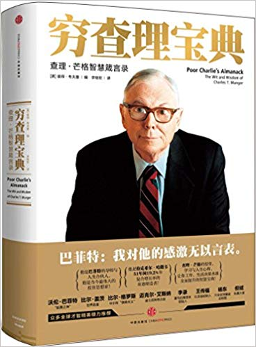

## Angel_Kitty的 plog 第十六周

今天是2019年6月16日，距离考研初试时间还剩 188 天，这是我考研正式开始复习的第十六周，好巧啊，今天刚好是父亲节，祝愿全天下的父亲节日快乐哈～

于是乎，这篇文章写在我考试的前两天，虽然我复习(预习)都还只是刚刚开始，但是，立的flag断不能倒，冒着挂科的风险都得要写总结，多阅读，结果这周考完两门后，自己都感觉有点悬，难受，讨厌期末。

这周其实没有太多可分享的东西，也许是我忘了要分享啥了，一时半会儿也想不起来，只不过被考试困扰了许久，只要平安度过下周，一切会过去的。身边很多小伙伴都已经考完了(不晓得唯独我们专业考试为啥这么多)，考完以后一定要多读几本书。这几天某东某宝某当都在搞活动，所以我购置了一大批的书已备后期做大量的阅读，我提前透露下接下来要看的书单，有兴趣的可以趁着降价购置一些：(有些书的价格比较贵，所以还是趁活动的时候购置比较好些，我看的书单一般都是来源于一些大佬的推荐，仅供参考)

- 穷查理宝典(这书价格有点贵，毕竟据说这书本来就是卖给富人看的，不过很建议购置，查理芒格最重要的三场演讲还没看，不过很极力推荐)
- 乔布斯传
- 富兰克林自传
- 想象的共同体(推荐度似乎比较高，不过这书价钱也稍微有点小贵)
- 增长黑客(范冰版)
- 增长黑客实战
- 增长黑客(肖恩版)[未购置]
- 硅谷增长黑客实战笔记[未购置]
- 黑客与画家
- 物种起源
- 时间简史
- 相对论
- 莎士比亚全集(这书完全就是捡漏了，2折左右的价钱购置，邮费估计都挺贵的，买来不吃亏不上当)
- 中国近代史(全两本，好厚的说，预估可能有1k页左右，稍微翻过一下，大白话)
- 南渡北归(全三本好像是，我猜估计得有2k页，这书价钱也是超级贵，不过推荐度挺高的，后期看完再做评价)
- 经济学原理(微观经济学和宏观经济学)[未购置]
- ……..

以上列举书目不一定完全，当然我也不确定有些真的有点厚，而且有些书价钱确实有点贵，书友们可以量力而行(虽然这年头基本上都用kindle看电子书了，没啥人会去买纸质书)

本周内容概要：

- 本周的学习情况
- 本周书评

### 本周的学习情况

不得不说，考研进度又延后了一周，不过日子也熬到头了，度过了下周应该会好些了，至少可以稍微看看考研的书，虽然考研的书一页没看过，单词一个没背过，电视剧倒是看了不少，不过确实可以推荐大家看看，纯正的英英，《Downton Abbey》，这部连续剧很早就有人推荐过，一直都没时间看，这个练听力还是比较好的，一集大概一个小时的样子，好像有六季，今年好像准备拍个大电影，如果有时间的话可以去电影院支持一下。

## 本周书评

这周读了两本书(准确的说是1.5本，有一本是分了上下册的)

1、《社会契约论》

这本书谈到了五个方面的问题，公民、主权者、执政者（政府）、法律和立法者。也正是这五点，便构成了任何一个人类社会的全部。

公民，是每一个自然人。在社会没有形成之前他们拥有自然赋予的各自的自由和财富——那是一种不受任何约束的自由，他们可以做任何他们想做的事。然而当社会形成的时候，便是每一个自然人自愿的与其他所有人订立了一项社会契约，他们放弃了身为自然人的部分自由，从而换取了和平、安宁、稳定，总而言之，换取了他们的自由不被他人侵犯的权利。因此只要公民还在社会当中享受这些权利，并且愿意继续在这个社会当中生存，社会契约就是永不能被打破的法则，否则他们就成为了异乡人，成为了敌人。

主权者，不是指某一个掌握权力的个体，而是所有公民意志的整体，是公意。主权者是不能被选举或者赋予的，更不是被任何一个人任命的，主权者从来也只能是公民本身。然而正因为主权者这样的身份和存在，决定了主权者本身是不具备任何的行动能力的。它不可能自己去统治和管理自己的人民，因为让一个人去管理自己是荒谬的。于是在主权者和公民当中需要一个纽带，通过它来实现对公民和社会的治理和维护，也正因此才诞生了政治活动。这个纽带，便是执政者，也就是我们通常意义上的政府。

政府本身是不具备任何的权力和职能的，它的一切权力都是被主权者赋予并且是代为执行的，主权者可以在任何时候更换或者废弃一个它认为不合适或者坏的政府。政府有三种存在形式：民主制、贵族制和君主制。民主制的政府里每一个公民都是实际的行政官员，都担负着社会管理的使命和职责，这样的体制除了在个别极小的国家里是不会真正存在的。贵族制则是通过选举的方式产生执政者，那些或具有高尚的情操或具有无比的智慧或具有众多的财富的被认为能力超群的人们往往被选举成为这样一批与众不同的官员，这种体制在西方的一些古代帝国（如古罗马、斯巴达人）以及现代西方的不少民主国家中存在。最为常见的，则是君主制，也就是只有一个人，我们一般称之为国王或者君主的这个人是唯一的真正执政者，所有的社会治理都只有这一双手来决定和执行。而由于我们知道，真正的民主制是不存在的，后两种政府都不可避免的遇到一个问题——那就是身为政府的个人意志如果与主权者的意志互相冲突（我们知道这是很正常的事情），那么政府就完全有可能利用他们的特权去倾向于实现个人的意志而违背公意，这样一来腐败就开始滋生，最恶劣的情况便是政府开始试图篡夺属于主权者的权力。于是就需要法律来规范政府的活动。

法律，是一切社会活动的准绳和原则，不但是公民在社会当中规范自己的唯一参照物，更是政府管理的唯一标准。政府在代主权者行使权力的过程当中如何控制和监督，如何确保政府能够真正的按照主权者的意图去治理国家和社会，于是只能根据充分反映公意且得到全部公民认可的法律。无论是所有人（民主制）、少数人（贵族制）还是一个人（君主制），只要他是在按照法律管理国家和社会，那么他就还是在为民众服务，可以被视作一个好的政府。于是自然会有越来越多的政府试图自己制定法律，以便为他们行私利找到最完美的借口和理由，于是法律由谁来制定便是最为关键的问题。

谁有资格充当立法者？这可能是最困扰人们的问题。首先，肯定不能是政府，政府是执行和维护法律的角色。如果法律可以由政府来制定，那么政府的权力将无法控制和约束。但是，也不能是主权者。因为主权者就是公民本身，而法律却必须是反映全体公民的利益和福祉的。制定法律的难度不仅在于它必须绝对的公正和客观，更在于它必须富有足够的远见和智慧。因为很多利益在当下是难以被体现和发觉的，而法律却必须要求立法者能有更加长远的眼光去为了民众长久的利益而着想。因此，立法者从来都只能是社会中那些具备最高贵的德行和深邃的智慧的真正伟人来担当。而那些最古老的法律由于完全没有任何一种办法可以被证明为正确并令人信服，所以往往不得不借助于神明的力量来赋予其正当合法性。

2、《穷查理宝典》

这本书主要讲的是查理芒格的独创的生活、学习、工作、哲学和决策，处处充满了智慧。

对于生活，我们追求朴素，一切从简：我们赚钱，靠的是记住浅显的，而不是掌握深奥的。我们从来不试图成为非常聪明的人，而是持续地试图别变成蠢货，久而久之，我们这种人便能获得非常大的优势；我们并不自称是道德高尚的人，但至少有很多即便是合法的事情，也是我们不屑去做的（有性格的人才能拿着现金坐在那里什么事也不做，我能有几天，靠的是不去追逐平庸的机会。）；所以对于谎言，我们的办法很简单——说真话，将无需记住你的谎言——就这么简单；满足我们已经拥有的：在生活中减少物质需求——你不需要很多物质的商品来满足自己大量愚蠢的需求（这些需求自然会很快消失）；在生活中不断培养自己理想性格（投资性格）：毫不妥协的耐性、自律，自控——无论遭受多大的压力也不会动摇或者改变原则。

对于学习，有关我们在学校的教育，我们必须要认识到其局限性。很多聪明人之所以会犯错，大概是他们没有掌握所有重要的模型，把它们当作检查清单，用来审视各种复杂系统的结果。我们不能依照你们教授传授的方法来学习。你们应该学习他们传授的一切，但你们还应该学习许多他们没有教的知识——因为这些教授们并没有正确地对待他们自己的学科。大多属于教授用一个假定来解决这个问题：“如果我不能用实验来证明它，它就是不存在的。”然而，他们的假定明显是愚蠢的，如果有的事情在生活中极为明显，但很难通过容易做的、可重复的学术实验得到证明，这些的讯菇犬就会忽略它。如果有些东西非常重要，但由于道德约束，你们无法完美而准确地证明它，那么你们也不应该把它当作是不存在的。你们必须经历而为，利用现有的证据去证明它。而在你学习了心理学之后，你也要注意：装备基本的心理学力量的技巧（也就是说当你知道该怎么做）之后，你们必须依据道德规范来调整自己的行为。并不是你们懂得如何操控人们之后，就可以随心所欲地去操控他们。如果你跨过了道德的界限，而你们试图操控的那个人因为也懂得心理学，所以明白你们的用意，那么他就会恨你们。    

对于工作，我们应该不兜售你自己不会购买的东西，不为你不尊敬和倾佩的人工作，只跟你喜欢的人同事。

对于投资，投资股市最大的风险其实并不是价格的上下起伏，而是你的投资未来会不会出现永久性的亏损。单纯的股价下跌不仅不是风险，简直就是机会。不然那里去找便宜的股票呢？有些人的个性天生就不适合投资，他们要么过于焦躁，要么缺乏耐心。我认为优秀的品性比大脑更重要，你必须严格控制那些非理性的情绪，你需要镇定、自律，对损失与不幸淡然处之，同样地也不能被狂喜冲昏头脑。只有当你具有较好的个性（主要是指你非常有耐心），拥有了足够的知识后，势必进行大规模进攻，然后就会慢慢学会游戏规则，部分通过实践，部分通过学习别人的经验。显而易见，你能从别人那儿获得的启发越多，你的情况就会越好。

对于哲学，在做事情之前，先弄清楚应该别做什么事情，然后才会考虑接下来要采取的行动——我只想知道我将来会死在什么地方，这样我就可以永远不去那里了。迅速歼灭不该做的事情，接着对该做的事情发起熟练的、跨学科的攻击，然后，等合适的机会来临——只有当合适的机会来临——就采取果断的行动。

对于决策，认识并适应你周围世界的真实本质，不要指望世界会适应你。不断挑战和主动地修正你“最爱的观念”。认清现实，即使你不喜欢现实——尤其是你不喜欢它的时候。

当然查理芒格的智慧不仅仅是我上面所提到的这些，还有很多很多，真的是很值得阅读，当然更有条件的人可以买原版的读一下(原版的据说要$100+)。