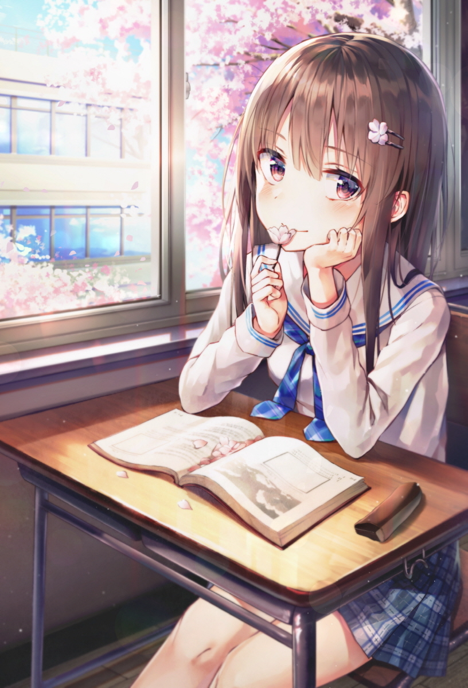
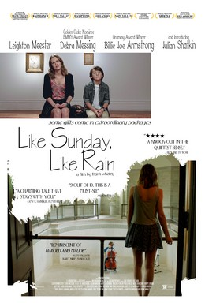
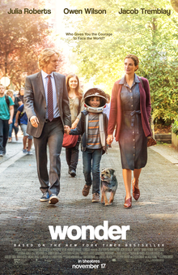

## Angel_Kitty的 plog 第十周

今天是2019年5月5日，距离考研初试时间还剩 230 天，这是我考研正式开始复习的第十周，五一已经结束了，本学期最长的一个假期结束了，十二周得开始期末考试了，可能从十一周开始大多数时间都得准备期末了，考研的任务得稍微放放了。五一假期过的还算充实，虽然任务还是差了一大截没有完成，大概就完成了一半左右，还算是没有太虚度这最后的假期。

本周内容概要：

- 本周的学习情况

- 重温三国的一些新领悟
- 本周推荐的电影
  - 《Like Sunny Like Rain》
  - 《Flipped》
  - 《Wonder》

### 本周的学习情况

本周按照上周给自己定的目标来看，完成的进度还算过得去，中间有一天帮别人干活改论文去了，小赚了300大洋，然后出去玩了一天，在实验室补了三部美剧，所以进度上确实是有所怠慢了，不过对英文的感觉是越来越好了，算是找回了一些状态了，下面来说说本周完成的一个情况吧。

Completed some tasks：

- 清华大学郑莉的 C++ 程序设计课程全部过完了一遍，作业和实验需要花一段时间来补上，内容多，而且确实是有很大一部分内容从未接触过
- 串了一遍词根词缀
- 熟练掌握 LaTex 公式的编写(帮别人改论文的时候温习了一遍)
- 徐涛的史纲和思修基础过完了
- 看完了三部经典的电影，可能是本年度最后一次推荐电影了，以后会不会推荐得看复习情况了，个人感觉后面不能再花很多时间看电影了，感觉会影响后期的复习进度

No Completed Tasks

> 以下将会是五月份一整个月需要去完成的任务

- 每天背 4-5 个单元单词，一个星期完成一遍考纲单词的背诵，持续四周
- 清华大学郑莉的 C++ 程序设计课程的作业和实验一周补一个单元，每周写个知识点小结
- C++ primer Plus 紧跟 C++ 课程复习的进度，抓紧时间多看一点内容
- 计算机网络每周跟进一个单元，一个月完成整个课程的复习
- 数学完成1000题的高等数学上册部分
- 一周背诵两篇英语大小作文(大作文一篇＋小作文一篇)，先坚持四周看看

### 重温三国的一些新领悟

可能有些朋友会好奇，既然你每天复习这么忙，怎么还会有时间看电视剧呢？是的，复习期间看一些对考试没用的东西确实是大忌，不过每次重温永恒的经典，站在不同的时间段，总是会有一些新的想法，新的高度去看待历史的万千。

我记得我小时候，对曹操是特别的崇拜，因为我觉得曹操是个特别有想法的枭雄，一言 "宁可我负天下人，不可天下人负我" 名扬天下，一句 "对酒当歌，人生几何" 足以看出其雄心壮志；长大后，对刘备的仁义所折服，一届织席贩履之辈，却能赢得五虎将，孔明凤雏等多位义士誓死追随，尤其是从新野败北逃亡至江夏，全城的百姓都愿意追随他而去，正所谓得民心者得天下，刘备的这份胆识，让我佩服不已。

而现在，站在一个更高的高度去考虑其治国安邦之策，学习一些前人的经验教训，我能够明白，为什么曹操的雄才霸略没有能够一统天下，止步于中原；而又为什么刘备的仁义之道却也没能兴复汉室，为什么最后会被司马家族夺得胜利的果实呢？试想一下，两种不同的治国之道，却都没能收复天下，这是为何？世人都说，孔明凤雏二者得一即可安天下，可是刘备得了俩却都没有办法平天下，这又是为何？反思历史的真与假，对与错，或多或少都有些许值得我们学习的地方。

我曾思考了许久，把曹操的治国之道和刘备的治国方略结合起来，不正是印证了我们正践行的马克思主义中国化的道路嘛？不正是毛泽东思想的真谛之所在嘛？

试想一下，古代打仗，武力靠的是兵强马壮，没有军事力量何谈一统天下；而打仗带来的后果必定是要消耗大量的人力物力财力，这些东西哪里来，都是从老百姓那里征收过来的，如没有民心所向，老百姓又岂能愿意服从；一旦发生灾害，如若没有充足的余粮钱财，又岂能救济全天下的百姓？打仗虽然胜利了，如若不能收复民心，凝聚民心，则天下不久还是会陷入一片混乱。

> **军力可以平天下，财力可以救天下，仁义可以安天下。**

老毛那个时代可以印证上面的那些说法，把老百姓始终放在第一位，这是安民；努力去增强自己的军事力量，去搞原子弹，这是军力。

而老毛那个时代犯下最严重的错误就是不懂商，缺乏财力，不懂商就没有资金的流动，那个时候我们处在社会主义的探索阶段，犯下了大跃进，人民公社化等不可弥补的过错，足以说明，老毛当时的远见还是过于狭隘了，人非圣贤，孰能无过？后来老毛也反思过了自己当年的过错，并且也提到了我们要改革开放，要吸收外来的资金去把经济给提上去，这是老毛的远见，可惜老毛没有办法能够看到现在发展壮大的中国，这样他老人家的在天之灵也可以安息了。老毛是我一生中最为敬佩的一个人。

历史始终是有很大的警示作用，我们要吸取前人的教训，多反思，多调整自己的策略，才能始终让自己处于不败之地。我觉得现在的大学生(包括一些拿薪水的上班族)，缺乏的就是这样一种能力。我觉得现在的学生只是一味的流于形式，流于考试，试问一下，都读了这么多年的书了，每天为了那几个分数，几个死工资，累不累啊。你们有没有想过，你读这么多年的书，到底是为了什么？为了拿到文凭，毕业找个好工作？为了保研考研留学出国做准备？流于面子，为了父母为了老师争光争彩？难道你们不觉得这样活着很累吗？难道你们没有一点点想法为自己而活下去嘛，为梦想活下去嘛？

我每天都会不断的反思我自己，今天我做了什么？今天我的付出能不能对得起我说花费的这些青春，这些时间？既然要学东西，既然你来到大学，既然你已经是个成年人了，你就需要对自己的一言一行负责，仅仅是为了考试去学东西，我觉得这只是流于表面，流于形式的东西，你去应考，然后取得了很好的分数，这对你来讲真的已经足够了嘛？未必。会考试算什么本事，应试考试都是有技巧可言的，考完以后就什么都不记得了，这能说明你的本事嘛？最后到头来你还不是要按部就班，规规矩矩地重新学一些东西，重新捡起你曾经学过的东西，与其如此，何不多花点时间，去站在一个更高的层面上，解读这门学科，甚至这个领域所特有的魅力，哪怕只有一点点也好。时间真的不多了，最黄金的年龄就只有那么短短的几年，与其浪费时间去流于那些套路形式，不如多花点时间去做点你想做的事情，人生苦短，白驹过隙，珍惜你现在所拥有的一切，珍惜眼前的你我。

## 本周推荐的电影

本周还是惯例推荐三部经典好看的美剧，这可能是本年度最后一次推荐美剧了，以后会不会推荐取决于我的复习情况，所以大家加油啊。

1、《Like Sunny Like Rain》

我觉得这是一个非常简单非常平常的故事，它只是简简单单的，记录了女孩和少年的一次相遇和别离。这是个关于孤独，陪伴，音乐，阅读，重新认识自我和爱的故事。

生活中有些人和你相遇，一起分享生命中的一段时光，然后匆匆离开，或许再无交集，但他/她对你的影响却一直留存下来，让你成为现在的你。

每个人都很孤独，在我们的一生中，遇到爱，遇到性都不稀罕，稀罕的是遇到了解。如果有一个人能帮你找回生活中的热情和梦想，他一定是值得珍惜一辈子的人。似晴天般温暖，似雨天般忧伤，平静如流水，却沁人到心田。

最治愈人的不仅是能冲淡一切的时间，更可以是书籍和音乐，还有对生活的希望。

2、《Flipped》

电影名翻译为怦然心动，我也是真的怦然心动了。一对小孩，一棵树，特别简单的故事。

曾经听说过这样一句话：我一直相信，这个世界上是有一些爱情如同宿命般无从逃避，不可取代，色授魂予，需以性命相拼。

我们每个人总是会有先入为主的意识，当你遇到那个人的时候，你才能体会到那种感觉。就是那种日思夜想辗转反侧，为一双迷人的眼睛着迷，或者偷偷地闻着某人干净的肥皂味道的格子衬衫，或者是偷偷期待那双纤长厚实的手可以把自己的小手握在掌心。就是那种电光火石般的火花，那种噬魂彻骨的疯狂，那种把世界一切染上光辉的爱慕，只靠思念和期待就能生存的情愫。我们能够在心里把一个人美化成那个样子，能够把他的缺点看成可爱，能够因为一个眼神一个笑容而颤抖颤栗，觉得他的声音婉转动听，他的名字所组成的音符也是那么悦耳。当你遇到那个人的时候，你突然明白一件事，原来生命可以美好成这个样子。正如电影中Brace的外公说：

> Some of us get dipped in flat, some in satin, some in gloss.... But every once in a while you find someone who&amp;amp;#39;s iridescent, and when you do, nothing will ever compare.
>
> 有的人浅薄，有的人金玉其表败絮其中。有一天 你会遇到一个彩虹般绚烂的人，当你遇到这个人后，会觉得其他人都只是浮云而已。
>
> **精辟的翻译：**有人住高楼，有人住深沟，有人光万丈，有人一身锈，世人万千种，浮云莫去求，斯人若彩虹，遇上方知有。

我很开心，人性里还存在着这样美好的诗意的情怀，让我们互相点亮了彼此的生命，让这个越发暗淡的世界时不时地显得那么温暖美好。

让我们在容颜老去，失去梦想的能力之时，还能够在心里点起一盏小灯，让诗意从心底蔓延出来，化作嘴角边一抹不老的微笑。

3、《Wonder》

电影名叫奇迹男孩，这部电影表面上说在讲述畸形男孩在遭遇校园霸凌后，在朋友、老师和家人的鼓励下，一步步成为“榜样学生”的故事。但实际上，导演是把故事的权重平均分配到每一个角色当中，以不同的角度去观察并影响畸形男孩的生活，通过这个角色彼此之间的共鸣，来促成 **奇迹** 的诞生。

影片以章回体的形式去展开情节，每一个角色的身上都承载着一个主题。

电影中有两种偏见，第一种偏见是因为男主人公奥吉的外貌而否定他的一切；第二种偏见是以自我为中心，把自己看到的当成真相，忽略了自己没看到的。这两种偏见本质上都是一样的，都是只看到了事物的表面，没有全面地看待问题。

时间是一剂最好的良药，没有人是完美的，每个人或多或少都有外在的缺陷，我们很可能就是以上弱势群体当中的一员。而且很多时候，我们不仅是弱势群体，也是旁观者。

对于旁观者，放下偏见，去发现对方好的一面，就能让世界变得更加美好。

对于弱势群体，愤怒只会招致更大的愤怒，如果像男主人公奥吉那样以德报怨，或许就会被友好相待。毕竟想要得到别人的尊重，首先要学会尊重别人。

正如电影中那句经典的台词所说：

> When given the choice between being right or being kind, choose kind.
>
> 如果要在正确和善良中做出选择，请选择善良。

“以貌取人是不对的”，这是人人都知道的道理，但道理大家都懂，真正想要做到却很难。想当年三国凤雏样貌丑陋也并没有阻挡他的才华，刘备星夜奔驰为请庞统相助。以貌取人，以及主观判断都是偏见，而解除偏见的办法就是换个角度看待问题，花时间精力去感受对方的内心，发现对方的优点。正如男主人公奥吉最后演讲中说的两句话：

> Maybe if we knew what other people were thinking, we'd know that no one's ordinary. And we all deserve a standing ovation at least once in our lives.
>
> 如果我们了解别人的想法，就会知道，没有人是普通的，每个人都值得大家站起来为他鼓掌一次。
>
> Be kind, for everyone is fighting a hard battle. And if you really wanna see what people are, all you have to do is look.
>
> 善良一点，因为大家的一生都不容易。如果你想真正了解他人，你只需要用心去看。