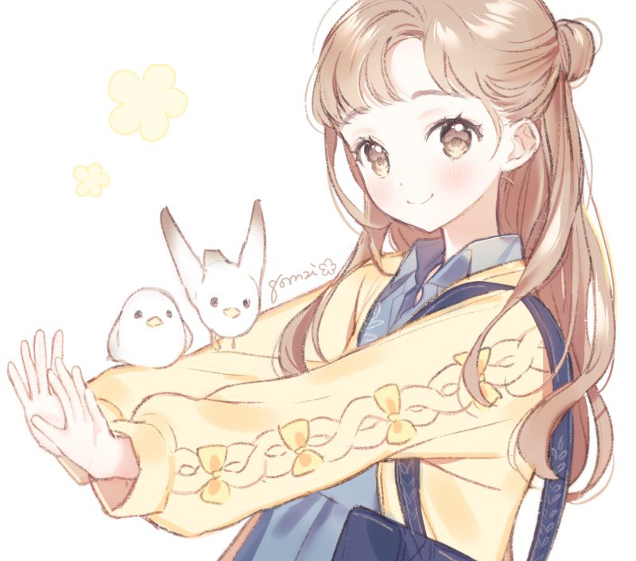
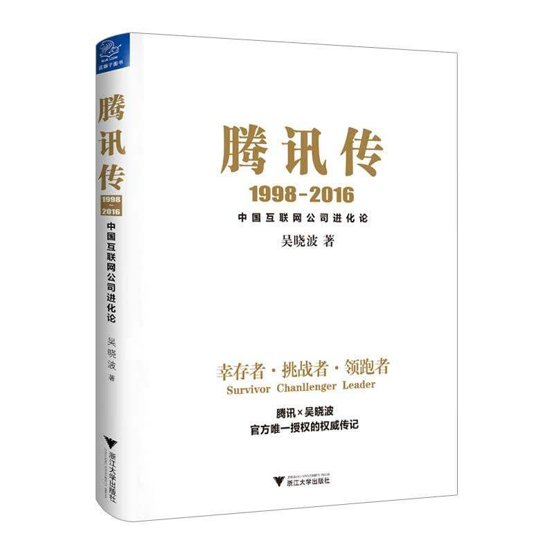
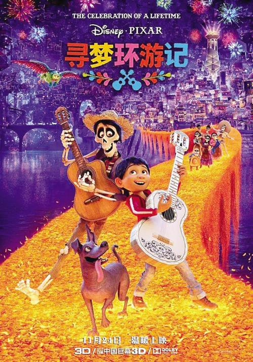

## Angel_Kitty的 plog 第十四周

今天是2019年6月2日，距离考研初试时间还剩202天，这是我考研正式开始复习的第十四周。好吧，已经基本不能叫考研复习了，完完全全在准备期末考试了，期末真的是很折磨，很摧残一个人的意志，每天背着那些恐怖的电路图，画着那些可怕的工图，完全没有给自己放松的机会啊，然后我选择做一件很疯狂的事情，做大量的阅读工作。大一的时候，我曾经立下flag，说每周要看一本书，可最后呢，只坚持了一个月，所以我觉得在这一年的考研复习时间，我觉得我需要好好沉淀一下自己，既然不想复习，又没办法专注于复习考研，那就做点疯狂的事情吧，阅读，说不定看着看着就有了复习的欲望了呢～

于是我开始计算我到现在为止我欠下的债，我希望尽可能我把债给还清。九月份开学到即将到来的九月份，我大概要看36*4=144本，掐指算一下，也就看了个零头吧，我很愧疚。再加上这周读了一本新东方一个英语老师写的一本自传，那个老师回忆录中提到她一年读了三书柜的英文原版书，现在那个老师年薪已经上千万了。

很多人也许都没仔细去想过，你为什么不如清北的学生，你为何毕业只能拿着两三千的工资养家糊口过日子，你为什么不能挤入上流社会，而只能甘愿被资本主义所压榨。也许你离哈佛就只差这三书柜的书，也许你离年薪千万只差这三书柜的书，也许你离梦想的距离只是这三书柜的书。

我曾以为我写出的文字，说过的话没人会在意的，我一直以为自己只不过是班上最叛逆，思想最反动的学生而已，从来没有奢求过任何一个人能记得我，因为我，只是一个很普通的人，只是一个很不值得一提的忧郁的孩子，也从未想过有一天我竟然会深深的伤透了一个人的心。

六一那天吃饭的时候，她跟我聊起了公众号的那些事，看得出来，她其实很难过，有些事情似乎不知道该如何向我表述，她只是轻描淡写地说了一句，“你之前有一次的文章，我读了两遍，其中一句话，让我心里很是难受，因为这事一宿没睡。”而我像个没事人一样，淡淡地问了一句，“我说了什么啊？” “**这个学校没有你留恋的任何人，任何事，离开了这个学校，我会把它忘得一干二净。**难道我不算是你的朋友嘛？”我心里疙瘩了一下，我一时间不知该怎么回答这个问题。我当时觉得可能只是比赛的时候认识的吧，觉得比完以后可能就各自远走高飞了，只不过是个过客罢了，何必要在意这些呢？事实上，我并没有想到她竟会在意这些，生活上明明都没有任何的交集可言，她却似乎很在意这些，似乎又很想了解这个充满未知谜团的我，就好像是我这个无情的人重重地刺伤了这个天真而又善良的孩子的心。我第一次体会到了难过，体会到了伤害到别人，内心的这种焦灼感，但似乎却又有些庆幸，庆幸这个世上还有人可以记得我，庆幸我不会真正意义上的死亡。正如《寻梦环游记》中所描述的场景，如果一个人真正意义上被人遗忘，那这个人真正意义上从这个世界上消失。我顿时明白了生命的意义。**生命的永恒不在于你能在这个世界上苟活多长，而在于你能在世人的心中存活多久。**我并不是一个人，我其实很快乐。

**人生就是一次次幸福的相聚，夹杂着一次次伤感的离别，我不是在最好的时光遇见了你们，而是因为遇见了你们，我才有了这段最好的时光。**

本周内容概要：

- 本周的学习情况
- 每周书评
- 推荐电影

### 本周的学习情况

我也很深刻的反思了这段长达三个月的复习，因为马上要跨入倒计时200天的大门了，我需要总结一些这近百天的复习情况。

情况似乎并没有想象中的那么好，一门一门的来讲吧。我们先从英语来讲，虽然是复习了百来天的英语，但是似乎英语在各项能力上并没有得到一个实际性的突破，可以这么说，这三个月的努力几乎等于0。学语言最重要的就是听说读写，我尝试疯狂地去练习听写句子和文章，却没有得到任何的成效，我也在不断地反思自己，听力的问题暴露的其实很明显，主要是以下三个问题：

- 发音敏感度
- 记忆粘性
- 反应能力

我为什么不能做到看美剧脱离字幕组，裸听就能听懂，我觉得还是我学习方法上存在一点问题，但更多的还是输入不够多吧。

其次是说，我在口语这块不能表达的非常的地道，主要原因我也尝试分析了一下，应该是我没有去转变我的语言思维，我总是喜欢用中文的思维去理解英文，没有一套非常系统的美式或者英式的思维方式，没有形成英语母语的思维，其次是积累的太少，归根到底还是输入太少。

接着是读，阅读这个问题，很明显是词汇量的问题，而词汇量存在一个最大的问题就是场景应用，我只是侧重于去记忆单词的读音与拼写，却忽略了词汇的场景应用，我把背单词当做一种任务一样，有一种感觉就是单词背了跟没背一样，背了也不会用。

最后一个是写，背了那么多的单词，最后发现写作文用的还是小学初中的一些词汇，就感觉一点儿都没长进。语法在这三个月的复习是有所提高了，掌握的比较清楚了，最大的问题就是没能将这些语法转化成语感，语法只是鸡肋而已。

其次是数学了，数学虽然已经把数学二和概率论的部分内容稍微过了一遍，事实上仅仅只是回顾了一下过去学的东西，但是没有集中花时间进行大量练习的训练，所以事实上只是在做自我安慰而已。

再说政治，其实最不担心的应该就是政治了，因为每天都在说，每周都在谈，每周都在阅读，修养境界只会一天比一天高，而且我也发现，哲学的很多文字我不需要背诵，看一遍就能把它记住，还能跟别人讲一遍，感觉上好像做到了那种过目不忘而且还理解的比较深刻的那种境界了，我很庆幸自己终于有门课不用操心了。

最后就说说这专业课的问题，事实上，专业课基本上还没开始动笔，对我来讲，压力其实是挺大的，本身我是非计科班的，再加上学校大量课程考试的压力，我复习的时间被大打折扣，我甚至对考任何大学都很没把握，我心里特别的乱。我并不擅长背诵，一切都是被逼出来的。我也不想做这些无聊的事情，那样只是耽误我追梦的道路。我只是希望能够平安的度过六月，让我安心的复习沉淀。

Completed some tasks：

- Harry Potter电影第七部上和下都看完了
- 看完两本书

No Completed Tasks：

- 把三门考试课复习完，期末了！！！(十五周有一门考试，十七周有两门考试+一门大作业，十八周有一门大作业，十九周有两门考试)

### 每周书评

1、《新东方带给我的不止是年薪百万》

我很推荐大家看看这本书，这本书的作者是位新东方的英语老师，这本书算是她的自传，回忆她这么多年是如何一步一步走向人生的巅峰，她的很多观点我其实是非常认同的，我相信一个道理，就是 **一个人之所以能成为伟人，一方面源于他所作出的杰出的贡献，更多的我觉得是来源于他自身的人格魅力**，这种人格魅力是由内而外的，字里行间透露着知识分子的气息。一个工人和一个知识分子并排走，你很容易就能判断哪个是知识分子，书读得多永远不会是件坏事，读书人的那种气场是压不住的，我们为什么不能成功，我觉得其中一个原因是我们读书读少了，从我接触了解到的企业家来看，他们平均每人每年会读上20本书来充实他们的生活，而你又为什么能说不行？

2、《腾讯传》

这本书主要讲述的是腾讯是如何从一个创业公司一步一步变成现在国内最大的互联网公司，由于篇幅有限，在这里我不能完整的进行叙述，不过我读完一遍，我几乎能完整的复述腾讯的历史以及对腾讯的一些成长岁月有一个客观的认识(这一点能力不知道是什么时候开始拥有的)，如果有机会，我可以跟你讲上个一天一夜，我一定是个不会让你失望的人，如果你愿意听我讲的话。

1998年，腾讯这家不起眼的小公司在深圳成立。近20年来，它一步步成为中国即时通信的霸主，进而成为整个互联网的霸主。2005年上市到现在股价创造了上涨超过400倍的奇迹。这些年，腾讯的崛起见证了整个中国互联网的发展。我们见证了整个过程，腾讯的成长与进化也反过来见证了我们的青春岁月。

这是一本关于时代变革的书，腾讯是这本书的主角，但是书中涉及了那整个时代中的重要公司和人物。在宏大的背景下，以时间轴为主线，不断相互穿插关联，复盘起全方位立体的影像。群雄并起，策马逐鹿。一场场商战的摇旗呐喊振聋发聩。作为时代浪潮的一个小小旁观者，我们亲历了互联网的时代的变革。

无论是三大门户网站的兴衰，还是BAT的崛起，360微博京东都是你方唱罢我登场。那个时代，让人真切地感受到白驹过隙，时代的力量让人感受到身处洪流之中，冲浪与淹没只在一念之间。

说的再多也不如你读一遍来的更亲切，我还是非常推荐大家看一看的。

### 推荐电影

1、《阿拉丁》

毕竟是迪士尼的大作，肯定不会差到哪里去。我最后悔的一点就是我当时没有看英语场(因为下午场好像只有国语场)，里面很多歌词唱起来就会少许有些生硬，失去了异域风情那种原汁原味的情怀。我少有看这种异域风情的动漫，所以偶尔看一看觉得还挺新鲜的。不过公主真的长的很漂亮，虽然声音是后期配的，我觉得后期硬生生把英文歌改成中文歌的小姐姐真的挺不容易的，而且还能唱的那么好，为后期配音的小姐姐点个赞。有时间很推荐大家去刷一刷英文的，很有意思的。

2、《寻梦环游记》

这部电影被安利过很多次了，一直没来得及看看，我觉得这部动漫电影有很多比较感人的细节，而且也有很多值得我们去思考，去学习的一些地方。最让我感触的一个细节，在电影尾声，已百岁的Coco虽已头发全白，却还扎着和儿时一样的两条小辫子，Coco即将去世的时候，记忆几乎消失。米格再一次唱起爸爸的歌，让Coco的意识突然惊醒，记起来爸爸，记起了所有她爱的人。在冥界与爸爸团聚时，和小时候一样纯真的叫着“爸爸”，爸爸慈祥地拉着她的手，虽然她看上去比爸爸苍老，画面却一点都不违和。我想，不论经过了多少岁月，经历了为人父母甚至为人曾祖母，但在爸爸面前，永远都可以做个孩子吧。

还有那首令人特别感动的歌曲《Remember me》，我把它加入了单曲循环的列表。这部电影是为数不多能让我落泪的动漫电影，强烈推荐！！！