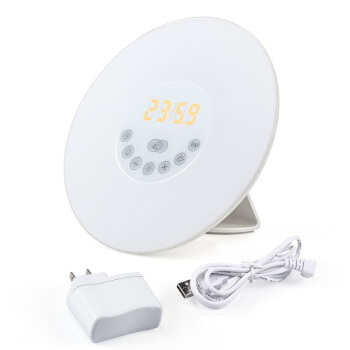
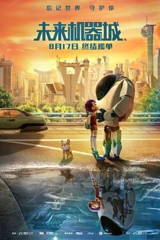

## Angel_Kitty的 plog 第三周

今天是2019年3月17日，距离考研初试时间还剩279天，这是我考研正式开始复习的第三周，时间确实过的挺快的，眨眼间就到了第三周了，当然也谢谢很多小伙伴们的关心，还有一点感冒，也可能是体质差的缘故吧，一感冒就得花很长一段时间才能痊愈。这周的学习状态和上周差不多持平，一再提醒自己要早睡早起，可能睡晚已经成为习惯，尽量要改掉这个坏习惯。

这周的感悟和思考其实还挺多的，我觉得可以拿出来和大家分享一下，一方面是我自己的认识，还有一部分是作为战地记者的我听来的故事，开始这周的分享啦 ~\\(≧▽≦)/~

> 喜报：当然要祝贺我曾经的队友荣获最强战队奖冠军和最佳漏洞情报挖掘奖冠军啦，4.19去阿里参加颁奖典礼，着实让人羡慕，我也为她感到高兴，至少我以后可以在外面吹牛说我曾经是一个双冠军的大佬的队友，希望她能够在网络安全这条道路上越走越远，为国家的网络安全事业添砖加瓦。

本周内容概要：

- 本周的学习情况
- 我对未来规划的一点见解
- 本周推荐的电影

### 本周的学习情况

感冒还没完全好，有点伤了，学习效率一般吧，看看进度完成了多少吧。

Completed some tasks：

- 恋恋有词看完 Unit21
- 数学一高数上下册都过完了一遍，计划本月下旬进行第二轮数学扫盲
- 每天听了一段 TED
- 看了一部电影，所以本周决定推荐一下

No Completed Tasks：

- 英美外刊没有达到每日一篇，还是感觉时间稍微有点紧吧
- LCS 算法的实现还没code一下，鸽了三周，预计下周还得继续鸽，难过
- 本周可能更多时间在理解一些概念，所以题目仅仅是挑了一些例题在看，训练的较少，需要好好反思自我

### 我对未来规划的一点见解

对这个话题的思考来源是我周六和一位老板谈生意的时候产生的。当然一直以来，至少上了大学以后，我都有很对这个问题反复思考过，不过和那个老板聊完之后，对于这个问题有了一个更深层次的理解吧，所以挑出这个话题来和大家分享一下。(事实上其实是我想买一副耳机嫌太贵了，然后讨价还价产生的话题)

作为一个生意人，尤其是把时间和金钱看得如此重要的大老板，会愿意花上几个小时的时间和我这个无名小辈推心置腹，我自愧不如，但仍不忘心存感激，再次鸣谢。

K 公司的老板 ACE (暂且我们就这么称呼吧)，C9 本科毕业，在上海从事战略管理工作，其实大概也可以猜出 ACE 本科学的专业和金融方面有关，月薪保底 2w ，在上海这个收入算是一般吧，还算稳定，不过年轻的时候想法比较多，觉得上班赚不到什么钱，就想着自己出来做生意，经朋友的引荐开始从事外贸方面的工作，家庭背景中上游水准，父母亲也是从商的，对他从事外贸工作多少会有点帮助吧，现在似乎行情不好，一直在赔钱清仓，所以准备转行做产后护理。

我们其实聊了一些蛮有意思的话题，ACE 谈了谈他生意上的一些事情，他主要销售的是电子产品一类的，不过我个人感觉他销售的一些产品受众群体太小，东西都相对比较高大上，一般消费者在价格方面承受不了，所以内销基本无市场，外销的话老外对产品比较挑剔，各方面要求都比较高，所以也很容易赔本。可能这也是生意上不如意的原因之一吧。举个例子，我第一次在他的店铺里面看到了一个高科技产品，自然唤醒灯，给你们看看样子：

这东西据产品介绍说它可以 LED 模拟日出，通过灯光亮度变化，让人自然醒，是代替闹钟的产物。这东西，我也是第一次见到如此高科技的产品，不过讲实话，这东西真的有用么？就比如拿我自己为例吧，我从小到大就到过 KTV 两次，一次是高考结束以后的庆功酒后，第二次是部门聚会去的 ，事实证明，我两次都能在如此嘈杂 + 灯光刺眼的环境下睡着了，而且还睡得特别香，233333，所以我决定以后再也不去 KTV 了，人家去 KTV 唱歌，我去 KTV 睡觉，可能是 KTV 的沙发比寝室的床舒服吧。所以我觉得这种产品对我来讲肯定是非必需品，况且现在手机都有闹钟了，这种产品生产出来卖不出去我觉得还是很正常的吧，而且价格方面也不友好。

我们跳出生意这个话题，根据所介绍的来看，ACE 的各项条件至少在整个大陆来看，算是家境比较好的那类了，至少比我要好不少啦，其实他也有自己苦恼的一面。他曾说，人生的前五十年，应该保证自己的每一天所得(积累的经验、人脉、见识等等)要大于所失去的(至少是对得起这一天的时间损失)，他也觉得他逝去的那些日子，没有真正积累到东西，所以常常有莫名地危机感。年轻人应该多稳扎稳打一点，甚至他还羡慕我准备从事 IT 这一行业，也感慨他这一生一大败笔就是没有学 IT 相关专业。

而且现在找工作可能并不像各位所想的那么简单，他有个朋友在上海创业，某一岗位招聘，税前薪资 1w/1month ，而这种可能很多读者朋友都看不上的岗位(上海的物价房价估计都有所耳闻吧)，却有如此多的 40 岁左右的，并且是复旦、交大、上财这样的名校毕业生前来应聘。我猜这种薪水的岗位，你可能连面试都不会去吧，因为上海的物价房价实在是太高了。

现在的你可能面对他们有优越感，试想一下，如果换做是你，你该怎么办，你是否会有和他们一样的中年危机？

我们可以换个角度去考虑一下，现在40岁左右的人，上本科的时间大概是98年～00年，那个时候国内的大学并没有扩招这一说法，高考的难度相比于现在已经不是一个量级，能考上像复旦、交大、上财这样的名校，应该是千分之一的人了吧，可就是这样的人，很多父母眼中所谓 "别人家的孩子"，为什么到了 40 岁，反而沦落至此呢？我们可以思考一下这个问题，其实也很简单，就是因为他们在 40 岁之前所积累到的东西，远小于他们所失去的时间，精力，所以他们的市场价值，甚至有可能小于普通院校刚刚本科毕业的学生。

沉舟侧畔千帆过，病树前头万春来。有时候我也会自我反思，我这些年的积累是否足以让我心安理得，是否对得起我逝去的青春，我觉得这个问题是值得我们去反思的。何况孔子都说"学而不思则罔"，学会衡量成本和效益，一件看似极其简单的事情，有些人可能一辈子都没有办法做到这一点，无法找到这个平衡点，这可能是上层阶级和下层社会最大的差距吧。我认为，要想找到这个平衡点，还是需要有足够的知识储备和一定的社会阅历才行。

我觉得我不是属于那种父母眼中的所谓的"别人家的孩子"，我觉得我脑子是比较的笨拙，以前是因为虚荣而害怕失败，而现在的我经历了太多太多不是我这年纪应该去承受的一些生理和心理上的负担，我也早已不惧怕失败，而我现在的想法很简单，就是考上国内第一学府，我自己也并不相信我能一年考上，我比较笨，而专业课也特别特别难，我也愿意去尝试考两年，我觉得我两年内能考上国内第一学府，对我来讲就是人生起步阶段的胜利了，我人生的第一阶段的起点在那里，我必须去实现它。因为考上顶尖名校能得到的东西，或许是我选择读一个普通 985 院校一辈子都没办法实现的。开心就好，多一些不为什么的坚持就行了。

佛曰：破执。何为执？"我一定要去清华"，这就是执，因为我只是想要得到这个，而不知为什么想要得到这个。事实上，我相信，在这个努力的过程中，我的所见所得，远远比 "清华" 这两个字的标签要值钱的多得多，我曾努力过，能去最好，不能去，也不必强求，不负青春就好。

引用乔布斯的一句名言：

> Stay Hungry, Stay Foolish.

永远保持这个状态，为逝去的青春添上浓墨重彩的一笔。

### 本周推荐的电影

本周推荐的电影毫无疑问定当是未来机器城了：

这部电影其实我很早的时候就想去电影院看了，据说电影院上院第二天就被下架了，看完以后大概才知道，应该是里面的有些言语情节稍微有点太暴力了，不太符合小朋友那个年纪的认知观吧。

资源链接：https://pan.baidu.com/s/1kyEr_Z8kZH81UhP-F3MoTA 

(虽然这么直接分享资源不太好，不过如果真的在国内重新上架的话，我还是会愿意去电影院支持一下的)

这部动漫是暴走漫画出品的第一部电影，我不算是暴漫的老粉，但也算是忠实粉丝吧，每一期的暴走大事件都有可能是最后一期，所以且看且珍惜。我不说以前怎么样，至少近一年以来，每一期的大事件我都看了，暴走团队是真正代表人民站出来说话的一方，用诙谐幽默的语言诉说了很多人想说而不敢说的一些事情，包括社会上的一些不公等等。

再稍微介绍一下这部电影，这是我比较推荐的一部，这是一部充满未来科技的动画片，除了新奇的机器人之外，还有王尼玛访谈出现在电影中，仿佛打破了二次元与三次元的壁垒。我觉得这部充满科技感的动漫真正想表达的还是对未来人工智能时代的设想和忧虑吧。

电影的主人公是一名叛逆女孩小麦，虽然生活在机器人辅助的科技时代，却因为父亲的离开对机器人充满厌恶，留着和性格相匹配的短发热爱足球。

在阴差阳错下，激活了博士的新型机器人7723，一个讨厌机器人的小女孩却不得不和7723一起相处，在相处中原本孤独的小麦重新获得了快乐，也收获了友谊和家人的关心，同时和7723并肩作战，实现了拯救世界的任务。

机器人7723更像是钢铁侠和大白的结合体，一方面对激活的小麦关心照顾，另一方面在面对困难敌人时，又能化身战斗机器大败四方。

可是机器人的设定有些奇怪，博士制造了他的功能及结构，可是7723为何就认准了小麦是他的朋友，在帮小麦搞破坏时没有什么反应，可是最后居然自己删除了武器核心功能，难道机器人对世界的认知已经超过了人类？

反观小麦似乎比机器人还不懂事，因为父亲的离开不喜欢机器人还能理解，可是公然破坏社会秩序和他人机器人的逻辑就无法理解了。就如同我不喜欢养花，我可以把自己家的花都扔出去，可是我如果把邻居家的花也砸了就不符合常规了。

还有一点，有7723之前小麦被同学的机器人欺负，她应该更能体会到被欺负的痛苦，可是当拥有了强大的7723后，小麦居然开始报复曾经的同学，让7723都看不下去停手了，小麦反倒怪罪7723不是真正的朋友。

这种价值观好可怕，好朋友不应该是互帮互助，而不是依靠强大去欺负他人。这种思想如果真的被小朋友学去，后果真的不堪设想。

如果你有了一个强大的机器人，你会让它干什么呢？