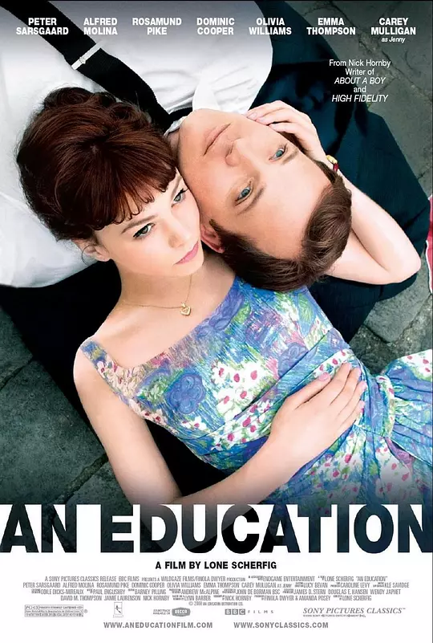

## Angel_Kitty的 plog 第五周

今天是2019年3月31日，距离考研初试时间还剩265天，这是我考研正式开始复习的第五周，学期好像已经过去 1/3 了，到学期过去 2/3 的时候，我就得开始接受无尽的复习和考试的折磨了。不知道室友什么情况，病了一个多月了，得去治治吧，感觉它们生活作息很有问题，不吃早饭，晚睡晚起，这咋行呢？

这周感觉状态还没完全调整过来，可能真的有点累了吧，一周好好看书的时间不超过三天？一个星期看了两部电影，题材感觉很接近，又形成了比较鲜明的对比，然后又花了两天半的时间读了一本有关财商的书，我考虑看完原版以后再拿出来分享的，我可能要花比较长的时间才能看完，所以可以稍微期待一下。

刚才在修复网站的一个 bug ，tocbot 和 pjax 的锅，然而我搞了一下午都没搞出来。。。自闭了～菜是原罪。

本周内容概要：

- 本周的学习情况
- 格局决定高度
- 本周推荐的电影

### 本周的学习情况

说来惭愧，这周脑子有点抽，被罪恶的闲鱼和某宝带偏了方向，花了很长的时间泡在 shopping 中，钱包被彻底洗空，科技带来的最终效果就是负债了，呜呜呜\~\~\~~(>_<)~~~~

Completed some tasks：

- 恋恋有词已经全部过完了一遍
- 数学现在做不动了，自愧不如(可能最近心思不在这上面了吧)
- 好像就听了一两段 TED 
- 看了两部经典的美剧
- 读了一本财商的书
- 低价购置了一套英版的 Harry Potter ，准备看完电影再来读读原版小说
- 捡垃圾收了一台 MacBookPro ，看看啥时候把我手头的 ThinkPad 出售吧，希望捡垃圾不要翻车吧，下周做个测评

No Completed Tasks：

- 下周把线性代数看完吧
- 吸取上一次的经验，页面最近出了点状况，所以构建了一个项目：https://github.com/AngelKitty/review_the_national_post-graduate_entrance_examination ，这里将记录着我复习过程中的完整的电子版资料和笔记，以及我这一年所学习的一切。
- 下周把语法全部看完
- 下周过完基础的翻译部分

### 格局决定高度

这周想聊聊格局的问题，我一直在思考一个问题，在我们这种小地方出生的人，从出生开始就已经落后于其他人，后天的教育，以及封建思想的家庭都远远落后于大城市生活的孩子。那么在这种环境下生存的我们是不是有可能走出这个死胡同，看到更广阔的天空呢？

答案是可以的，但前提在于你该怎么去理解这个问题，你应该采取怎么样的行动去提升自己的高度，这是一个值得思考的问题。

回顾大学三年生活，想想很多事情我挺后悔的，我浪费了至少一年半的时间，很多时候我都觉得自己在做的是无用功，就像我之前文章里说的一样，你的成效要对得起你的时间和精力的付出，并不是说一定要达到什么样的目的，对我而言，只要能学有所得就好。大一刚进校门的那会儿，我还是会认认真真地每周去图书馆读一本书，不管是什么类型的书都行，当时就坚持了大概一个月左右，读了三四本书的样子，后面总是找借口说忙忙忙，现在看来，我当时都在忙些啥啊，都是在瞎忙活儿，啥也没做成啊。

看书这种东西，读的越多自然是越好的，一个人的修养，行为举止和你看多少书是有莫大关系的，甚至可以说是对等的，而现在的大学生，怎么说呢，寒假的时候在我妈公司打杂，她那里也招本科毕业生，我看到的那些大学毕业生啊，只会去抱怨事多钱少，而且怎么说呢，感觉上就不像是读过大学的人。一个人的修养是由内而外的，在这些人中，我丝毫看不出这一点，如果我不知道他们的学历，我可能认为他们的文化程度和菜市场大妈不相上下。**读书是提高个人修养和高度最有效的方式。**

不过我不建议什么书都读，读经典的就好，什么类型的书都要看，哲学啊，法律啊，金融啊等等，这些我觉得都得要有所涉略是最好的。

其次是要多思考，孔子说过：学而不思则罔。读了那么多书，不去思考问题，那就真成书呆子了。社会往往不需要那么多死读书的人，书其实是有生命的，我觉得，一个人看书的深度也能决定一个人未来能走多远。为什么这么说呢？最近我在读一本书，叫做 Rich Dad Poor Dad ，我相信很多人都有听过或者看过这本书，这本书主要讲的是关于财商方面的知识，绝大多数读者可能读到的浅层意思大概是我们按照这种方式去做，我们就能成功，成为一个富商，这可能也是一些小孩子才会这么想的吧。稍微有一些生活阅历的读者可能读到的稍微更深一点的意思大概是会觉得书上讲的这些都是鸡汤，在现实中是不可能做到的。而其实更深层次的意思绝大多数人领会不到，这可能才是作者真正想要表达的意图，这也就是为什么全球 99% 的财富掌握在1%的人手上的原因之一吧，因为你的见识太狭隘，格局太小，对问题理解的深度不够。如果你已经看过这本书，你可以尝试看看我对作者意图的揣测。

> 作者的真实意图并不是要你脱离实际去凭空想象，首先这本书是基于美国的国情出发的，而结合中国国情来看是有很多值得借鉴的地方。其次像书中所提到的那样，绝大多数人都是基于一种盲目地状态去随大流，去接受所谓地应试教育的摧残，成为被奴役的对象，而没有自己的观点和立场。学校的培养方案只能把你培养成一个优秀的雇员，而不会教你如何成为一个雇主。绝大多数家长会这么教育小孩：你要好好读书，要努力考上一个好大学，找到一份好工作，然后买房结婚生子啥的，这就是所谓穷人的思想，因为他们的格局只能达到一个这样的高度，而富人的观点则恰好相反，这也就是穷爸爸和富爸爸在看问题角度上最大的区别所在吧。具体的以后可以慢慢地聊，这里我就抛出这个话题，有时间可以看看这本书，这本书有中文版，在我发起的那个项目里面存了电子稿，可以下载下来阅读，最近在看原著，我想等原著看完以后再做一个更深层次的探讨。

再者就是要多实践，小平同志曾经说过：实践是检验真理的唯一标准。书上讲的那些东西，你没有真正实践过的都不能说是正确的，有些东西实践过了以后才会印象深刻，理解的更深刻，这也就是我一直在强调的 **少言多行** 原则。

> 今天状态不是很好，所以稍微就简单唠这么多吧。

### 本周推荐的电影

#### Fish Tank

电影资源链接：链接: https://pan.baidu.com/s/1KVS1PVujrZCUhakEZEOvnA 提取码: f48d 

电影名字叫做 Fish Tank ，大家查一下字典就能知道中文意思是鱼缸，鱼缸是什么？鱼缸就是养鱼用的嘛～这里比喻的是被养在玻璃缸的那些不自由之身，它们本属于大海，但为了满足人类的观赏需求，被囚禁在那小小的一方池水中。

电影开始就是一段喘息，女主人公米娅刚刚练完舞。破旧的房间，老旧的录音机，还有那身不怎么合身的衣服，这是米娅留给观众最初的印象。可下一秒，她就和几个女生当街撕逼了。米娅一个人对一群人，还打坏了一个女孩的鼻子，气哄哄地走了。米娅暴躁的脾气离不开她的家庭背景。她没有父亲，只有一个整天鬼混的亲妈，和一个出口成脏的妹妹。米娅每次回到家里，都会重重关上房门，那一声摔门的声响是个信号，代表着“我回来了”和“请勿打扰”。只有在那个挂满了稀奇古怪玩意儿的小小空间里，她才会有丝丝的归属感。然而，不是所有人都理解她这样的怪脾气，亲妈不待见她，妹妹不喜欢她，就连街上的小混混都时不时找她的麻烦。她被排挤，被欺负，但她依然会找个没人的地方，随着音乐扭动起身体。她喜欢跳舞，或者说是因为没有其他爱好可以供她选择。

在一个不完整的家庭里长大，米娅早早习惯了大人不负责任的生活，她的母亲抽烟、酗酒、吸毒、乱性。而她耳濡目染，每天化着浓厚的妆，学大人穿着不合时宜的衣服。唯一不同的是，她的孤僻，并没有让她有可以“乱来”的机会。直到，这个家里出现了一个大叔（法鲨）。他是母亲的新男友，第一次看到他，是女主早起之后在厨房里找吃的。大叔半裸出现，开着玩笑，从米娅身边侧身擦过。在这个混乱的小屋里，大叔是一点都不见外，不仅和米娅母亲难舍难分，对米娅的妹妹也很大方，尽管米娅对他充满了戒备，他依然是微笑着示好。米娅喜欢跳舞，她的母亲却总是打击她跳的是垃圾，只有大叔在当面夸她跳的好。那是米娅第一次得到鼓励，在她的成长经历里，这个第一次对她来说意义深重。大叔的到来让这个房子不再是剑拔弩张，他会教育米娅不能说粗口，也会教育她要学会包容。母亲沉溺在恋情中，不再针对她们姐妹。米娅虽然表面上还是刺头一个，但内心早已起了变化。大叔对米娅十分关心，米娅的脚踝在钓鱼时不小心被割伤，妹妹喊着艾滋，大叔先是阻止妹妹乱喊，然后把绷带缠在米娅的脚踝上，默默背起了她。休息时，大叔趁着女友离开，悄悄打开了音乐，在他的引导下，米娅第一次在公众场合下跳起了她秘密练习了很久的舞。虽然母亲还是一如既往的打击，但大叔却连连称赞，而且还建议米娅应该把自己的舞姿寄出去，让更多的人看到。从米娅记事以来，她没有感受到温暖，她跟妹妹说的最多的话就是，如果你有一天在这个房子里待不下去了，找儿童保护协会。但现在，一个浑身上下都散发着荷尔蒙的大叔，让她有了早点回家的理由。大叔给了米娅一个DV，还推荐了他最喜欢的歌曲《California dreaming》，他们之间暧昧，让米娅有点心乱。米娅15岁，没有谈过恋爱，没有享受过父爱，突然一个这样“优秀”的大叔出现在她身边，她有点意乱情迷。她说服自己这只是胡思乱想，但背地里，她却为了那句口头上的承诺，拼了命地练习舞蹈。然而，这场暗恋的故事还没有开头，就被灌上了一个恶俗但现实的结尾。米娅在大叔的挑逗下，两个人趁着母亲醉酒熟睡时，做出了越轨的行为。第二天，意识到自己犯了大错的大叔马上和米娅妈妈分了手。

谁能想到，这位不断给米娅鼓励和安慰的大叔，是个有妇之夫。米娅跟踪过去才发现，原来他一边扮演着好丈夫好爸爸，一边和自己母亲以情侣关系自称，同时还口口声声说真正喜欢的是自己。所有梦幻的希望全部破灭了，她冲上去想要一个说法，但看到他们一家三口其乐融融的画面时，她又忍住了。那一刻，她是那么的多余，少女情怀里的那些美好被人撕得粉碎，她的心也碎了。冲动之下，她诱拐了大叔的女儿，虽然最后还是将女儿送了回去，但换来的是大叔愤怒的一巴掌。是那一巴掌，也结束了她仅存的希望。梦醒了，她还是那个不受人待见的奇怪女孩，青春里充满很多美好，但也隐藏了很多残酷。米娅没有选择家庭的权力，她一出生就要面对一个不负责任的妈，要面对一个没有爸爸的家，还要面对周围人对自己的排挤和打压。她变成了一个问题少女，可是所有人都觉得是她自己的问题，所有的后果是她咎由自取。突然，一个温柔如水的男人出现了，他给了米娅关怀，这段时间，米娅感受到了这15年来不曾有过的美好。只是稍纵即逝，她的生活又一次回到了原点。

女主人公米娅就像那条鱼，她用尽全力也游不到大海。而生活就是透明水缸，你以为可以很轻松逃离，却怎么都冲不破那道看不见的屏障。

#### An Education

电影资源链接：链接: https://pan.baidu.com/s/19SFc4noOh70rOzIO30r1XQ 提取码: 75r7 

片子讲一个有潜力上牛津的伦敦底层少女放弃学习决定嫁给一个狂追她的有钱中年大叔但发现大叔已婚而重获新生考入牛津的故事。故事的核心大概本来是想说：教育的意义在于明确自己的发展目标并为之奋斗，但是最后却给了我们一个爱情观的探讨：生活没有捷径，女孩只能靠自己奋斗。其实跟上一部影片形成了鲜明的对比，一个结局是悲惨的，一个结局是美好的。

教育的意义是什么？这是生而为人必须要明确的问题。或者其实，从受众的角度来说，应该是“学习的意义到底是什么”。如果让我来回答，我觉得学习的意义是找到真正的自己，找到自己生活的意义，找到最适合自己的生存方式。学习可以开阔眼界，学习可以带给你新的人生观，学习可以给你人生新的起点，学习可以给你成就感，学习当然也可以给你一份不错的收入的工作，可是学习的意义远远不只是“带给你什么”这么而简单，而是在学习的过程中，“发觉了什么”。

所以以上两部影片都非常值得大家去看看。

