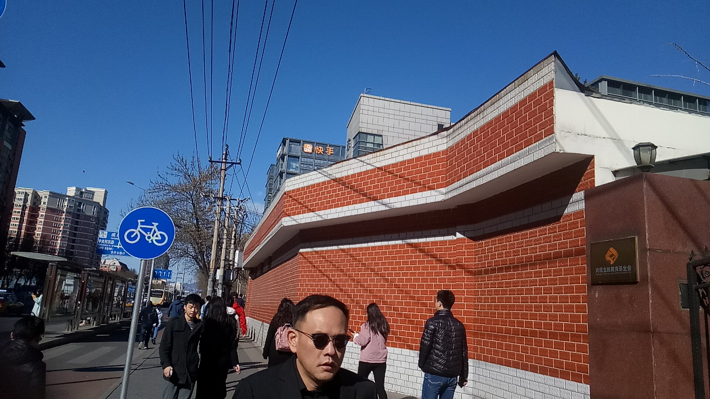
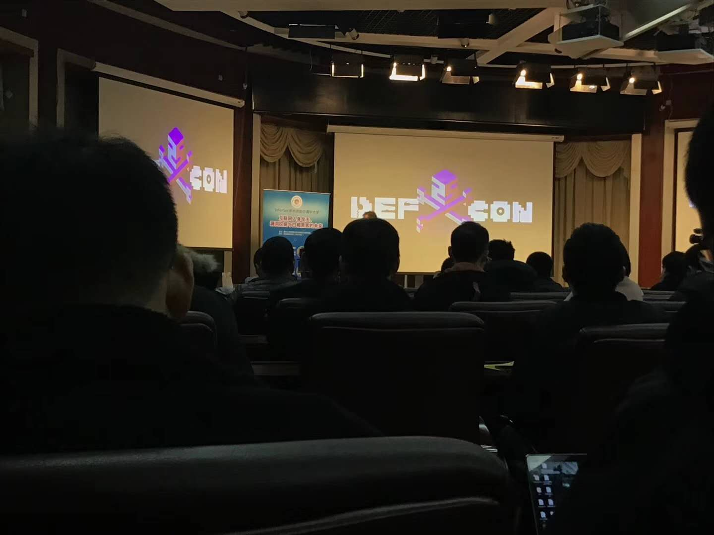
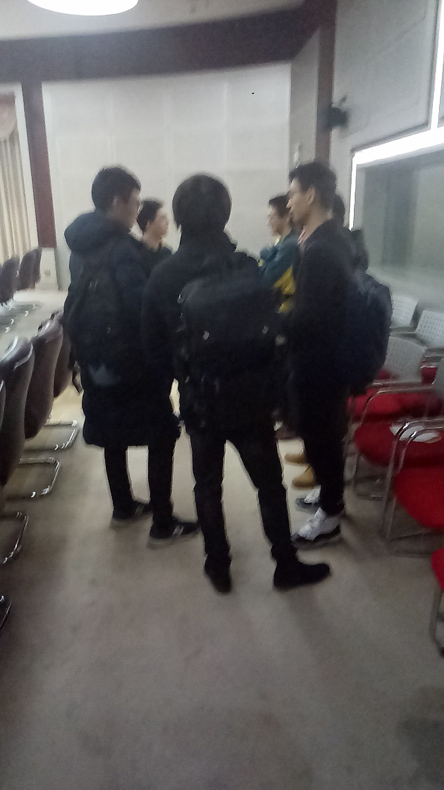
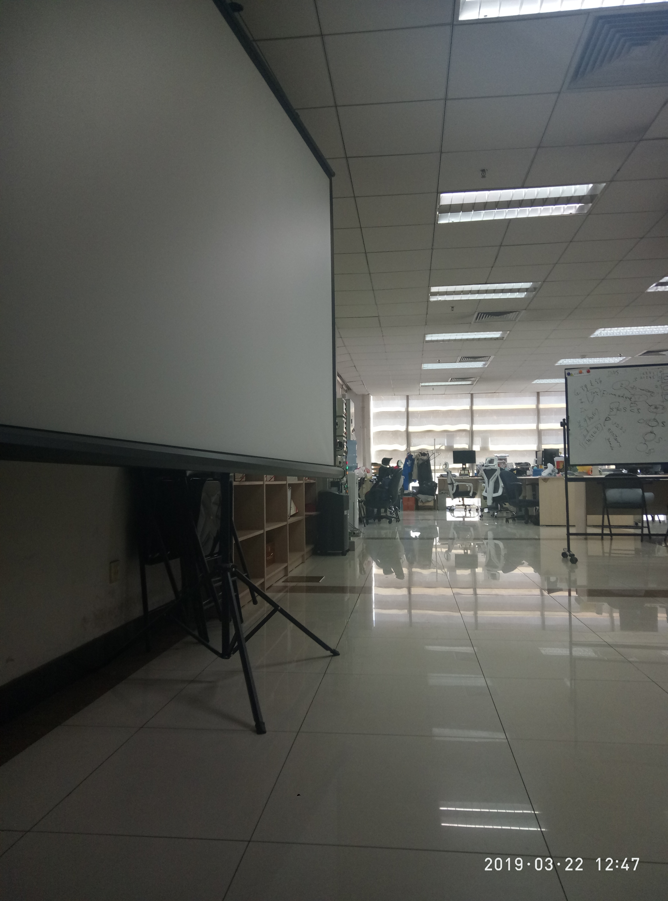

## Angel_Kitty的 plog 第四周

今天是2019年3月24日，距离考研初试时间还剩272天，这是我考研正式开始复习的第四周，这篇文章是我在北京的宾馆写完的。其实原本感冒差不多好了的，由于温差的缘故，学校的气候和北京的温差相差的有点大，上火车前还是大暴雨状态，在火车上呆了十几个小时来到北京就是阳光明媚了。

> ps：北京是真的有点冷\~\~\~~(>_<)~~~~

这周其实遇到了很多事情，原本计划是来北京考试的，结果据说报名系统出了点意外，我刚好没赶上，但这趟旅程也不亏了诶，和清北大佬同堂吃饭，和北邮大佬谈笑风生，别有一番滋味，嘿嘿嘿。

这趟旅程，傻乎乎的因为下地铁忘记把伞拿出来，差点没被雨淋湿，也走错了许多路，在北京西站绕了一个小时没绕出去，坐地铁坐反了方向，唉，糊涂了啊。

不过这样的颠破流离，总算赶上了参加清华的 InForSec 学术讲座，亲眼见到了以前只能在封面中看到的那些大牛们，真心感动的哭了 /(ㄒoㄒ)/~~，最后结束的时候，有幸和这些大牛们合影留念了，真的非常的赞诶。

中午和蓝莲花(Blue-lotus)战队的大佬们一起吃了个饭，聊了很多很有意思的话题，下午也参观了 Blue-lotus 的实验室，在他们实验室一起学习，探讨问题。他们都挺热心的，那种学术氛围是国内绝大多数学校都无法匹及的吧。

下午在实验室呆了一会儿，约了个北邮的朋友，告别了清华，然后又开始了新的旅途，在北邮的校园走了走，和北邮的大佬叙叙旧情，除了没去他们实验室看一下以外，其他都还挺好的呢。

这趟旅行，也满足了我那颗强烈的好奇心，总算把清北都玩过了一次，虽然清华的校园我没有去转转，就只到了 FIT 楼，我希望我下次来北京的时候，就是我能在清华网安实验室读研究生，到时候一定要把校园玩个遍。

本周内容概要：

- 本周的学习情况
- 再度北漂的一些感悟
- 关于后续(**纯属虚构，不建议心理承受能力差的同学看**)

### 本周的学习情况

说实话，本周基本上没怎么看书，时间都投入在背题库准备 CISP 考试去了，结果前一天晚上，官方跟我说报名系统出了点故障，我都来北京了！！！！一定要抗议一波，来一趟北京不容易啊，主要是旅途太远了。

看看进度完成怎么样吧。

Completed some tasks：

- 恋恋有词看完 Unit26
- 数学第二轮数学扫盲到高数18讲第2讲
- 每天听了一段 TED

No Completed Tasks：

> 注：太多没完成的了，就只能写写下周要完成的任务了，撸起袖子加油干，把欠的债补回来。

- 英美外刊每日一篇(泛读)
- 学完所有简单句有关的语法
- 背诵两篇作文并默写 && 写两篇作文
- 单词全部过完一遍
- 看一部美剧

### 再度北漂的一些感悟

这是我继去年来第四次来北京了，不过这次算是我第一次一个人提着大包小包飘到北京，所以还是有点人生地不熟的，室友帮我定了个靠近火车站的旅馆，然后信了导航的邪，转了一圈又一圈，扫地的大叔十分钟遇到了三次，尴尬，一直在原地打转，没想到北京的火车站这么大，真的把我绕晕了呜呜。后面想想凭着路感，拖着行李一路溜达终于找到了地儿，好开心啊呜呜。

然后放好行李以后，一路奔跑赶往去参加 InForSec 学术讲座，中间出了点意外，坐反了地铁，我也是服了我自己。

在路上，我看到了快手的总部，哇哇哇，好想上去看一下是什么样子的，可是要赶着去听讲座，没办法惹。

在讲座上，王若愚教授提出了一些研究领域的新思路，例如如何去自动化分析和识别无用代码，从程序中提取并分析抽象信息，加速自动化漏洞挖掘等等，攻克科研及工程领域上的安全难题。这是一个极好的思路，我也希望我有朝一日能成为一名科研工作者，投入到安全难题的研究上。

中午有幸和蓝莲花一队人吃了个饭，和大佬一起吃饭，无上的光荣，我们探讨了很多学术问题，他们也非常愿意让我加入到他们的实验室里面，也叫我回去好好考研，希望明年能来他们的实验室一起公事。

这是偷偷地拍了一张照片，手机像素太差了，没办法，差点被保证师傅发现，入镜的几乎似乎都是 Blue-lotus 的大佬们。

下午在他们的实验室小呆了一会儿，他们实验室大概隔了一个黑板，最里面是研究生搞学术研究的地方，而靠外边(实验室大佬安排我坐的地方)是博士以及一些教授进行学术讨论的地方。

我呆的那一个小时里面，有三四个大佬在汇报他们的科研进度，一起探讨科研中遇到的一些阻碍，共同讨论，想出一套合理的解决方案去克服这一问题，不时的有大佬上台在黑板上讲解着一些思路和方法，我觉得这种氛围是值得其他学校学习和借鉴的，我相信能在清华读研，是值得我受益一生的一段时光。

相比与北邮来讲，我觉得氛围就差了不少，我也不知道是什么缘故，总觉得北邮的气氛是比较冷清的，据那位朋友说人都在图书馆里头，很少出门，这可能就是真学霸类型的吧。

对我来讲，有些东西真的只有你自己亲身去尝试了，去体验了才可以有最真实的感受吧，拿我现在来讲，我觉得网上一些人对清华的说辞就是有问题的，多数可能都是他们是刚编出来的故事，具体是怎么样的，我暂时就不透露了，当然有非常黑暗的一面，在这里我就不想说太多，这种事情我相信，如果你没有这么要好的朋友关系，估计都不会跟你这些的，先埋个伏笔吧。所以有和我一样有考研想法的同学，我觉得你还是得自己去看看比较好，或者咨询那些刚考上的学长学姐吧。

今早打道回府了，北京的早点是真的贵，一碗粥要15，吐血噗噗。回想一下，一路的颠婆，能进入我未来的院校听一堂讲座，能和大佬们谈笑风生吃顿饭，这趟旅程已经很值了。我也希望我未来能够走的更远，能为国家的安全事业做出自己的一份贡献。

### 关于后续

文章到前面为止已经结束了，这部分补充内容本来我是不想写的，但是想想看，我觉得有些东西能记录一下便是最好的，这部分也是我回到学校以后的补充内容，以下内容毫无考证，纯属个人虚构，请部分朋友不要太过激动。

> 以下这些话可能对部分同学来讲会极度反感，毕竟忠言逆耳，谁都喜欢听好话，所以我不建议这部分小伙伴看接下来的一些说辞，部分内容有待考证，如果以下内容对你自信心有冲突的地方，还请见谅。

我客观地评价一下吧，北京的学校我觉得是比较适合搞学术研究的，北京的学校门禁都是非常的严格，学习的气氛相对来讲，我就这么评价，最好的->次好的->较好的->中等的->较糟糕的->糟糕透顶的学校我都有走过，所以我觉得我有一定的发言权。我觉得，985/211 和一般学校最大的区别并非在这个名号上，客观的来讲，我觉得最能反应出区别的是学习氛围的差距、学生自主性学习的积极性。真正好的学校学习不是靠老师逼迫的，上了大学大家都是成年人了，自己应该都有点自己的判断力，什么事情该做什么事情不该做，自己到现在难道还不清楚嘛？如果说读了四年本科还不知道自己将来想要干什么，妄图想要通过考研这种方式去逃避社会，我觉得你真的不配作为一个大学生，不配作为一个当代有思想的年轻人，你可能还只是个娃娃。

说的激进一点，因为现在的大学教育出了一点很严重的问题，我也不知道教育部那边是什么情况，严抓大学教育，是因为大学生出事故天天上热搜嘛？还是因为以前的自主学习，放养式教育可能让很多学生荒废了大学，然后要求学校，要求老师要狠抓大学教育，难为学生？？？这样有意思嘛？？？

如果你上了大学，老师还需要像中学一样天天管着你，呵护着你，怕你出事，我觉得这样的学生出了社会以后一定不能给社会创造很大的价值，一定没啥出息，而你永远只是个不成熟的孩子。而现在的大学教育都怎么了，以前的自主学习，放养式教育可能让很多学生荒废了大学，然后现在学校又严抓大学教育，天天管着学生，把那一点学生的自由又剥夺了，然后搞的现在的大学和中学毫无差别可言，这样做真的有意思嘛，学校妄想通过这样的方式培养出来高水平的学生，这样的学生出了校园有什么用？而且我不确定每个老师都有像周先生(周志华)，吴先生(吴恩达)这样的水平，既然这样，这些稍有点妄自菲薄的老师又凭什么说他们自己讲的东西就一定毫无错误呢？这是不可取的。

而我也去了北京已经四次了，一路走过了 top1、top2 的院校，在这里，我看到了一些新的面貌，学生的自主性意识是绝对值得认可的，当然我觉得能来这里的都是有自己的各项特长，在清华也有很多大佬挂过科的，那种成绩又好，技术水平又高的真的只是极个别，术业有专攻，如果清北每个学生都有这么优秀，全国也没必要开设这么多院校了，所以要有信心，可能很多处在中下层学校的学生都不太清楚这个事吧。

我并不是要求每个同学都像这种学校的学生那样奋进吧，只不过说，你应该对你的未来有所展望，不管你未来是考研还是工作，你都应该对你自己的人生有所规划吧。

大学本来就是个浪里淘沙的过程，你的每一步选择，未来都会给予你相应的回报，可能是好的，也可能是不好的，有因必有果，能量是守恒的，付出和回报永远是等价的，只是你并没有真正了解过自己。

读研究生真的如同你们所想的那样，可以弥补你本科浪费的时间嘛？我相信很多朋友上知乎，上微博，看论坛，浏览帖子都有所耳闻，研究生是帮导师打工的，还有乱七八糟的一些潜规则啥的。

事实上，这么跟你说吧，即便是国内最好的学校，都有不少的黑幕，怎么说呢，我当时在他们实验室的时候，他们的教授和一群博士生在开研讨会，我刚好占了一个位置，有点尴尬，勉强算是其中的一位听众吧，有个学员讲述了他在论文中运用了XXX的预测模型，然后似乎后面又补充了一句，这个论文暂时是没有数据做支撑的，这不有点明摆着瞎扯淡嘛，没有数据的模型都是假模型，参加过数学建模的同学应该都知道今年的美赛吧，胡编乱造的一大堆，什么靠语文建模，美术建模妄想拿到O奖的情况屡见不鲜，很多教授一个小时就能搞出好几个课题，全都是基于人工智能的XXXX，然后觉得这个问题对成绩好的学生来讲应该问题不大，分组(大概一两个人一个课题)，然后做一些学术研究，比如说一个月，你给我把这个东西大致搞出来，而真正考研招进来的学生除了会考试，其它啥都不会，弄了一个月以后，发现丝毫没有进展。而那些导师也是自以为，学习成绩好的学生，写代码只不过是工作量的问题，随便学一学就会了，而事实上呢，写代码是一种能力的衡量标准，往往写代码比考上更能衡量一个人的水平，这些东西导师并不知情，也不清楚学生在做课题的过程中遇到了什么困难，往往有些时候，导师也不能指点你，因为他们并没有做过，根本不知道实现的困难性，他们能做的就是帮你拉资源，最后还是得靠你自己想办法解决，解决不了你有可能要延毕或者退学吧。在导师眼里，论文是他们升官评职称的最有效的办法，他们必须这么做，你做不出成果，就会陷入死循环吧。我有理由相信，全国的学校都是这样的，真正的大佬早就已经选择去国外留学深造了吧。

当然在这里我只是陈述了一些事实，没有增添过多的个人的主观色彩，慧眼识文即是最好的，我不保证上文所说的全部是正确的，我只希望看到这里的朋友多少有些自己的判断吧。

